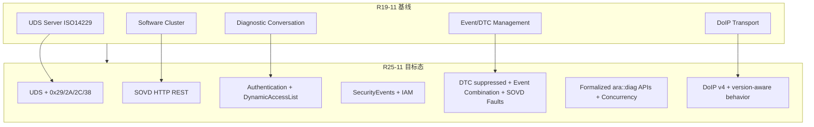

# AUTOSAR AP 诊断管理（DM）规范演进报告（R19-11 → R25-11）

> 数据来源：基于 MinerU 从 7 份官方 PDF 转换的 Markdown 原始文本，经脚本 `[scripts/analyze_dm_evolution.py](../../scripts/analyze_dm_evolution.py)` 与人工校核生成。  
> 分析范围：AUTOSAR Adaptive Platform *Specification of Diagnostics*（文档编号 723）。

---

## 1. 执行摘要

2019 至 2025 年间，AUTOSAR AP 诊断规范从 **UDS/DoIP 为核心的传统车载诊断服务器**，演进为 **UDS + SOVD 双栈、认证驱动、安全可观测、与 CP 深度对齐** 的诊断管理平台。规范体量从 R19 的约 75 万字符、754 条 `SWS_DM` 需求，增长到 R25 的约 333 万字符、2207 条需求，**净增 1453 条需求，未检测到需求 ID 被删除**（以文本匹配 `[SWS_DM_xxxxx]` 为准）。

演进主线可概括为五条技术方向：

1. **传输与协议扩展**：DoIP 扩展（R20）、UDS 0x29 认证（R21）、0x38 文件传输（R22）、DoIP 2023 修订版支持（R24/R25）。
2. **SOVD 引入与成熟**：R22 概念引入 → R23 Part 2 实现 → R25 原生数据/操作处理与 UDS 扩展数据记录对齐。
3. **安全与访问控制**：从 SecurityAccess（0x27）扩展到 Authentication（0x29）、DynamicAccessList、IAM SecurityEvents。
4. **事件/DTC 能力增强**：Event Combination、DTC suppressed、快照/扩展数据与 SOVD 协同、显式 no-debouncing。
5. **工程化与平台一致性**：C++ API 正式化、Reentrancy→Concurrency、与 Classic Platform 谐调、标准化 Violations、生成接口类规范化。

---

## 2. 分析方法说明


| 维度     | 方法                                           |
| ------ | -------------------------------------------- |
| 官方变更记录 | 提取各版本 `Document Change History` 表格           |
| 需求规模   | 统计 `[SWS_DM_xxxxx]` 出现次数（去重）                 |
| 章节结构   | 对比 `Table of Contents` 条目                    |
| 关键词密度  | 统计 SOVD、Authentication、SecurityEvent 等术语频次变化 |
| 服务/API | 提取 `Service 0xXX` 与 `ara::diag::` 类型名        |


> 说明：MinerU `parse_method=txt` 转换保留了表格与正文，但 OCR 噪声可能导致个别 API 名称粘连；本报告以官方变更记录与多版本交叉验证为准。

---

## 3. 规范体量演进总览


| 版本     | 规范需求数       | 目录条目 | 文本规模     | 支持 UDS 服务（检测）                                  |
| ------ | ----------- | ---- | -------- | ---------------------------------------------- |
| R19-11 | 754         | 306  | ~943K 字符 | 0x10/11/14/19/22/27/28/2E/2F/31/34-37/3E/85/86 |
| R20-11 | 951 (+198)  | 265  | ~1.29M   | +0x2A, 0x2C                                    |
| R21-11 | 1119 (+168) | 261  | ~1.53M   | +0x29                                          |
| R22-11 | 1419 (+300) | —    | ~1.94M   | +0x38                                          |
| R23-11 | 1774 (+355) | —    | ~2.43M   | 同 R22                                          |
| R24-11 | 1913 (+139) | —    | ~2.82M   | 同 R22                                          |
| R25-11 | 2207 (+294) | 449  | ~3.33M   | 同 R22（0x2F 自 R19 后不再单独列出）                      |


**R19→R25 新增 UDS 服务**：`0x29 Authentication`、`0x2A ReadDataByPeriodicIdentifier`、`0x2C DynamicallyDefineDataIdentifier`、`0x38 RequestFileTransfer`。

**R19→R25 新增主要 API 族**（节选）：

- 认证：`ara::diag::Authentication`、`ClientAuthentication`、`ExternalAuthentication`、`DynamicAccessList`*
- SOVD/文件：`ara::diag::File`、`FileTransferService`、`DataTransferReadSession`、`DataTransferReadByPull/Push`
- 数据访问：`ara::diag::DataIdentifier`（生成接口正式化）、`DataIdentifierConcurrencyType`
- 其他：`ara::diag::EcuResetRequest`、`ServiceValidation` 增强

---

## 4. 分年度演进详情

### 4.1 R19-11（基线）

**定位**：AP 诊断管理首版稳定发布（由 Final 改为 published），确立 `ara::diag` C++ 接口替代 `ara::com` 服务接口。

**核心能力**：

- UDS 服务器（ISO 14229-1）+ DoIP 传输（ISO 13400-2）
- Diagnostic Conversation 模型替代旧 Diagnostic Protocol
- Software Cluster 多诊断地址、每 Cluster 独立 Diagnostic Server 实例
- 事件管理：Monitor、Debouncing、DTC/快照/扩展数据、用户自定义故障存储器
- 基础 UDS 服务集与 `uds_transport` 插件式传输层

**当年“删除/收敛”**（官方记录）：

- 移除部分过时需求
- 移除过时 Service Interface
- 质量审查整改

**对软件的要求（基线）**：实现 UDS 会话/安全/权限校验、Conversation 生命周期、DEXT 配置驱动、Monitor 上报与 DTC 存储。

---

### 4.2 R20-11（DoIP 扩展 + 周期性/动态 DID）

**官方新增**：

- 验证 DoIP Extension 概念需求
- 引入 UDS 服务 **0x2A**（ReadDataByPeriodicIdentifier）与 **0x2C**（DynamicallyDefineDataIdentifier）

**主要变化**：

- 需求 +198，MetaInfo 使用场景显著增加（+88 次引用）
- 引入 `Reentrancy` 术语与 `ara::diag::ReentrancyType`
- 新增 `EcuResetRequest`、`SecurityLevelType`、`SessionControlType` 等类型化接口
- DoIP 相关 API 命名规范化（`DoIPActivationLine`、`DoIPTriggerVehicleAnnouncement` 等）

**删除/变更**：

- 少量需求修订（净删 1 条 ID）
- 目录重组：Diagnostic Server 子章节编号调整（7.4/7.5 等）

**新增章节示例**：

- `7.4.3 Dispatching of UDS Requests`
- `8.3.x` 生成接口 Routine/DataElement/Indicator 细化

---

### 4.3 R21-11（UDS 认证 + 事件组合）

**官方新增**：

- 引入 UDS 服务 **0x29 Authentication**
- 引入 **Event Combination**（第 7 章）

**主要变化**（关键词跃升）：

- `Authentication` +499、`DynamicAccessList` +290
- 新增 `ara::diag::Authentication`、`ClientAuthentication`、`ClientAuthenticationHandle`、`ExternalAuthentication`
- 新增 `ServiceValidation` 类及认证状态/DynamicAccessList 管理章节
- 会话分配逻辑扩展：需处理认证状态与动态访问列表

**章节新增**（TOC）：

- `7.5.1.3.1 ExternalAuthentication`
- `7.5.1.8.14 Service 0x31 – RoutineControl`（认证上下文下重组）
- `8.3.1.22 ClientAuthentication class`

**对软件的要求**：DM 需实现 0x29 子功能（证书验证、所有权证明、认证配置等），并将认证结果映射到后续 UDS 服务的访问控制。

---

### 4.4 R22-11（SOVD 概念 + 文件传输 + DTC 抑制）

**官方新增**：

- **SOVD Concept** 首次引入
- UDS 服务 **0x38 RequestFileTransfer**
- **DTC suppressed** 特性
- 厂商特定错误码到 UDS NRC 的标准化映射

**主要变化**：

- `SOVD` 关键词从 0 → 715
- 需求 +300（单年最大增幅之一）
- DoIP 章节显著扩充（+86）
- `RequestFileTransfer` +30、`suppressed` +45

**架构影响**：

- R25 引言回溯可见：SOVD 以 HTTP/HTTPS + REST 作为传输，与 UDS/DoIP 并列
- 为后续 `7.2 SOVD Transport Layer`、`7.3.3 Diagnostic SOVD Management` 奠基

**对软件的要求**：除 UDS 外，需规划 SOVD 资源模型；支持文件传输服务；DTC 存储需区分 suppressed 状态；应用层 NRC 映射需遵循标准转换表。

---

### 4.5 R23-11（SOVD Part 2 + 0x29 细化）

**官方新增**：

- **SOVD Concept Part 2 implemented**
- Service 0x29 refinements

**主要变化**：

- `SOVD` +1058（概念落地为可实施需求）
- `Authentication` +116，认证流程需求细化
- DoIP +142
- 需求 +355

**章节级新增**（自 R22→R23 TOC/正文）：

- SOVD Conversation、SOVD 请求校验（Authorization/Locks/Environmental Conditions）
- 标准化 SOVD API（docs、version-info、data-categories、data-groups、Locks、Logging 等）
- 可配置 SOVD API（Data Access、Configuration、Data Lists、Faults、Operations、Modes、Bulk Data）

**对软件的要求**：DM 需同时处理 UDS Conversation 与 SOVD Conversation/锁机制；实现 REST 资源路由与实体路径解析；SOVD 与 UDS 在授权模型上需协同。

---

### 4.6 R24-11（结构重组 + CP 对齐 + 安全事件）

**官方新增/变更**：

- 文档结构更新
- DID/RID/DataElement **生成接口类正式化**
- 增加 **Standardized Violations**
- 术语 **Reentrancy → Concurrency**
- 支持 **DoIP amendment 2023 / protocol version 4**
- 与 **Classic Platform 谐调**
- `ara::diag::monitor` 显式 **no-debouncing**
- **SecurityEvents** 引入

**主要变化**：

- `Concurrency` +176，`Reentrancy` -146（术语迁移）
- `extended data` +24，`snapshot` +15
- 需求 +139（增幅放缓，以澄清与结构优化为主）
- SOVD 继续 +191

**删除/变更**：

- 部分旧 API 命名清理（如 `Metalnfo` 拼写变体、`ReentrancyType` 等）
- R24 附录记录大量 Changed/Deleted Specification Items（以澄清替换为主）

**对软件的要求**：

- 接口实现必须声明 Concurrency 能力而非 Reentrancy
- Monitor 需支持无防抖模式
- 向 IAM 上报 SecurityEvents
- DoIP 行为需按配置协议版本分支（如 GID/VIN sync status 字节差异）

---

### 4.7 R25-11（SOVD 原生处理 + 安全强化 + 数据模型约束）

**官方新增**（R25-11 Change History）：

- **Native Handling of SOVD Data and Operations**
- **Enhanced Snapshot Record Handling for SOVD Use Cases**
- **Harmonized Use of SOVD and UDS Extended Data Records**
- **Adapt DoIP Behavior Based on Configured DoIP Protocol Version**
- **Add SecurityEvents for DoIP**
- **Extend IAM with New SecurityEvents**
- **Class Derivation Details and Semantic Constraints for C++ Data Type Mapping**
- Code Quality / Reliability 增强

**主要变化**：

- 需求 +294，规范达 2207 条
- `SOVD` +1793（SOVD 成为与 UDS 同等重要的规范主线）
- `snapshot` +88、`extended data` +42、`IAM` +6
- 目录恢复并扩充至 449 条（含完整附录 E.11 变更清单）
- 新增 `7.5.1 Security Events`、`DataTransferReadSession` 等章节

**R25 功能定位（引言）**：

> DM 同时实现 ISO 14229-1 UDS 服务器 **与** ASAM SOVD；UDS 走 DoIP/自定义传输，SOVD 走 HTTP/HTTPS REST。

**对软件的要求**：

- SOVD 数据/操作需原生处理，不再仅是概念性占位
- 快照记录与 UDS 扩展数据记录与 SOVD 数据模型统一
- DoIP 全链路 SecurityEvents + IAM 集成
- C++ 数据类型映射需满足类派生与语义约束

---

## 5. R25 对比 R19：技术演进方向总结




### 5.1 从“单一 UDS 服务器”到“双协议诊断平台”


| 维度    | R19                     | R25                                            |
| ----- | ----------------------- | ---------------------------------------------- |
| 协议栈   | UDS + DoIP              | UDS + DoIP + **SOVD/REST**                     |
| 客户端模型 | Diagnostic Conversation | UDS Conversation + **SOVD Conversation/Locks** |
| 配置输入  | DEXT                    | DEXT + **OpenAPI/SOVD 能力描述**                   |
| 服务范围  | 经典 UDS 服务集              | +认证、周期性 DID、动态 DID、文件传输                        |


### 5.2 从“会话/安全级”到“认证/动态访问列表”

R19 主要依赖 **DiagnosticSession + SecurityLevel（0x27）** 控制访问。  
R25 在此基础上增加：

- **0x29 Authentication** 全子功能链（证书、所有权证明、认证配置）
- **ExternalAuthentication / ClientAuthentication / DynamicAccessList** 运行时访问控制
- **ServiceValidation** 与 **MetaInfo** 贯穿应用回调
- **SecurityEvents** 与 **IAM** 联动，满足车载网络安全审计

### 5.3 从“DTC 存储”到“多源故障数据融合”

- **Event Combination**：多 Monitor/事件组合逻辑
- **DTC suppressed**：抑制态 DTC 管理
- **SOVD Faults API**：REST 侧故障查询/操作
- **快照/扩展数据与 SOVD 数据记录 harmonization**（R25 重点）

### 5.4 从“Reentrancy”到“Concurrency + 标准化 Violations”

R24/R25 明确要求接口并发模型术语迁移，并引入标准化 Violations，意味着：

- 应用与 DM 交互需明确并发安全契约
- 违反并发约束时行为可预期、可测试
- 生成接口（DID/RID/DataElement）有正式类层次与语义约束

### 5.5 从“DoIP 基础实现”到“版本感知 + 安全可观测”

- 支持 ISO 13400-2:2019 及 **Amd 1:2023**
- 按配置 **DoIP protocol version** 调整语义（如 Vehicle Announcement 中 VIN/GID sync status）
- DoIP 关键操作产生 **SecurityEvents**

---

## 6. 对诊断管理软件（DM 实现方）的新要求清单

以下按优先级归纳 R25 相对 R19 的**增量实现要求**：

### 6.1 必须新增的能力

1. **SOVD 完整栈**
  - HTTP/HTTPS REST 服务端
  - SOVD 实体/资源路由、Locks、Modes、Operations
  - 标准化与可配置 SOVD API（data-categories、faults、bulk data 等）
  - SOVD 与 UDS 请求并行调度与授权协同
2. **UDS 0x29 Authentication**
  - 子功能 0x00–0x04、0x08 等完整状态机
  - 与 DynamicAccessList 联动，影响后续 SID 可访问性
3. **扩展 UDS 服务**
  - 0x2A 周期性数据标识符
  - 0x2C 动态定义 DID
  - 0x38 文件传输（配合 `FileTransferService` API）
4. **安全与审计**
  - SecurityEvents（UDS/DoIP/IAM）
  - 认证失败、非法访问、协议异常等事件上报
5. **DTC/Event 增强**
  - Event Combination 配置与运行
  - DTC suppressed 状态存储与读取
  - 厂商错误码 → UDS NRC 标准映射表

### 6.2 必须调整/对齐的既有能力

1. **接口并发模型**：`Reentrancy` 全面替换为 `Concurrency` 声明与实现
2. **Monitor**：支持显式 **no-debouncing** 模式
3. **DoIP**：按配置协议版本分支行为；支持 2023 修订特性
4. **生成接口**：DID/RID/DataElement 使用正式生成类，满足 R25 C++ 类型映射约束
5. **与 CP 谐调**：行为、术语、NRC/会话语义与 Classic Dcm/Dem 对齐
6. **快照/扩展数据**：与 SOVD 数据记录统一处理（R25 harmonization）

### 6.3 工程与质量要求


| 要求     | 说明                                                           |
| ------ | ------------------------------------------------------------ |
| 配置驱动   | DEXT + SOVD OpenAPI 能力描述双配置源                                 |
| 多实例    | 每 Software Cluster 独立 Diagnostic Server，共享传输层                |
| 可测试性   | 2200+ 条 `SWS_DM` 需求需可追溯测试                                    |
| 附录变更追踪 | 每版本 Appendix E 记录 Added/Changed/Deleted Items，实现方应建立等效需求基线管理 |
| 应用集成   | MetaInfo、CancellationHandler、ServiceValidation 贯穿 AA 回调      |


---

## 7. 各年“新增 / 删除 / 更改”速查表


| 版本      | 新增（要点）                                                              | 删除/收敛（要点）              | 更改（要点）                 |
| ------- | ------------------------------------------------------------------- | ---------------------- | ---------------------- |
| **R19** | 基线：ara::diag、Conversation、DoIP、DEM                                  | 过时需求/Service Interface | Final→published        |
| **R20** | 0x2A/0x2C、DoIP Extension                                            | 少量过时需求                 | MetaInfo/Reentrancy 体系 |
| **R21** | 0x29、Event Combination、认证 API                                       | —                      | 会话/权限模型扩展              |
| **R22** | SOVD 概念、0x38、DTC suppressed、NRC 映射                                  | —                      | 架构双栈萌芽                 |
| **R23** | SOVD Part 2 可实施需求、0x29 细化                                           | —                      | SOVD API 全集            |
| **R24** | SecurityEvents、DoIP v4、no-debouncing、Violations                     | 旧术语/API 变体             | 结构重组、CP 对齐、Concurrency |
| **R25** | SOVD 原生处理、快照/扩展数据 harmonization、DoIP SecurityEvents、IAM 扩展、C++ 类型约束 | —                      | 可靠性/代码质量全面提升           |


---

## 8. 建议的实现路线图（供 DM 软件团队参考）

1. **阶段 1（兼容 R19）**：UDS/DoIP/Conversation/DEM 核心 + DEXT
2. **阶段 2（R20–R21）**：0x2A/0x2C/0x29 + 认证基础设施
3. **阶段 3（R22–R23）**：SOVD REST 栈 + 0x38 + Event Combination
4. **阶段 4（R24）**：Concurrency 迁移、SecurityEvents、DoIP v4、CP 对齐
5. **阶段 5（R25）**：SOVD 原生数据/操作、快照 harmonization、IAM 深度集成

---

## 9. 附录

### 9.1 分析产物路径

- Markdown 原始数据：`autosar/dm/markdown/AUTOSAR_AP_SWS_Diagnostics_R{19..25}-11/`
- 机器分析结果：`autosar/dm/analysis/evolution_summary.json`
- 自动摘要：`autosar/dm/analysis/evolution_summary.md`

### 9.2 需求规模变化图（文本）

```
R19 ████████████████ 754
R20 ████████████████████ 951
R21 ███████████████████████ 1119
R22 █████████████████████████████ 1419
R23 ████████████████████████████████████ 1774
R24 ███████████████████████████████████████ 1913
R25 █████████████████████████████████████████████ 2207
```

### 9.3 免责声明

本报告为基于公开 AUTOSAR 规范的二次分析，用于技术规划参考。具体实现应以 AUTOSAR 官方发布 PDF 及对应 DEXT/工具链为准。

---

*报告生成时间：2026-07-21*