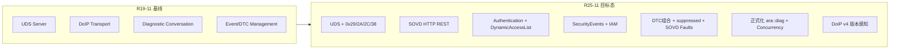
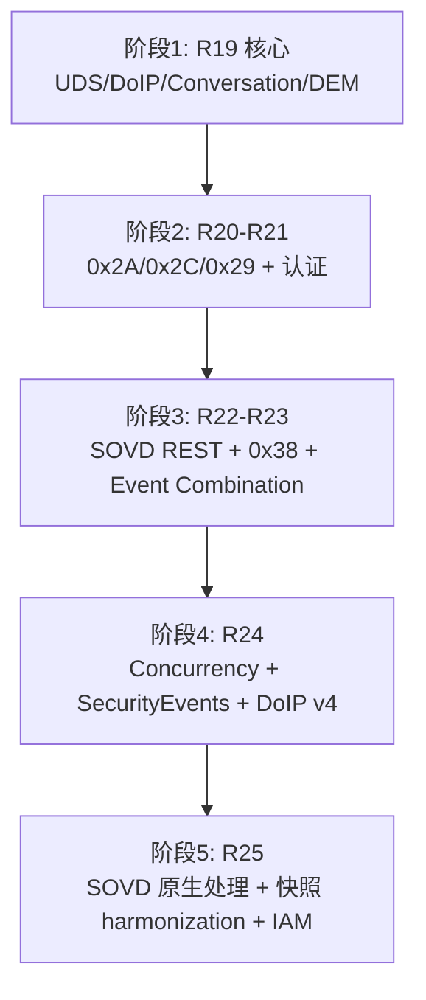

# AUTOSAR AP 诊断管理（DM）R25 对比 R19：五大技术方向详细分析

> **数据来源**：基于 MinerU 从官方 PDF 转换的 Markdown 原始文本（`autosar/dm/markdown/`），交叉参考 [AUTOSAR_AP_DM_Evolution_Report_R19-R25.md](./AUTOSAR_AP_DM_Evolution_Report_R19-R25.md)。  
> **分析范围**：AUTOSAR Adaptive Platform *Specification of Diagnostics*（文档编号 723），R19-11 与 R25-11。

---

## 1. 文档目的

本文对演进报告中的 **五大技术方向** 做展开说明，介绍 R25 相对 R19 在每个方向上的**具体内容、引入版本、规范章节与对诊断管理软件（DM）的实现要求**。

五大方向：

1. **传输与协议扩展**：DoIP 扩展、UDS 0x29/0x2A/0x2C/0x38、DoIP 2023 修订版支持
2. **SOVD 引入与成熟**：概念 → 可实施 → R25 原生数据/操作处理与 UDS 数据统一
3. **安全与访问控制**：从 SecurityAccess（0x27）到 Authentication（0x29）、DynamicAccessList、SecurityEvents/IAM
4. **事件/DTC 能力增强**：Event Combination、DTC suppressed、SOVD Faults、快照/扩展数据 harmonization
5. **工程化与平台一致性**：C++ API 正式化、Concurrency、CP 对齐、Standardized Violations

---

## 2. 总览：R19 与 R25 架构对比

R19 的 DM 是 **UDS/DoIP 单栈诊断服务器**；R25 演进为 **UDS + SOVD 双栈、认证驱动、安全可观测、与 CP 深度对齐** 的诊断管理平台。



| 维度 | R19-11 | R25-11 |
|------|--------|--------|
| 协议栈 | UDS + DoIP | UDS + DoIP + **SOVD/REST** |
| 客户端模型 | Diagnostic Conversation | UDS Conversation + **SOVD Conversation/Locks** |
| 访问控制 | Session + SecurityLevel（0x27） | + **0x29 认证** + **DynamicAccessList** |
| 配置输入 | DEXT | DEXT + **OpenAPI/SOVD 能力描述** |
| 安全审计 | 无 | **SecurityEvents** → IdsM/IAM |
| 规范需求规模 | ~754 条 `SWS_DM` | ~2207 条 `SWS_DM` |

> 注：五大能力并非均在 R25 一次性引入，而是 R20→R25 逐年叠加；下表为各方向关键里程碑。

| 方向 | R20 | R21 | R22 | R23 | R24 | R25 |
|------|-----|-----|-----|-----|-----|-----|
| 传输协议 | 0x2A/0x2C、DoIP Extension | 0x29 | 0x38 | 0x29 细化 | DoIP v4 | DoIP SecurityEvents |
| SOVD | — | — | 概念 | Part 2 可实施 | 持续扩充 | **原生处理**、快照 harmonization |
| 安全 | MetaInfo 增强 | 认证 API | — | — | SecurityEvents | IAM 扩展 |
| DTC/Event | — | Event Combination | DTC suppressed | — | no-debouncing | SOVD Faults 数据融合 |
| 工程化 | Reentrancy | — | NRC 映射 | — | Concurrency、CP 对齐 | C++ 类型映射约束 |

---

## 3. 方向一：传输与协议扩展

### 3.1 R19 基线

- **传输层**：DoIP（ISO 13400-2）+ 可插拔 UDS 传输层（`uds_transport`）
- **UDS 服务集**（目录可见）：0x10/11/14/19/22/27/28/2E/31/34–37/3E/85/86 等
- **不具备**：0x29、0x2A、0x2C、0x38；无 SOVD；无 DoIP 协议版本分支配置

### 3.2 逐年新增能力

| 版本 | 新增内容 | 规范依据（Change History） |
|------|----------|---------------------------|
| R20-11 | DoIP Extension 概念验证；**0x2A**、**0x2C** | Validated requirements from concept DoIPExtension |
| R21-11 | **0x29 Authentication** | Introduced UDS service 29 |
| R22-11 | **0x38 RequestFileTransfer** | Introduced 0x38 RequestFileTransfer |
| R24-11 | DoIP **protocol version 4**（ISO 13400-2 Amd 2023） | Support DoIP amendment 2023 protocol version 4 |
| R25-11 | DoIP **SecurityEvents** | Add SecurityEvents for DoIP |

### 3.3 各扩展服务详解

#### 3.3.1 0x2A ReadDataByPeriodicIdentifier（R20）

- 按 ISO 14229-1 周期性上报 DID 数据
- 适用于监控类、趋势类诊断数据
- DM 按 DEXT 配置周期标识符与 DID 映射关系处理请求

#### 3.3.2 0x2C DynamicallyDefineDataIdentifier（R20）

- 运行时动态组合 DID，减少 DEXT 中静态预定义数量
- 支持将多个源 DID/内存地址组合为新 DID

#### 3.3.3 0x29 Authentication（R21，R25 第 7.3.2.8.11 节）

基于 ISO 14229-1:2020，DM 实现以下子功能子集：

| 子功能 | 名称 | 作用 |
|--------|------|------|
| 0x00 | deAuthenticate | 注销当前认证状态 |
| 0x01 | verifyCertificateUnidirectional | 单向 PKI 证书验证 |
| 0x02 | verifyCertificateBidirectional | 双向 PKI 证书验证 |
| 0x03 | proofOfOwnership | 所有权证明，完成认证序列 |
| 0x04 | transmitCertificate | 按 certificateEvaluationId 传输/验证证书 |
| 0x08 | authenticationConfiguration | 返回 APCE 认证配置 |

**关键 API**：`ara::diag::Authentication::VerifyCertificateUnidirectional`、`VerifyCertificateBidirectional`、`VerifyOwnership`；`ara::diag::TransmitCertificate::Process`。

**限制**：当前 DM 仅支持 **PKI 证书交换**认证；挑战-响应（ACR）不在 DM 实现范围内。

**认证序列**：`verifyCertificate*` → `proofOfOwnership` → 认证完成（RV=0x12）；完成后须重新从 verify 开始新序列。

#### 3.3.4 0x38 RequestFileTransfer（R22，第 7.3.2.8.20 节）

支持多种 `modeOfOperation`，映射至 `ara::diag::FileTransferService`：

| modeOfOperation | 操作 | API 调用 |
|-----------------|------|----------|
| 0x01 AddFile | 添加文件 | `RequestWriteFile(kAdd)` |
| 0x02 DeleteFile | 删除文件 | `DeleteFile` |
| 0x03 ReplaceFile | 替换文件 | `RequestWriteFile(kReplace)` |
| 0x04 ReadFile | 读取文件 | `RequestReadFile` |
| 0x05 ReadDir | 读取目录 | `RequestReadDirectory` |
| 0x06 ResumeFile | 断点续传 | `RequestResumeWriteFile` |

**传输策略**（应用可选）：

- **Simple**：数据在 AA 与 DM 间拷贝，适合小文件
- **Zero Copy**：零拷贝，适合大文件、高性能场景
- **OS File System Handle**：传递文件句柄，依赖 OS 能力

`RequestFileTransfer` 与后续 `0x36 TransferData`、`0x37 RequestTransferExit` 通过 `DataTransferReadSession` / `DataTransferWriteSession` 对象串联。SOVD 的 Bulk Data、Software Update 也复用该传输机制。

**权限说明**：DEXT 仅在服务级配置 `DiagnosticAccessPermission`；文件级权限由 AA 在 OS 文件系统层实现。

#### 3.3.5 DoIP 协议版本感知（R24/R25，第 7.1.2 节）

- 配置项：`DoIpFunctionalClusterDesign.doIpProtocolVersion`
- 未配置时默认 **0x03**
- **0x04** 对应 ISO 13400-2:2019 Amendment 1 / 2025 及后续 DoIP protocol version 4

DM 行为要求（`SWS_DM_02111`）：

> 根据配置的 DoIP 协议版本调整协议行为，仅使用所选 ISO 13400-2 版本规定的消息、载荷类型、NACK 码等。

典型差异包括 Vehicle Announcement 中 VIN/GID sync status 字节、扩展 NACK 码等。

### 3.4 实现要求小结

- [ ] 实现 0x2A、0x2C、0x29、0x38 及与 `ara::diag` 的完整映射
- [ ] DoIP 栈支持 protocol version 配置与分支语义
- [ ] 0x38 按项目选择传输策略并实现 `FileTransferService`
- [ ] R25：DoIP 关键路径产生 SecurityEvents（见方向三）

---

## 4. 方向二：SOVD 引入与成熟

### 4.1 演进三阶段

| 阶段 | 版本 | 状态 | 标志 |
|------|------|------|------|
| 概念引入 | R22-11 | SOVD Concept | 架构双栈萌芽，关键词 SOVD 首次大量出现 |
| 可实施规范 | R23-11 | SOVD Concept Part 2 implemented | REST API 全集、Locks、Operations 等 |
| 原生融合 | R25-11 | Native Handling of SOVD Data and Operations | 与 UDS 快照/扩展数据 harmonization |

### 4.2 R25 架构定位（第 1.3.1 节）

DM 同时实现：

- **UDS 服务器**（ISO 14229-1）→ 经 DoIP 或自定义 UDS 传输层
- **SOVD 服务器**（ASAM SOVD）→ 经 **HTTP/HTTPS + REST**

Diagnostic Server 扩展职责：

1. 接收 DoIP 请求 **与** SOVD HTTP/REST 请求
2. 提取 UDS 传输无关信息，或 SOVD 实体路径/资源信息
3. 按 TA（物理/功能）或 URI 实体路径分发至各 Diagnostic Server 实例
4. UDS 用 **Session + SecurityLevel** 控制访问；SOVD 用 **Authorization + Locks**
5. 拒绝时分别返回 UDS NRC 或 HTTP 错误码

### 4.3 SOVD 传输层（第 7.2 节）

| 需求 | 内容 |
|------|------|
| `SWS_DM_01369` | DM 作为 SOVD Server（`SovdModuleInstantiation.communicationConnector`） |
| `SWS_DM_01370` | 支持 DNS-SD、mDNS 服务发现 |
| `SWS_DM_01371` | HTTP 连接使用 TLS（`securePropsForTcp`） |
| `SWS_DM_01372` | DM 表示为 SOVD component（Server 的 components 子节点） |
| `SWS_DM_01373` | 每个 Diagnostic Server 实例对应一个 SOVD subcomponent |
| `SWS_DM_01374` | 按 SOVD path 分发请求/响应 |

### 4.4 SOVD 管理（第 7.3.3 节）

#### 4.4.1 SOVD Conversation 与 UDS 互操作（7.3.3.1）

| 机制 | 规则 |
|------|------|
| 独占访问 | UDS 扩展会话 ↔ SOVD Lock：同一时刻仅一方持有独占权 |
| Lock 获取前提 | 无 UDS 客户端处于扩展会话时方可获取 SOVD Lock |
| 并行访问 | 无 Lock 的 SOVD 客户端按 UDS 默认会话的并行规则处理 |
| 非并发实现 | 资源不可重入时返回 SOVD "Conflicted state" 错误 |

#### 4.4.2 授权（7.3.3.2.1）

- 凭证验证端点 → `ara::diag::SovdAuthorization::GetAuthorizationUrl`（HTTP 307 重定向）
- Token 端点 → `GetTokenUrl`
- Token 校验 → `ValidateAuthorization`，设置 `ClientAuthentication` 角色
- 支持 `validUntil` 有效期、按 Token/Identity 重识别客户端（影响 Lock 与临时资源）

#### 4.4.3 Locks（7.3.3.2.2）

| 场景 | HTTP 响应 |
|------|-----------|
| 未认证客户端请求 Lock | 401 |
| 实体已被其他客户端锁定 | 错误码（冲突） |
| 需 Lock 的资源未持锁访问 | 409 |
| Lock 超时 | 释放关联资源，后续访问 409 |

#### 4.4.4 标准化 SOVD API（7.3.3.4）

- `docs`、`version-info`
- `data-categories`、`data-groups`
- Query entity data、Locks、Logging

#### 4.4.5 可配置 SOVD API（7.3.3.5）

| API 族 | 主要能力 |
|--------|----------|
| **Data Access** | 读/写实体数据值 |
| **Configuration** | 显式配置查询 |
| **Data Lists** | 批量数据列表读写 |
| **Faults** | 故障列表、详情、删除（与 UDS DTC 映射） |
| **Operations** | 查询/启动/终止/状态轮询/邻近管理 |
| **Modes** | CommunicationControl、ControlDTCSetting 的 SOVD 等价 |
| **Bulk Data** | 大文件传输（复用 0x38 策略） |
| **Software Update** | 软件更新数据上传 |

### 4.5 R25 重点：原生处理与数据统一

R25 Change History 三项核心变更：

1. **Native Handling of SOVD Data and Operations** — SOVD 数据与操作由 DM 内部完整处理，不再仅为概念占位
2. **Enhanced Snapshot Record Handling for SOVD Use Cases** — 快照记录增强
3. **Harmonized Use of SOVD and UDS Extended Data Records** — UDS 与 SOVD 扩展数据记录统一

**Faults API 数据映射示例**（`SWS_DM_01567`、`SWS_DM_01561`）：

- 每个 `DiagnosticTroubleCodeUds` 表达一个 SOVD fault
- `code` ← `udsDtcValue`；`scope` ← `DiagnosticMemoryDestination.shortName`
- `status` ← UDS DTC Status Mask 的 JSON 对象
- `environment_data` 同时包含：
  - `extended_data_records`：UDS 扩展数据
  - `snapshots`：UDS `DiagnosticDataElement` 与 SOVD `DiagnosticSovdContentElement` **合并**的快照数组

### 4.6 实现要求小结

- [ ] 部署 HTTP/HTTPS REST 服务端 + TLS
- [ ] 实现 DNS-SD/mDNS（若配置要求）
- [ ] UDS Conversation 与 SOVD Lock 互斥调度
- [ ] 实现 Faults/Data/Operations/Modes 等可配置 API
- [ ] R25：UDS 0x19 与 SOVD Faults 共用同一事件内存与快照模型
- [ ] 配置：DEXT + OpenAPI/SOVD 能力描述双源

---

## 5. 方向三：安全与访问控制

### 5.1 R19 基线

- **DiagnosticSession**（0x10）+ **SecurityAccess**（0x27）
- `DiagnosticAccessPermission` 静态配置访问权限
- `ServiceValidation` 用于厂商/供应商权限确认与响应确认
- **无**：0x29、DynamicAccessList、SecurityEvents、IAM 集成

### 5.2 R21 起：多层访问控制模型

```
┌─────────────────────────────────────────────────────────┐
│  静态 DEXT 权限（Session + SecurityLevel + Permission）  │
├─────────────────────────────────────────────────────────┤
│  0x29 证书认证链 → Authentication Role                   │
├─────────────────────────────────────────────────────────┤
│  DynamicAccessList（运行时动态授予诊断资源）              │
├─────────────────────────────────────────────────────────┤
│  SecurityEvents → IdsM / IAM（安全审计）                 │
└─────────────────────────────────────────────────────────┘
```

### 5.3 ExternalAuthentication 与 ClientAuthentication（7.3.2.3）

**设计原则**：认证过程主要在 Application 完成，DM 维护认证状态。

| 组件 | 作用 |
|------|------|
| `ExternalAuthentication` | 应用获取 `ClientAuthentication` 实例（按 MetaInfo 或 Client SA） |
| `ClientAuthentication` | 设置认证状态（`kDeAuthenticated` / `kAuthenticated`）、角色 |
| `ClientAuthenticationHandle` | 认证成功后管理 DynamicAccessList、撤销、刷新超时 |

**关键行为**：

- 每 Diagnostic Client **独立**认证状态，互不影响
- 启动默认：`kDeAuthenticated`，角色为 `isDefault=true` 的 `DiagnosticAuthRole`
- S3 超时 / `authenticationTimeout` 无活动 → 自动 `kDeAuthenticated` 并**清空 DynamicAccessList**
- `Authenticate()` 成功后返回 `ClientAuthenticationHandle`

### 5.4 DynamicAccessList（7.3.2.3.4）

认证客户端可获得的**运行时动态访问列表**，补充 DEXT 静态配置：

| 方法 | 作用 |
|------|------|
| `Set` | 替换整个 DynamicAccessList |
| `Append` | 追加条目 |
| `Revoke` | 撤销认证（→ `kDeAuthenticated`） |
| `Refresh` | 刷新 OverrideDefaultRoles 或认证超时 |

构建器：`DynamicAccessListDiagServiceBuilder`、`DiagnosticServiceDynamicAccessList`。

### 5.5 服务级认证检查（7.3.2.4）

每个 UDS 请求除 Session/Security 检查外，还需验证：

- 认证状态是否满足服务要求
- DynamicAccessList 是否包含目标 SID/DID/RID

不满足 → **NRC 0x34 authenticationRequired** → 触发 `SEV_UDS_AUTHENTICATION_NEEDED`

### 5.6 SOVD 侧授权（7.3.3.2.1）

- HTTP `Authorization` header 携带 Token
- `SovdAuthorization::ValidateAuthorization` 校验并设置角色
- Lock 仅对已认证客户端开放

### 5.7 SecurityEvents 与 IAM（7.5.1，R24 引入，R25 扩展）

DM 向 **IdsM** 上报安全事件，覆盖 UDS 与 DoIP：

**UDS 类事件（节选）**

| 事件名 | ID | 触发条件 |
|--------|-----|----------|
| SEV_UDS_SECURITY_ACCESS_NEEDED | 100 | NRC 0x33 |
| SEV_UDS_AUTHENTICATION_NEEDED | 101 | NRC 0x34 |
| SEV_UDS_SECURITY_ACCESS_SUCCESSFUL/FAILED | 102/103 | 0x27 结果 |
| SEV_UDS_AUTHENTICATION_SUCCESSFUL/FAILED | 104/105 | 0x29 结果 |
| SEV_UDS_WRITE_DATA_* | 106/107 | 0x2E |
| SEV_UDS_REQUEST_FILE_TRANSFER_* | 112/113 | 0x38 |
| SEV_UDS_CLEAR_DTC_* | 116/117 | 0x14 |
| SEV_UDS_ECU_RESET_* | 120/121 | 0x11 |
| SEV_UDS_ROUTINE_CONTROL_* | 122/123 | 0x31 |

**DoIP 类事件（R25 新增）**

| 事件名 | ID | 触发条件 |
|--------|-----|----------|
| SEV_DOIP_HEADER_CHECK_FAILED | 127 | 头部校验失败 |
| SEV_DOIP_ROUTING_ACTIVATION_* | 128/129 | 路由激活失败/成功 |
| SEV_DOIP_DIAG_MESSAGE_CHECK_FAILED | 130 | 诊断消息校验失败 |

**IAM 类**

| 事件名 | ID | 触发条件 |
|--------|-----|----------|
| SEV_ACCESS_CONTROL_DM_IAM_ACCESS_DENIED | 133 | 应用访问 DM 资源被拒 |

Context Data 含 SID、Subfunction、DID、RID、ClientSourceAddress 等，便于 IDS 关联分析。单次请求可触发多个事件。

### 5.8 实现要求小结

- [ ] 完整 0x29 状态机及与 DynamicAccessList 联动
- [ ] 应用实现 `ExternalAuthentication` / `SovdAuthorization` 或对接 OEM PKI
- [ ] 所有敏感 UDS/DoIP 路径接入 SecurityEvents
- [ ] SOVD 与 UDS 共享 `ClientAuthentication` 模型
- [ ] 与 IAM/IdsM 集成，支持上下文数据上报

---

## 6. 方向四：事件 / DTC 能力增强

### 6.1 R19 基线

- Monitor + Counter-based / Time-based Debouncing
- DTC、快照（Freeze Frame）、扩展数据、用户自定义故障存储器
- 典型模型：一 Event 映射一 DTC
- **无**：Event Combination、DTC suppressed、SOVD Faults API

### 6.2 Event Combination（R21，7.3.4.1.3）

**目的**：多个 Monitor/Event 映射到同一 DTC，组合计算 DTC 状态字节（按位逻辑运算）。

**配置**：`DiagnosticCommonProps.typeOfEventCombinationSupported`

| 模式 | 存储行为 | 读取行为 |
|------|----------|----------|
| **eventCombinationOnStorage** | 一个 DTC 一条事件内存项；只存一个 Event 的相关数据 | UDS 响应如同单 Event |
| **eventCombinationOnRetrieval** | 每个 Event 独立存储 | 读取时合并所有 Event 数据拼接响应 |

**组合规则（节选）**：

- 组合 DTC 状态字节：各关联 Event 按 `SWS_DM_01977` 逻辑方程计算
- FDC：取各子 Event FDC 的**最大值**
- 清除 DTC：清除所有关联 Event（与是否组合无关）
- Event 自身 `EventStatusByte` 不受组合影响

### 6.3 DTC suppressed（R22）

- 允许在特定条件下**抑制** DTC 存储/上报（开发、质保等场景）
- 应用 API 错误码 `kSuppressionIgnored`（117）：请求抑制但条件不满足
- 与 `ControlDTCSetting`（0x85）等机制协同

### 6.4 SOVD Faults API（R23/R25，7.3.3.5.4）

| SOVD 方法 | 功能 |
|-----------|------|
| Read Faults from an Entity | 列出实体故障 |
| Read Details for a Fault | 故障详情（含 environment_data） |
| Delete All/Single Fault of an Entity | 清除故障 |
| scope 查询参数 | 对应 `DiagnosticMemoryDestination.shortName` |

**Fault 属性映射**（`SWS_DM_01567`）：

| SOVD 属性 | 来源 |
|-----------|------|
| code | `DiagnosticTroubleCodeUds.udsDtcValue` |
| scope | `DiagnosticMemoryDestination.shortName` |
| display_code | `DiagnosticTroubleCodeUds.shortName` |
| fault_name | `DiagnosticTroubleCodeUds.longName` |
| severity | `DiagnosticTroubleCodeUds.severity` |
| status | UDS DTC Status Mask（JSON） |

### 6.5 R25：快照/扩展数据 Harmonization

SOVD fault 的 `environment_data` 统一结构（`SWS_DM_01561`）：

```text
environment_data
├── extended_data_records/     ← UDS 扩展数据（按 DiagnosticExtendedDataRecord）
└── snapshots[]                ← 快照数组
    ├── name                   ← first_occurrence / last_occurrence / occurrence_N
    └── data/
        ├── {DiagnosticDataElement.shortName}      ← UDS 建模快照
        └── {DiagnosticSovdContentElement.shortName} ← SOVD 建模快照
```

实现 **UDS 0x19 ReadDTCInformation** 与 **SOVD REST Read Fault Details** 的数据同源。

### 6.6 其他 DEM 增强

| 能力 | 版本 | 说明 |
|------|------|------|
| 显式 no-debouncing | R24 | `ara::diag::Monitor` 支持无防抖模式 |
| 厂商错误码 → UDS NRC 映射 | R22 | 标准化 `DiagUdsNrcErrc` 转换 |
| Monitor 非法 action | R24 | 触发 Standardized Violation（`SWS_CORE_00003`） |
| 应用 EnableControlDtc | R20+ | `DTCInformation::EnableControlDtc` 重新启用 DTC 设置 |

### 6.7 实现要求小结

- [ ] DEXT 配置 Event Combination 类型及多 Event→DTC 映射约束
- [ ] 实现 suppressed 状态机与条件判断
- [ ] SOVD Faults 与 UDS DEM 共用事件内存，避免双份数据
- [ ] R25：快照同时支持 UDS 与 SOVD 内容元素建模
- [ ] 组合 DTC 的 FDC、老化计数器、状态回调按规范计算

---

## 7. 方向五：工程化与平台一致性

### 7.1 R19 基线

- `ara::diag` C++ 接口替代 `ara::com` Service Interface（R19-03 起）
- `Reentrancy` / `ReentrancyType` 描述接口可重入性
- 生成接口（DID/RID/DataElement）结构较简单
- 与 Classic Platform（Dcm/Dem）对齐有限

### 7.2 Reentrancy → Concurrency（R24，7.3.1.2）

| 术语 | R19 | R24/R25 |
|------|-----|---------|
| 并发声明 | `ReentrancyType` | `ConcurrencyType` |
| 并发安全 | `kReentrant` | `kConcurrent` |
| 非并发 | `kNonReentrant` | `kNotConcurrent` |

**语义**（`SWS_DM` 7.3.1.2）：

- `kConcurrent`：DM 可在上次调用未完成时再次调用该 AA 回调
- `kNotConcurrent`：DM 阻塞新请求直至上次调用返回（Future ready）

扩展类型：`DataIdentifierConcurrencyType`、`SovdContentConcurrencyType`。

SOVD 非并发资源冲突 → 返回 "Conflicted state"（`SWS_DM_01929`）。

### 7.3 生成接口正式化（R24/R25）

- DID、RID、DataElement 生成类层次与命名空间规范化（`SWS_DM_01273`–`01275`）
- R25 新增：**Class Derivation Details and Semantic Constraints for C++ Data Type Mapping**
- 类型化 Routine/DataIdentifier/DataElement 接口有正式命名空间与类派生规则

### 7.4 Standardized Violations（R24）

违反并发契约、非法 Monitor action 等 → 通过 `SWS_CORE_00003` 在对应进程触发 Violation：

- 行为可预期、可测试
- 替代原先模糊的未定义行为

### 7.5 与 Classic Platform 谐调（R24）

- 术语、NRC、会话语义与 Dcm/Dem 对齐
- 便于 AP/CP 混合架构下诊断行为一致
- Monitor debouncing、DTC 状态等语义与 CP Dem 趋同

### 7.6 MetaInfo 增强（R20→R25）

R25 `MetaInfo` 支持多上下文（Table 7.1）：

| 上下文 | 典型 Key |
|--------|----------|
| kDiagnosticCommunication | kSA, kTA, kTAType, kRequestHandle, kLocalIP/Port, kRemoteIP/Port |
| kFaultMemory | kDtc |
| kSOVD | kBaseUri, kEntityPath, kResourcePath, kClientIdentity |

应用回调可区分 UDS 与 SOVD 请求来源，并获取传输层元信息。

### 7.7 应用调用缓存（7.3.1.3）

DM 未就绪时，以下调用可缓存并在 DM 恢复后转发：

- EnableCondition 状态
- ClearDTC 条件状态
- Monitor 结果上报

降低应用处理 DM 生命周期复杂度的负担。

### 7.8 配置与架构模型演进

| 项目 | R19 | R25 |
|------|-----|-----|
| 多实例模型 | 每 SoftwareCluster 一 Diagnostic Server | 每 DiagnosticContributionSet 一实例 |
| 地址模型 | 每 Cluster 独立 diagnosticAddress | 可共享或独立地址 |
| SOVD 配置 | 无 | `DiagnosticSovdProps`、OpenAPI 能力描述 |
| 需求可追溯 | ~754 条 | ~2207 条；Appendix E 逐版变更清单 |

### 7.9 实现要求小结

- [ ] 所有 AA 实现 `ara::diag` 接口时声明 `ConcurrencyType`
- [ ] 使用正式生成类，满足 R25 C++ 类型映射语义约束
- [ ] 建立 2200+ `SWS_DM` 需求可追溯测试基线
- [ ] DEXT + SOVD OpenAPI 双配置源版本管理
- [ ] 与 CP 诊断栈在 NRC/会话/DTC 语义上保持一致
- [ ] Violation 路径可测试、可日志化

---

## 8. 五大方向综合对照与实施路线图

### 8.1 综合对照表

| 方向 | R19 典型实现 | R25 目标实现 | 主要新增章节 |
|------|-------------|-------------|-------------|
| 传输协议 | DoIP + 经典 UDS | +0x29/2A/2C/38 + DoIP v4 | 7.1.2, 7.3.2.8 |
| SOVD | 不存在 | HTTP REST 全栈 + UDS 数据融合 | 7.2, 7.3.3 |
| 安全 | 0x27 + 静态权限 | 0x29 + DAL + SecurityEvents | 7.3.2.3, 7.5.1 |
| DTC/Event | 单 Event 单 DTC | 组合 + 抑制 + SOVD Faults | 7.3.4.1.3, 7.3.3.5.4 |
| 工程化 | Reentrancy + 基础 API | Concurrency + 正式生成类 + CP 对齐 | 7.3.1.2, 第 8 章 API |

### 8.2 建议实施路线图



| 阶段 | 版本范围 | 交付能力 |
|------|----------|----------|
| 1 | R19 | UDS/DoIP/Conversation/DEM 核心 + DEXT |
| 2 | R20–R21 | 0x2A/0x2C/0x29 + 认证基础设施 + MetaInfo |
| 3 | R22–R23 | SOVD REST 栈 + 0x38 + Event Combination + DTC suppressed |
| 4 | R24 | Concurrency 迁移、SecurityEvents、DoIP v4、CP 对齐、no-debouncing |
| 5 | R25 | SOVD 原生数据/操作、快照 harmonization、DoIP SecurityEvents、IAM 深度集成 |

---

## 9. 附录

### 9.1 相关文档路径

| 文档 | 路径 |
|------|------|
| 演进总报告 | [AUTOSAR_AP_DM_Evolution_Report_R19-R25.md](./AUTOSAR_AP_DM_Evolution_Report_R19-R25.md) |
| 机器分析结果 | [evolution_summary.json](./evolution_summary.json) |
| R19 Markdown | `../markdown/AUTOSAR_AP_SWS_Diagnostics_R19-11/` |
| R25 Markdown | `../markdown/AUTOSAR_AP_SWS_Diagnostics_R25-11/` |
| 批量转换脚本 | `../../scripts/mineru_batch_convert.ps1` |

### 9.2 关键规范章节索引（R25-11）

| 主题 | 章节 |
|------|------|
| 功能概述 | 1.3.1 Diagnostic Server |
| DoIP | 7.1.2 |
| SOVD 传输 | 7.2 |
| Concurrency | 7.3.1.2 |
| 认证与 DAL | 7.3.2.3 |
| UDS 0x29 | 7.3.2.8.11 |
| UDS 0x38 | 7.3.2.8.20 |
| SOVD 管理 | 7.3.3 |
| Event Combination | 7.3.4.1.3 |
| Security Events | 7.5.1 |
| ara::diag API | 第 8 章 |

### 9.3 免责声明

本文档为基于公开 AUTOSAR 规范的二次分析，用于技术规划与架构设计参考。具体实现应以 AUTOSAR 官方发布 PDF、对应 DEXT 配置及工具链为准。

---

*文档生成时间：2026-07-21*
