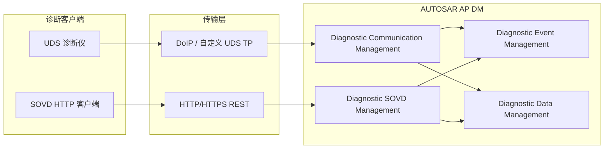

# SOVD 技术介绍报告

**Service-Oriented Vehicle Diagnostics（面向服务的车辆诊断）**

| 项目 | 内容 |
|------|------|
| 文档类型 | 技术介绍报告 |
| 编制依据 | 对话研讨内容；AUTOSAR AP SWS Diagnostics R25-11；R19–R25 演进分析 |
| 适用读者 | 诊断软件工程师、架构师、测试与运维平台开发人员 |
| 版本 | 1.0 |
| 日期 | 2026-07-21 |

---

## 摘要

SOVD（Service-Oriented Vehicle Diagnostics）是由 **ASAM** 制定、并正逐步纳入 **ISO 17978** 体系的新一代车辆诊断标准。与基于 ISO 14229 的 **UDS** 不同，SOVD 采用 **HTTP/HTTPS + REST** 架构，以资源 URI、OpenAPI 能力描述和 JSON 数据交换为核心，面向云诊断、远程运维、多域控制器与服务化 E/E 架构。

在 **AUTOSAR Adaptive Platform Diagnostic Management（DM）** 中，R22 引入 SOVD 概念，R23 完成 Part 2 可实施化，R25 实现 SOVD 数据与操作的原生处理，并与 UDS 快照/扩展数据记录进行 harmonization。DM 同时作为 **UDS Server** 与 **SOVD Server** 运行，形成“传统近场诊断 + 现代远程服务化诊断”的双栈能力。

本报告从标准背景、技术架构、与 UDS 对比、AUTOSAR 集成、演进路线及工程价值等维度，对 SOVD 进行系统性介绍。

---

## 1. 背景与动机

### 1.1 传统 UDS 的局限

UDS（Unified Diagnostic Services，ISO 14229-1）是车载诊断的事实标准，通常经 DoIP（ISO 13400）或 CAN 传输，具有以下特点：

- 二进制报文，以 **SID（Service Identifier）** 组织功能
- 依赖 **DID/RID/DTC 编号** 与 OEM 私有编码表
- 客户端需维护会话、安全访问、NRC 错误处理等状态机
- 生态成熟，适合车间诊断、EOL、法规 OBD

随着车辆 E/E 架构向**域集中、软件集群（Software Cluster）、云端运维**演进，UDS 在以下方面面临挑战：

- 与云平台、Web 系统集成成本高
- 能力扩展依赖新增 SID/子功能，语义不够直观
- 远程诊断需额外网关/协议转换层

### 1.2 SOVD 的定位

SOVD 并非要完全替代 UDS，而是提供**上层、服务化、可发现**的诊断访问方式：

> 把“专家才知道的十六进制 DID/Routine”  
> 转化为“机器可发现、可编排的 Web 资源与操作”。

这与当前软件工程中 **API 化、OpenAPI 自描述、微服务资源模型** 的方向一致；在 AI 时代，也可类比为诊断领域的 **“能力工具化”**（类似 MCP 的 tool/resource 发现与调用），但 SOVD 本身是**车规级、确定性**的行业标准，而非 Agent 推理框架。

---

## 2. 标准体系与维护组织

### 2.1 ASAM

**ASAM e.V.**（Association for Standardization of Automation and Measuring Systems）是汽车测试、测量、标定、诊断领域的标准组织，总部在德国，采用会员制工作组维护标准。

与 AUTOSAR 的关系：

| 组织 | 职责 |
|------|------|
| **ASAM** | 测试/诊断/标定数据格式与接口（XCP、ASAP2、ODS、**SOVD** 等） |
| **AUTOSAR** | 车载软件架构与模块实现规范（如 AP DM） |

AUTOSAR DM 规范**引用并实现** ASAM SOVD，但 SOVD 标准本身由 **ASAM** 制定与维护。

### 2.2 主要引用标准（AUTOSAR DM R25）

| 编号 | 标准 | 说明 |
|------|------|------|
| [5] | ASAM SOVD V1.0.0 | SOVD 基础规范 |
| [13] | ISO 17978-3:2025 | SOVD API（应用编程接口） |
| [14] | ASAM SOVD 1.1 | SOVD 新版本（与 ISO 对齐中） |
| [1] | ISO 14229-1 | UDS（对比参照） |
| [2][3] | ISO 13400-2 | DoIP（UDS 传输层） |

SOVD 正从 ASAM 主导走向 **ISO 17978** 国际标准化，ASAM SOVD 1.1 与 ISO 17978-3 内容逐步对齐。

---

## 3. 技术架构

### 3.1 总体架构



AUTOSAR DM R25 引言明确：

- DM 实现 **ISO 14229-1 UDS Server**
- DM 实现 **ASAM SOVD Server**
- UDS 传输：DoIP 或自定义传输协议
- SOVD 传输：**HTTP/HTTPS + REST**

### 3.2 核心概念

| 概念 | 说明 |
|------|------|
| **SOVD Client** | 实现 SOVD 的 HTTP 诊断客户端（测试仪、云平台、运维工具） |
| **SOVD Server** | 车端提供 SOVD REST API 的实体（AUTOSAR DM 承担） |
| **SOVD Entity** | 被诊断的逻辑实体（整车、域、ECU、Software Cluster 等） |
| **Resource** | 通过 URI 访问的资源（data、faults、operations、modes 等） |
| **Locks** | SOVD 资源锁，用于独占访问，类似 UDS 扩展会话的排他机制 |
| **Operations** | 可启动/查询/终止的诊断操作（类比 UDS Routine，但为 REST 执行模型） |
| **OpenAPI** | 离线能力描述，定义可用 API 与数据 schema |

### 3.3 REST / HTTP 技术基础

SOVD 采用 **HTTP REST** 风格：

| HTTP 方法 | 典型 SOVD 用途 |
|-----------|----------------|
| GET | 读取 data、faults、docs、version-info |
| POST | 创建 operation execution、获取 lock |
| PUT/PATCH | 更新配置或模式 |
| DELETE | 释放 lock、终止资源 |

**REST 设计要点：**

- **资源导向**：URL 表示“什么”（`/entities/.../faults`），非动词
- **无状态**：请求自带认证 Token 等上下文
- **标准状态码**：200/401/403/404/409/500 等
- **JSON 载荷**：结构化、易与云系统集成

---

## 4. SOVD 与 UDS 对比

### 4.1 维度对比

| 维度 | UDS | SOVD |
|------|-----|------|
| 标准 | ISO 14229-1 | ASAM SOVD / ISO 17978 |
| 协议形态 | 二进制 SID + 参数 | HTTP REST + JSON |
| 传输 | DoIP、CAN 等 | HTTP/HTTPS |
| 寻址 | 物理/功能地址 + DID/RID/DTC | URI 实体路径 + 资源名 |
| 错误处理 | NRC（Negative Response Code） | HTTP 状态码 + SOVD 错误体 |
| 能力发现 | OEM 诊断数据库 / ODX | **OpenAPI**、SOVD docs |
| 典型场景 | 车间、EOL、法规 OBD | 云诊断、远程运维、fleet 管理 |
| 扩展方式 | 新增 SID/子功能 | 新增 REST 资源/API |

### 4.2 实例对比：读取数据

**UDS — ReadDataByIdentifier (0x22)**

```text
请求:  22 F1 90
响应:  62 F1 90 0C E4    （DID 0xF190，数据按 OEM 编码）
```

**SOVD — Data Access**

```http
GET /entities/vehicle/powertrain/battery/data/voltage HTTP/1.1
Authorization: Bearer <token>
Accept: application/json
```

```json
{
  "entity": "vehicle/powertrain/battery",
  "dataId": "voltage",
  "value": 13.0,
  "unit": "V"
}
```

### 4.3 实例对比：读取故障

**UDS — ReadDTCInformation (0x19)**

```text
请求:  19 02 FF
响应:  59 02 FF P1234 08 ...
```

**SOVD — Faults API**

```http
GET /entities/vehicle/powertrain/battery/faults HTTP/1.1
```

```json
{
  "faults": [
    { "code": "P1234", "status": "confirmed", "snapshotAvailable": true }
  ]
}
```

### 4.4 实例对比：执行诊断操作

**UDS — RoutineControl (0x31)**

```text
请求:  31 01 FF 00    （StartRoutine, RID=0xFF00）
```

**SOVD — Operations API**

```http
POST /entities/.../operations/self-test/executions HTTP/1.1
Content-Type: application/json

{"mode": "synchronous"}
```

```json
{ "executionId": "exec-001", "status": "running" }
```

### 4.5 互补关系

R25 强调 **SOVD 与 UDS 数据 harmonization**：

- 同一 DTC、快照、扩展数据在两种协议下语义对齐
- DM 内部统一管理 DEM/DDM，对外暴露双接口
- 并非“二选一”，而是**同一诊断数据、两种访问语言**

---

## 5. SOVD 的技术优势

### 5.1 可发现与自描述

- 通过 **OpenAPI** 与 SOVD 标准资源（docs、version-info、data-categories）描述能力
- 客户端无需记忆 DID 表，可先发现再调用
- 降低工具链与 OEM 集成的定制成本

### 5.2 语义清晰、层次化建模

- URI 表达实体层级：`vehicle → domain → component → resource`
- 契合多域控制器、Software Cluster 架构
- 资源类型明确：data / faults / operations / modes / bulk-data

### 5.3 互联网原生集成

- HTTP/HTTPS、JSON 为云原生标准栈
- 便于对接 API 网关、IAM、OAuth、日志与监控
- 适合 OTA 运维、fleet 远程排障

### 5.4 服务化扩展

- 新增能力以 REST 资源/Operation 扩展，不必挤入 UDS SID 空间
- **Locks、Modes、Executions** 为一等公民，支持长时操作与并发控制

### 5.5 与“AI Agent / MCP 工具化”的设计共鸣

| 思想 | SOVD | MCP / Agent 生态 |
|------|------|------------------|
| 能力暴露 | REST 资源/Operation | tools / resources |
| 发现机制 | OpenAPI | tools/list |
| 调用方式 | HTTP GET/POST | call_tool |
| 抽象层级 | 高于 UDS 二进制 | 高于原始 API/脚本 |

**差异：** SOVD 是车规确定性标准，含 Locks、Authorization、环境校验；不是为 LLM 即兴推理设计。

---

## 6. AUTOSAR AP DM 中的 SOVD 集成

### 6.1 规范章节结构（R25-11）

| 章节 | 内容 |
|------|------|
| **7.2** | SOVD Transport Layer（HTTP/HTTPS） |
| **7.3.3** | Diagnostic SOVD Management |
| 7.3.3.1 | SOVD Conversations 与 UDS 交互 |
| 7.3.3.2 | 请求校验（Authorization、Locks、环境条件、Service Validation） |
| 7.3.3.3 | 数据序列化与转换 |
| 7.3.3.4 | 标准化 SOVD API（docs、faults、locks、logging 等） |
| 7.3.3.5 | 可配置 SOVD API（Data Access、Configuration、Operations、Modes、Bulk Data、Software Update） |
| **第 8 章** | C++ API（如 `GenericDiagnosticSovdContent`、`GenericDiagnosticSovdOperation`） |

### 6.2 与 UDS 的并行与互斥

规范要求 DM 同时处理 UDS 与 SOVD 客户端：

- **SOVD Lock** 获得独占访问后，并行 UDS/SOVD 客户端访问受限
- 无 Lock 的 SOVD 客户端，并行规则与 UDS 默认会话类似
- Lock 仅对已认证 SOVD 客户端开放（否则 HTTP 401）
- 同一 Entity 同时只允许一个 Lock（冲突返回 HTTP 409）

### 6.3 演进时间线（AP DM 规范）

| 版本 | SOVD 相关变更 |
|------|--------------|
| R19–R21 | 无 SOVD |
| **R22** | SOVD Concept 引入 |
| **R23** | SOVD Concept Part 2 实施；0x29 细化 |
| R24 | 结构重组；SecurityEvents；与 CP 谐调 |
| **R25** | SOVD 数据/操作原生处理；快照/扩展数据与 SOVD harmonization；DoIP SecurityEvents |

规范文本中 “SOVD” 关键词频次：R19 为 0，R25 逾 3700 次（基于 Markdown 统计），反映其已成为 DM 主线能力。

### 6.4 R25 已知限制（节选）

AUTOSAR DM R25 对 SOVD 的支持仍有限制，例如：

- ASAM SOVD 1.0：不支持 entity 类型 area/app/function；Locks 仅 SoftwareCluster 级
- ASAM SOVD 1.1 / ISO 17978-3:2026：**尚未完全支持**
- 部分 SOVD Operation 能力（custom capabilities、modes 属性等）未实现

实现方需对照 **4.1.3 SOVD support** 章节评估差距。

---

## 7. 典型应用场景

| 场景 | 推荐协议 | 理由 |
|------|---------|------|
| 4S 店诊断仪、刷写 | UDS | 生态成熟、实时性好 |
| EOL 产线、法规 OBD | UDS | 行业标准、认证体系完善 |
| 云端 fleet 健康监控 | SOVD | HTTP 易集成、JSON 易解析 |
| 远程故障排查、OTA 运维 | SOVD | 远程 HTTPS、IAM 对接 |
| 多域控制器统一诊断门户 | SOVD + UDS | DM 双栈，按场景分流 |
| 第三方生态/OpenAPI 工具 | SOVD | 能力自描述、低定制成本 |

---

## 8. 对诊断软件实现的影响

### 8.1 DM 实现方

1. 除 UDS/DoIP 栈外，需实现 **HTTP Server + SOVD 路由**
2. 实现 **Locks、Authorization、SOVD Conversation** 状态管理
3. 与 DEM/DDM 打通，保证 fault/data 与 UDS 侧一致
4. 支持 **DNS-SD / mDNS** 服务发现（规范要求）
5. 配置输入扩展：DEXT + SOVD/OpenAPI 能力描述

### 8.2 Adaptive Application 集成方

- 通过 `ara::diag::GenericDiagnosticSovdContent`、`GenericDiagnosticSovdOperation` 等接口提供 SOVD 数据与操作
- 关注 **Concurrency** 声明（R24 起 Reentrancy 术语迁移）
- 配合 **MetaInfo、ServiceValidation、SovdAuthorization** 完成访问控制

### 8.3 测试与运维平台

- 可用标准 HTTP 客户端（curl、Postman、云 API 网关）替代专用 UDS 栈做部分场景验证
- 需额外覆盖 Lock 互斥、Token 认证、SOVD/UDS 交叉并发等场景

---

## 9. 结论

SOVD 代表车辆诊断从**报文驱动**向**服务驱动**的重要演进方向。其核心价值在于：

1. **标准化**：ASAM/ISO 统一语义，降低跨 OEM、跨工具链集成成本  
2. **服务化**：REST 资源模型契合现代 E/E 与云运维架构  
3. **可发现**：OpenAPI 使能力机器可读、可编排  
4. **互补 UDS**：近场实时与远程扩展并存，由 DM 统一承载  

对于 AUTOSAR AP 诊断软件团队，SOVD 已不再是“远期概念”，而是 R23 起可实施、R25 起需原生支持的**正式能力维度**。建议在架构设计、测试策略与人才技能（HTTP/REST/OpenAPI/IAM）上同步布局，与 UDS 能力并列规划。

---

## 10. 参考资料

1. AUTOSAR AP SWS Diagnostics R25-11（文档 723），`autosar/dm/markdown/AUTOSAR_AP_SWS_Diagnostics_R25-11/`
2. AUTOSAR AP DM 演进分析报告，`autosar/dm/analysis/AUTOSAR_AP_DM_Evolution_Report_R19-R25.md`
3. ASAM SOVD V1.0.0 — http://www.asam.net
4. ISO 17978-3:2025 — Service-oriented vehicle diagnostics (SOVD), Part 3: API
5. ISO 14229-1:2020 — Unified diagnostic services (UDS)
6. ISO 13400-2 — Diagnostic communication over Internet Protocol (DoIP)

---

*本报告由对话研讨内容整理而成，具体实现请以 AUTOSAR 与 ASAM/ISO 官方发布版本为准。*

---