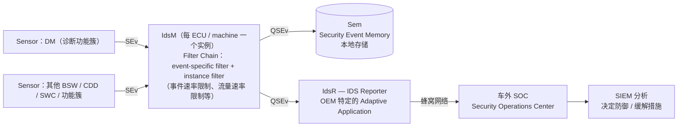

# AUTOSAR IdsM（Intrusion Detection System Manager）技术调研报告

> **本文性质**：技术**调研**报告，不是规范分析。原因是 IdsM 的核心规范（`AUTOSAR_AP_SWS_IntrusionDetectionSystemManager`、`AUTOSAR_FO_RS_IntrusionDetectionSystem`、`AUTOSAR_TPS_SecurityExtractTemplate`）**均不在本仓库**。
>
> 因此本文的证据强度是**分层的**：涉及 DM 侧上报义务的部分有仓库内一手规范支撑；涉及 IdsM 自身架构与内部行为的部分来自联网检索的二手资料，**必须以官方 PDF 复核后才能写入项目正式文档**。每一节都标注了证据级别。

| 文档属性 | 值 |
|---|---|
| 文档类型 | 技术调研 / 边界界定 |
| 调研目的 | 回答三个问题：IdsM 是否 AUTOSAR 正式模块、DM 在 IDS 体系中承担什么、暂不实现上报是否可行 |
| 一手来源 | `autosar/dm/autosar/AUTOSAR_AP_SWS_Diagnostics_R25-11.pdf` §7.5.1；`AUTOSAR_AP_TPS_ManifestSpecification_R25-11.pdf` §3.6、§4.12 |
| 二手来源 | 联网检索（技术博客、Qiita、Scribd 摘要等），检索日期 2026-08-27 |
| **缺失材料** | `AUTOSAR_AP_SWS_IntrusionDetectionSystemManager`、`AUTOSAR_FO_RS_IntrusionDetectionSystem`、`AUTOSAR_FO_PRS_IntrusionDetectionSystem`、`AUTOSAR_TPS_SecurityExtractTemplate` |
| 编写日期 | 2026-08-27 |

## 证据级别标签

| 标签 | 含义 | 可否写入项目正式文档 |
|---|---|---|
| `一手·规范` | 引自仓库内 R25-11 官方 PDF 对应 Markdown 的 ⌈⌋ 需求体或类表格 | **可以**，附需求 ID |
| `二手·调研` | 联网检索的技术资料，与仓库内引用可交叉印证但非官方原文 | **需先核对官方 PDF** |
| `分析` | 基于上两者的工程推导 | 需标明为推导 |

---

## 目录

- [0. 执行摘要](#0-执行摘要)
- [1. IdsM 是什么](#1-idsm-是什么)
- [2. DM 在 IDS 体系中的角色](#2-dm-在-ids-体系中的角色)
- [3. DM 侧 SecurityEvent 的完整要求](#3-dm-侧-securityevent-的完整要求)
- [4. 强制性分析：能否暂不实现](#4-强制性分析能否暂不实现)
- [5. 术语澄清：SecurityEvent 不是 DiagnosticEvent](#5-术语澄清securityevent-不是-diagnosticevent)
- [6. 工程建议](#6-工程建议)
- [7. 待补充材料与后续调研](#7-待补充材料与后续调研)
- [8. 方法局限与交叉链接](#8-方法局限与交叉链接)

---

## 0. 执行摘要

1. **IdsM 是 AUTOSAR 正式定义的模块**，且是跨平台概念：CP 侧为 **Basic Software module**，AP 侧为 **Platform Service / Functional Cluster**。它**不是 DM 的子模块**，两者通过端口通信。`一手·规范` + `二手·调研`
2. **DM 在 IDS 体系中的角色是 Sensor**——只负责检测并上报安全事件（SEv），不参与过滤、聚合、限流与对外上报。用门禁类比：DM 是刷卡机，IdsM 是安保中控室。`分析`
3. **DM 侧的上报义务是明确的强制要求**：§7.5.1 定义了 **27 对需求**（27 条报告义务 + 27 条 context data 定义），覆盖事件 ID `100`–`133`，上游需求统一为 `RS_Ids_00810`。`一手·规范`
4. **强制性是分层的**：报告义务**无 DRAFT 标记**（正式有效），但事件总表与全部 context data 定义**均为 `Status: DRAFT`**。也就是规范说"必须报"，但"报什么 ID、带什么字段"尚未定稿。`一手·规范`
5. **暂不实现上报不影响 DM 任何基础诊断功能**——上报是结果确定后的伴随动作，不构成服务处理的前置条件，且上报通道由 Manifest 中可选配置决定。但这属于需登记的规范偏差。`分析`
6. **安全事件的定义不在 Diagnostic Extract 里**，而在独立的 **Security Extract**（`AUTOSAR_TPS_SecurityExtractTemplate`）中。这份模板不在本仓库，构成配置工作的实际缺口。`一手·规范`（Security Extract 归属）+ `二手·调研`（模板文档名）

---

## 1. IdsM 是什么

### 1.1 仓库内可核实的证据 `一手·规范`

DM 规范内部有四处指向 IdsM 是外部独立实体：

| 证据 | 内容 |
|---|---|
| 参考文献 **[26]** | `Requirements on Intrusion Detection System` — **`AUTOSAR_FO_RS_IntrusionDetectionSystem`**（`FO` 前缀 = **Foundation**，说明是跨平台概念） |
| 上游需求编号 | 27 条 SecurityEvent 需求的上游全部是 **`RS_Ids_00810`**，独立于 `RS_Diag_*` 编号空间 |
| 报告需求措辞 | [SWS_DM_02015]：*"the DM shall report a security event ... **to IdsM**"*——两个独立主体之间的动作 |
| 章节自述 | §7.5.1：*"This section lists all security events defined by **this functional cluster**"*——DM 自称功能簇，事件由 DM 定义但报给外部 |

Manifest 侧提供了更强的结构性证据：抽象元类 **`IdsmAbstractPortInterface`**（Note：*"a base class for all kinds of PortInterfaces related to **security event handling**"*）的子类枚举揭示了 IdsM 完整的交互面：

| IdsM 端口接口 | 作用 | DM 是否使用 |
|---|---|:--:|
| `SecurityEventReportInterface` | **事件上报入口** | **是**（唯一接触点） |
| `IdsmQualifiedEventReceiverInterface` | 合格事件的下游接收 | 否 |
| `IdsmContextProviderInterface` | 提供上下文信息 | 否 |
| `IdsmReportingModeProviderInterface` | 控制 IdsM 的报告模式 | 否 |
| `IdsmTimestampProviderInterface` | 为安全事件提供时间戳 | 否 |

DM 只碰其中一个，其余四个属于 IdsM 自己的生态。若 IdsM 是 DM 的内部模块，不会有这样一套独立的端口接口族。`分析`

Manifest §4.12.1 的正文也明确：*"On the AUTOSAR adaptive platform, a dedicated PortInterface for the interaction of **application-layer software with the AUTOSAR Intrusion Detection System Manager** is defined."*

### 1.2 官方文档族 `二手·调研`

| 文档 | 层级 | 内容 |
|---|---|---|
| `AUTOSAR_FO_RS_IntrusionDetectionSystem` | Foundation | IDS 需求规范——**DM 参考文献 [26] 就是这份** |
| `AUTOSAR_FO_PRS_IntrusionDetectionSystem` | Foundation | IDS **协议**规范：报文格式、消息序列、语义 |
| `AUTOSAR_AP_SWS_IntrusionDetectionSystemManager` | **AP** | AP 侧 IdsM 的功能、API、配置 |
| `AUTOSAR_CP_SWS_IntrusionDetectionSystemManager` | **CP**（文档号 977） | CP 侧 IdsM 的 BSW 模块规范 |
| `AUTOSAR_TPS_SecurityExtractTemplate` | 模板 | **Security Extract**——`SecurityEventDefinition` 的所在之处 |

最后一行与仓库内证据吻合：Manifest §3.6 明确 *"This meta-class maps the RPortPrototype to a `SecurityEventDefinition` that itself is part of the so-called **Security Extract**"*（`一手·规范`）。即安全事件的定义**不在 Diagnostic Extract 中**，需要另一份模板文档才能完整配置。

### 1.3 两个平台的形态差异 `二手·调研`

| 平台 | IdsM 形态 |
|---|---|
| **Classic Platform** | **Basic Software module**（BSW） |
| **Adaptive Platform** | **Platform Service / Functional Cluster**（不是 BSW） |

每个安全相关的 ECU 或 machine 内部署一个 IdsM 实例。

> 一处需保留态度的二手说法：某些资料称 IdsM "residing in the Crypto Services stack"。该描述对 AP **不准确**——AP 侧 IdsM 是独立的 Platform Service，不属于 Crypto 栈。以官方 AP SWS 为准。

### 1.4 完整职责链与术语 `二手·调研`

| 缩写 | 全称 | 说明 |
|---|---|---|
| **SEv** | Security Event | 传感器上报的原始安全事件——**DM 产生的就是这个** |
| **QSEv** | Qualified Security Event | 经 IdsM 过滤后的合格事件 |
| **Sem** | Security Event Memory | 本地安全事件存储 |
| **IdsR** | Intrusion Detection System Reporter | **OEM 特定**应用，把 QSEv 转发到车外 |
| **SOC** | Security Operations Center | OEM 安全运营中心 |
| **SIEM** | Security Incident and Event Management | 分析与响应决策 |
| **Sensor** | — | 上报 SEv 的实体：BSW 模块、CDD、SWC 或平台功能簇（如 DM） |

IdsM 的过滤分两类（`二手·调研`，具体算法须查官方 SWS）：**event-specific filter**（针对特定事件定制）与 **instance filter**（普遍适用，例如事件速率限制、流量速率限制，用于防止事件洪泛压垮系统或占满网络带宽）。

---

## 2. DM 在 IDS 体系中的角色

### 2.1 DM 是 Sensor，不是决策者 `分析`

| 职责 | DM | IdsM |
|---|---|---|
| 在诊断请求处理过程中识别安全相关事件 | **是** | — |
| 按规范组装 context data 并上报 | **是** | 接收 |
| 判断是否构成攻击 | **否** | 是（filter chain） |
| 限流 / 聚合 | **否** | 是 |
| 决定是否对外报警、报给谁 | **否** | 是（经 IdsR） |
| 认证状态、会话、安全等级的管理 | **是**（DM 内） | **完全不参与** |

最后一行值得强调：**IdsM 与诊断状态管理无关**。连接粒度的认证状态隔离靠的是 [SWS_DM_00421] 的 `(sourceAddr, globalChannelId)` 二元组，与 IdsM 无任何关系。这是一个常见误解。

### 2.2 上报方向与端口类型 `一手·规范`

[TPS_MANI_01338]（`Status: DRAFT`）：*"The modeling of the association between a specific security event and the corresponding **RPortPrototype** typed by a `SecurityEventReportInterface` is created by means of the `SecurityEventReportToSecurityEventDefinitionMapping`."*

DM 侧使用 **RPort**（require），即 DM 是请求方、IdsM 是提供方。[TPS_MANI_01340]（`Status: DRAFT`）：*"Each RPortPrototype typed by a `SecurityEventReportInterface` is able to report **exactly one** security event."*

**事件数量 = 端口数量。** 想上报 27 个事件就需要 27 个 RPort。

---

## 3. DM 侧 SecurityEvent 的完整要求 `一手·规范`

### 3.1 需求规模

全部集中在 **§7.5.1 Security Events**，共 **27 对 = 54 条**需求，上游统一 `RS_Ids_00810`：

- **奇数 ID**（[SWS_DM_02015]、[SWS_DM_02017] … [SWS_DM_02140]）：**报告义务**
- **偶数 ID**（[SWS_DM_02016]、[SWS_DM_02018] … [SWS_DM_02141]）：**context data 定义**

加上事件总表 [SWS_DM_02014]。

### 3.2 完整事件清单

| ID | 事件 | 触发 | 需求对 |
|:--:|---|---|---|
| 100 | `SEV_UDS_SECURITY_ACCESS_NEEDED` | 返回 NRC `0x33` | 02015 / 02016 |
| **101** | `SEV_UDS_AUTHENTICATION_NEEDED` | 返回 NRC `0x34` | 02017 / 02018 |
| 102 | `SEV_UDS_SECURITY_ACCESS_SUCCESSFUL` | `0x27` 解锁成功 | 02019 / 02020 |
| 103 | `SEV_UDS_SECURITY_ACCESS_FAILED` | `0x27` 解锁失败 | 02021 / 02022 |
| **104** | `SEV_UDS_AUTHENTICATION_SUCCESSFUL` | `0x29` 认证成功（绑定 APCE `0x03`） | 02023 / 02024 |
| **105** | `SEV_UDS_AUTHENTICATION_FAILED` | `0x29` 认证失败 | 02025 / 02026 |
| 106 / 107 | `SEV_UDS_WRITE_DATA_*` | `0x2E` 成功 / 失败 | 02027–02030 |
| 110 / 111 | `SEV_UDS_REQUEST_UP_DOWNLOAD_*` | `0x34`、`0x35` | 02031–02034 |
| 112 / 113 | `SEV_UDS_REQUEST_FILE_TRANSFER_*` | `0x38` | 02035–02038 |
| 114 / 115 | `SEV_UDS_COMMUNICATION_CONTROL_*` | `0x28` | 02039–02042 |
| 116 / 117 | `SEV_UDS_CLEAR_DTC_*` | `0x14` | 02043–02046 |
| 118 / 119 | `SEV_UDS_CONTROL_DTC_SETTING_*` | `0x85` | 02047–02050 |
| 120 / 121 | `SEV_UDS_ECU_RESET_*` | `0x11` | 02051–02054 |
| 122 / 123 | `SEV_UDS_ROUTINE_CONTROL_*` | `0x31` | 02055–02058 |
| 127 | `SEV_DOIP_HEADER_CHECK_FAILED` | DoIP 头校验拒绝 | 02134 / 02135 |
| 128 | `SEV_DOIP_ROUTING_ACTIVATION_CHECK_FAILED` | 路由激活被拒 | 02136 / 02137 |
| 129 | `SEV_DOIP_ROUTING_ACTIVATION_SUCCESS` | 路由激活成功 | 02138 / 02139 |
| 130 | `SEV_DOIP_DIAG_MESSAGE_CHECK_FAILED` | 诊断报文被拒 | 02140 / 02141 |
| 133 | `SEV_ACCESS_CONTROL_DM_IAM_ACCESS_DENIED` | 应用访问 DM 资源被拒 | 02132 / 02133 |

ID `108/109`、`124`–`126`、`131/132` 在 R25-11 未使用。模式很清晰：**安全敏感服务的成功与失败都要报**，不只报失败。

### 3.3 报告义务的形式

以 [SWS_DM_02017] 为例：

> ⌈If a diagnostic service request is not having the required authentication which results in a negative response with NRC `0x34` (authenticationRequired), the DM **shall** report a security event `SEV_UDS_AUTHENTICATION_NEEDED` to IdsM (see [26] and table [SWS_DM_02018]) **with the context data given in** [SWS_DM_02018].⌋

三要素均为强制：**触发条件**、**目标（IdsM）**、**内容（对应 context data 表）**。

### 3.4 Context Data 的强制格式

[SWS_DM_02018] 的完整定义（[SWS_DM_02016] 结构相同）：

| 项 | 值 |
|---|---|
| SEV Name | `SEV_UDS_AUTHENTICATION_NEEDED` |
| ID | `101` |
| **Context Data Version** | **1** |

| Context Data | 数据类型 | 允许值 |
|---|---|---|
| `SID` | uint8 | — |
| `Subfunction` | uint8 | **255：服务无子功能时填此值** |
| `DataIdentifier` | uint16 | **65535：服务无 DID 时填此值** |
| `RoutineIdentifier` | uint16 | **65535：服务无 RID 时填此值** |
| `ClientSourceAddress` | uint16 | — |

三点注意：**哨兵值由规范规定**，不能用 0 或省略字段代替；**格式被显式版本化**（`Context Data Version`，当前为 1）；`ClientSourceAddress` 只有 **uint16**，**不含 `globalChannelId`**——因此安全事件**无法区分同一源地址的不同 DoIP 连接**，这是做入侵检测关联分析时的已知限制（`分析`）。

### 3.5 一个请求可产生多个事件

§7.5.1：*"In situations when a single diagnostic request can result in more than one security event, the Diagnostic Server Instance **can report more than one** security event."*

规范示例：`0x2E` 被 `0x33` 拒绝，且 DM 配置为报告 `SEV_UDS_SECURITY_ACCESS_NEEDED` 与 `SEV_UDS_WRITE_DATA_FAILED`，则两个事件都上报。实现时不能假设"一请求一事件"。

---

## 4. 强制性分析：能否暂不实现

### 4.1 强制性分层 `一手·规范`

| 需求类别 | Status | 含义 |
|---|---|---|
| 事件总表 [SWS_DM_02014] | **DRAFT** | 事件名与 ID 可能变化 |
| 报告义务（奇数 ID） | **无 DRAFT 标记，正式有效** | "the DM **shall** report ..." |
| context data 定义（偶数 ID） | **DRAFT** | 字段清单与类型可能变化 |
| Manifest [TPS_MANI_01338]/[01339]/[01340] | **DRAFT**（类 Tags `atp.Status=candidate`） | 配置建模可能变化 |

准确表述：**上报义务是稳定的强制要求，但"报什么 ID、带什么字段"仍在 DRAFT。**

> AUTOSAR 对 `Status: DRAFT` 的正式定义（尚未完整验证、后续版本可能变更或移除）不在本仓库四份文档内，属行业惯例理解；正式引用前应查 AUTOSAR 方法论文档。`二手·调研`

### 4.2 上报通道的配置依赖 `一手·规范`

上报需要两样东西，且**均为可选建模**：

| 建模元素 | 多重度 | 状态 |
|---|---|---|
| RPortPrototype typed by `SecurityEventReportInterface` | 每事件一个（[TPS_MANI_01340]） | DRAFT |
| `SecurityEventReportToSecurityEventDefinitionMapping.reportedSecurityEvent` | **0..1** | DRAFT |
| `...securityEventDefinition` | **0..1** | DRAFT |

在 Manifest §3.6 与 §4.12.1 中**未发现任何 constr 强制这些端口必须存在**。不配置端口即无上报通道——这正是 §7.5.1 示例中 "the DM **is configured to** report ..." 的含义。

### 4.3 结论 `分析`

**不实现不影响 DM 任何基础诊断功能。** 依据是 27 条报告需求的措辞结构：上报是**结果已确定之后的伴随动作**（"...which results in a negative response with NRC 0x34, the DM shall report..."）。NRC 判定、服务放行或拒绝、响应组装全部在上报之前完成，且没有任何需求把上报结果作为服务处理的输入。

反向观察：上报若实现成同步阻塞，反而会占用 P2 时间预算。从时序角度看"暂不实现"比"实现得不好"更安全。

| 不受影响 | 受影响 |
|---|---|
| UDS 服务处理与分发 | 安全审计能力（认证成功/失败无记录） |
| NRC 生成（含 `0x33`/`0x34`） | IDS 相关验收与测试项 |
| 会话、`0x27`、`0x29` 状态机与授权 | AUTOSAR 合规声明——需登记偏差 |
| 响应时序 P2/P2\* | 攻击溯源能力（车端无认证尝试历史） |
| DTC / 故障内存 / Monitor | 可能的法规合规（见下） |
| 功能一致性测试项 | — |

**法规维度**（`二手·调研`，须与 OEM 需求文档核对）：UN R155（CSMS）与 ISO/SAE 21434 对车辆的攻击监测与响应能力有要求，许多 OEM 的 IDS 需求来自法规而非 AUTOSAR 规范。即使 AUTOSAR 侧可以登记偏差，OEM 规范可能强制。

---

## 5. 术语澄清：SecurityEvent 不是 DiagnosticEvent

这是本主题最危险的误解——**两者名字里都有 "event"，但完全无关**。若混淆，可能误砍 DM 的核心功能。

| | SecurityEvent | DiagnosticEvent / Monitor / DTC |
|---|---|---|
| 规范位置 | §7.5.1 Reporting | §7.3.x 服务处理与故障管理 |
| 用途 | 入侵检测，报给 **IdsM** | **故障管理**，产生 DTC、快照、老化/确认 |
| 相关 API | `SecurityEventReportInterface`（RPort） | `ara::diag::Event`、`ara::diag::Monitor`、`ara::diag::DTCInformation` |
| 上游需求 | `RS_Ids_00810` | `RS_Diag_*` |
| 状态 | 事件表与 context data 均 **DRAFT** | 正式有效 |
| 支撑的服务 | 无（旁路） | `0x19`、`0x14`、`0x85` 等核心服务 |
| **能否暂不实现** | **可以**（登记偏差） | **不能** |

SecurityEvent 不产生 DTC，也不参与故障内存。两者唯一交集只是名字。`分析`

---

## 6. 工程建议 `分析`

### 6.1 分阶段实施策略

| 阶段 | 做什么 |
|---|---|
| **现在（无 IdsM）** | 实现**事件检测 + context data 组装**，输出到本地日志或 DLT；把"输出后端"做成可替换适配层；在项目偏差清单登记未接 IdsM |
| **IdsM 就绪后** | 只增加 `SecurityEventReportInterface` RPort 与 mapping 配置，替换输出后端，检测逻辑不动 |
| **量产前** | 复核 DRAFT 项：事件 ID、context data 字段、`Context Data Version`；确认 OEM 是否重映射事件 ID |

**为什么现在就要埋检测点**：27 个事件的触发条件是"返回某特定 NRC"或"某服务成功/失败"，判定点遍布 DM 的服务处理路径。等 IdsM 就绪再回头改 27 处，成本远高于现在预留。

### 6.2 优先级建议

资源有限时优先做**安全相关的 6 个**：`100`（`0x33` 被拒）、`101`（`0x34` 被拒）、`102`/`103`（`0x27` 成功/失败）、`104`/`105`（`0x29` 成功/失败）。它们的攻击检测价值最高。其余 21 个（写数据、上下载、文件传输、DTC、复位、例程、DoIP、IAM）可延后。

### 6.3 实现注意事项

**即使只写本地日志，也照规范格式组装** context data（哨兵值 `255`/`65535`、携带 `ClientSourceAddress` 与 `Context Data Version`），后期切换到 IdsM 时无需重定义数据结构。

**不硬编码事件 ID。** [TPS_MANI_01339] 明确：*"the **Id of a security event might change** depending on the specific project or simply because **different OEMs use different Ids** for semantically identical security events."* [SWS_DM_02014] 的 `100`–`133` 是 AUTOSAR 标准值，mapping 机制允许项目重映射到 OEM 自己的 `SecurityEventDefinition`。`一手·规范`

**脱敏是项目责任。** 规范定义的 context data 字段本身不含敏感数据，但若为 ACR 等项目扩展定义自有事件，则不得包含密钥、原始 POWN、完整 challenge 或会话密钥（对应 ACR Spec 的 `ACR29-OBS-002`）。

### 6.4 与 `0x29` / ACR 的衔接

| 事件 | 对 ACR 的可用性 |
|---|---|
| `101`（NRC `0x34`） | **可直接复用**——由 NRC 触发，与认证方式无关 |
| `105`（`0x29` 负响应） | 语义上适用，但 ACR `0x05`/`0x06` 非标准子功能，接口契约需与 DM/IdsM 供应商确认 |
| `104`（认证成功） | **不能声称覆盖 ACR `0x06` 成功**——[SWS_DM_02023] 绑定的是 APCE `0x03`；需定义项目扩展事件 |

这三条已写入 ACR Spec 的 `ACR29-OBS-003`/`004`/`005` 与 `ACR29-PD-11`。

---

## 7. 待补充材料与后续调研

若要把 IdsM 纳入本仓库做进一步分析，需补充以下 PDF（当前均缺失）：

| 文档 | 用途 | 优先级 |
|---|---|:--:|
| `AUTOSAR_AP_SWS_IntrusionDetectionSystemManager`（R25-11） | DM 上报的 **API 契约**、IdsM 功能与配置 | 高 |
| `AUTOSAR_TPS_SecurityExtractTemplate` | **`SecurityEventDefinition` 的配置方式** | 高 |
| `AUTOSAR_FO_RS_IntrusionDetectionSystem` | DM 参考文献 [26]，`RS_Ids_00810` 原文 | 中 |
| `AUTOSAR_FO_PRS_IntrusionDetectionSystem` | IDS 协议格式（若需分析车内传输） | 低 |

补齐后可回答的问题（当前无法回答）：DM 调用的具体 API 签名与错误处理；IdsM 的 filter chain 配置项与默认行为；事件速率限制被触发时 DM 侧的可观测后果；`SecurityEventDefinition` 的 ARXML 结构与校验规则；QSEv 的车内传输协议。

---

## 8. 方法局限与交叉链接

### 8.1 方法局限

1. **核心规范缺失**：本文关于 IdsM 自身架构（形态、filter chain、QSEv、Sem、IdsR 链路、术语体系）的内容**全部来自二手资料**，虽与仓库内的 [26]、`RS_Ids_00810`、`Security Extract` 三处引用交叉印证，但**不得作为项目正式文档的规范依据**。
2. **一手部分的边界**：DM 侧的 27 对需求、context data 格式、Manifest 端口建模来自 R25-11 官方 PDF 的转换 Markdown，可直接引用；但 context data 表存在 OCR 风险（字段名如 `Dataldentifier`/`Routineldentifier` 的大小写在转换中可能失真），量产前应回查 PDF。
3. **DRAFT 状态的影响**：本文引用的多数建模与 context data 定义处于 DRAFT/candidate 状态，R26 及之后版本可能变更，结论需随版本复核。
4. **法规部分未核实**：§4.3 关于 UN R155 / ISO 21434 的表述是行业背景，本仓库无对应标准文本，须与 OEM 需求文档核对。
5. 本文不覆盖 CP 侧 IdsM 的 BSW 配置（`AUTOSAR_CP_SWS_IntrusionDetectionSystemManager`，文档号 977），仅在 §1.3 提及形态差异。

### 8.2 交叉链接

| 文档 | 关系 |
|---|---|
| [认证状态管理与 API 约束参考](./UDS_0x29/AUTOSAR_AP_DM_R25_Authentication_State_and_API_Reference.md) | 其 §3.5 给出 IdsM 职责边界的简表，本文是该节的完整展开；两者的四事件清单一致 |
| [UDS 0x29 APCE Spec](./UDS_0x29/AUTOSAR_AP_DM_R25_UDS_0x29_APCE_Spec.md) | 其 §9.7 Audit 类需求与 §10 测试涉及事件 101/104/105 |
| [ACR 单向认证功能 Spec](./UDS_0x29/AUTOSAR_AP_DM_R25_UDS_0x29_ACR_Unidirectional_Spec.md) | 其 §9.3、`ACR29-OBS-*`、`ACR29-PD-11` 处理 ACR 事件归属问题，依据即本文 §6.4 |
| [ACR 增量实现模块拆分](./UDS_0x29/UDS_0x29_ACR_Unidirectional_Incremental_Module_Breakdown.md) | 其 **M14（安全日志、审计与安全事件）** 的规范背景由本文提供 |
| [ACR 配置与 API 缺口分析](./UDS_0x29/AUTOSAR_AP_DM_R25_UDS_0x29_ACR_Config_API_Gap.md) | 其 `GAP-SEC-01`/`GAP-SEC-02`（ACR 细粒度事件缺失）与本文 §6.4 对应 |
| [SOVD 技术介绍](./AUTOSAR_AP_DM_SOVD_Technical_Introduction.md) | 同为技术介绍类文档，SOVD 侧的安全事件未在本文覆盖 |
| [AUTOSAR AP DM R25 vs R19 五大技术方向](./AUTOSAR_AP_DM_R25_vs_R19_Five_Directions.md) | 方向 3「安全与访问控制」；SecurityEvent 属该方向的可观测性部分 |

---

*本文为调研报告。标注 `一手·规范` 的内容可附需求 ID 直接引用；标注 `二手·调研` 的内容必须经官方 PDF 复核后方可写入项目正式文档；标注 `分析` 的内容是工程推导，不代表 AUTOSAR 的设计意图声明。*
