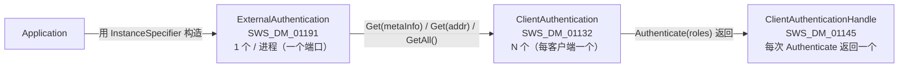
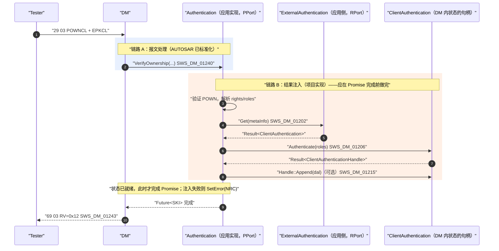
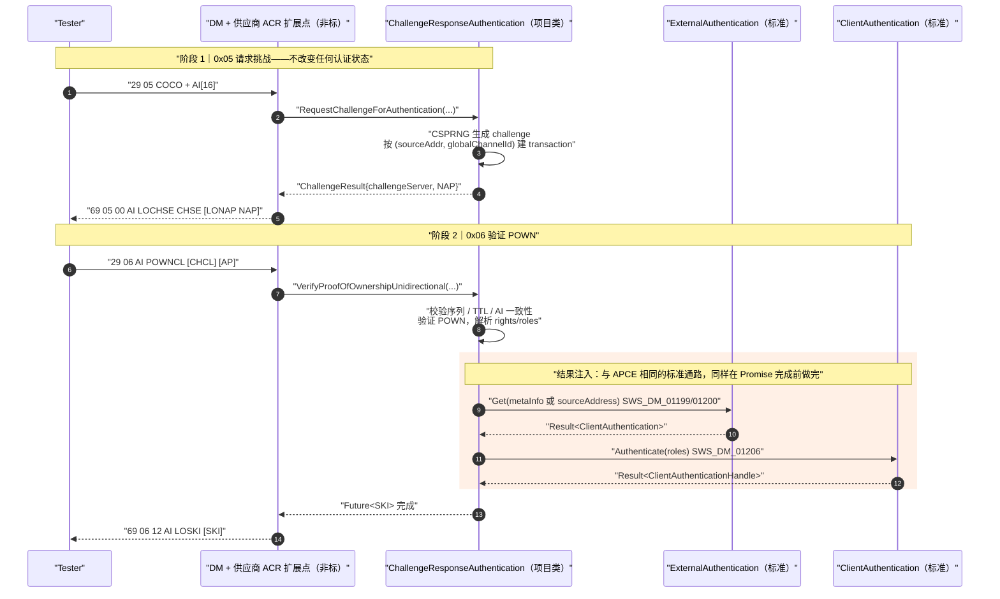
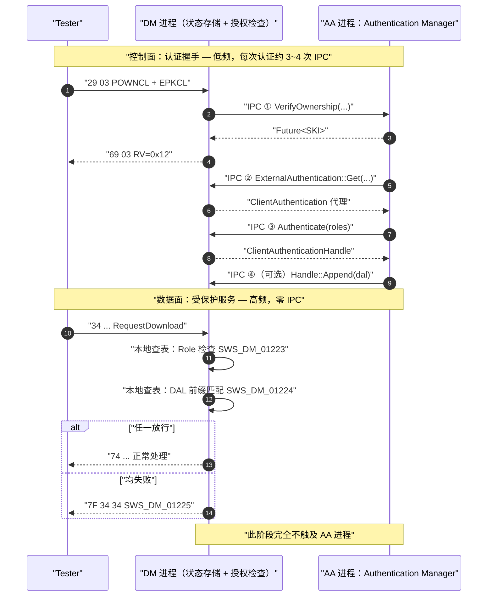
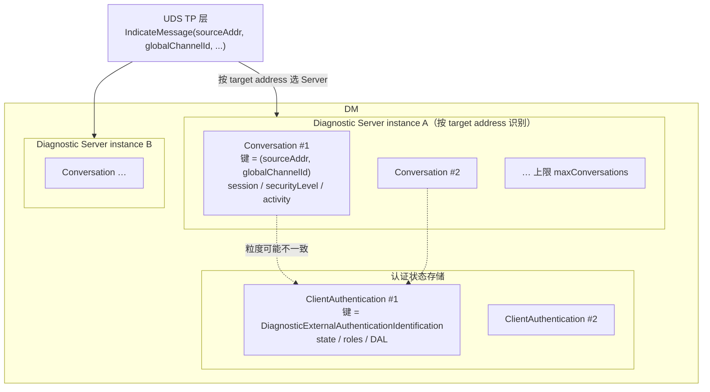
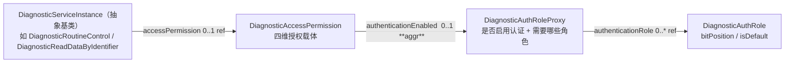

# AUTOSAR AP DM R25-11 认证状态管理与 API 约束参考

> **本文定位**：既有三份 `0x29` 文档分别覆盖了**报文层**（APCE Spec / ISO 译本）、**标准缺口**（ACR Config/API Gap）与**实现拆分**（ACR 增量拆分）。本文补的是它们之间的空隙——**认证状态是怎么被管理的、相关 C++ 接口到底长什么样、Role 与 DAL 能配到多细、连接粒度如何隔离**。
>
> 这些机制大多**独立于 `0x29` 报文**（[TPS_MANI_01362] 明示 external authentication "is not bound to the existence of UDS service 0x29"），但它们决定了任何 `0x29` 实现（含 APCE 与项目扩展的 ACR）能否正确落地，因此归入 `0x29` 专题目录。

| 文档属性 | 值 |
|---|---|
| 文档类型 | 机制与 API 参考（面向实现与评审） |
| 覆盖版本 | AUTOSAR AP SWS Diagnostics **R25-11**；CP TPS DiagnosticExtractTemplate R25-11；AP TPS ManifestSpecification R25-11；ISO 14229-1:2020 |
| 内容边界 | 认证状态类模型、进程模型、连接粒度、Role/DAL 配置与判定、`ara::diag` 认证相关 C++ 接口约束 |
| 不覆盖 | `0x29` 各子功能的报文字段（见 APCE Spec 与 ISO 译本）、ACR 的实现拆分（见增量拆分文档） |
| 编写日期 | 2026-08-27 |
| 证据规则 | 所有 `[SWS_DM_*]`、`[TPS_*]`、`constr_*` 均引自 R25-11 官方 PDF 对应 Markdown 的 ⌈⌋ 需求体或类表格；标注 `DERIVED` 的为推导，标注 `GAP` 的为规范未定义 |

---

## 目录

- [1. 四个类的定位与关系](#1-四个类的定位与关系)
- [2. 进程模型与通信开销](#2-进程模型与通信开销)
- [3. 连接粒度的状态管理](#3-连接粒度的状态管理)
- [4. Role：配置期授权](#4-role配置期授权)
- [5. DAL：运行时授权](#5-dal运行时授权)
- [6. C++ 接口完整定义与实现约束](#6-c-接口完整定义与实现约束)
- [7. 规范空白与项目须冻结项](#7-规范空白与项目须冻结项)
- [8. 方法局限与交叉链接](#8-方法局限与交叉链接)

---

## 1. 四个类的定位与关系

### 1.1 一句话区分

认证相关的类一共四个，分处两条不同的链路：

| 类 | 一句话职责 | 链路 |
|---|---|---|
| `ara::diag::Authentication` | 接收 DM 转发来的 `0x29` 报文，执行证书/POWN 验证 | **报文链路**（DM → 应用） |
| `ara::diag::ExternalAuthentication` | 按客户端地址**找到**对应的状态句柄 | 状态链路（应用 → DM） |
| `ara::diag::ClientAuthentication` | 某一个诊断客户端的**状态句柄**：提交/查询认证状态与角色 | 状态链路（应用 → DM） |
| `ara::diag::ClientAuthenticationHandle` | 认证成功后管理该客户端的 **DAL 与生命周期** | 状态链路（应用 → DM） |

### 1.2 三层链条与实例数量



实例数量的来源各不相同，这一点在排查问题时很关键：

| 类 | 实例数量由什么决定 | 能否自行构造 |
|---|---|---|
| `ExternalAuthentication` | 每个进程一个端口实例；同一 `InstanceSpecifier` 在一个进程内只能构造一次（否则 `InstanceSpecifierAlreadyInUseViolation`） | 能（需 `InstanceSpecifier`） |
| `ClientAuthentication` | **配置期固定**：`DiagnosticExternalAuthenticationIdentification` 元素个数（[TPS_MANI_01435]）。规范原文："The number of available `DiagnosticExternalAuthenticationIdentification` elements define the number of instances of the `ara::diag::ClientAuthentication` class" | **不能**，只能由 `Get`/`GetAll` 返回 |
| `ClientAuthenticationHandle` | `Authenticate()` 或 `OverrideDefaultRoles()` 成功时返回 | 有默认构造（[SWS_DM_01146]），但空 handle 无操作对象 |

### 1.3 易混点：三个名字相似的类

`Authentication` / `ExternalAuthentication` / `ClientAuthentication` 名字相似，但**分处两条互不自动连接的链路**。这是本主题最高频的误判来源。

| 维度 | `Authentication` | `ExternalAuthentication` | `ClientAuthentication` |
|---|---|---|---|
| 需求 ID | [SWS_DM_01123] | [SWS_DM_01191] | [SWS_DM_01132] |
| 头文件 | `ara/diag/authentication.h` | `ara/diag/external_authentication.h` | `ara/diag/client_authentication.h` |
| Port Interface | `DiagnosticAuthenticationInterface` | `DiagnosticExternalAuthenticationInterface` | **无** |
| 端口方向 | **PPort**（应用提供，DM 调用） | **RPort**（应用请求，调 DM） | 不是端口 |
| 应用角色 | **实现者**（派生并重写纯虚函数） | 使用者 | 使用者 |
| 与 `0x29` 的关系 | 直接绑定 `0x29` 子功能 | **与 `0x29` 解耦**（[TPS_MANI_01362]） | 与 `0x29` 解耦 |
| 典型方法 | `VerifyCertificateUnidirectional` / `VerifyOwnership` | `Get` / `GetAll` | `Authenticate` / `GetState` |

记忆口诀：**`Authentication` 管报文，`ExternalAuthentication` 管寻址，`ClientAuthentication` 管状态。**

### 1.4 与 `0x27` 的四层对位

把 `0x27 SecurityAccess` 和 `0x29 Authentication` 并排看，AP 的设计意图会清晰很多：

| 关注点 | `0x27 SecurityAccess` | `0x29 Authentication` |
|---|---|---|
| **应用业务回调**（DM→应用） | `ara::diag::SecurityAccess`<br/>Port: `DiagnosticSecurityLevelInterface`<br/>`GetSeed(dataRecord, metaInfo, cancel)`<br/>`CompareKey(key, metaInfo, cancel)` | `ara::diag::Authentication`<br/>Port: `DiagnosticAuthenticationInterface`<br/>`VerifyCertificateUni/Bidirectional(...)`<br/>`VerifyOwnership(...)` |
| **实例寻址**（应用→DM） | `Conversation::GetConversation(metaInfo)`<br/>（**static 方法，在状态类自身上**） | `ExternalAuthentication::Get(metaInfo / addr)`<br/>（**独立端口类**） |
| **状态载体与查询** | `Conversation`（[SWS_DM_00693]）<br/>`GetDiagnosticSecurityLevel()`<br/>`SetSecurityLevelNotifier()` | `ClientAuthentication`（[SWS_DM_01132]）<br/>`GetState()`<br/>`SetNotifier()` |
| **状态写入** | **无应用侧写接口** | `Authenticate(roles)`（[SWS_DM_01206]） |
| 授权粒度 | 单一 SecurityLevel 标量 | roles 集合 + DAL |
| 失败管理 | ISO §10.4 标准化：`numFailedSecurityAccess` + `securityDelayTime` + NRC `0x35`/`0x36`/`0x37` | ISO §10.6.3 NOTE 3 交给整车厂，**无标准 NRC** |

两处结构差异值得注意。

**寻址方法的归属不同。** 会话侧是"状态类自带静态工厂"（`Conversation` 一个类兼任寻址入口与状态载体，共 2 个类）；认证侧把寻址拆成了独立的 `ExternalAuthentication`（共 3 个类）。

**是否需要 Manifest 建模不同。** `Conversation` 没有 Port Interface、不需要 `InstanceSpecifier`，任何进程直接调静态方法即可；`ExternalAuthentication` 必须有 `DiagnosticExternalAuthenticationPortMapping`（RPort + ProcessDesign，[constr_10094]）才能拿到 `InstanceSpecifier`。

**为什么多这一层？** 因为能力范围不同。`Conversation` 依附于一个正在处理的请求上下文（靠 `metaInfo` 取得）；而 `ExternalAuthentication` 有 `Get(Address)` 重载，可以**脱离任何请求上下文**、在任意时刻声明"某客户端已认证"。这是一项相当强的能力，AUTOSAR 因此把它做成必须在 Manifest 中显式建模、显式绑定到某个 `ProcessDesign` 的端口——**这一层多出来的类实质上是一道部署期的权限门禁**，把"哪个进程可以充当认证状态的注入者"变成可配置、可审计的模型元素。

### 1.5 根本差异：状态变更由谁**触发**

这是 `0x27` 与 `0x29` 在 AP 里最本质的架构区别，也是项目最容易漏掉的一段工作量。

> **先分清两个维度，否则本节与 §2.3 容易读成矛盾**：
>
> | 维度 | `0x27` | `0x29` |
> |---|---|---|
> | **谁触发**状态变更 | **DM 自发**（`CompareKey` 成功即解锁） | **应用显式发起**（必须调 `Authenticate()`） |
> | **谁执行**修改、**存在哪** | **DM** | **DM**（同左） |
>
> 也就是说：两个服务的状态**都由 DM 持有、都由 DM 实际修改**（详见 §2.3）；本节讨论的差别**只在触发者**。应用调 `Authenticate()` 是"提出请求"，不是"自己保存状态"。

**`0x27` 只有一条链路。** 应用只需回答"key 对不对"，**解锁由 DM 自行发起并完成**。证据有两条：第 8 章 `Conversation` 的方法清单里只有 `GetDiagnosticSecurityLevel` 与 `SetSecurityLevelNotifier`，**没有任何写接口**（应用连"请求变更"的入口都没有）；安全事件需求的措辞是 "CompareKey ... which successfully **unlocks** the requested security access type"（[SWS_DM_02020]），解锁是 DM 的内部行为。

**`0x29` 有两条互不自动连接的链路。**

下图以 **APCE `0x03`** 为例。选它是因为它是 AUTOSAR **唯一标准化**的 `0x29` 路径，每一步都能锚到真实需求 ID；ACR 的等价时序见本节末尾的第二张图。

图中的时序是**推荐实现顺序**（先提交状态，再完成 Promise），理由见 §1.7 的原子性讨论：



**关键断言**：`RV=0x12`（[SWS_DM_01243]）与 `GetState() == kAuthenticated`（[SWS_DM_01206]）分属两条链路，**协议成功不等于状态已变更**。规范没有定义二者之间的自动桥接，也**没有规定两者的先后**——DM 只要求"回调无错误即发 `RV=0x12`"，它不知道链路 B 是否发生过、是否成功。因此上图的顺序是**工程选择而非规范要求**：把注入放在 Promise 完成之前，可以消除"tester 已认为认证完成、DM 内状态却未提交"的窗口。若实现成"先完成 Promise 再注入"，该窗口就真实存在（详见 §1.7）。

ACR 的等价时序如下。它的报文段（`0x05`/`0x06`）必须由供应商 DM 扩展点承载（`0x05`/`0x06` 不在 [SWS_DM_01226] 白名单），回调是项目自定义接口（参考设计见 [ACR 单向 Spec](./AUTOSAR_AP_DM_R25_UDS_0x29_ACR_Unidirectional_Spec.md) §8.3.2）；但**结果注入这一段与 APCE 完全相同，走的是标准通路**：



两图对比后可以看出 ACR 相对 APCE 的三点差异：报文段从"DM 标准处理"变成"供应商扩展点"；回调从 `ara::diag::Authentication` 变成项目类，且多出 `algorithmIndicator` 与 additionalParameter 的处理；`0x05` 阶段**只签发挑战、不触碰认证状态**（已认证客户端发起新 `0x05` 时旧授权继续有效，见 ACR Spec §6.1）。而橙色的注入段两者完全一致——这正是下一段要说的"对 ACR 极其有利"的含义。

再次强调分工，避免与 §2.3 混淆：链路 B 中应用做的是**发起变更请求**（`Get` 定位 + `Authenticate` 提交），[SWS_DM_01206] 的执行主体仍是 "the Diagnostic Server instance"——**状态由 DM 设置、由 DM 保存**。项目要补的那段"桥"是**触发逻辑**，不是状态存储。

这个设计对 ACR 极其有利：因为状态变更本来就由应用显式发起、且该通路与 `0x29` 报文解耦，所以 ACR 即使完全不走标准 `0x29` 通路，认证结果的注入依然是**合规的标准用法**。

### 1.6 状态变更的触发源与不对称性

§1.5 说"`0x29` 的状态变更由应用发起"，这句话需要一个重要限定：**应用不是唯一的触发者**。完整清单如下。

| 变更 | 触发者 | 依据 |
|---|---|---|
| 启动时置 `kDeAuthenticated` | **DM** | [SWS_DM_01205] |
| 未认证时的默认角色 | **配置**（`DiagnosticAuthRole.isDefault = TRUE`），应用不参与 | [SWS_DM_01204] |
| `kDeAuthenticated` → `kAuthenticated` 并设定角色集 | **应用**（`Authenticate(roles)`） | [SWS_DM_01206] |
| 临时更改默认角色（仅未认证态下有意义） | **应用**（`OverrideDefaultRoles(roles, timeout)`） | [SWS_DM_01209] |
| `Authenticate()` 时复位被覆盖的默认角色 | **DM**（自动副作用） | [SWS_DM_01570] |
| 追加 / 替换 DAL | **应用**（`Handle::Append` / `Set`） | [SWS_DM_01215] / [SWS_DM_01213] |
| 主动去认证 | **应用**（`Handle::Revoke`） | [SWS_DM_01216] |
| `authenticationTimeout` 到期去认证 | **DM 自发** | [SWS_DM_01210] |
| S3server 超时去认证 | **DM 自发** | [SWS_DM_01211] |
| 去认证时恢复默认角色 + 清空 DAL | **DM**（自动副作用） | [SWS_DM_01212] |

由此得出一条**方向上的不对称性**（`AUTOSAR-REF`）：

- **"上升"（获得权限）只能由应用发起**——DM 永远不会自行把某个客户端置为已认证，即使 `0x29` 报文处理成功（原因见 §1.7）；
- **"下降"（失去权限）双方都能触发**——应用可 `Revoke()`，DM 也会因 `authenticationTimeout` 或 S3 超时自行去认证；
- **默认角色不在应用管辖内**——由 DEXT 的 `isDefault` 决定，应用只能用 `OverrideDefaultRoles` 临时覆盖且必须带 timeout。

**实现含义**（`DERIVED`）：应用**不能假设自己是状态的唯一改变者**，必须注册 `SetNotifier`（[SWS_DM_01208]）监听 DM 自发的变更。规范给的例子正是这个场景——"notify the application when a transition to `kDeAuthenticated` state occurred due to an **S3 timeout**"。

对 ACR 而言这条通知是清理 transaction、销毁会话密钥的正确触发点：它一次性覆盖显式去认证、`authenticationTimeout`、S3 超时三种来源，比自建定时器可靠。这也是配套 ACR Spec §8.3.3 建议**不要**自定义 `Abort`/`Deauthenticate` 回调的依据。

### 1.7 为什么权限提升只能由应用发起

一个自然的疑问：DM 明明知道 `VerifyOwnership` 成功了，为什么不直接提升权限？本节前两条是规范依据，第三条是设计分析（**非规范明文**）。

**规范给出的架构前提。** §7.3.2.3.1 开篇：

> In AUTOSAR Adaptive, **a major part of the client authentication process is handled in the Application**. It is therefore necessary for the application to convey the Authentication state to the Diagnostic Server instance of the DM.

`AUTOSAR-NORM`（架构声明）

**技术上的决定性原因：DM 手上没有 roles。** `Authenticate` 需要角色集参数，而 APCE 的三个回调**没有一个返回角色信息**：

| 回调 | 返回值 | 是否含 roles |
|---|---|:--:|
| `VerifyCertificateUnidirectional`（[SWS_DM_01126]） | challenge server + EPK server | 否 |
| `VerifyCertificateBidirectional`（[SWS_DM_01127]） | challenge server + certificate server + POWN server + EPK server | 否 |
| `VerifyOwnership`（[SWS_DM_01128]） | sessionKeyInfo | 否 |

所以即便 DM 想在 `0x03` 成功后自动提升，**它也不知道该提升到什么角色**——DM 只知道"回调未返回错误码"，不知道证书或令牌里声明的是哪个角色。这不是疏漏：从证书扩展/令牌内容到本地 `DiagnosticAuthRole` 的映射属于 **OEM 的 roles-and-rights 矩阵**（DEXT 明言该矩阵 "is typically defined individually by each OEM"，见 §4.3），DM 作为平台组件不内置 OEM 策略。`AUTOSAR-REF`

**三条设计层面的考虑**（以下为分析，非规范明文，`DERIVED`）：

1. **认证源不止 `0x29`。** [TPS_MANI_01362] 明确 external authentication "not bound to the existence of UDS service 0x29"；SOVD 认证、车内 HMI 用户认证同样需要注入状态。若 DM 在 `0x29` 成功时自动提升，就会存在两套语义不同的路径（`0x29` 自动 / 其他手动）。
2. **"认证完成"的时机不一定等于某个报文成功。** APCE 是 `0x01`→`0x03` 多步流程，应用可能需要在 `0x03` 成功后再做额外判定（吊销状态联网查询、OEM 策略、时间/里程窗校验）。提交时机交给应用更灵活。
3. **权限提升是单入口的安全操作。** 只有配置了 `DiagnosticExternalAuthenticationPortMapping` 的进程才能构造 `ExternalAuthentication`（§1.4、§2.1），这构成部署期门禁。若 DM 也能自动提升，该门禁会被绕过一半。

**对 ACR 的特殊性**：DM 主动提升在 ACR 场景下**更不可行**。ISO 虽在 §10.6.3 步骤 (5) 提到令牌内容含 rights/roles，但 ISO 未规定令牌 wire 格式（仅给出 CVC 类构造示例），rights/roles 表示法也是 OEM 自定义；最根本的是 DM 根本不处理 ACR 报文（`0x05`/`0x06` 不在 [SWS_DM_01226] 白名单，按 [SWS_DM_00100] 判为 `0x12`）。因此"应用验证 + 应用注入"对 ACR 不是次优选择，而是唯一可行路径。

**这个设计的代价**（`DERIVED`）：`RV` 与状态提交分属两条链路，中间存在**不一致窗口**。DM 按 [SWS_DM_01243] 发出 `RV=0x12` 后 tester 即认为自己已认证，但此时应用可能尚未调用 `Authenticate()`，或调用返回 `kServiceNotAvailable` 失败。规范未定义二者的顺序与原子性。

若 AUTOSAR 当初让回调返回 `{sessionKeyInfo, roles}`，DM 就能在发响应的同一事务内提交状态，原子性天然成立。AUTOSAR 选择了解耦，代价是把原子性责任推给项目。

**实践应对**（`DERIVED` + `PROJECT-DECISION`）：**先提交状态，再发最终响应**——即在 `VerifyOwnership`（ACR 则是 `VerifyProofOfOwnershipUnidirectional`）的 Promise 完成**之前**完成 `Authenticate()` 与必要的 `Append(dal)`，使 DM 发出 `RV=0x12` 时状态已就绪；若注入失败则让回调返回 NRC 而非成功。**§1.5 的两张时序图已按此顺序绘制。** 该顺序约束应在项目内明确记录，对应 APCE Spec 的 `PD29-01` 与 ACR 增量拆分文档的 `ACRI-M09-08`。

需要注意这只是**缓解而非消除**：`Authenticate()` 成功后、DM 发出响应前若发生进程崩溃或链路中断，仍会出现"DM 内已授权、tester 未收到成功响应"的反向不一致。这个方向的窗口影响较小（tester 会重试或超时，且权限受 `authenticationTimeout` 约束），但在安全评审中应作为已知残余风险记录。

### 1.8 RV 与认证状态：两个层面的"认证完成"

`RV` 是 `returnValue`，规范名 `authenticationReturnParameter`，位于 UDS `0x29` **正响应**中，用于说明认证过程的结果。它与 `ClientAuthentication::GetState()` 是两个层面的概念，混用是本主题的高频错误。

报文中的位置（以 APCE `0x03` 正响应为例）：

```text
69   03   12   [LOSKI]  [SKI...]
│    │    │    │        └─ sessionKeyInfo（条件存在）
│    │    │    └─ lengthOfSessionKeyInfo（2 字节，MSB-first）
│    │    └─ RV = 0x12
│    └─ 回显的 SubFunction
└─ 正响应 SID（0x29 + 0x40）
```

ACR `0x06` 正响应结构类似：`69 06 12 AI[16] LOSKI [SKI]`（见 ACR Spec §5.5）。

完整取值（ISO 14229-1:2020 Annex B.5，Table B.5）：

| 值 | 含义 | Mnemonic | 典型出现处 |
|---|---|---|---|
| `0x00` | RequestAccepted | RA | ACR `0x05` 接受挑战请求 |
| `0x01` | GeneralReject | GR | — |
| `0x02` | AuthenticationConfiguration **APCE** | ACAPCE | `0x08` 响应；AP DM **硬编码此值**（[SWS_DM_01246]） |
| `0x03` | AuthenticationConfiguration **ACR 非对称** | ACACRAC | `0x08` 响应（ACR 需要，AP DM 不支持） |
| `0x04` | AuthenticationConfiguration **ACR 对称** | ACACRSC | 同上 |
| `0x05`–`0x0F` | ISOSAEReserved | — | — |
| `0x10` | DeAuthentication successful | DAS | `0x00` 去认证成功（[SWS_DM_01245]） |
| `0x11` | CertificateVerified, **OwnershipVerificationNecessary** | CVOVN | `0x01`/`0x02` 成功（[SWS_DM_01233]） |
| **`0x12`** | **OwnershipVerified, AuthenticationComplete** | **OVAC** | `0x03` 成功（[SWS_DM_01243]）、ACR `0x06` 成功 |
| `0x13` | CertificateVerified | CV | `0x04 transmitCertificate` 成功（[SWS_DM_01251]） |
| `0x14`–`0x9F` | ISOSAEReserved | — | — |
| `0xA0`–`0xCF` | VehicleManufacturerSpecific | VMS | OEM 自定义 |
| `0xD0`–`0xFE` | SystemSupplierSpecific | SSS | 供应商自定义 |

`0x11` 与 `0x12` 的对比最能说明 RV 的作用：两步认证流程中，第一步成功回 `0x11`（证书已验，但尚未证明拥有私钥），第二步成功才回 `0x12`（所有权已验，认证完成）。

两条使用约束：

- **RV 只存在于正响应（`0x69`）**；失败发负响应 `7F 29 NRC`。Annex B.5 虽定义了 `0x01 GeneralReject` 这类"失败类 RV"，但同一 final 结果**只能二选一**，不得同时发送。推荐量产统一走 NRC，避免测试设备把 `0x69` 误判为认证成功（详见 ACR Spec §5.6）。`ISO-NORM` + `PROJECT-DECISION`
- **`RV=0x12` ≠ `GetState() == kAuthenticated`**。前者是 DM 填入的协议结果（[SWS_DM_01243]），后者是应用提交后的状态（[SWS_DM_01206]），两者分属 §1.5 的两条链路，中间的窗口见 §1.7。`DERIVED`

---

## 2. 进程模型与通信开销

### 2.1 两类 PortMapping 与端口方向

[TPS_MANI_01360] 明确认证需要**两个扮演不同角色**的 mapping：

| PortMapping | 引用 | 端口方向 | 用途（规范原文） |
|---|---|---|---|
| `DiagnosticAuthenticationPortMapping`<br/>[TPS_MANI_01361] | `DiagnosticAuthentication` + `ProcessDesign` + **PPortPrototype**（[constr_10092] 要求由 `DiagnosticAuthenticationInterface` 类型化） | 应用**提供** | "forwarding of the request for authentication from the DM to some application software that acts as an **authentication manager**" |
| `DiagnosticExternalAuthenticationPortMapping`<br/>[TPS_MANI_01362] | `ProcessDesign` + **RPortPrototype**（[constr_10094] 要求由 `DiagnosticExternalAuthenticationInterface` 类型化） | 应用**请求** | "convey the authentication state of a diagnostic client to the diagnostic server instance of DM" |

注意规范给"应用"的正式称法是 **authentication manager**（认证管理器）。本文与既有文档中出现的 "Bridge"、"Auth Bridge" 等是项目自定义术语，不是规范概念。

补充约束：[constr_10093] 规定每个 `DiagnosticAuthentication` 只能被**恰好一个** `DiagnosticAuthenticationPortMapping` 引用；[constr_10663] 规定只要 `DiagnosticContributionSet` 引用了这两类 PortMapping 之一，`DiagnosticCommonProps.authenticationTimeout` 就**必须存在**。

### 2.2 是否必须同进程

| 类 | 进程约束 |
|---|---|
| `ClientAuthentication` | **必然**与 `ExternalAuthentication` 同进程——它无 Port Interface、不能独立构造，只能由 `Get()` 按值返回，是不可跨进程传递的本地代理 |
| `Authentication` 与 `ExternalAuthentication` | **模型上可以分处不同进程**：两个 PortMapping 各自独立引用 `ProcessDesign`，属性注释明确 "the mapping could be different for different Processes referring to a specific Executable"（`atp.Splitkey=process`） |

**工程建议：放在同一进程。** POWN/证书的验证结果与解析出的 rights/roles 必须传给 `Authenticate()`，跨进程会凭空增加一次 IPC、一处竞态窗口和一份状态一致性负担，而这段路径本身要求原子性。

**分开的合理场景只有一个**：`ExternalAuthentication` 被多个认证来源共用。因为它与 `0x29` 解耦，完全不实现 `0x29` 的进程也能合法注入认证状态——例如 SOVD 侧认证、车内 HMI 用户认证。此时"认证管理器"与"状态注入者"确实可能是不同进程。

### 2.3 状态存放在哪里

**认证状态的权威副本在 DM 进程内**，不在应用侧。三处规范互证：

- §7.3.2.3.2：*"The **Diagnostic Server instance** maintains the Authentication State and Authentication Role for each Diagnostic Client."*
- §7.3.2.3.3：*"The **Diagnostic Manager** maintains a 'DynamicAccessList' for every client that is authenticated."*
- [SWS_DM_01206]：应用调用 `Authenticate()` 后，是 **Diagnostic Server instance** 去设置状态和角色。

> **与 §1.5 的关系**：§1.5 说 `0x29` 的状态变更"由应用显式发起"，指的是**触发**；本节说状态"在 DM"，指的是**存储与执行**。两者不冲突——应用发起请求，DM 执行并保存。`0x27` 与 `0x29` 的区别仅在于前者连触发都由 DM 自己完成。

因此 `ClientAuthentication` 是**发起变更用的句柄，不是状态容器**。跨进程传输的是"变更请求"这个动作，不是状态数据本身。

一个佐证方向性的细节：`SetNotifier`（[SWS_DM_01208]）是 **DM 推送给应用**的状态变更通知（典型场景是 `authenticationTimeout` 或 S3 超时导致 DM 自行去认证），这个方向本身就说明状态源在 DM。

### 2.4 控制面与数据面：IPC 只在认证握手时发生

每条 UDS 报文的授权判定完全由 DM 执行：[SWS_DM_01223] 做 Role 分层检查，失败后 [SWS_DM_01224] 做 DAL 前缀匹配，两者都失败才由 [SWS_DM_01225] 返回 `0x34`。这些需求的主体全部是 "the Diagnostic Server instance"，**全程在 DM 进程内本地查表**。



"每条报文都去问应用"的架构在 P2 时间预算下是不可行的，AUTOSAR 的这个设计正是为了避免它。

### 2.5 为什么必须先 `Get` 再 `Authenticate`

看两个签名的对比就明白了：

```cpp
// DM 回调应用：带 metaInfo（内含客户端标识）
VerifyOwnership(Span<const Byte> clientPOWN,
                Span<const Byte> clientEphemeralPublicKey,
                const MetaInfo& metaInfo,          // ← 客户端身份从这里来
                CancellationHandler) noexcept = 0;

// 应用写状态：只有 roles，没有任何客户端标识参数
Authenticate(ara::core::Vector<DiagnosticAuthRole> userRoles) noexcept;
```

`Authenticate()` 的参数里**没有客户端标识**。客户端身份被"具身化"在 `ClientAuthentication` 实例本身——拿到的那个实例已经绑定了某一个特定客户端。`Get()` 的作用就是完成这次绑定。`ExternalAuthentication::Get` 有 `MetaInfo` 重载，正是为了让你把回调里拿到的 `metaInfo` 原样传进去，两个 API 是配对设计的。

除此之外，`Get()` 还承担另外两件事：

**配置驱动的校验点。** 实例数量由 `DiagnosticExternalAuthenticationIdentification` 决定；传入未配置的地址时 `Get` 返回 `Result` 里的错误而不是静默创建实例。这把"这个客户端是否被允许做外部认证"的判定前移到寻址阶段。

**长期对象的挂载点。** `SetNotifier` 需要挂在一个长期存在的对象上。如果设计成 `Authenticate(metaInfo, roles)` 这样的单次无状态调用，notifier 就无处注册了。

两个重载的分工：

| 重载 | 适用路径 |
|---|---|
| `Get(const MetaInfo&)`（[SWS_DM_01199]） | `0x29` 回调路径，`metaInfo` 直接来自 `VerifyOwnership` 等回调参数 |
| `Get(Address)`（[SWS_DM_01200]） | **非 `0x29` 路径**：自定义认证方式（SOVD、HMI 用户认证、项目扩展的 ACR）没有 `0x29` 回调，手上只有 tester 源地址 |

第二个重载的存在，正是 §7.3.2.3 开篇那句话在 API 层面的体现——本章内容 "are independent of the parts specified for the UDS Service Authentication (0x29), and may be used also with **custom methods** for authentication of clients"。

---

## 3. 连接粒度的状态管理

### 3.1 客户端标识二元组

```
[SWS_DM_00421] Identification of a Diagnostic Client
⌈The Diagnostic Server instance shall identify a Diagnostic Client by means of
 the tuple of sourceAddr and globalChannelId provided by the TP Layer on call of
 ara::diag::uds_transport::UdsTransportProtocolMgr::IndicateMessage⌋
```

这是连接粒度管理的**唯一权威键**。`globalChannelId` 由 TP 层提供，正是它让"同一 tester 源地址、两条不同 DoIP TCP 连接"能被区分开。

Diagnostic Server instance 本身则通过 UDS 请求的 **target address** 识别（[SWS_DM_00390]、[SWS_DM_00391]）。

### 3.2 三层实例结构

§7.3.2.1 对 Conversation 的定义值得完整引用，因为它纠正了"AP 只有单一会话管理者"的常见误解：

> A Diagnostic Conversation depicts a conversation between a **distinct Diagnostic Client** and a Diagnostic Server instance. In contrast to CP, on AP the details of connections between Diagnostic Clients and Diagnostic Server instances are **not statically configured, but a Diagnostic Conversation is dynamically allocated during run-time** of the Diagnostic Server instance.



Conversation 实例数由 [SWS_DM_00840] 规定：*"shall provide as many instances of `ara::diag::Conversation` class as the number of potential parallel Diagnostic Clients is configured by **`maxConversations`**"*（未配置时的行为见 [SWS_DM_02003]）。

请求到 Conversation 的分配是三选一（§7.3.2.2）：

1. 已存在该客户端的 Conversation → 复用（[SWS_DM_00426]）；
2. 不存在 → 检查 `maxConversations` 资源，有空闲则新建（[SWS_DM_01581]）；
3. 资源耗尽 → 走优先级处理（[SWS_DM_00430]，Status: DRAFT）或拒绝。

### 3.3 两种状态的粒度并不一致（两个缺口）

| | `Conversation`（session / securityLevel） | `ClientAuthentication`（state / roles / DAL） |
|---|---|---|
| 实例数量来源 | **运行时动态分配**，上限 `maxConversations` | **配置期固定**，由 `DiagnosticExternalAuthenticationIdentification` 元素数决定 |
| 隔离键 | **(sourceAddr, globalChannelId)** 二元组 | identification 元素——可为单个固定源地址，**也可为一个地址段** |
| 查找 | `Conversation::GetConversation(metaInfo)` | `ExternalAuthentication::Get(Address / MetaInfo)` |
| 生命周期 | 动态建立/结束 | 长期存在 |

**缺口一：地址段配置造成认证状态共享。** 规范说明地址段的用途是 "if the final source address of the client is within a range and **not known upfront (during compile time)**"。代价是落在同一段内的多个客户端**共享同一个** `ClientAuthentication` 实例，即共享认证状态、角色与 DAL。这与 [SWS_DM_01229] 的注解意图存在张力：

> NOTE: The authentication status on one Diagnostic Client shall not influence the access restrictions on a different Diagnostic Connection.

**缺口二：地址重载不含 `globalChannelId`。** `ExternalAuthentication::Address` 的定义是 `using Address = std::uint16_t`（[SWS_DM_01192]），只有源地址。所以 `Get(Address)` 无法区分"同一源地址的两条不同连接"，而 Conversation 可以。`Get(const MetaInfo&)` 虽能拿到更多上下文，但最终仍映射到按 identification 元素分配的那个实例。

**对实现的直接含义**（`DERIVED`）：任何需要严格连接级隔离的状态——尤其是 ACR 的 challenge 与 transaction——**必须自己维护 `(sourceAddr, globalChannelId)` 二元组作为键，不能依赖 `ClientAuthentication` 实例来实现连接级隔离**。建议分工：

| 状态 | 存放位置 | 键 |
|---|---|---|
| challenge / generation / transaction | 项目自建存储 | **(sourceAddr, globalChannelId)** |
| 认证结果（state / roles / DAL） | `ClientAuthentication`（标准通路） | identification 元素 |
| session / securityLevel | `Conversation`（DM 内建） | (sourceAddr, globalChannelId) |

提交认证结果时应显式校验"发起认证的那个连接"与"`Get()` 返回的实例"之间是否唯一对应。若配置使用了地址段，这个校验必须由项目补上——否则段内任一客户端完成认证，段内其他客户端会一并获得权限。

### 3.4 多客户端并行约束

§7.3.2.1.1 的 pseudo parallel mode：

- 默认会话下 DM 可**并行**处理多客户端请求；
- 一旦某客户端切到**非默认会话**，DM 只处理该 Conversation 的请求；
- SOVD lock 被任一客户端获取后，多客户端并行访问不再可能（§7.6.3.1）。

并发调用应用回调还有额外条件（[SWS_DM_00940]，DID 读写另见 [SWS_DM_00941]/[SWS_DM_00942]）：必须同时满足"默认会话 + 多 conversation 同时处理 + 同一端口被不同客户端触发 + 构造时 `ConcurrencyType` 为 `kConcurrentType`"。

**对状态设计的含义**："客户端 A 处于已认证状态"与"客户端 A 此刻能否发请求"是两件独立的事。认证状态按客户端长期保持，但请求处理可能被别的客户端的非默认会话阻断。设计 challenge TTL 时要考虑这一点——客户端可能因为别人占用了非默认会话而无法及时发出第二阶段请求，导致 challenge 过期。

### 3.5 IdsM 的职责边界

> **完整展开见独立调研报告**：[AUTOSAR IdsM 技术调研](../AUTOSAR_AP_IdsM_Technical_Research.md)。该文覆盖 IdsM 的功能簇定位与文档族、`IdsmAbstractPortInterface` 的五个子类、SEv→QSEv→Sem/IdsR→SOC 完整链路、DM 侧 **27 对** SecurityEvent 需求全清单、context data 强制格式、强制性分层（报告义务正式有效 / 事件定义与 context data 为 DRAFT），以及"暂无 IdsM 时能否不实现"的工程结论。本节只保留与认证状态管理直接相关的要点。

IdsM（Intrusion Detection System Manager）是**独立的功能簇**（CP 侧为 BSW 模块，AP 侧为 Platform Service），**不是 DM 的子模块，也不参与任何状态管理**——它只是安全事件的接收方。DM 在 IDS 体系中的角色是 **Sensor**：只检测并上报事件，不做过滤、聚合、限流或对外上报。

与认证相关的四个事件：

| 事件 | ID | 触发条件 | 需求 |
|---|:--:|---|---|
| `SEV_UDS_SECURITY_ACCESS_NEEDED` | 100 | 因安全等级不足返回 NRC `0x33` | [SWS_DM_02015]、[SWS_DM_02016] |
| `SEV_UDS_AUTHENTICATION_NEEDED` | **101** | 因认证不足返回 NRC `0x34` | [SWS_DM_02017]、[SWS_DM_02018] |
| `SEV_UDS_SECURITY_ACCESS_SUCCESSFUL` | 102 | `0x27 CompareKey` 成功解锁 | [SWS_DM_02019]、[SWS_DM_02020] |
| `SEV_UDS_AUTHENTICATION_SUCCESSFUL` | **104** | `0x29` 认证成功（触发点绑定 APCE `0x03`） | [SWS_DM_02023]、[SWS_DM_02024] |
| `SEV_UDS_AUTHENTICATION_FAILED` | **105** | 任一 Authentication 请求产生负响应 | [SWS_DM_02025]、[SWS_DM_02026] |

（`0x27` 侧另有 `103 SEV_UDS_SECURITY_ACCESS_FAILED`，见调研报告 §3.2 的 27 事件全表。）

Manifest 侧通过 `SecurityEventReportInterface`（[TPS_MANI_01340]，**每个 RPort 报告恰一个事件**）与 `SecurityEventReportToSecurityEventDefinitionMapping`（[TPS_MANI_01338]）建模；后者把 RPort 关联到 `SecurityEventDefinition`，而该元素属于**独立的 Security Extract**，不在 Diagnostic Extract 内。

两点与本文其他章节呼应：`ClientSourceAddress` 的类型是 **uint16**、**不含 `globalChannelId`**，因此安全事件无法区分同一源地址的不同连接——与 §3.3 的隔离缺口同源；事件 `104` 的标准触发点绑定 APCE `0x03`，**不能声称覆盖 ACR `0x06` 成功**（见 ACR Spec 的 `ACR29-OBS-005`）。

---

## 4. Role：配置期授权

### 4.1 四层引用链



`DiagnosticAccessPermission`（DEXT Table 4.29）汇聚四个授权维度：

| 属性 | 类型 | 多重度 | 种类 | 作用 |
|---|---|---|---|---|
| `diagnosticSession` | `DiagnosticSession` | 0..* | ref | 会话门 |
| `securityLevel` | `DiagnosticSecurityLevel` | 0..* | ref | `0x27` 安全等级门 |
| `environmentalCondition` | `DiagnosticEnvironmentalCondition` | 0..1 | ref | 环境条件门 |
| `authenticationEnabled` | `DiagnosticAuthRoleProxy` | 0..1 | **aggr** | `0x29` 认证门 |

四者的语义"如何授予访问权"由 Dcm 规范定义（[TPS_DEXT_01139]）。注意 `authenticationEnabled` 是**聚合而非引用**——"这个聚合存不存在"本身就是配置信息，这直接决定了下面的三态语义。

### 4.2 三态语义

| # | 配置状态 | DEXT 需求 | 语义（原文要点） | DM 行为 |
|---|---|---|---|---|
| ① | `authenticationEnabled` **不存在** | [TPS_DEXT_01188] | "no authentication checks are done and the service is processed" | 完全跳过认证检查（[SWS_DM_01739]） |
| ② | 存在，但**无** `authenticationRole` | [TPS_DEXT_01190] | "the service is checked against the current **dynamic access list**" | **只查 DAL**（[SWS_DM_01224]） |
| ③ | 存在，**且有** `authenticationRole` | [TPS_DEXT_01191] | 需考虑特定角色 | 先查 Role（[SWS_DM_01223]），失败再查 DAL |

状态 ② 的使用场景，DEXT 前导段说得很清楚：

> There are use cases where diagnostic services shall explicitly **not** have any authentication role and the corresponding service is only accessible via the dynamic access list **of certificates**.

即"该服务不属于任何静态角色，只能靠证书/令牌动态授权"。对 ACR 来说这个状态很有用——令牌携带的细粒度权限走 DAL，无需预先定义角色。

### 4.3 `bitPosition` 与 `isDefault`（含完整算例）

[TPS_DEXT_01154] 解释了 Role 的实现本质：

> The rights are defined in the form of a **bitfield** that is associated with a given role. In other words, the implementation of this "roles and rights" concept is that **a bitfield is associated with a textual label** (that describes the role).

| 属性 | 类型 | 多重度 | 语义 |
|---|---|---|---|
| `bitPosition` | PositiveInteger | 0..1 | 该角色在 OEM "roles and rights" 位域矩阵中的位序号 |
| `isDefault` | Boolean | 0..1 | 为 TRUE 时是 `kDeAuthenticated` 客户端的默认角色（[SWS_DM_01204]），**可以有多个角色同时标 TRUE** |

DEXT 提醒这个矩阵的性质：*"the value of `DiagnosticAuthRole.bitPosition` contributes to the 'normative' definition of the 'roles and rights' matrix. This matrix is typically defined individually by **each OEM**."*

CP 侧的映射规则可反证位域语义：`DcmDsdServiceRole`、`DcmDsdSubServiceRole`、`DcmDspDidReadRole`、`DcmDspAuthenticationDeauthenticatedRole` 的取值都是"对所有被引用角色取 `2^bitPosition` 累加"。

**完整算例。** 定义四个角色：

| 角色 shortName | `bitPosition` | `isDefault` | 位掩码 |
|---|:--:|:--:|:--:|
| `RoleEndUser` | 4 | **true** | `0x10` |
| `RoleAfterSales` | 5 | false | `0x20` |
| `RoleProduction` | 6 | false | `0x40` |
| `RoleDevelopment` | 7 | false | `0x80` |

未认证客户端的默认角色集 = `{RoleEndUser}` → 位域 `0x10`。三个资源这样配：

| 资源 | `authenticationRole` 引用 | 累加位域 |
|---|---|:--:|
| DID `F190`（读 VIN） | EndUser + AfterSales + Production + Development | `0xF0` |
| RID `5678`（标定例程） | Production | `0x40` |
| Service `0x28`（通信控制） | EndUser + AfterSales | `0x30` |

运行时判定：

| 场景 | 客户端角色位域 | 资源位域 | 交集 | 结果 |
|---|:--:|:--:|:--:|---|
| 未认证 → 读 DID `F190` | `0x10` | `0xF0` | ≠ 0 | 放行（未认证也能读 VIN） |
| 未认证 → 启动 RID `5678` | `0x10` | `0x40` | = 0 | Role 失败 → 查 DAL → 无匹配 → `7F 31 34` |
| 认证为 `RoleProduction` → RID `5678` | `0x40` | `0x40` | ≠ 0 | 放行 |
| 认证为 `RoleProduction` → Service `0x28` | `0x40` | `0x30` | = 0 | `7F 28 34` |

**最后一行揭示一个真实的坑**：认证成功后默认角色**不会自动保留**。[SWS_DM_01206] 是"把角色设置为传入的角色集"，替换语义。上例中客户端认证为 `RoleProduction` 后，反而失去了未认证时凭 `RoleEndUser` 拥有的 `0x28` 权限。若业务上希望权限叠加，应用必须显式传 `Authenticate({"RoleProduction", "RoleEndUser"})`。

两点补充：AP 侧 API 不暴露位掩码（`DiagnosticAuthRole` 是 `ara::core::String`，DM 内部做集合判定，位域是 OEM 矩阵与 CP 的表达方式）；去认证时（[SWS_DM_01212]）角色恢复为 `isDefault` 集合并清空 DAL；`Authenticate()` 切到 `kAuthenticated` 时，被 `OverrideDefaultRoles` 覆盖的默认角色复位为 `isDefault`（[SWS_DM_01570]）。

**取值来源的一个模糊点**：SWS 对 `DiagnosticAuthRole` 取值只说 "specified in the Diagnostic Extract"，**并未明写字符串就是元类的 shortName**。实践上几乎肯定是 shortName，但这属于要向 DM 供应商确认的绑定细节。且拼写错误在编译期无法发现，而 `Authenticate` 定义的错误码只有 `DiagErrc::kServiceNotAvailable`，**没有"未知角色"这类错误**——传入未配置角色时 DM 的反应规范未定义。建议从 DEXT 自动生成角色名常量。

### 4.4 能配到哪些粒度

DEXT 里**只有三个元类**持有 `accessPermission` 引用：

| 宿主元类 | 多重度 | 粒度 |
|---|---|---|
| `DiagnosticServiceInstance`（**abstract**） | 0..1 ref | 服务实例级——所有具体服务子类继承 |
| `DiagnosticRoutineSubfunction`（**abstract**） | 0..1 ref | `0x31` 的子功能级 |
| `DiagnosticMemoryIdentifier` | 0..1 ref | 内存标识符级 |

另外 `authenticationEnabled` 有**两个**宿主（见 `DiagnosticAuthRoleProxy` 的 "Aggregated by"）：`DiagnosticAccessPermission.authenticationEnabled` 与 `DiagnosticMemoryDestinationUserDefined.authenticationEnabled`（后者是不经过 `accessPermission` 的独立路径，用于用户自定义故障内存）。

DM 侧实际支持的判定粒度由 [SWS_DM_01223] 的七层清单界定（命中即放行，"If a check grants access to a service, the remaining checks are skipped"）：

| # | 检查层 | 支持情况 |
|---|---|---|
| 1 | Service ID 级 | — |
| 2 | Service ID **+ 子功能**级 | ✅ 子服务可配 |
| 3 | 带一个或多个 **DID** 的服务 | ✅ DID 可配 |
| 4 | **动态定义的 DID** | ✅ |
| 5 | 服务 **`0x31` 按子功能** | ✅ RID 子功能可配 |
| 6 | 服务 `0x19` 的 **MemorySelection** | ✅ |
| 7 | 服务 `0x14` 的 **MemorySelection** | ✅ |

**两条容易踩的跳过规则**（都在第 1 层的限定条件里）：

> - this is skipped **for services with identifiers (DID / RID)**
> - this is skipped **if this service has subfunctions and none of these subfunctions grants access** in the current authenticated role

第一条意味着"给 `0x22` 配一个 SID 级 Role 来保护所有 DID"是**无效的**——带 DID/RID 的服务必须在 DID/RID 级配置。

**`0x38` 的不同 mode 不支持。** `DiagnosticRequestFileTransfer` 的属性表只有一个 `requestFileTransferClass`（0..1 ref），没有 `modeOfOperation` 相关属性，只从 `DiagnosticServiceInstance` 继承**一个** `accessPermission`；[SWS_DM_01223] 的七层清单里也没有 `0x38` 的 mode。所以整个 `0x38` 只能有一份 Role 配置，无法区分 addFile / deleteFile / replaceFile / readFile / readDir。

需要这种粒度时只能用 DAL——它是字节前缀匹配，mode 字节正好在第二个字节：

```cpp
// 只放行 readFile（38 04），不放行 deleteFile（38 02）
auto b = dal.MakeServiceBuilder(std::uint8_t{0x38});
b.EndsWith(std::uint8_t{0x04});
b.Build();
```

DEXT 还对故障内存的保护方式做了说明：主故障内存的保护做在 SID+子功能级，用户自定义故障内存走 `memorySelection` 参数，理由是"拥有某个用户自定义内存的有效访问权，就等于对该内存的完全访问，包括 ClearDiagnosticInformation 和读取其全部数据"。

### 4.5 配置约束 `constr_10038`

```
[constr_10038] Restriction for the usage of DiagnosticAccessPermission.authenticationEnabled
Imposition time: CP: IT_DiagDes, AP: IT_DiagDes
⌈Attribute DiagnosticAccessPermission.authenticationEnabled shall not exist if the
 DiagnosticAccessPermission is referenced from
 • DiagnosticRequestCurrentPowertrainData
 • DiagnosticRequestPowertrainFreezeFrameData
 • DiagnosticRequestEmissionRelatedDTC
 • DiagnosticClearResetEmissionRelatedInfo
 • DiagnosticRequestOnBoardMonitoringTestResults
 • DiagnosticRequestControlOfOnBoardDevice
 • DiagnosticRequestVehicleInfo
 • DiagnosticRequestEmissionRelatedDTCPermanentStatus
 • sub-classes of DiagnosticAuthentication ⌋
```

前八项是 OBD 法规服务（不允许被认证挡住）。**最后一项是 `0x29` 的全部六个子功能元类**，这从元模型层面消除了"未认证就无法认证"的死锁——配置工具在 `IT_DiagDes` 阶段就会拒绝，不需要项目自己防。

> 前 8 个是 OBD 服务，法规原因， OBD 是强制排放法规要求，第三方通用扫描工具必须能无条件读取排放相关数据，不允许要求认证。AP SWS Diagnostics 明确声明 DM 不实现 OBD，所以在纯 AP 项目里，constr_10038 前 8 项引用的元类在 DM 上没有对应的运行时服务，实际生效的只有最后一项（0x29 防死锁）。

约束**范围**要看清：只禁止 `authenticationEnabled` 这一个聚合。`DiagnosticAuthentication` 作为 `DiagnosticServiceInstance` 子类仍继承 `accessPermission`：

| 门 | 能否保护 `0x29` |
|---|---|
| `diagnosticSession` | **可以**（如要求扩展会话才能认证） |
| `securityLevel`（`0x27`） | **可以**（`0x29` 前置要求 `0x27` 解锁是合法配置） |
| `environmentalCondition` | **可以** |
| `authenticationEnabled`（Role/DAL） | **禁止** |

---

## 5. DAL：运行时授权

### 5.1 三个类与完整接口

DAL 的内容是**一组 UDS 请求字节模式**。构造它涉及三个类：

```cpp
// ===== [SWS_DM_01156]  ara/diag/diagnostic_service_dynamic_access_list.h =====
class DiagnosticServiceDynamicAccessList final {
public:
  DiagnosticServiceDynamicAccessList() noexcept;                                          // [SWS_DM_01157]
  DiagnosticServiceDynamicAccessList(DiagnosticServiceDynamicAccessList const&) noexcept; // [SWS_DM_01159] 可拷贝
  DiagnosticServiceDynamicAccessList(DiagnosticServiceDynamicAccessList&&) noexcept;      // [SWS_DM_01160]
  ~DiagnosticServiceDynamicAccessList() noexcept;                                         // [SWS_DM_01158]
  auto operator=(DiagnosticServiceDynamicAccessList&&) & noexcept -> ...&;                // [SWS_DM_01162]
  auto operator=(DiagnosticServiceDynamicAccessList const&) & noexcept -> ...&;           // [SWS_DM_01161]

  auto MakeServiceBuilder(DynamicAccessListDiagServiceBuilder::Byte sid) noexcept
      -> DynamicAccessListDiagServiceBuilder;                                             // [SWS_DM_01164]
  auto MakeServiceBuilder(DynamicAccessListDiagServiceBuilder::ByteString serviceHead) noexcept
      -> DynamicAccessListDiagServiceBuilder;                                             // [SWS_DM_01165]
  void Reserve(std::size_t numberOfServiceHeads, std::size_t maxServiceHeadSize) noexcept; // [SWS_DM_01163]
};

// ===== [SWS_DM_01166]  ara/diag/dynamic_access_list_diag_service_builder.h =====
class DynamicAccessListDiagServiceBuilder final {
public:
  using Byte       = std::uint8_t;                      // [SWS_DM_01167]
  using ByteString = ara::core::Span<Byte>;             // [SWS_DM_01168]

  class ByteRange final {                               // [SWS_DM_01182]  闭区间
  public:
    ByteRange(Byte min, Byte max) noexcept;             // [SWS_DM_01184]
    ByteRange(ByteRange const&) noexcept;               // [SWS_DM_01186]
    ByteRange(ByteRange&&) noexcept;                    // [SWS_DM_01185]
    ~ByteRange() noexcept;                              // [SWS_DM_01188]
  };

  // 追加模式元素：返回自身引用，支持 fluent 链式
  auto Add(Byte value)      noexcept -> DynamicAccessListDiagServiceBuilder&;  // [SWS_DM_01175] 精确匹配
  auto Add(ByteString vals) noexcept -> DynamicAccessListDiagServiceBuilder&;  // [SWS_DM_01176] 序列精确匹配
  auto Add(ByteRange range) noexcept -> DynamicAccessListDiagServiceBuilder&;  // [SWS_DM_01177] 范围匹配
  auto Any(std::size_t numberOfBytesToIgnore) noexcept
                            -> DynamicAccessListDiagServiceBuilder&;           // [SWS_DM_01178] 通配符

  // 收尾：返回 void，链式在此中断
  void EndsWith(Byte value)      noexcept;              // [SWS_DM_01179]
  void EndsWith(ByteRange range) noexcept;              // [SWS_DM_01180]
  void Build() noexcept;                                // [SWS_DM_01181]

  DynamicAccessListDiagServiceBuilder(DynamicAccessListDiagServiceBuilder const&) = delete; // [SWS_DM_01171]
  DynamicAccessListDiagServiceBuilder(DynamicAccessListDiagServiceBuilder&&) noexcept;      // [SWS_DM_01170]
  ~DynamicAccessListDiagServiceBuilder() noexcept;                                         // [SWS_DM_01174]
};
```

对应的行为需求：[SWS_DM_01218]（MakeServiceBuilder 创建新 DAL）、[SWS_DM_01219]（Add 追加模式）、[SWS_DM_01220]（`Any` 追加但**不参与**模式匹配）、[SWS_DM_01221]（EndsWith 追加到末尾）、[SWS_DM_01222]（Build 定型）。

### 5.2 匹配语义与示例

[SWS_DM_01224] 规定的是**前缀模式匹配**：

> The check is considered as successful if **all the bytes of one entry** of the DynamicAccessList are matching the UDS request. **Further bytes in the UDS request are not relevant.**

规范自带两个例子，很好地说明了粒度：

| DAL 条目 | 效果 |
|---|---|
| `31 01 13F4` | 任何 RID 为 `13F4` 的 StartRoutine 都放行，**不管** `routineControlOptionRecord` 内容 |
| `11` | 任何 ECUReset 都放行，**不管**子功能 |

用法：

```cpp
ara::diag::DiagnosticServiceDynamicAccessList dal;
dal.Reserve(/*numberOfServiceHeads=*/2, /*maxServiceHeadSize=*/8);

// 模式 1：31 01 13 F4 —— RoutineControl / StartRoutine / RID 13F4
{
  auto b = dal.MakeServiceBuilder(std::uint8_t{0x31});
  b.Add(std::uint8_t{0x01}).Add(std::uint8_t{0x13});   // Add 可链式
  b.EndsWith(std::uint8_t{0xF4});                       // 返回 void，链式中断
  b.Build();                                            // 必须在 builder 销毁前调用
}

// 模式 2：22 F1 xx —— ReadDataByIdentifier，DID 高字节 F1、低字节任意
{
  using B = ara::diag::DynamicAccessListDiagServiceBuilder;
  auto b = dal.MakeServiceBuilder(std::uint8_t{0x22});
  b.Add(std::uint8_t{0xF1}).Add(B::ByteRange{0x00, 0xFF});
  b.Build();
}

handle.Value().Append(dal);   // 或 Set(dal) 替换
```

实现约束：

| 约束 | 内容 |
|---|---|
| **`Build()` 必须调用** | 原文："Finalizes building the DynamicAccessList. **Must be called before destroying the ServiceBuilder object.**" 漏调用的后果规范未定义 |
| **链式在收尾处中断** | `Add`/`Any` 返回 `Builder&`；`EndsWith`/`Build` 返回 `void`，不能写 `.EndsWith(x).Build()` |
| **容器可拷贝，Builder 不可** | 容器有拷贝构造（[SWS_DM_01159]）；Builder 拷贝构造 `delete`（[SWS_DM_01171]） |
| **线程安全** | 容器的构造/拷贝/移动 `thread-safe`；`MakeServiceBuilder`、`Reserve`、所有 Builder 方法 `not thread-safe` |
| **Builder 持有外部缓冲引用** | 底层构造函数 [SWS_DM_01169] 为 `template<typename V> Builder(V value, ara::core::Vector<std::uint8_t>& content)`，第二个参数是 "Stack holder for serialized DynamicAccessList"——这解释了为什么必须先 `Build()` 再销毁 |

### 5.3 为什么 DAL 不能配置化

**三重结构性证据**：

1. **DEXT** 全文只有两处提到 "dynamic access list"，都是 §4.3.6 的**自然语言**描述（[TPS_DEXT_01190] 及其前导句），**没有任何元类、属性或引用**；
2. **AP Manifest** 对 `DynamicAccessList` **零命中**；
3. **SWS** 明确规定初值为空，且所有修改入口都以应用调用为前提：

```
[SWS_DM_01214] Default DynamicAccessList
⌈On startup, the DynamicAccessList of all clients shall be empty.⌋
```

[SWS_DM_01213]（Set）、[SWS_DM_01215]（Append）、[SWS_DM_01218]–[SWS_DM_01222]（Builder）的前提清一色是 "If the **application calls** …"，没有任何一条以配置为触发条件。

**配置侧唯一能做的事**是三态语义中的状态 ②：`authenticationEnabled` 存在但不引用 `authenticationRole`，表达"该服务的授权完全委托给 DAL"。**配置能决定是否走 DAL，不能决定 DAL 里有什么。**

**为什么这样设计？** 三个原因：

- **内容来源不同。** DEXT 把 DAL 定位为 "the dynamic access list **of certificates**"——内容来自凭据（证书扩展或令牌）里携带的权限声明，ISO §10.6.3 步骤 (5) 也提到令牌内容含 rights/roles。凭据是运行时才拿到的。
- **生命周期不兼容。** DAL 启动为空（[SWS_DM_01214]）、去认证时清空（[SWS_DM_01212]）、`Revoke()` 时清空（[SWS_DM_01154]）。若可静态配置，去认证后该"清空"还是"恢复配置值"？两种答案都会破坏现有需求。
- **可静态配置的 DAL 就退化成 Role。** Role 已经是静态配置的权限集合，且有元类引用、工具链校验和七层分层判定。再加一份静态字节模式清单不增加能力，只是绕过了 ARXML 的引用完整性检查。

**如果确实想配置化管理 DAL 内容**：可行做法是应用侧读自己的配置文件或持久化数据，在 `Authenticate()` 后用 Builder 构造。但这份配置是**应用私有**的，DEXT 工具链看不见也不校验——性质上等同于 ACR 的配置载体问题（缺口文档 `GAP-TOOL-01`），需要自建 linter。

### 5.4 Role 与 DAL 的对照与互补

| 维度 | Role | DAL |
|---|---|---|
| 内容定义处 | DEXT `DiagnosticAuthRole` + `authenticationRole` 引用 | 运行时 Builder，**无配置落点** |
| 内容可否配置 | 是 | **否** |
| 配置能控制什么 | 哪些角色可访问哪些资源（七层粒度） | 仅"是否启用 DAL 检查" |
| 匹配方式 | 元类引用 + 分层检查（[SWS_DM_01223]） | UDS 请求**字节前缀匹配**（[SWS_DM_01224]） |
| 表达能力 | 受限于已建模粒度（`0x38` 的 mode 就表达不了） | 任意字节模式，可表达配置管不到的粒度 |
| 启动值 | 配置固化 | 空（[SWS_DM_01214]） |
| 去认证后 | 恢复 `isDefault` 角色 | 清空（[SWS_DM_01212]） |
| 变更时机 | 编译 / 部署期 | 运行时任意时刻 |
| 工具链校验 | 有（schema + constr） | 无 |
| 判定次序 | 先（[SWS_DM_01223]） | 后（兜底，[SWS_DM_01224]） |

两者是**互补而非替代**：Role 覆盖"可预先建模的静态权限矩阵"，DAL 覆盖"凭据驱动的、配置期无法枚举的动态权限"。这也是两条检查被设计成先后兜底而不是并列的原因。

对 ACR 的意义：ISO §10.6.3 步骤 (5) 的"令牌内容包含 rights/roles"正好对上——令牌里的粗粒度角色映射到 `Authenticate(roles)`，细粒度资源清单映射到 `Handle::Append(dal)`。ACR **不需要自建权限矩阵**。

### 5.5 安全含义

正因为 DAL 完全由运行时决定、且不经过任何配置校验，它是一条**直通的权限提升通道**。一个被攻破或有缺陷的认证管理器可以给客户端 `Append` 任意字节模式，包括安全关键服务。而 `constr_10038` 只保护了 `0x29` 不被认证门拦截，**并没有反向约束"DAL 不得覆盖某些服务"**。

`DERIVED` 建议：项目应自行约束应用可构造的 DAL 模式集合（白名单化，或对 DAL 内容做二次校验），这比"rights/roles 映射默认拒绝"更靠外一层。

---

## 6. C++ 接口完整定义与实现约束

### 6.1 `ara::diag::Authentication`（[SWS_DM_01123]）

```cpp
// Port Interface: DiagnosticAuthenticationInterface
class Authentication {   // 非 final；业务方法为纯虚 → 应用必须派生实现
public:
  // [SWS_DM_01124]  注意第二个参数
  explicit Authentication(const ara::core::InstanceSpecifier& specifier,
                          ConcurrencyType concurrencyType) noexcept;

  Authentication(Authentication&&) noexcept = delete;        // [SWS_DM_01610]
  Authentication(Authentication&)           = delete;        // [SWS_DM_01609]
  Authentication& operator=(Authentication&&) = delete;      // [SWS_DM_01608]
  Authentication& operator=(Authentication&)  = delete;      // [SWS_DM_01607]
  virtual ~Authentication() noexcept;                        // [SWS_DM_01125]

  ara::core::Result<void> Offer() noexcept;  // [SWS_DM_01130] 错误 DiagOfferErrc::kAlreadyOffered
  void StopOffer() noexcept;                 // [SWS_DM_01131]

  // ---- 以下三个业务回调 Status 均为 DRAFT，且为纯虚 ----

  // [SWS_DM_01126]  0x01 verifyCertificateUnidirectional
  virtual ara::core::Future<std::tuple<ara::core::Vector<ara::core::Byte>,   // challenge server
                                      ara::core::Vector<ara::core::Byte>>>  // EPK server
  VerifyCertificateUnidirectional(ara::core::Byte communicationConfiguration,
                                  ara::core::Span<const ara::core::Byte> clientCertificate,
                                  ara::core::Span<const ara::core::Byte> clientChallenge,
                                  const MetaInfo& metaInfo,
                                  CancellationHandler cancellationHandler) noexcept = 0;

  // [SWS_DM_01127]  0x02 verifyCertificateBidirectional（返回 4 元组：CHSE, CESE, POWNSE, EPKSE）
  virtual ara::core::Future<std::tuple<ara::core::Vector<ara::core::Byte>,
                                      ara::core::Vector<ara::core::Byte>,
                                      ara::core::Vector<ara::core::Byte>,
                                      ara::core::Vector<ara::core::Byte>>>
  VerifyCertificateBidirectional(ara::core::Byte communicationConfiguration,
                                 ara::core::Span<const ara::core::Byte> clientCertificate,
                                 ara::core::Span<const ara::core::Byte> clientChallenge,
                                 const MetaInfo& metaInfo,
                                 CancellationHandler cancellationHandler) noexcept = 0;

  // [SWS_DM_01128]  0x03 proofOfOwnership（返回 sessionKeyInfo）
  virtual ara::core::Future<ara::core::Vector<ara::core::Byte>>
  VerifyOwnership(ara::core::Span<const ara::core::Byte> clientPOWN,
                  ara::core::Span<const ara::core::Byte> clientEphemeralPublicKey,
                  const MetaInfo& metaInfo,
                  CancellationHandler cancellationHandler) noexcept = 0;
};
```

| 约束 | 内容 |
|---|---|
| **DRAFT 状态** | 三个业务方法在 R25-11 均标注 **Status: DRAFT**，签名可能在后续版本变更。建议在 `ara::diag` 之上加一层自有抽象隔离 |
| **线程安全** | 三者均为 `Thread Safety: conditional`——"determined by the `ConcurrencyType` given in the constructor"。传 `kConcurrent` 就必须自己保证线程安全 |
| **可重入** | "This callback may be called **re-entrant** to requests from different clients" |
| **缓冲区生命周期** | 所有 `Span` 入参 "Valid until Promise is fulfilled or the processing is cancelled by the cancellationHandler"。**异步处理前必须拷贝**，不能保存 Span |
| **错误返回** | "Please use an applicable NRC, as defined in ISO 14229-1, using `DiagUdsNrcErrc`"，由 DM 转译（[SWS_DM_01231]/[SWS_DM_01236]/[SWS_DM_01241]） |
| **Offer 门禁** | `Offer()` 后 DM 才转发请求；未 Offer 或已 StopOffer 时 DM 返回 NRC `0x94`（[SWS_DM_01257]） |
| **单实例** | 拷贝/移动构造与赋值全部 `delete`——"shall be a single not copy-able / not assignable instance" |
| **构造期 Violation** | `InstanceSpecifierMappingIntegrityViolation`、`PortInterfaceMappingViolation`、`ProcessMappingViolation`、`InstanceSpecifierAlreadyInUseViolation` |
| **`VerifyOwnership` 语义** | 用 `verifyCertificate*` 收到证书的公钥，对**上一次** `verifyCertificate*` 生成的 server challenge 验证 POWN；序列状态由应用维护 |

### 6.2 `ara::diag::ExternalAuthentication`（[SWS_DM_01191]）

```cpp
// Port Interface: DiagnosticExternalAuthenticationInterface
class ExternalAuthentication final {
public:
  using Address = std::uint16_t;                                              // [SWS_DM_01192]

  explicit ExternalAuthentication(ara::core::InstanceSpecifier) noexcept;      // [SWS_DM_01193]
  ExternalAuthentication(ExternalAuthentication&&) noexcept = default;         // [SWS_DM_01194]
  ExternalAuthentication(ExternalAuthentication const&)     = delete;          // [SWS_DM_01196]
  auto operator=(ExternalAuthentication&&) & noexcept -> ExternalAuthentication& = default;  // [SWS_DM_01195]
  auto operator=(ExternalAuthentication const&) -> ExternalAuthentication& = delete;         // [SWS_DM_01197]
  ~ExternalAuthentication() noexcept;                                         // [SWS_DM_01198]

  ara::core::Result<ClientAuthentication> Get(Address sourceAddress) noexcept; // [SWS_DM_01200]
  ara::core::Result<ClientAuthentication> Get(const MetaInfo&) noexcept;       // [SWS_DM_01199]
  ara::core::Vector<ClientAuthentication> GetAll() noexcept;                   // [SWS_DM_01201]
};
```

| 约束 | 内容 |
|---|---|
| **无 Offer/StopOffer** | 不是 skeleton，构造成功即可用 |
| **线程安全** | 构造与三个查询方法 `thread-safe`；析构 `not thread-safe` |
| **错误** | `Get` 返回 `DiagErrc::kServiceNotAvailable`（`rollback_semantics`）；`GetAll` 不返回 `Result`，无实例时返回**空 vector** |
| **每进程一次** | 同一 `InstanceSpecifier` 在一个进程内只能构造一个实例 |
| **部署前提** | `DiagnosticExternalAuthenticationPortMapping`（RPort + ProcessDesign，[constr_10094]） |
| **超时耦合** | [constr_10663]：引用了该 PortMapping 则 `authenticationTimeout` 必须存在 |

### 6.3 `ara::diag::ClientAuthentication`（[SWS_DM_01132]）

```cpp
// 无 Port Interface
class ClientAuthentication final {
public:
  using DiagnosticAuthRole = ara::core::String;                     // [SWS_DM_01134]

  enum class DiagnosticAuthState : std::uint8_t {                    // [SWS_DM_01133]
    kDeAuthenticated = 0x00,
    kAuthenticated   = 0x01
  };

  using ClientAuthenticationSetNotifier = std::function<void(DiagnosticAuthState)>;  // [SWS_DM_02077]

  ClientAuthentication(ClientAuthentication&&) noexcept = default;   // [SWS_DM_01137]
  ClientAuthentication(ClientAuthentication const&)     = delete;    // [SWS_DM_01139]
  auto operator=(ClientAuthentication&&) & noexcept -> ClientAuthentication& = default;  // [SWS_DM_01138]
  auto operator=(ClientAuthentication const&) -> ClientAuthentication& = delete;         // [SWS_DM_01140]
  ~ClientAuthentication() noexcept;                                 // [SWS_DM_01136]

  ara::core::Result<ClientAuthenticationHandle>
  Authenticate(ara::core::Vector<DiagnosticAuthRole> userRoles) noexcept;               // [SWS_DM_01142]

  ara::core::Result<ClientAuthenticationHandle>
  OverrideDefaultRoles(ara::core::Vector<DiagnosticAuthRole> defaultRoles,
                       std::chrono::milliseconds timeout) noexcept;                     // [SWS_DM_01141]

  ara::core::Result<DiagnosticAuthState> GetState() const noexcept;                     // [SWS_DM_01143]
  ara::core::Result<void> SetNotifier(ClientAuthenticationSetNotifier) noexcept;         // [SWS_DM_01144]
};
```

| 约束 | 内容 |
|---|---|
| **全部方法 `not thread-safe`** | 与 `ExternalAuthentication::Get` 的 thread-safe 形成对比。多线程共用同一实例必须自行加锁 |
| **角色是字符串** | 不是枚举也不是位掩码；取值须与 DEXT 中 `DiagnosticAuthRole` 一致，**拼写错误编译期不可见** |
| **不可拷贝** | 只能 move；跨模块传递需 `std::move` 或传引用 |
| **无公开构造** | 只能来自 `ExternalAuthentication::Get`/`GetAll` |
| **错误** | 四个方法统一 `DiagErrc::kServiceNotAvailable`；`SetNotifier` 另标注 "does not specify any standardized errors" |
| **`Authenticate` 副作用** | 置 `kAuthenticated` + 设角色 + 返回 Handle（[SWS_DM_01206]）；同时被覆盖的默认角色复位（[SWS_DM_01570]） |
| **notifier 覆盖** | 连续调用覆盖前次注册（[SWS_DM_01360]），一个实例只有一个 notifier |
| **`OverrideDefaultRoles` 前提** | 仅在客户端处于 `kDeAuthenticated` 时有意义（[SWS_DM_01209]） |

### 6.4 `ara::diag::ClientAuthenticationHandle`（[SWS_DM_01145]）

```cpp
class ClientAuthenticationHandle final {
public:
  ClientAuthenticationHandle() noexcept;                                        // [SWS_DM_01146] thread-safe
  ClientAuthenticationHandle(ClientAuthenticationHandle&&) noexcept = default;   // [SWS_DM_01148]
  ClientAuthenticationHandle(ClientAuthenticationHandle const&)     = delete;    // [SWS_DM_01150]
  auto operator=(ClientAuthenticationHandle&&) & noexcept
      -> ClientAuthenticationHandle& = default;                                 // [SWS_DM_01149]
  auto operator=(ClientAuthenticationHandle const&)
      -> ClientAuthenticationHandle& = delete;                                  // [SWS_DM_01151]
  ~ClientAuthenticationHandle() noexcept;                                       // [SWS_DM_01147]

  ara::core::Result<void> Set(DiagnosticServiceDynamicAccessList) noexcept;      // [SWS_DM_01153] 替换
  ara::core::Result<void> Append(DiagnosticServiceDynamicAccessList) noexcept;   // [SWS_DM_01152] 追加
  ara::core::Result<void> Revoke() noexcept;                                     // [SWS_DM_01154]
  ara::core::Result<void> Refresh() noexcept;                                     // [SWS_DM_01155]
};
```

两处语义细节：`Revoke()` 不只是去认证，规范描述是 "de-authenticate a client, **and also to clear the DynamicAccessList and any overridden defaults**"；`Refresh()` 刷新 `Authenticate` 或 `OverrideDefaultRoles` 启动的定时器，"If both Methods were previously called, **both timers are refreshed**"。

### 6.5 横向约束对比

| 维度 | `Authentication` | `ExternalAuthentication` | `ClientAuthentication` | `…Handle` | `…DynamicAccessList` |
|---|---|---|---|---|---|
| 可派生 | **是**（纯虚） | 否 | 否 | 否 | 否 |
| 可拷贝 / 可移动 | 否 / 否 | 否 / 是 | 否 / 是 | 否 / 是 | **是 / 是** |
| 默认构造 | 无 | 无 | 无 | **有** | **有** |
| Offer/StopOffer | 有 | 无 | 无 | 无 | 无 |
| 线程安全 | 业务方法 conditional | 查询 thread-safe | **全部 not thread-safe** | **全部 not thread-safe** | 构造类 thread-safe，其余不 |
| 错误类型 | `DiagUdsNrcErrc`（NRC） | `DiagErrc::kServiceNotAvailable` | 同左 | 同左 | 无 `Result` 返回 |
| DRAFT | **三个业务方法均 DRAFT** | 否 | 否 | 否 | 否 |

### 6.6 完整代码骨架

```cpp
class MyAuthManager final : public ara::diag::Authentication {
public:
  MyAuthManager(const ara::core::InstanceSpecifier& authSpec,
                const ara::core::InstanceSpecifier& extAuthSpec)
      : ara::diag::Authentication(authSpec, ara::diag::ConcurrencyType::kConcurrent)
      , extAuth_(extAuthSpec) {}

  ara::core::Future<ara::core::Vector<ara::core::Byte>>
  VerifyOwnership(ara::core::Span<const ara::core::Byte> clientPOWN,
                  ara::core::Span<const ara::core::Byte> epk,
                  const ara::diag::MetaInfo& metaInfo,
                  ara::diag::CancellationHandler cancel) noexcept override {
    // 约束：Span 仅在 Promise 完成前有效 → 异步前必须拷贝
    std::vector<ara::core::Byte> pown(clientPOWN.begin(), clientPOWN.end());

    ara::core::Promise<ara::core::Vector<ara::core::Byte>> promise;
    auto future = promise.get_future();

    if (!VerifyAgainstLastChallenge(pown)) {
      // 密码层错误转成 UDS NRC，不泄露内部细节
      promise.SetError(ara::diag::DiagUdsNrcErrc::kCertificateVerificationFailedInvalidSignature);
      return future;
    }

    // 链路 B：结果注入。与上面的响应链路解耦，需自己保证原子性
    auto clientAuth = extAuth_.Get(metaInfo);        // 用回调给的 metaInfo 定位客户端
    if (clientAuth.HasValue()) {
      auto handle = clientAuth.Value().Authenticate({"RoleProduction", "RoleEndUser"});
      // 注意：角色是替换语义，需要保留默认权限就得一并传入
      if (handle.HasValue()) {
        handle.Value().Append(BuildDal());           // 令牌里的细粒度权限走 DAL
      }
    }

    promise.set_value(BuildSessionKeyInfo());        // 返回 SKI
    return future;
  }

  // VerifyCertificateUnidirectional / Bidirectional 同样必须重写（纯虚）

private:
  ara::diag::ExternalAuthentication extAuth_;        // 与 Authentication 同进程
};
```

---

## 7. 规范空白与项目须冻结项

以下各项**规范未定义或未明确**，须在项目内冻结或向 DM 供应商确认。

| # | 空白项 | 性质 | 影响 | 建议动作 |
|:--:|---|---|---|---|
| 1 | `ClientAuthenticationHandle` **析构语义** | `GAP` | [SWS_DM_01147] 只说是析构函数，未规定是否隐含 `Revoke()`。若隐含，把 Handle 当临时对象用完即弃会立刻失效认证；若不隐含，Handle 丢失后再也无法操作该客户端的 DAL | 向 DM 供应商确认并在项目文档固定；代码上一律长期持有 Handle |
| 2 | **认证管理器进程崩溃/StopOffer 时**，DM 内已提交认证状态的处置 | `GAP` | 规范定义的退出条件只有显式去认证、`authenticationTimeout`、S3 超时、`Revoke()`。未找到"应用端口失效即去认证"的需求，可能出现"认证管理器已死、客户端仍已认证"的窗口 | 实测目标栈行为；必要时由应用在启动时主动 `GetAll()` + `Revoke()` 清场 |
| 3 | `DiagnosticAuthRole` 字符串与元类的**绑定方式** | 未明写 | SWS 只说 "specified in the Diagnostic Extract"，未明写是 shortName | 向供应商确认；从 DEXT 自动生成角色常量 |
| 4 | 传入**未配置角色**时 `Authenticate` 的行为 | `GAP` | 错误码只有 `kServiceNotAvailable`，没有"未知角色" | 项目约定"未知角色一律拒绝"，并在注入前自校验 |
| 5 | 地址段配置下的**认证状态共享** | `DERIVED` 风险 | 段内客户端共享 state/roles/DAL，与 [SWS_DM_01229] 隔离意图冲突 | 优先用固定源地址；必须用段时补唯一性校验 |
| 6 | **DAL 内容的上界** | `GAP` | `constr_10038` 不反向约束 DAL 可覆盖哪些服务，构成权限提升通道 | 白名单化应用可构造的 DAL 模式 |
| 7 | `Build()` **漏调用**的后果 | `GAP` | 规范只说"必须在销毁前调用" | 封装 RAII 包装器强制调用 |
| 8 | 三个 APCE 回调的 **DRAFT** 状态 | 版本风险 | 后续版本签名可能变更 | 加自有抽象层隔离；pin AUTOSAR release |

---

## 8. 方法局限与交叉链接

### 8.1 方法局限

1. **权威来源**：AP SWS Diagnostics R25-11、CP TPS DEXT R25-11、AP TPS Manifest R25-11、ISO 14229-1:2020 的官方 PDF。检索载体为 MinerU（`parse_method=txt`）转换的 Markdown，本文所有需求 ID 与签名均定位到 ⌈⌋ 需求体或第 8 章类表格后摘录，未整段复制版权原文。
2. **C++ 签名的 OCR 风险**：`ara::core::Span`、`Vector`、模板嵌套在转换 Markdown 中可能出现空格或断行噪声。本文已按语法合理性还原，**量产实现必须以目标栈的实际头文件为准**。
3. **否定性结论的证据强度**：§5.3"DAL 无配置落点"基于 DEXT 两处自然语言 + Manifest 零命中 + [SWS_DM_01214] 三重证据，属结构性排除，可确定性断言。§4.4"`0x38` mode 不支持"基于 `DiagnosticRequestFileTransfer` 属性表穷尽 + [SWS_DM_01223] 七层清单穷尽，同为结构性排除。
4. **第 7 章的"规范空白"**是"在 R25-11 检索范围内未找到相关需求"，不排除供应商文档或其他 AUTOSAR 文档另有规定；正式项目文档引用前建议再核 PDF 与供应商手册。
5. 本文不覆盖 SOVD 侧认证（见 SOVD 技术介绍）与 `0x29` 报文字段（见 APCE Spec 与 ISO 译本）。
6. 结论绑定 **R25-11**。三个 APCE 回调为 DRAFT，后续版本变更时 §6.1 需重核。
7. **§1.7 的性质说明**：该节前两条（架构前提、DM 无 roles）有规范依据；"三条设计层面的考虑"与"代价/实践应对"是**基于规范结构的推导与工程分析，不是 AUTOSAR 的设计意图声明**。规范未解释为何不让回调返回 roles，本文也不臆测其决策过程。
8. **2026-08-27 增补**：新增 §1.6（状态变更触发源与上升/下降不对称性）、§1.7（权限提升为何只能由应用发起，含原子性代价与提交顺序建议）、§1.8（RV 语义与 Annex B.5 完整取值表）。三节均源自本文既有章节的延伸追问，锚点为 [SWS_DM_01204]–[SWS_DM_01216]、[SWS_DM_01570]、[SWS_DM_01126]–[SWS_DM_01128]、[SWS_DM_01233]、[SWS_DM_01243]、[SWS_DM_01246]、ISO 14229-1:2020 Annex B.5。
9. **2026-08-27 增补（二）**：§1.5 的时序图原按"DM 先发 `RV=0x12`，应用随后注入"绘制，与 §1.7 的提交顺序建议自相矛盾，已改为推荐时序（注入在 Promise 完成前），并明确标注该顺序是**工程选择而非规范要求**——规范未规定二者先后。同时补入 **ACR `0x05`/`0x06` 的等价时序图**，以及"缓解而非消除"的残余风险说明。原文档只用 APCE `0x03` 举例，是因为它是唯一能锚到标准需求 ID 的 `0x29` 路径；补图后 ACR（本仓库主题）的对照关系变得显式。

### 8.2 交叉链接

| 文档 | 关系 |
|---|---|
| [AUTOSAR AP DM R25 UDS 0x29 APCE Spec](./AUTOSAR_AP_DM_R25_UDS_0x29_APCE_Spec.md) | `0x29` 六子功能的报文级与需求级分析。本文补充其未展开的状态管理类模型、进程模型与完整 API 约束；其 §5.1 的校验顺序与本文 §4.5 引用同一批规范锚点 |
| [ACR 单向认证功能 Spec](./AUTOSAR_AP_DM_R25_UDS_0x29_ACR_Unidirectional_Spec.md) | ACR 的行为级需求与验收测试。本文 §3.3 的连接粒度结论是其 `ACR29-STATE-001` / §6.2 隔离键要求的规范依据 |
| [ACR 配置与 API 缺口分析](./AUTOSAR_AP_DM_R25_UDS_0x29_ACR_Config_API_Gap.md) | ACR 在 DEXT/Manifest/`ara::diag` 三层的缺口。本文 §1.5、§2.5 展开了其 §4.4"ExternalAuthentication 是关键着力点"的机制细节 |
| [ACR 增量实现模块拆分](./UDS_0x29_ACR_Unidirectional_Incremental_Module_Breakdown.md) | 从既有栈出发的模块与需求拆分。本文 §3.3 对应其 M04（事务状态机）、§4/§5 对应其 M09（授权模型） |
| [0x29 DEXT 与 AP Manifest 配置项清单](./AUTOSAR_AP_DM_R25_0x29_DEXT_Manifest_Config.md) | `0x29` 配置元类清单。本文 §4 的 Role 链条与 §4.5 的 `constr_10038` 与之互补 |
| [ISO 14229-1:2020 UDS 0x29 全量中文译本](./ISO_14229-1_2020_UDS_0x29_Translation_Full_Spec.md) | ISO 侧 `0x29` 全集，含 §10.6.3/10.6.4 与 ACR 三子功能 |
| [AUTOSAR IdsM 技术调研报告](../AUTOSAR_AP_IdsM_Technical_Research.md) | **本文 §3.5 的完整展开**：IdsM 功能簇定位与文档族、27 对 SecurityEvent 需求、context data 格式、强制性分层、无 IdsM 时的分阶段策略。注意该文一半内容为二手调研，引用前需核对官方 PDF |
| [AUTOSAR AP DM R25 vs R19 五大技术方向](../AUTOSAR_AP_DM_R25_vs_R19_Five_Directions.md) | 方向 3「安全与访问控制」 |
| [AUTOSAR AP DM 演进报告 R19–R25](../AUTOSAR_AP_DM_Evolution_Report_R19-R25.md) | 总演进；`0x29` 自 R21-11 引入 |

---

*本文所有结论均可追溯到 R25-11 官方文档的具体需求 ID 或类表格。标注 `GAP` 的条目表示在 R25-11 检索范围内未找到规范规定，不构成"规范禁止"或"规范允许"的断言。*
