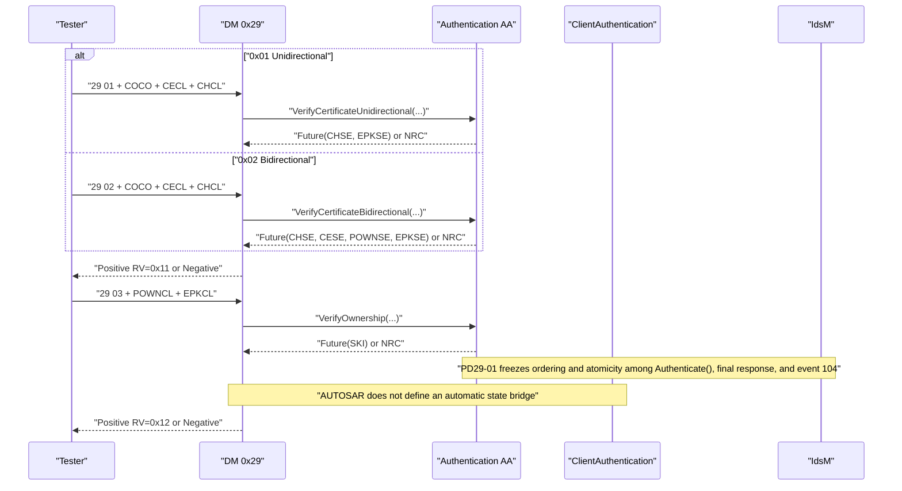
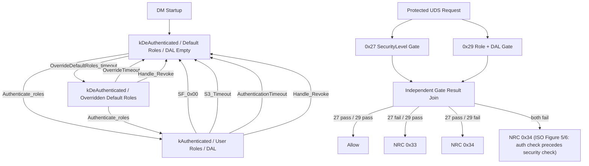
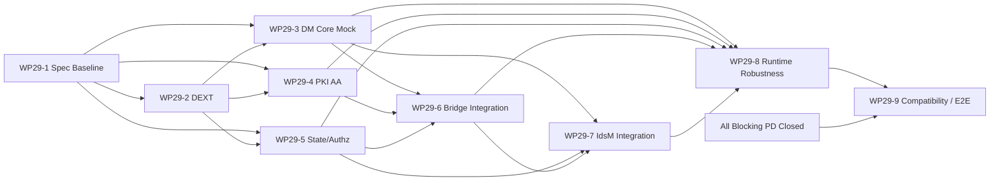

# AUTOSAR AP Diagnostics R25-11 UDS 0x29 Authentication 需求分析、AR 拆解与功能 Spec（完整 AUTOSAR DM APCE 子集）

> **范围声明：完整 AUTOSAR DM 0x29 APCE 子集，不是 ISO 14229 全量 0x29。**  
> 本文仅覆盖 AUTOSAR AP Diagnostics R25-11 明确支持的 `0x00/0x01/0x02/0x03/0x04/0x08`；Authentication with challenge-response（ACR）不在 DM 范围内。报文字节布局、完整长度规则、完整 NRC 集及密码学参数由 ISO 14229-1:2020、OEM 诊断规范和 PKI 策略补齐，本文不猜测这些外部内容。

| 文档属性 | 值 |
|---|---|
| 文档版本 | `0.6-draft` |
| 状态 | 规范审查 `APPROVED`；工程发布基线待冻结 |
| Owner | 待项目指定 |
| 基线 | AUTOSAR Adaptive Platform Diagnostics R25-11，Document ID 723 |
| 基线日期 | 2026-08-04 |
| 权威原文 | [AUTOSAR_AP_SWS_Diagnostics_R25-11.pdf](../autosar/AUTOSAR_AP_SWS_Diagnostics_R25-11.pdf) |
| 检索载体 | [AUTOSAR_AP_SWS_Diagnostics_R25-11.md](../markdown/AUTOSAR_AP_SWS_Diagnostics_R25-11/AUTOSAR_AP_SWS_Diagnostics_R25-11.md) |
| Markdown 审计 | [audit_after_v2.md](../markdown/_audit/audit_after_v2.md)；仅证明 requirements ID 集合匹配 |
| 历史对照 | R19-11–R24-11 PDF/Markdown |
| 文档性质 | 实现级需求分析、项目 AR Catalog、功能与测试 Spec |
| 受控 ID 计数 | 60 AR / 103 TC / 138 AR↔TC pairs / 14 PD / 9 WP |
| 分析日期 | 2026-08-04 |
| Git revision | 未冻结；发布时填写 commit hash |

## 目录

- [0. 执行摘要](#0-执行摘要)
- [1. 目的、方法与证据规则](#1-目的方法与证据规则)
- [2. 范围与边界](#2-范围与边界)
- [3. 演进与 R19 差距](#3-演进与-r19-差距)
- [4. 架构、职责与数据流](#4-架构职责与数据流)
- [5. 通用请求处理与 NRC 边界](#5-通用请求处理与-nrc-边界)
- [6. API 与 DEXT 功能 Spec](#6-api-与-dext-功能-spec)
- [7. 状态、Role、DAL、生命周期与授权](#7-状态roledal生命周期与授权)
- [8. 六个子功能详细功能 Spec](#8-六个子功能详细功能-spec)
- [9. AR29 追溯型需求 Catalog](#9-ar29-追溯型需求-catalog)
  - [9.10 TC family 到 AR category 反向覆盖](#910-tc-family-到-ar-category-反向覆盖)
- [10. 测试规格](#10-测试规格)
  - [10.2 协议与配置测试](#102-协议与配置测试)
  - [10.3 状态与授权测试](#103-状态与授权测试)
  - [10.4 鲁棒性与兼容测试](#104-鲁棒性与兼容测试)
- [11. 实施工作包 DAG](#11-实施工作包-dag)
- [12. 项目决策、测试就绪门禁与风险](#12-项目决策测试就绪门禁与风险)
- [13. 附录](#13-附录)

## 0. 执行摘要

### 0.1 最关键结论

1. **演进结论**：UDS `0x29 Authentication` 在 R21-11 引入；R23-11 的 Change History 明确记录 “Service 0x29 refinements”；R24-11 将 `TransmitCertificate` 从 `Authentication` 的旧成员拆为独立 `ara::diag::TransmitCertificate` 类，并新增 UDS SecurityEvents；R25-11 的六子功能核心服务流程稳定，但 API/事件定义文本并非未变。R25 Annex E.11.2 明确把本专题相关的构造、Handle/DAL、ExternalAuthentication、TransmitCertificate 和 SecurityEvent 条目列为 changed items，必须做接口影响分析。[SWS_DM_01226]，[SWS_DM_01961]–[SWS_DM_01970]，[SWS_DM_02014]–[SWS_DM_02026]；R25 §7.3.2.8.11、Annex E.11.2，PDF pp.164–170、1159–1170，Markdown L4513–4694、L20083–20106。
2. **范围结论**：AUTOSAR DM 只允许实现本章列出的 APCE/PKI 子集：`0x00/01/02/03/04/08`；ACR 明确 out of scope。不能把本文扩展成 ISO 14229-1:2020 全量 0x29。[SWS_DM_01226]；R25 §7.3.2.8.11，PDF p.164，Markdown L4513–4537。
3. **双权限维度**：`0x27 SecurityAccess` 与 `0x29 Role/DAL` 是独立访问 gate。前者不满足时产生 `0x33 (securityAccessDenied)`，后者的 Role 与 DynamicAccessList（DAL）均不授权时产生 `0x34 (authenticationRequired)`；0x29 gate 结果不能用 `kDeAuthenticated/kAuthenticated` 状态替代。二者不能互相替代，也不在本文中固定执行先后。[SWS_DM_00103]、[SWS_DM_00450]、[SWS_DM_01223]–[SWS_DM_01225]；R25 §7.3.2.4–7.3.2.5.3，PDF pp.134–138，Markdown L3521–3587、L3673–3689。
4. **协议握手与状态管理解耦**：`proofOfOwnership (0x03)` 成功时，[SWS_DM_01243] 只要求响应 `RV=0x12` 并返回 `SKI`；认证状态只在应用调用 `ClientAuthentication::Authenticate()` 时由 [SWS_DM_01206] 置为 `kAuthenticated`。§7.3.2.3 还明确说明状态/DAL 部分独立于 UDS 0x29。因此，不能写成 AUTOSAR 明确“禁止自动切换”；准确结论是：**规范未定义 0x03 到 `Authenticate()` 的自动桥接，项目必须显式闭合该链路**。R25 PDF pp.128–130、168，Markdown L3335–3385、L4652–4658。
5. **初态和去认证**：启动时每客户端状态为 `kDeAuthenticated`、DAL 为空；默认 Role 是 DEXT 中 `DiagnosticAuthRole.isDefault=TRUE` 的集合。认证状态从 `kAuthenticated` 变为 `kDeAuthenticated` 时，恢复默认 Role 并清除该客户端全部 DAL。[SWS_DM_01204]、[SWS_DM_01205]、[SWS_DM_01212]、[SWS_DM_01214]；R25 §7.3.2.3，PDF pp.129–133，Markdown L3369–3431、L3479–3483。
6. **客户端隔离**：认证服务、状态、Role、DAL 和超时必须按 Diagnostic Client 独立维护；一个客户端的认证不得改变另一连接的访问限制。[SWS_DM_01229]；R25 PDF p.129，Markdown L3361–3367。
7. **协议序列边界**：连续 `verifyCertificate*` 请求分别处理，不保留历史 verify 请求；`proofOfOwnership` 无论正响应还是负响应，响应发出后该认证序列结束，下一次必须重新从 `0x01` 或 `0x02` 开始。这些正文分别邻接 [SWS_DM_01233]、[SWS_DM_01238]、[SWS_DM_01243]，但句子本身无独立 SWS ID，本文按“规范正文无 ID”证据处理。R25 PDF pp.166–168，Markdown L4605–4608、L4630–4632、L4656–4658。
8. **不能擅自补齐**：AUTOSAR 将通用请求处理和协议格式继承自 ISO 14229-1:2020，但没有在本章复制完整报文字节图、所有长度约束、完整 NRC 列表、证书格式或算法参数。实现验收必须引入已授权的 ISO 文本和 OEM 诊断规范。[SWS_DM_00096]、[SWS_DM_00098]、[SWS_DM_01226]；R25 PDF pp.136、164，Markdown L3597–3629、L4513–4537。

### 0.2 交叉链接

- 总体演进背景见 [AUTOSAR AP DM Evolution Report R19–R25](../AUTOSAR_AP_DM_Evolution_Report_R19-R25.md)。
- R25 相对 R19 的五大方向与工作量框架见 [AUTOSAR AP DM R25 vs R19 Five Directions](../AUTOSAR_AP_DM_R25_vs_R19_Five_Directions.md)。
- DEXT / AP Manifest 配置项清单见 [AUTOSAR AP DM R25 0x29 DEXT Manifest Config](./AUTOSAR_AP_DM_R25_0x29_DEXT_Manifest_Config.md)。
- ISO 14229-1:2020 §10.6 + B.5 全量中文译本见 [ISO_14229-1_2020_UDS_0x29_Translation_Full_Spec.md](./ISO_14229-1_2020_UDS_0x29_Translation_Full_Spec.md)（含 ACR；本文仅 APCE 子集）。
- **认证状态管理、进程模型、连接粒度与 `ara::diag` 认证类的完整 C++ 约束**见 [认证状态管理与 API 约束参考](./AUTOSAR_AP_DM_R25_Authentication_State_and_API_Reference.md)。本文 §4.2、§6.3、§6.5、§7 只保留行为要点，机制细节与 Role/DAL 配置粒度在该文档展开。
- ACR（`0x05`/`0x06`）相关：[缺口分析](./AUTOSAR_AP_DM_R25_UDS_0x29_ACR_Config_API_Gap.md)、[实现 Spec](./AUTOSAR_AP_DM_R25_UDS_0x29_ACR_Unidirectional_Spec.md)、[增量模块拆分](./UDS_0x29_ACR_Unidirectional_Incremental_Module_Breakdown.md)。
- 本文不复制上述报告的宏观叙事，只展开 0x29 的实现边界、AR 和测试闭环。

## 1. 目的、方法与证据规则

### 1.1 目的

本文用于指导以下角色共同实现和验收 R25-11 0x29：

- DM Core：请求校验、子功能调度、异步响应、状态与授权；
- Adaptive Application：PKI、证书验证、Proof of Ownership、Role 派生；
- DEXT/Manifest 集成：服务实例、Role、Port Mapping、CEID、客户端识别和超时；
- IdsM 集成：SecurityEvent 及 context；
- 测试与合规：AUTOSAR SHALL、ISO 继承项和项目决策的分层验证。

### 1.2 方法

1. 以 R25 PDF 为权威，对 0x29 核心 pp.164–170、认证状态与授权 pp.128–136 逐项核对。
2. 以 R25 Markdown 定位 SWS ID、API 签名和 Annex；[audit_after_v2](../markdown/_audit/audit_after_v2.md) 的 2207/2207 匹配只证明 requirements ID 集合匹配，不证明 requirement 标题文本完整，也不证明表格单元格无损。
3. 以各版本 Change History Annex 判定新增、变更和删除；不以关键词缺失推断“已删除”。
4. 将 AUTOSAR 规定、ISO 继承、无 ID 正文、项目决策及 DRAFT API 分开，避免将设计建议伪装成标准 SHALL。

### 1.3 证据等级标签

| 标签 | 含义 | 本文用词规则 |
|---|---|---|
| `[AS]` | AUTOSAR SHALL | 可使用“必须”，并给出有效 `[SWS_DM_xxxxx]` |
| `[CS]` | 条件 SHALL | 只有条件成立才“必须”，必须写出配置/状态条件 |
| `[ISO]` | ISO 继承 | AUTOSAR 指向 ISO；细节须由 ISO 14229-1:2020 证据补齐 |
| `[BODY]` | 规范正文无独立 ID | 可作为 AUTOSAR 正文约束，但不得伪造 SWS ID |
| `[PD]` | 项目决策 | OEM/供应商必须冻结；不是 AUTOSAR SHALL |
| `[DRAFT]` | AUTOSAR 条目标为 DRAFT | 可实现但需版本冻结、变更监控和兼容隔离 |

引用格式为：`[SWS_DM_xxxxx]；R25 §章节，PDF 页，Markdown 行范围`。AR Catalog 中的 `AR29-*` 是本文自定义项目需求 ID，**不是 AUTOSAR ID**。

### 1.4 主要定位锚点

| 主题 | R25 权威位置 | Markdown 定位 |
|---|---|---|
| 状态、Role、DAL | §7.3.2.3，PDF pp.128–133 | L3335–3519 |
| 授权与 NRC 0x34 | §7.3.2.4，PDF pp.134–135 | L3521–3587 |
| 通用校验 | §7.3.2.5，PDF pp.136–141 | L3595–3779 附近 |
| 0x27 / NRC 0x33 | §7.3.2.5.3、§7.3.2.8.9，PDF pp.137–163 | L3645–3689、0x27 章节 |
| 0x29 六子功能 | §7.3.2.8.11，PDF pp.164–170 | L4513–4694 |
| SecurityEvents | §7.5.1，R25 对应页 | L8424–8530 |
| Authentication API | §8.3 | L8951–9045 |
| ClientAuthentication / Handle | §8.5–§8.6 | L9135–9352 |
| DAL Builder | §8.13、§8.15 | L10707–10795、L10920–11058 |
| ExternalAuthentication | §8.17 | L11284–11386 |
| TransmitCertificate API | §8.26 | L12307–12395 |
| DEXT Annex | Annex A | L18108–18139、L18405–18415、L18776–18779 |

## 2. 范围与边界

### 2.1 AUTOSAR DM 的完整 APCE 子集

| SF | 名称 | AUTOSAR 处理形态 | 核心成功 RV |
|---|---|---|---|
| `0x00` | `deAuthenticate` | DM 内部状态操作 | `0x10` |
| `0x01` | `verifyCertificateUnidirectional` | 外部 `Authentication` callback | `0x11` |
| `0x02` | `verifyCertificateBidirectional` | 外部 `Authentication` callback | `0x11` |
| `0x03` | `proofOfOwnership` | 外部 `Authentication` callback | `0x12` |
| `0x04` | `transmitCertificate` | 独立 `TransmitCertificate` callback | `0x13` |
| `0x08` | `authenticationConfiguration` | DM 内部固定 APCE 响应 | `0x02` |

证据：[SWS_DM_01226]；R25 §7.3.2.8.11，PDF p.164，Markdown L4517–4537。

### 2.2 明确 out of scope

- ACR 认证；
- ISO 14229-1:2020 中未列于 [SWS_DM_01226] 的其他 0x29 子功能；
- 网络报文的完整逐字节布局、字节序、所有最小/最大长度；
- 完整服务特定 NRC 集及 NRC 优先级矩阵；
- X.509/非 X.509 证书 profile、链构建、撤销检查、时间策略；
- 密钥协商、签名、哈希、KDF、曲线、密钥长度和随机数参数；
- OEM 信任锚、证书到 Role 的映射、CEID 业务动作。

这些项目不是“不需要实现”，而是必须由 `[ISO]` 或 `[PD]` 外部基线提供。AUTOSAR API 中出现 `EphemeralPublicKey` 或 Diffie-Hellman 描述，不构成算法套件选择。[SWS_DM_01126]–[SWS_DM_01128]（DRAFT）；R25 §8.3，Markdown L9011–9045。

### 2.3 规范术语

- **协议认证序列**：`verifyCertificate* → proofOfOwnership → RV=0x12/失败`。
- **认证状态**：`ClientAuthentication::DiagnosticAuthState` 的 `kDeAuthenticated` / `kAuthenticated`。
- **Role**：应用传给 `Authenticate()` 的 `DiagnosticAuthRole` 字符串集合；支持值来自 Diagnostic Extract。
- **DAL**：按客户端维护的 UDS 请求前缀/通配模式列表，是静态 Role 授权失败后的附加授权路径。
- **APCE**：本文仅按 AUTOSAR/ISO 引用作为 PKI certificate exchange 路径名称使用，不扩展其密码学细节。

## 3. 演进与 R19 差距

### 3.1 版本演进

| 版本 | 证据 | 对实现的含义 |
|---|---|---|
| [R19-11](../markdown/AUTOSAR_AP_SWS_Diagnostics_R19-11/AUTOSAR_AP_SWS_Diagnostics_R19-11.md) | 目录及 Change History 无 0x29 | 只有 0x27 等既有机制，不能声称已具备证书认证 |
| [R20-11](../markdown/AUTOSAR_AP_SWS_Diagnostics_R20-11/AUTOSAR_AP_SWS_Diagnostics_R20-11.md) | Change History 未引入 0x29 | 0x29 无核心新增/变化；尚不能形成 APCE 实现基线 |
| [R21-11](../markdown/AUTOSAR_AP_SWS_Diagnostics_R21-11/AUTOSAR_AP_SWS_Diagnostics_R21-11.md) | Change History：“Introduced UDS service 29” | 新增 0x29、状态/Role/DAL、Authentication 系列 API |
| [R22-11](../markdown/AUTOSAR_AP_SWS_Diagnostics_R22-11/AUTOSAR_AP_SWS_Diagnostics_R22-11.md) | Change History 未列 0x29 核心新增；“Standardize mapping of vendor specific error codes to UDS Error codes” | 0x29 核心无新增/变化；vendor-specific error→UDS error 的标准化属于所有外部 callback 共用的错误映射基线 |
| [R23-11](../markdown/AUTOSAR_AP_SWS_Diagnostics_R23-11/AUTOSAR_AP_SWS_Diagnostics_R23-11.md) | Change History：“Service 0x29 refinements” | 细化回调和错误处理；Annex 删除旧的 unspecified-error fallback 项 |
| [R24-11](../markdown/AUTOSAR_AP_SWS_Diagnostics_R24-11/AUTOSAR_AP_SWS_Diagnostics_R24-11.md) | Change History：“SecurityEvents added”；新增 [SWS_DM_01961]–[SWS_DM_01970] | `TransmitCertificate` 独立成类；0x27/0x29/授权失败进入 IdsM 事件模型 |
| [R25-11](../markdown/AUTOSAR_AP_SWS_Diagnostics_R25-11/AUTOSAR_AP_SWS_Diagnostics_R25-11.md) | 六子功能处理要求未发生核心流程重构；Annex E.11.2 列出相关 changed items | 服务流程稳定不等于 API/事件文本未变；必须复核签名、special member、DAL Builder、ExternalAuthentication、TransmitCertificate 与 SecurityEvent 定义 |

历史证据：R21 Markdown L3–5；R22 Change History；R23 L8–10；R24 L8–13；R25 Annex E.11.2 Markdown L20083–20106。删除项必须以对应 Annex 为准，见附录 C。

R25 Annex E.11.2 与本专题直接相关的 changed items 为：

`[SWS_DM_01124]`、`[SWS_DM_01137]`、`[SWS_DM_01138]`、`[SWS_DM_01144]`、`[SWS_DM_01148]`、`[SWS_DM_01149]`、`[SWS_DM_01159]`、`[SWS_DM_01160]`、`[SWS_DM_01170]`、`[SWS_DM_01175]`–`[SWS_DM_01178]`、`[SWS_DM_01184]`、`[SWS_DM_01185]`、`[SWS_DM_01193]`–`[SWS_DM_01195]`、`[SWS_DM_01962]`、`[SWS_DM_01967]`、`[SWS_DM_02014]`。

这些是“规范条目发生编辑”的证据，不自动意味着运行时语义变化；但版本迁移必须逐项审查，不能用“核心稳定”跳过 API/ABI、生成代码和事件定义回归。

### 3.2 R19 基线差距分类

| 分类 | R19 资产处置 | R25 0x29 增量 |
|---|---|---|
| 可复用 | UDS TP、Diagnostic Conversation、通用校验、P2/P2*、NRC 发送、0x27 SecurityAccess、DEXT 访问许可框架 | 接入同一请求流水线，但保持独立状态轴 |
| 必须新增 | 六子功能调度、`Authentication`/`TransmitCertificate` API、`ClientAuthentication` 状态、Role、DAL、`ExternalAuthentication`、0x34 | R19 无对应能力 |
| 条件新增 | CEID 路由、IdsM SecurityEvents、并发 callback、外部认证源地址范围 | 取决于 DEXT、IdsM 和项目部署 |
| 项目决策 | 信任锚、算法/证书 profile、Role 映射、PoO→`Authenticate()` 桥接、CEID 动作、在途 StopOffer 策略 | AUTOSAR 未标准化 |

### 3.3 0x27 gate 与 0x29 Role/DAL gate 四象限

| 0x27 SecurityLevel gate | 0x29 Role/DAL gate | 仅要求 0x27 的资源 | 仅要求 0x29 的资源 | 同时要求两者的资源 |
|---|---|---|---|---|
| 失败 | 失败 | `0x33` | `0x34` | 两 gate 都失败；按 ISO §8.7.2 Figure 5 / §8.7.3.1 Figure 6，认证检查先行，最终 NRC 为 **`0x34`** |
| 通过 | 失败 | 允许 | `0x34` | `0x34` |
| 失败 | 通过 | `0x33` | 允许 | `0x33` |
| 通过 | 通过 | 允许 | 允许 | 允许 |

0x29 gate 的“通过/失败”是**有效 Role 检查及后续 DAL 检查的授权结果**，不能用 `kDeAuthenticated/kAuthenticated` 代替：

- `kDeAuthenticated` 客户端仍可因 DEXT default Role 或 `OverrideDefaultRoles()` 的临时 Role 命中而通过 0x29 gate；
- `kAuthenticated` 客户端若 user Role 不命中且 DAL 也不命中，仍按 [SWS_DM_01225] 返回 `0x34`；
- `kAuthenticated` 只说明状态，不是资源授权通票；`kDeAuthenticated` 也不必然表示所有资源都被 0x29 gate 拒绝。

`deAuthenticate (0x00)` 的规范效果只涉及 Authentication State、Role 和 DAL。[SWS_DM_01212] 没有要求清除 0x27 SecurityLevel。因此本文禁止实现或测试作出“0x29 去认证必然清 0x27”的假设；若 OEM 希望联动，必须作为独立 `[PD]` 并评估与 AUTOSAR 会话状态机的冲突。

## 4. 架构、职责与数据流

### 4.1 职责边界

```mermaid
flowchart LR
    Tester["Diagnostic Client / Tester"] --> TP["UDS Transport + Conversation"]
    TP --> Validator["DM Common Validation"]
    Validator --> Dispatcher["0x29 Subfunction Dispatcher"]
    Dispatcher --> AuthAPI["ara::diag::Authentication"]
    Dispatcher --> TxCertAPI["ara::diag::TransmitCertificate"]
    AuthAPI --> PkiApp["AA PKI / Certificate Policy"]
    TxCertAPI --> PkiApp
    PkiApp --> Bridge["Project Authentication Bridge"]
    Bridge --> ExtAuth["ara::diag::ExternalAuthentication"]
    ExtAuth --> ClientAuth["ClientAuthentication per Client"]
    ClientAuth --> AuthState["State + Role + DAL"]
    AuthState --> Authz["DM Authorization Check"]
    Authz --> ProtectedSvc["Protected UDS Service"]
    Dispatcher --> IdsM["IdsM SecurityEvents"]
    Authz --> IdsM
```

### 4.2 责任分配

| 组件 | AUTOSAR 责任 | 不属于该组件的责任 |
|---|---|---|
| DM Validator | ISO 继承的通用顺序、格式/SID/SF/session/security/条件检查、失败即终止 | 证书解析和密码学 |
| 0x29 Dispatcher | 六子功能映射、字段转发、Future 完成后组响应、RV、序列终止 | OEM 信任策略 |
| AA PKI | 验证证书/PoO、生成 challenge/证书/PoO/EPK/SKI、返回 NRC | 改写 DM 的状态机 |
| Project Bridge | 取得正确 `ClientAuthentication`、Role 映射、调用 `Authenticate()` | 被伪装成 AUTOSAR 自动行为 |
| Auth State Store | 每客户端 State/Role/DAL、S3/authenticationTimeout、Notifier | 0x27 SecurityLevel |
| Authorization Engine | 静态 Role 检查，失败后 DAL 前缀匹配，最终 `0x34` | 用 0x29 替代 0x27 |
| IdsM Adapter | 报告 100/101/104/105 等事件、组合事件和 context | 决定证书可信度 |

### 4.3 0x29 协议序列

关键断言：`RV=0x12` 是协议成功结果，不是对 `ClientAuthentication::GetState()==kAuthenticated` 的替代断言。[SWS_DM_01243] 与 [SWS_DM_01206] 分属两条解耦链路。

## 5. 通用请求处理与 NRC 边界

### 5.1 所有六子功能的前置通用校验

每个子功能要求“if all checks described in [SWS_DM_00096] are successfully completed”后才执行专属逻辑。实现必须让专属 callback 在任一前置检查失败时保持未调用。[AS][SWS_DM_00096]、[SWS_DM_00097]；R25 §7.3.2.5，PDF pp.136–141，Markdown L3597–3621。

建议按以下逻辑域划分实现；下列项目**不是执行先后编号**：

- ISO 语法/长度、SID/SF 与 session 检查；
- 0x27 SecurityLevel gate；
- 0x29 Role/DAL gate（[SWS_DM_01223] 的 Role 路径仅在 `authenticationEnabled` 与 `authenticationRole` 同时存在时适用）；
- manufacturer/supplier validation 与 environmental condition；
- 子功能专属 CEID/应用处理；
- 异步响应与 SecurityEvent。

0x27 与 0x29 是独立 gate，在授权图中汇合，且**执行顺序由 ISO 规范确定**：[SWS_DM_00096] 把总顺序交给 ISO 14229-1，并明示依据为 ISO §8.7.2 **Figure 5 — General server response behaviour**（SID 级）与 §8.7.3.1 **Figure 6**（带 SubFunction 的服务）。

两图的强制顺序为：

- SID 级（Figure 5）：`0x11` SID supported → **`0x34` Authentication check** → `0x7F` session → `0x33` SID security check → `0x38`/`0x39` secure transmission；
- 子功能级（Figure 6）：`0x13` minimum length → `0x12` SubFunction supported → **`0x34` Authentication check** → `0x7E` session → `0x33` SubFunction security check → `0x24` request sequence。

由此可确定两点：**0x29 认证 gate 排在 0x27 SecurityLevel gate 之前**，两 gate 同时失败时唯一 NRC 为 `0x34`；且 ISO 把 `Authentication check` 置于 **Mandatory** 列、`security check` 置于 **Optional** 列，认证 gate 不可跳过。[ISO] ISO 14229-1:2020 §8.7.2、§8.7.3.1。

ISO §8.7.2 的 NOTE 指出，由于 Optional 检查可以不实现，"a specific NRC is not guaranteed for all possible test pattern sequences"；但 Mandatory 列的相对顺序是确定的，上述结论不受削弱。原 PD29-08 因此关闭（见 §12.1）。

### 5.2 NRC 来源清单

| 来源层 | 已由 AUTOSAR 明确的结果 | 证据 |
|---|---|---|
| 请求格式 | `0x13` | [SWS_DM_00098]，Markdown L3625–3629 |
| SID 不支持 | `0x11` | [SWS_DM_00099]，L3633–3637 |
| SF 不支持 | `0x12` | [SWS_DM_00100]，L3639–3643 |
| SID/SF session 不允许 | `0x7F` / `0x7E` | [SWS_DM_00101]、[SWS_DM_00102] |
| 0x27 SecurityLevel 不允许 | `0x33` | [SWS_DM_00103]、[SWS_DM_00450]，L3673–3689 |
| Role 与 DAL 均不允许 | `0x34` | [SWS_DM_01223]–[SWS_DM_01225]，L3531–3587 |
| 环境条件不满足 | 配置的 `nrcValue`，未配置 NRC 时 `0x22` | [SWS_DM_00111]、[SWS_DM_00286]–[SWS_DM_00289] |
| callback 未 Offer/已 StopOffer | `0x94` | [SWS_DM_01257] |
| 处理超时进行中 | `0x78`；达到配置上限时 `0x10` | [SWS_DM_00368]、[SWS_DM_00369] |
| 应用 callback 返回错误 | 将有效 `DiagUdsNrcErrc`/错误码转为相同 NRC | [SWS_DM_01231]、[SWS_DM_01236]、[SWS_DM_01241]、[SWS_DM_01249]、[SWS_DM_02059]、[SWS_DM_02060] |
| `0x04` 未知 CEID | `0x31`，且不得调用 `Process()` | [SWS_DM_01247] |

这不是 ISO 14229-1:2020 的“完整 NRC 集”。服务特定 NRC 与所有长度分支必须由授权 ISO/OEM 测试向量补齐。[ISO]

**双重失败的优先级已由 ISO 裁决**，不属于待冻结项：按 §5.1 引用的 Figure 5/Figure 6，`0x34` 先于 `0x33`；子功能级 `0x33` 先于 `0x24`。OEM 只能在 Optional 检查是否实现的范围内做选择，不能改变 Mandatory 列的相对顺序。[ISO]

## 6. API 与 DEXT 功能 Spec

> 配置元类/属性的完整清单、AP↔CP 差异与 constr 对照见独立文档 [AUTOSAR_AP_DM_R25_0x29_DEXT_Manifest_Config.md](./AUTOSAR_AP_DM_R25_0x29_DEXT_Manifest_Config.md)。本节保留行为相关摘要，供 AR/TC 追溯。

### 6.1 DEXT 配置对象

| 配置对象 | 实现语义 | 规范边界 |
|---|---|---|
| `DiagnosticAuthentication`（abstract） | 六个子类对应六 SF | 子类集合见 Annex A；[SWS_DM_01226] |
| `DiagnosticVerifyCertificateUnidirectional` / `Bidirectional` | 配置 `0x01/0x02` 服务实例 | 使用 `DiagnosticAuthenticationInterface` |
| `DiagnosticProofOfOwnership` | 配置 `0x03` | 必须至少同时配置一种 verify，[SWS_DM_01227] |
| `DiagnosticDeAuthentication` | 配置 `0x00` | 配置任一 verify/PoO 时为必选，[SWS_DM_01228] |
| `DiagnosticAuthenticationConfiguration` | 配置 `0x08` | 配置任一 verify/PoO 时为必选，[SWS_DM_01228] |
| `DiagnosticAuthTransmitCertificate` | 配置 `0x04` | 可按 `evaluationId` 路由；不由 [SWS_DM_01228] 强制带 `0x00/0x08` |
| `DiagnosticAuthCertificateEvaluation.evaluationId` | CEID 支持集 | 未知值 `0x31`，[SWS_DM_01247]；CEID 业务语义是 `[PD]` |
| `DiagnosticAuthRole` | 细粒度角色，含 `bitPosition`、`isDefault` | 默认 Role 由 `isDefault=TRUE` 决定 |
| `DiagnosticAuthRoleProxy.authenticationRole` | 访问许可到 Role 的 `0..*` 引用 | [SWS_DM_01223] 的 Role 检查要求它与 `authenticationEnabled` 同时存在 |
| `DiagnosticAccessPermission.authenticationEnabled` | 此聚合不存在时禁用认证检查 | 不存在则跳过，[SWS_DM_01739]；存在但无 Role 引用时不得自行推导运行时行为 |
| `DiagnosticExternalAuthenticationIdentification` | 以固定或范围 SA 定义客户端认证实例 | 数量决定 `ClientAuthentication` 实例数；§7.3.2.3.1 |
| `DiagnosticCommonProps.authenticationTimeout` | 默认 session 中已认证客户端无通信的保持时间；DEXT 类型为 `TimeValue`，说明单位为秒 | 属性可选；规范未在本章给默认值，项目应显式配置或冻结供应商行为 |

DEXT Annex 定位：R25 Markdown L18108–18139（AccessPermission/Role/Authentication/PortMapping），L18161（`authenticationTimeout` 与 external authentication 聚合）。

配置边界：若 `authenticationEnabled` 与至少一个 `authenticationRole` 同时存在，执行 [SWS_DM_01223] 的 Role 检查；若 `authenticationEnabled` 不存在，按 [SWS_DM_01739] 跳过认证检查。若 `authenticationEnabled` 存在但 `authenticationRole` 引用为空，本文不从上述两个条件推导“允许”或“拒绝”，必须按 PD29-14 由 DEXT 配置校验拒绝该组合，或由供应商/OEM 基线冻结。

ExternalAuthentication 地址识别边界由 PD29-11 管理：固定/范围配置发生重叠或歧义时，至少必须在配置期拒绝；运行时地址落在全部已配置范围之外时的返回/错误行为不是本文推导的 AUTOSAR SHALL，必须由供应商/OEM 基线冻结。对应门禁为 TC29-CFG-05。

### 6.2 Port Mapping

1. `DiagnosticAuthenticationPortMapping` 将某个 `DiagnosticAuthentication`（包括其具体子类）实例映射到应用 PPort；普通 verify/PoO 的 `Authentication` 构造函数要求 PPort 为 `DiagnosticAuthenticationInterface`。[SWS_DM_01124]；Markdown L8983–8987、L18132–18139。
2. R25 未为 `0x04` 定义另一套服务实例 mapping 类：同一 `DiagnosticAuthenticationPortMapping` 可引用 `DiagnosticAuthTransmitCertificate`，但其 PPort 必须为 `DiagnosticTransmitCertificateInterface`，再绑定独立 `TransmitCertificate` 类与构造函数。[SWS_DM_01961]、[SWS_DM_01962]；Markdown L8943、L12307–12359。
3. `DiagnosticExternalAuthenticationPortMapping` 使用应用 RPort 访问 DM 提供的 `DiagnosticExternalAuthenticationInterface`。[SWS_DM_01191]、[SWS_DM_01193]；Markdown L11284–11332、L18405–18415。
4. InstanceSpecifier、PortInterface、Process 和重复占用的映射违规按 API 表中的 standardized violations 处理；不能降级成“找不到回调时静默成功”。

### 6.3 `ara::diag::Authentication`

| 能力 | R25 API | 约束 |
|---|---|---|
| 生命周期 | `Authentication(InstanceSpecifier, ConcurrencyType)`、`Offer()`、`StopOffer()` | Offer 后 DM 才转发；StopOffer 后不再转发 |
| 单向验证 | `Future<tuple<Vector<Byte>, Vector<Byte>>> VerifyCertificateUnidirectional(...)` | 返回 Challenge、Server EPK；[SWS_DM_01126] **DRAFT** |
| 双向验证 | `Future<tuple<Vector<Byte>, Vector<Byte>, Vector<Byte>, Vector<Byte>>> VerifyCertificateBidirectional(...)` | 返回 Challenge、Server Certificate、Server PoO、Server EPK；[SWS_DM_01127] **DRAFT** |
| 所有权验证 | `Future<Vector<Byte>> VerifyOwnership(...)` | 返回 SessionKeyInfo；[SWS_DM_01128] **DRAFT** |
| 上下文 | 每个 callback 带 `const MetaInfo&`、`CancellationHandler` | 不得长期保存 `MetaInfo` 引用；如何终止/补偿被取消的业务处理由项目策略闭合 |

API 证据：[SWS_DM_01123]、[SWS_DM_01124]、[SWS_DM_01126]–[SWS_DM_01128]、[SWS_DM_01130]、[SWS_DM_01131]；R25 §8.3，Markdown L8951–9045。

### 6.4 `ara::diag::TransmitCertificate`

- 独立类绑定 `DiagnosticTransmitCertificateInterface`；
- 构造参数为 `InstanceSpecifier` 与 `ConcurrencyType`；
- `Offer()`/`StopOffer()` 控制转发；
- `Process(uint16_t certificateEvaluationId, Span<const Byte> certificateData, const MetaInfo&, CancellationHandler)` 返回 `Future<void>`；
- `certificateEvaluationId` 的 C++ 类型为 16 bit，但这不授权本文推导网络字节序或报文字节位置；
- [SWS_DM_01968] 没有声明 `certificateData` Span 的生命周期延续到 Future 完成或取消；Future 返回类型本身不构成该保证；
- `[PD]` 若 AA 在 `Process()` callback 返回后异步使用 CEDA，必须在 callback 返回前复制到自有存储；只有供应商提供并冻结更强 lifetime 合约时，项目才可采用该合约；
- API 明确表示证书没有统一业务语义，应用负责处理并派生动作，因此 CEID 动作表属于 `[PD]`。

证据：[SWS_DM_01961]、[SWS_DM_01962]、[SWS_DM_01968]–[SWS_DM_01970]；R25 §8.26，Markdown L12307–12387。

### 6.5 `ExternalAuthentication`、`ClientAuthentication` 与 Handle

| 类 | 关键 API | 规范效果 |
|---|---|---|
| `ExternalAuthentication` | `Get(Address)`、`Get(const MetaInfo&)`、`GetAll()` | 返回对应客户端或全部 `ClientAuthentication` |
| `ClientAuthentication` | `Authenticate(roles)` | 设置 `kAuthenticated` 和传入 Role，返回 Handle |
|  | `GetState()` | 返回当前状态 |
|  | `SetNotifier(fn)` | 状态变化时通知；重复注册覆盖旧 notifier |
|  | `OverrideDefaultRoles(roles, timeout)` | 仅在去认证状态临时覆盖默认 Role，返回 Handle |
| `ClientAuthenticationHandle` | `Set(dal)` | 替换 DAL |
|  | `Append(dal)` | 追加 DAL |
|  | `Revoke()` | [SWS_DM_01216] 置 `kDeAuthenticated`；[SWS_DM_01154] API 描述还要求清 DAL 与 overridden defaults |
|  | `Refresh()` | [SWS_DM_01217] 按 Handle 来源刷新对应 timer；[SWS_DM_01155] API 描述对“两方法都调用过”的场景写为刷新两 timer，存在文本张力 |

功能证据：[SWS_DM_01202]–[SWS_DM_01217]、[SWS_DM_01360]、[SWS_DM_01570]；R25 PDF pp.128–132，Markdown L3345–3471。ClientAuthentication API 证据：[SWS_DM_01132]–[SWS_DM_01134]、[SWS_DM_01136]–[SWS_DM_01144]；Handle API 见 [SWS_DM_01145]–[SWS_DM_01155]；ExternalAuthentication API 见 [SWS_DM_01191]–[SWS_DM_01201]。Markdown L9135–9352、L11284–11370。

Handle 边界：

- Override 状态下调用其 Handle 的 `Revoke()` 时，项目必须验证 [SWS_DM_01154] 所述 overridden defaults 被清除，客户端继续保持 `kDeAuthenticated` 并恢复 DEXT default Roles；
- [SWS_DM_01155] 的 API Description 写明：若 `Authenticate()` 与 `OverrideDefaultRoles()` 都曾调用，则 `Refresh()` 刷新两 timer；[SWS_DM_01217] 则按 Handle 来源分别描述刷新对应 timer；
- 本文不裁决两段文本的优先级。供应商必须澄清 Handle 关联、两个 timer 是否共存及刷新范围，并以 PD29-12 和合约测试冻结。

### 6.6 DAL Builder

构建链为：

`DiagnosticServiceDynamicAccessList::MakeServiceBuilder(head)`  
→ `Add(Byte/ByteString/ByteRange)`、`Any(n)`、`EndsWith(...)`  
→ `Build()`  
→ Handle `Set()` 或 `Append()`。

匹配语义：

- DAL entry 是请求起始字节模式；
- entry 的全部字节与请求匹配即成功；
- 请求中超出 entry 的后续字节不影响匹配；
- `Any(n)` 添加 n 个占位字节，但匹配时忽略其值；
- Role 检查失败后才检查 DAL；
- DAL 也失败才返回 `0x34`。

证据：[SWS_DM_01218]–[SWS_DM_01225]；R25 PDF pp.132–135，Markdown L3485–3587。API scaffold 见 [SWS_DM_01156]、[SWS_DM_01164]–[SWS_DM_01182]。

### 6.7 Future、Cancellation、MetaInfo 与 Concurrency

- `Verify*` 和 `Process` 返回 Future；DM 在 Future ready 前负责 P2/P2* / `0x78` 处理。[SWS_DM_00368]、[SWS_DM_00369]。
- 只有 [SWS_DM_01126]–[SWS_DM_01128] 明确声明其证书/challenge/POWN/EPK 输入 Span 的 lifetime 延续到 Promise fulfilled 或 processing cancellation；应用不得超出该边界读取。
- [SWS_DM_01968] 对 `TransmitCertificate::Process()` 的 `certificateData` 没有同类 lifetime 声明；异步 CEDA 处理必须按 6.4 的 `[PD]` 复制/供应商合约执行。
- `CancellationHandler::IsCanceled()` 查询状态，`SetNotifier()` 注册取消回调；后续注册覆盖旧回调。[SWS_DM_00614]、[SWS_DM_00615]。
- `MetaInfo` 至少携带客户端定位所需上下文；保证生命周期只覆盖 DM 到应用的活动调用，不得保存其引用。[SWS_DM_01345]；R25 §7.3.1.1.2。
- `ConcurrencyType=kConcurrent` 表示 callback 可被不同客户端并发调用；`kNotConcurrent` 时 DM 在前一个 Future ready 前不得并发调用同一接口。R25 §7.3.1.2。
- `[PD]` `StopOffer()` 对新请求的效果明确；已进入 callback 的 Future 如何取消、等待或丢弃晚到结果，AUTOSAR API 表未给出完整事务策略，必须按 PD29-06 冻结并测试。

## 7. 状态、Role、DAL、生命周期与授权

### 7.1 状态与授权图

图中的 `Override → DeAuth` 表示 override 超时或 Handle `Revoke()` 后回到配置默认 Role；`Override → Auth` 表示随后调用 `Authenticate()`。`Override` 只是图示的 Role 生命周期阶段，期间认证状态仍为 `kDeAuthenticated`，不是额外 AUTOSAR 枚举状态。两个 gate 的判定结果相互独立（互不代偿），但**执行先后由 ISO 规定**：按 §5.1 引用的 ISO §8.7.2 Figure 5 与 §8.7.3.1 Figure 6，认证检查排在 SecurityLevel 检查之前，因此同时失败时唯一 NRC 为 `0x34`。图中的汇合节点只表示"两个独立授权轴的结果合并"，不表示顺序未定。

### 7.2 生命周期规则

1. 启动：`kDeAuthenticated`，[SWS_DM_01205]；所有客户端 DAL 空，[SWS_DM_01214]。
2. 默认 Role：所有 `DiagnosticAuthRole.isDefault=TRUE` 的 Role，[SWS_DM_01204]；规范不保证至少存在一个默认 Role。
3. 认证：只有应用调用 `Authenticate(userRoles)` 才设置 `kAuthenticated` 和 Role，[SWS_DM_01206]。
4. Override：仅去认证状态可临时覆盖默认 Role，[SWS_DM_01209]；后续 `Authenticate()` 会将 override 基线重置回 DEXT 默认 Role，[SWS_DM_01570]。
5. 默认 session inactivity：已认证客户端从最后一次该客户端 `TransmitConfirmation` 起，在 `authenticationTimeout` 内无新请求则去认证，[SWS_DM_01210]。
6. S3：发生 S3 Server timeout 的客户端去认证，[SWS_DM_01211]。
7. 去认证后处理：恢复默认 Role、清该客户端 DAL，[SWS_DM_01212]。
8. Notifier：每次状态变化调用；重复 `SetNotifier()` 覆盖旧注册，[SWS_DM_01208]、[SWS_DM_01360]。
9. 客户端隔离：[SWS_DM_01229]；状态、Role、DAL、timer key 至少包含 Diagnostic Client identity。
10. Handle Revoke：[SWS_DM_01154] 的 API 描述要求 de-authenticate、清 DAL 和 overridden defaults；Override 状态下也要验证 override 被清除。
11. Handle Refresh：[SWS_DM_01155] 与 [SWS_DM_01217] 对“两方法都调用过”场景的表述存在张力，行为由 PD29-12/供应商合约冻结。

### 7.3 授权粒度与次序

[SWS_DM_01223] 仅在 `DiagnosticAccessPermission.authenticationEnabled` 与 `DiagnosticAuthRoleProxy.authenticationRole` 同时存在时，条件性规定 Role 检查的粒度：

- SID；
- SID + subfunction；
- 单个或多个 DID；
- dynamically defined DID；
- 0x31 的 subfunction/RID 路径；
- 0x19 `MemorySelection`；
- 0x14 `MemorySelection`。

上述条件成立时，实现必须遵循“某一级已授权即停止后续 Role 检查并处理服务”的规则。若 Role 不授权，再按 [SWS_DM_01224] 做 DAL 前缀匹配；两者均失败才按 [SWS_DM_01225] 返回 `0x34` 并停止服务处理。若 `authenticationEnabled` 不存在，按 [SWS_DM_01739] 不执行认证检查；若它存在但无 Role 引用，按配置校验/项目决策处理，不推导运行时结果。

### 7.4 PoO 到状态的项目闭环

推荐但非 AUTOSAR 强制的桥接流程 `[PD]`：

1. `VerifyOwnership()` callback 入口立即用当前 `MetaInfo` 调用 `ExternalAuthentication::Get(metaInfo)`，取得正确客户端对象；不要保存 `MetaInfo&`。
2. 异步验证 PoO，基于 PD29-02/PD29-03 的 PKI/crypto baseline 和 PD29-04 的 Role mapping 派生 Role。
3. 在 PD29-01 冻结的原子提交点调用 `ClientAuthentication::Authenticate(roles)`。
4. 只有 `Authenticate()` 成功后才把内部业务事务标记为“状态已提交”；若调用失败，不得仅凭 `RV=0x12` 对后续服务放行。
5. 由 PD29-01 明确 Future 成功、状态提交和 SecurityEvent 104 的原子性/补偿策略。

该流程是为了闭合规范空白，不得在追溯矩阵中标为 AUTOSAR SHALL。

## 8. 六个子功能详细功能 Spec

六子功能共用以下 SecurityEvent 组合规则：

- 任一 0x29 请求产生负响应时，按 [SWS_DM_02025]/[SWS_DM_02026] 报告 event 105；
- 任一诊断请求因当前 SecurityLevel 不允许而返回 `0x33` 时，按 [SWS_DM_02015]/[SWS_DM_02016] 报告 event 100；
- 因此，**0x29 请求在 0x27 gate 失败并以 `0x33` 负响应时，同时满足 event 100 与 event 105 条件，两个事件都要报告**；§7.5.1 正文允许单请求报告多个 SecurityEvents；
- event 102 仅在 `0x27 SecurityAccess` 的 `CompareKey` 成功解锁目标 SecurityAccess type 时触发；`RequestSeed` 正响应不触发 102。任一 SecurityAccess 请求产生负响应时触发 event 103。本文仅把 102/103 作为 0x27 兼容回归，不扩大 0x29 核心范围。[SWS_DM_02019]–[SWS_DM_02022]。

追溯到 AR29-AUDIT-05、AR29-AUDIT-06 及 TC29-VAL-04、TC29-OVL-09、TC29-IDS-08。

### 8.1 `0x00 deAuthenticate`

| 项 | 实现要求 |
|---|---|
| 配置条件 | `DiagnosticDeAuthentication` 已配置；若任一 `0x01/0x02/0x03` 已配置，则 [SWS_DM_01228] 条件性要求同时配置 `0x00` 和 `0x08` |
| 通用校验 | 先完成 [SWS_DM_00096]；失败时不改变认证状态 |
| AUTOSAR 明确转发字段 | 无应用 callback，因此没有 AUTOSAR 明确的应用转发字段；网络 payload 由 ISO 定义 |
| 调用/API | DM 执行 [SWS_DM_01212] 的状态转换后处理，不调用 `Authentication` API |
| 成功输出 | 正响应，`authenticationReturnParameter (RV)=0x10` |
| 失败/NRC | 来自通用校验；本子功能无应用返回 NRC |
| 序列/状态 | 对目标客户端去认证；从 `kAuthenticated` 转出时恢复默认 Role 并清 DAL；不得清另一客户端，也不得无证据清 0x27 SecurityLevel |
| SecurityEvent | 正响应不满足 [SWS_DM_02023] 的 PoO-success 条件；负响应按本章通用规则报告 105，若 NRC=`0x33` 还报告 100 |
| AR / 测试 | AR29-PROTO-03、AR29-STATE-04、AR29-COMPAT-03；TC29-00-*、TC29-OVL-05、TC29-VAL-04、TC29-IDS-02、TC29-IDS-08 |

证据：[SWS_DM_01244]、[SWS_DM_01245] → [SWS_DM_01212]；R25 §7.3.2.8.11.1，PDF p.165，Markdown L4567–4579。

### 8.2 `0x01 verifyCertificateUnidirectional`

| 项 | 实现要求 |
|---|---|
| 配置条件 | `DiagnosticVerifyCertificateUnidirectional`、对应 `DiagnosticAuthenticationPortMapping` 和已 Offer 的 `Authentication` handler；并由 [SWS_DM_01228] 要求 `0x00/0x08` |
| 通用校验 | [SWS_DM_00096] 全部通过后才回调 |
| AUTOSAR 明确转发字段 | `COCO → communicationConfiguration`；`CECL → clientCertificate`；`CHCL → clientChallenge` |
| API | `Authentication::VerifyCertificateUnidirectional(..., MetaInfo, CancellationHandler)`；[SWS_DM_01126] **DRAFT** |
| 成功输出 | 从 callback 返回值派生 `LOCHSE`、`LOEPKSE`；复制 `CHSE`、`EPKSE`；`RV=0x11` |
| 失败/NRC | callback 错误码原样转 NRC，[SWS_DM_01231]；未 Offer 为 `0x94`；其他来自通用校验 |
| 序列/状态 | 开始 APCE 序列；连续 verify 各自处理且不保留历史；本要求未设置 `ClientAuthentication` 状态 |
| SecurityEvent | 正响应不触发 104；负响应按通用规则触发 105，若 NRC=`0x33` 则 100+105 |
| AR / 测试 | AR29-PROTO-04、AR29-APP-01、AR29-STATE-07；TC29-01-*、TC29-CON-*、TC29-CAN-* |

证据：[SWS_DM_01230]、[SWS_DM_01231]、[SWS_DM_01233] + [SWS_DM_01126]；R25 §7.3.2.8.11.2，PDF pp.165–166，Markdown L4581–4608。

### 8.3 `0x02 verifyCertificateBidirectional`

| 项 | 实现要求 |
|---|---|
| 配置条件 | `DiagnosticVerifyCertificateBidirectional`、对应 mapping 和已 Offer handler；并由 [SWS_DM_01228] 要求 `0x00/0x08` |
| 通用校验 | [SWS_DM_00096] 全部通过后才回调 |
| AUTOSAR 明确转发字段 | `COCO → communicationConfiguration`；`CECL → clientCertificate`；`CHCL → clientChallenge` |
| API | `Authentication::VerifyCertificateBidirectional(..., MetaInfo, CancellationHandler)`；[SWS_DM_01127] **DRAFT** |
| 成功输出 | 派生 `LOCHSE/LOCESE/LPOWNSE/LOEPKSE`；复制 `CHSE/CESE/POWNSE/EPKSE`；`RV=0x11` |
| 失败/NRC | [SWS_DM_01236] 将 [SWS_DM_01127] 返回错误码原样转 NRC；未 Offer `0x94`；其他来自通用校验 |
| 序列/状态 | 开始双向 APCE 序列；连续 verify 不累积历史；不自动设置 `kAuthenticated` |
| SecurityEvent | 正响应不触发 104；负响应按通用规则触发 105，若 NRC=`0x33` 则 100+105 |
| AR / 测试 | AR29-PROTO-05、AR29-APP-02、AR29-STATE-07；TC29-02-*、TC29-CON-*、TC29-CAN-* |

**审计注意**：MinerU Markdown 在 L4618–4620 丢失了 `[SWS_DM_01236]` 标题，只留下正文；权威 PDF p.167 明确存在 `[SWS_DM_01236] Handling Negative return values ...`。实现追溯不得误删该需求。

证据：[SWS_DM_01235]、**[SWS_DM_01236]**、[SWS_DM_01238] + [SWS_DM_01127]；R25 §7.3.2.8.11.3，PDF pp.166–167，Markdown L4610–4632。

### 8.4 `0x03 proofOfOwnership`

| 项 | 实现要求 |
|---|---|
| 配置条件 | `DiagnosticProofOfOwnership` 已配置；[SWS_DM_01227] 要求至少一种 `0x01/0x02`；[SWS_DM_01228] 同时要求 `0x00/0x08` |
| 通用校验 | [SWS_DM_00096] 全部通过后才回调；项目还需按当前客户端活动序列校验上下文 |
| AUTOSAR 明确转发字段 | `POWNCL → ClientPOWN`；`EPKCL → ClientEphemeralPublicKey` |
| API | `Authentication::VerifyOwnership(..., MetaInfo, CancellationHandler)`；[SWS_DM_01128] **DRAFT** |
| 成功输出 | 派生 `LOSKI`；复制 `SKI`；`RV=0x12` |
| 失败/NRC | [SWS_DM_01241] 将 [SWS_DM_01128] 返回错误码原样转 NRC；其他来自通用校验 |
| 序列/状态 | 正或负响应发出后序列均结束；下一序列必须从 `0x01/0x02` 开始。`RV=0x12` 本身不等于 [SWS_DM_01206] 的状态转换 |
| SecurityEvent | 成功触发 `SEV_UDS_AUTHENTICATION_SUCCESSFUL` 104；负响应按通用规则触发 105，若 NRC=`0x33` 则 100+105 |
| AR / 测试 | AR29-PROTO-06、AR29-APP-03、AR29-STATE-03、AR29-STATE-07、AR29-AUDIT-01；TC29-03-*、TC29-APP-*、TC29-IDS-01、TC29-IDS-02、TC29-IDS-08 |

证据：[SWS_DM_01240]、[SWS_DM_01241]、[SWS_DM_01243] + [SWS_DM_01128]；R25 §7.3.2.8.11.4，PDF pp.167–168，Markdown L4634–4658。

### 8.5 `0x04 transmitCertificate`

| 项 | 实现要求 |
|---|---|
| 配置条件 | `DiagnosticAuthTransmitCertificate`、对应 mapping 和已 Offer 的 `TransmitCertificate` handler；若期望请求成功，必须存在与请求 CEID 匹配的 `evaluationId` |
| 通用校验 | [SWS_DM_00096] 全部通过后，先做 CEID 支持校验 |
| AUTOSAR 明确转发字段 | `CEID → certificateEvaluationId`；`CEDA → certificateData` |
| API | `TransmitCertificate::Process(..., MetaInfo, CancellationHandler)`，[SWS_DM_01968]；CEDA Span 无 AUTOSAR 延长 lifetime 声明 |
| 成功输出 | 正响应，`RV=0x13 (CertificateVerified)`；无其他 AUTOSAR 明确输出字段 |
| 失败/NRC | 未知 CEID：`0x31` 且不调用应用；callback 错误按 [SWS_DM_01249] 原样转 NRC；未 Offer：`0x94` |
| 序列/状态 | 规范未要求加入 `0x01/02→0x03` 序列，也未要求改变 `ClientAuthentication`；`RV=0x13` 不得被解释为客户端已认证 |
| SecurityEvent | 正响应不触发 PoO-success 104；负响应按通用规则触发 105，若 NRC=`0x33` 则 100+105 |
| AR / 测试 | AR29-PROTO-07、AR29-CFG-05、AR29-APP-04；TC29-04-*、TC29-IDS-02、TC29-IDS-08 |

证据：[SWS_DM_01247]、[SWS_DM_01248]、[SWS_DM_01249]、[SWS_DM_01251] + [SWS_DM_01968]；R25 §7.3.2.8.11.5，PDF pp.168–169，Markdown L4660–4686。

`evaluationId → 证书类型 → 信任域 → 验证/安装/轮换/撤销动作` 的映射表是 `[PD]`。AUTOSAR 只规定路由与 API，不定义 CEID 的业务动作。

CEDA lifetime 的唯一详细规则见 §6.4；本节仅以 AR29-APP-04、TC29-04-05、PD29-13 和风险条目引用该边界。

### 8.6 `0x08 authenticationConfiguration`

| 项 | 实现要求 |
|---|---|
| 配置条件 | `DiagnosticAuthenticationConfiguration` 已配置；任一 `0x01/0x02/0x03` 配置时由 [SWS_DM_01228] 强制存在 |
| 通用校验 | [SWS_DM_00096] 全部通过 |
| AUTOSAR 明确转发字段 | 无应用 callback，无 AUTOSAR 明确转发字段 |
| 调用/API | DM 内部直接处理 |
| 成功输出 | 正响应，`RV=0x02 (AuthenticationConfiguration APCE)` |
| 失败/NRC | 仅来自通用校验 |
| 序列/状态 | 查询配置能力，不开始/完成证书序列，不改变 `ClientAuthentication` |
| SecurityEvent | 正响应不触发 104；负响应按通用规则触发 105，若 NRC=`0x33` 则 100+105 |
| AR / 测试 | AR29-PROTO-08、AR29-CFG-03；TC29-08-*、TC29-VAL-* |

证据：[SWS_DM_01246]；R25 §7.3.2.8.11.6，PDF p.169，Markdown L4688–4694。

## 9. AR29 追溯型需求 Catalog

> `AR29-PROTO/CFG/APP/STATE/AUTHZ/LIFE/AUDIT/CONC/COMPAT` 均为本文自定义 ID，不是 AUTOSAR requirement ID。下列 AR Catalog 的 AR→TC 集合与 §10“覆盖 AR”列的 TC→AR 集合均为权威关系，两个 pair 集合必须完全等价；本节禁止 wildcard、范围符号或代表性省略。表中“必须”只在等级为 `[AS]/[CS]/[ISO]/[DRAFT]` 且有来源时表示规范义务；`[PD]` 表示项目必须决策并基线化。

### 9.1 Protocol

| ID | 规范陈述/边界 | 责任方 | 来源 RS/SWS | 等级 | 验证场景 |
|---|---|---|---|---|---|
| AR29-PROTO-01 | DM 仅支持 `00/01/02/03/04/08` APCE 子集，ACR 不实现 | DM-Core | RS_Diag_04251；[SWS_DM_01226] | `[CS]` | TC29-CFG-01、TC29-CFG-02、TC29-ISO-01 |
| AR29-PROTO-02 | 六 SF 专属处理前均通过 [SWS_DM_00096]，失败即停止 | DM-Core | RS_Diag_04276；[SWS_DM_00096]、[SWS_DM_00097] | `[AS][ISO]` | TC29-VAL-01、TC29-VAL-02、TC29-VAL-03、TC29-VAL-04、TC29-VAL-05、TC29-VAL-06、TC29-VAL-07、TC29-VAL-08、TC29-00-03、TC29-08-02 |
| AR29-PROTO-03 | `0x00` 执行去认证后返回 `RV=0x10` | DM-Core | RS_Diag_04251；[SWS_DM_01244]、[SWS_DM_01245] | `[AS]` | TC29-00-01、TC29-00-03 |
| AR29-PROTO-04 | `0x01` 精确转发 COCO/CECL/CHCL，成功回 CHSE/EPKSE 与 `RV=0x11` | DM-Core/AA | [SWS_DM_01230]、[SWS_DM_01231]、[SWS_DM_01233] | `[AS]` | TC29-01-01 |
| AR29-PROTO-05 | `0x02` 精确转发 COCO/CECL/CHCL，成功回 CHSE/CESE/POWNSE/EPKSE 与 `RV=0x11` | DM-Core/AA | [SWS_DM_01235]、[SWS_DM_01236]、[SWS_DM_01238] | `[AS]` | TC29-02-01、TC29-02-03 |
| AR29-PROTO-06 | `0x03` 转发 POWNCL/EPKCL，成功回 SKI 与 `RV=0x12`，响应后结束序列 | DM-Core/AA | [SWS_DM_01240]、[SWS_DM_01241]、[SWS_DM_01243] | `[AS][BODY]` | TC29-03-01、TC29-03-03 |
| AR29-PROTO-07 | `0x04` 校验 CEID、转发 CEID/CEDA，成功 `RV=0x13` | DM-Core/AA | [SWS_DM_01247]–[SWS_DM_01249]、[SWS_DM_01251] | `[AS]` | TC29-04-01、TC29-04-04 |
| AR29-PROTO-08 | `0x08` 成功直接返回 APCE `RV=0x02` | DM-Core | [SWS_DM_01246] | `[AS]` | TC29-08-01、TC29-08-02 |
| AR29-PROTO-09 | wire layout、完整长度/NRC 和密码参数不在本 Spec 自创，由 ISO/OEM 基线提供 | Compliance | [SWS_DM_00096]、[SWS_DM_00098]、[SWS_DM_01226] | `[ISO][PD]` | TC29-ISO-01、TC29-ISO-02、TC29-ISO-03 |

### 9.2 Configuration

| ID | 规范陈述/边界 | 责任方 | 来源 RS/SWS | 等级 | 验证场景 |
|---|---|---|---|---|---|
| AR29-CFG-01 | 只为已配置的 0x29/SF 提供处理器；未配置 SF 返回通用不支持结果 | DEXT/DM-Core | [SWS_DM_01226]、[SWS_DM_00100] | `[CS]` | TC29-CFG-01、TC29-CFG-02 |
| AR29-CFG-02 | 配置 PoO 时至少配置一种 verify | DEXT Validator | [SWS_DM_01227] | `[CS]` | TC29-CFG-03 |
| AR29-CFG-03 | 配置任一 verify/PoO 时同时配置 deAuthenticate 与 authenticationConfiguration | DEXT Validator | [SWS_DM_01228] | `[CS]` | TC29-CFG-04 |
| AR29-CFG-04 | `authenticationEnabled`+Role 引用同时存在时启用 Role 路径；前者存在但 Role 引用为空时按 PD29-14 处理，不推导 allow/deny | DEXT/DM-Core | [SWS_DM_01739]、[SWS_DM_01223] | `[CS][PD]` | TC29-AUTH-01、TC29-AUTH-09 |
| AR29-CFG-05 | CEID 必须命中 `evaluationId`；未知 CEID 返回 `0x31` 且不调用 AA | DEXT/DM-Core | [SWS_DM_01247] | `[AS]` | TC29-04-02 |
| AR29-CFG-06 | ExternalAuthentication 地址范围必须无重叠/歧义；范围外运行时行为按 PD29-11 冻结 | DEXT/Integration | §7.3.2.3.1；[SWS_DM_01202]、[SWS_DM_01229] | `[CS][PD]` | TC29-CFG-05 |
| AR29-CFG-07 | Authentication、TransmitCertificate、ExternalAuthentication 的 Port/Process Mapping 必须通过 InstanceSpecifier 校验 | Integration | [SWS_DM_01124]、[SWS_DM_01193]、[SWS_DM_01962] | `[AS]` | TC29-CFG-06 |

### 9.3 Application API

| ID | 规范陈述/边界 | 责任方 | 来源 RS/SWS | 等级 | 验证场景 |
|---|---|---|---|---|---|
| AR29-APP-01 | AA 实现单向验证 Future callback 及错误返回 | AA-PKI | [SWS_DM_01126] | `[DRAFT]` | TC29-01-01、TC29-01-02、TC29-01-03 |
| AR29-APP-02 | AA 实现双向验证 Future callback、四元返回及错误返回 | AA-PKI | [SWS_DM_01127] | `[DRAFT]` | TC29-02-01、TC29-02-02 |
| AR29-APP-03 | AA 实现 VerifyOwnership Future callback 并返回 SKI 或 NRC | AA-PKI | [SWS_DM_01128] | `[DRAFT]` | TC29-03-01、TC29-03-02 |
| AR29-APP-04 | AA 实现独立 `TransmitCertificate::Process`；CEDA lifetime 按 §6.4/PD29-13 | AA-PKI | [SWS_DM_01961]、[SWS_DM_01968] | `[AS][PD]` | TC29-04-01、TC29-04-03、TC29-04-05 |
| AR29-APP-05 | 需要 callback 的接口只有 Offer 后才接收请求；StopOffer 后新请求不转发 | AA/DM-Core | [SWS_DM_01130]、[SWS_DM_01131]、[SWS_DM_01969]、[SWS_DM_01970]、[SWS_DM_01257] | `[AS]` | TC29-OFF-01、TC29-OFF-02 |
| AR29-APP-06 | AA 使用 MetaInfo 定位客户端但不保存引用；取消后的业务终止与补偿按 PD29-06 | AA | [SWS_DM_01345]、[SWS_DM_00614]、[SWS_DM_00615] | `[AS][PD]` | TC29-01-03、TC29-CAN-01、TC29-CAN-02、TC29-CAN-03 |
| AR29-APP-07 | 信任锚、证书 profile、算法、Role 映射按 PD29-02/PD29-03/PD29-04 版本化 | Security Architecture | [SWS_DM_01126]–[SWS_DM_01128]、[SWS_DM_01968] 仅定义 byte/API 边界 | `[PD]` | TC29-APP-03、TC29-ISO-03 |

### 9.4 State

| ID | 规范陈述/边界 | 责任方 | 来源 RS/SWS | 等级 | 验证场景 |
|---|---|---|---|---|---|
| AR29-STATE-01 | 启动时每客户端为 `kDeAuthenticated` | Auth-State | [SWS_DM_01205] | `[AS]` | TC29-BOOT-01 |
| AR29-STATE-02 | 认证状态和访问限制按客户端独立 | Auth-State | [SWS_DM_01229] | `[AS]` | TC29-00-02、TC29-STA-03、TC29-STA-04、TC29-CON-03 |
| AR29-STATE-03 | 只有应用调用 `Authenticate(roles)` 才按该 SWS 置 `kAuthenticated` 并设置 Role | Auth-State/AA | [SWS_DM_01206] | `[AS]` | TC29-03-05、TC29-APP-01、TC29-STA-01 |
| AR29-STATE-04 | Auth→DeAuth 时恢复默认 Role 并清该客户端 DAL | Auth-State | [SWS_DM_01212] | `[AS]` | TC29-00-01、TC29-STA-02 |
| AR29-STATE-05 | S3 与 default-session inactivity 分别触发目标客户端去认证 | Auth-State | [SWS_DM_01210]、[SWS_DM_01211] | `[CS]` | TC29-STA-03、TC29-STA-04 |
| AR29-STATE-06 | GetState 返回当前状态；状态变化通知；重复 notifier 覆盖 | Auth-State/API | [SWS_DM_01207]、[SWS_DM_01208]、[SWS_DM_01360] | `[AS]` | TC29-STA-05、TC29-STA-06 |
| AR29-STATE-07 | PoO→Authenticate 自动桥接未定义；项目实现原子闭环且不得仅凭 RV 放行 | AA/Auth-State | [SWS_DM_01243] 对比 [SWS_DM_01206]；§7.3.2.3 独立性正文 | `[PD]` | TC29-03-04、TC29-03-05、TC29-APP-02 |

### 9.5 Authorization

| ID | 规范陈述/边界 | 责任方 | 来源 RS/SWS | 等级 | 验证场景 |
|---|---|---|---|---|---|
| AR29-AUTHZ-01 | `authenticationEnabled` 不存在时不做认证检查 | Authz/DEXT | [SWS_DM_01739] | `[CS]` | TC29-AUTH-01 |
| AR29-AUTHZ-02 | 仅当 `authenticationEnabled` 与 `authenticationRole` 同时存在时，Role 检查按 SID/SF/DID/dynamic DID/RID/MemorySelection 粒度执行 | Authz | [SWS_DM_01223] | `[CS]` | TC29-AUTH-02、TC29-AUTH-03、TC29-AUTH-04、TC29-AUTH-05、TC29-AUTH-06、TC29-AUTH-07 |
| AR29-AUTHZ-03 | Role 失败后才执行 DAL pattern match | Authz | [SWS_DM_01224] | `[AS]` | TC29-DAL-04 |
| AR29-AUTHZ-04 | Role 与 DAL 均失败返回 `0x34` 并终止服务处理 | Authz | [SWS_DM_01225] | `[AS]` | TC29-VAL-05、TC29-AUTH-08、TC29-OVL-08 |
| AR29-AUTHZ-05 | DAL 使用前缀匹配；entry 后的请求字节不参与判定，`Any` 字节被忽略 | Authz/DAL | [SWS_DM_01220]、[SWS_DM_01224] | `[AS]` | TC29-DAL-02、TC29-DAL-03 |
| AR29-AUTHZ-06 | 0x27 与 0x29 是独立 gate，分别产生 `0x33/0x34`；状态不等于 0x29 gate 结果，且本文不固定两个 gate 顺序 | Authz | [SWS_DM_00103]、[SWS_DM_00450]、[SWS_DM_01223]–[SWS_DM_01225] | `[AS][PD]` | TC29-OVL-01、TC29-OVL-02、TC29-OVL-03、TC29-OVL-04、TC29-OVL-06、TC29-OVL-07、TC29-OVL-08、TC29-OVL-09 |
| AR29-AUTHZ-07 | DAL Builder/更新 API：`MakeServiceBuilder/Add/Any/EndsWith/Build` 以及 Handle `Set/Append` | Authz/DAL API | [SWS_DM_01213]、[SWS_DM_01215]、[SWS_DM_01218]–[SWS_DM_01222]；[SWS_DM_01152]、[SWS_DM_01153]、[SWS_DM_01156]、[SWS_DM_01164]–[SWS_DM_01181] | `[AS]` | TC29-DAL-01、TC29-DAL-05 |

### 9.6 Lifecycle

| ID | 规范陈述/边界 | 责任方 | 来源 RS/SWS | 等级 | 验证场景 |
|---|---|---|---|---|---|
| AR29-LIFE-01 | 启动 DAL 为空；默认 Role 取 `isDefault=TRUE` 集合 | Auth-State/DEXT | [SWS_DM_01204]、[SWS_DM_01214] | `[AS]` | TC29-BOOT-01、TC29-BOOT-02 |
| AR29-LIFE-02 | OverrideDefaultRoles 仅在去认证状态生效，并按 timeout 失效 | Auth-State/API | [SWS_DM_01209] | `[CS]` | TC29-STA-07、TC29-OVL-07 |
| AR29-LIFE-03 | Authenticate 后 overridden default roles 重置到 DEXT 默认 | Auth-State | [SWS_DM_01570] | `[AS]` | TC29-STA-08 |
| AR29-LIFE-04 | Handle Set/Append 操作目标 DAL；Revoke 置去认证并按 API 描述清 DAL 与 overridden defaults | Auth-State/API | [SWS_DM_01213]、[SWS_DM_01215]、[SWS_DM_01216]、[SWS_DM_01154] | `[AS]` | TC29-STA-10、TC29-DAL-05 |
| AR29-LIFE-05 | StopOffer 时在途 Future 的取消/等待/晚结果丢弃策略必须基线化 | DM-Core/AA | [SWS_DM_01131]、[SWS_DM_01970]、[SWS_DM_00614]–[SWS_DM_00615] 的未定义事务间隙 | `[PD]` | TC29-CAN-03、TC29-OFF-03 |
| AR29-LIFE-06 | Refresh 在单一来源场景按 Handle 来源刷新；两方法都调用过时按 PD29-12 冻结 | Platform/API | [SWS_DM_01155]、[SWS_DM_01217] | `[PD]` | TC29-STA-09、TC29-STA-11 |

### 9.7 Audit

| ID | 规范陈述/边界 | 责任方 | 来源 RS/SWS | 等级 | 验证场景 |
|---|---|---|---|---|---|
| AR29-AUDIT-01 | 成功 PoO 报告 event 104；其 context schema 仍为 DRAFT | IdsM Adapter | [SWS_DM_02023]、[SWS_DM_02024] | `[AS][DRAFT]` | TC29-03-01、TC29-IDS-01 |
| AR29-AUDIT-02 | 任一 0x29 负响应报告 event 105；其 context schema 仍为 DRAFT | IdsM Adapter | [SWS_DM_02025]、[SWS_DM_02026] | `[AS][DRAFT]` | TC29-01-02、TC29-02-02、TC29-03-02、TC29-04-03、TC29-IDS-02 |
| AR29-AUDIT-03 | 后续服务因认证不足返回 0x34 时报告 event 101；其 context schema 仍为 DRAFT | IdsM Adapter | [SWS_DM_02017]、[SWS_DM_02018] | `[AS][DRAFT]` | TC29-OVL-03、TC29-IDS-03 |
| AR29-AUDIT-04 | 100/101 context 含 SID/SF/DID/RID/Client SA sentinel；104 含 SF/SA；105 另含 NRC | IdsM Adapter | [SWS_DM_02016]、[SWS_DM_02018]、[SWS_DM_02024]、[SWS_DM_02026] | `[DRAFT]` | TC29-IDS-04、TC29-IDS-05、TC29-IDS-06、TC29-IDS-08 |
| AR29-AUDIT-05 | 单请求可报告多个满足条件的 SecurityEvents，不能相互吞并 | IdsM Adapter | [SWS_DM_02014] 上下文后的 §7.5.1 正文；Markdown L8440–8442 | `[BODY]` | TC29-IDS-07 |
| AR29-AUDIT-06 | `0x33` 必须报告 event 100；若该负响应属于 0x29 请求，还必须同时报告 event 105 | IdsM Adapter | [SWS_DM_02015]、[SWS_DM_02016]、[SWS_DM_02025]、[SWS_DM_02026] | `[AS][DRAFT]` | TC29-VAL-04、TC29-OVL-02、TC29-OVL-09、TC29-IDS-08 |

### 9.8 Concurrency

| ID | 规范陈述/边界 | 责任方 | 来源 RS/SWS | 等级 | 验证场景 |
|---|---|---|---|---|---|
| AR29-CONC-01 | kConcurrent handler 在通用并发条件满足时支持不同客户端并发 callback，AA 实现线程安全 | AA/DM-Core | [SWS_DM_00940]、[SWS_DM_01126]–[SWS_DM_01128]、[SWS_DM_01968]；§7.3.1.2 | `[CS]` | TC29-CON-01 |
| AR29-CONC-02 | kNotConcurrent 时同一接口在前 Future ready 前不并发回调 | DM-Core | [SWS_DM_00940]、[SWS_DM_01126]–[SWS_DM_01128]、[SWS_DM_01968]；§7.3.1.2 | `[CS]` | TC29-CON-02 |
| AR29-CONC-03 | 活动 verify/PoO 上下文以客户端 identity 隔离，不得串用 challenge/certificate | AA/DM-Core | [SWS_DM_01229]；旧跨客户端需求已在 R24 删除 | `[AS][PD]` | TC29-CON-03 |
| AR29-CONC-04 | 连续 verify 不累计历史；项目只保留当前客户端当前序列所需上下文 | AA/DM-Core | [SWS_DM_01229] + §7.3.2.8.11.2/.3 正文（无独立 ID） | `[BODY][PD]` | TC29-01-04、TC29-02-04 |

### 9.9 Compatibility

| ID | 规范陈述/边界 | 责任方 | 来源 RS/SWS | 等级 | 验证场景 |
|---|---|---|---|---|---|
| AR29-COMPAT-01 | R19 0x27 资产可复用，但不构成 0x29 实现 | Architecture | R21 Change History；[SWS_DM_01226] | `[PD]` | TC29-CMP-01 |
| AR29-COMPAT-02 | 0x27 不得作为 0x29 的替代授权；按两个 gate 的通过/失败四象限验证，不以认证状态替代 gate 结果 | Authz/Test | [SWS_DM_00103]、[SWS_DM_01223]–[SWS_DM_01225] | `[AS][PD]` | TC29-OVL-01、TC29-OVL-04 |
| AR29-COMPAT-03 | 0x29 deauth 不得无证据清除 0x27 SecurityLevel | Auth-State | [SWS_DM_01212] 未包含 SecurityLevel | `[PD]` | TC29-OVL-05 |
| AR29-COMPAT-04 | R24+ 使用独立 TransmitCertificate；不得继续调用已删除的 Authentication::TransmitCertificate | AA/Integration | R24 Annex E.10.3 删除 [SWS_DM_01129]；新增 [SWS_DM_01961]–[SWS_DM_01970] | `[AS]` | TC29-CMP-02 |
| AR29-COMPAT-05 | DRAFT API/context 通过 adapter 隔离并锁定 AUTOSAR release | Architecture | [SWS_DM_01126]–[SWS_DM_01128]、[SWS_DM_02014]/context tables | `[DRAFT][PD]` | TC29-CMP-03 |
| AR29-COMPAT-06 | R25 Annex E.11.2 的本专题 changed items 必须逐项完成 API/ABI、生成代码和事件定义影响审查 | Architecture/Integration | R25 Annex E.11.2；Markdown L20083–20106 | `[PD]` | TC29-CMP-04 |
| AR29-COMPAT-07 | 既有 0x27 兼容回归：CompareKey 成功解锁触发 102；RequestSeed 正响应不触发 102；任一 SecurityAccess 负响应触发 103 | System Compatibility | [SWS_DM_02019]–[SWS_DM_02022] | `[AS][DRAFT]` | TC29-CMP-05、TC29-CMP-06、TC29-CMP-07 |

### 9.10 TC family 到 AR category 反向覆盖

AR Catalog 是 AR→TC 主矩阵；§10 每个具体 TC 行的“覆盖 AR”列是权威 TC→AR 关系。下表仅作非权威类别导航，不得覆盖或扩大精确映射；`*` 不创建新的 TC ID。

| TC family | 主要反向覆盖 AR category |
|---|---|
| `TC29-VAL-*` | `AR29-PROTO-*`、`AR29-AUDIT-*` |
| `TC29-CFG-*` | `AR29-PROTO-*`、`AR29-CFG-*` |
| `TC29-00-*` | `AR29-PROTO-*`、`AR29-STATE-*`、`AR29-COMPAT-*` |
| `TC29-01-*` | `AR29-PROTO-*`、`AR29-APP-*`、`AR29-CONC-*` |
| `TC29-02-*` | `AR29-PROTO-*`、`AR29-APP-*`、`AR29-CONC-*` |
| `TC29-03-*` | `AR29-PROTO-*`、`AR29-APP-*`、`AR29-STATE-*`、`AR29-AUDIT-*` |
| `TC29-04-*` | `AR29-PROTO-*`、`AR29-CFG-*`、`AR29-APP-*` |
| `TC29-08-*` | `AR29-PROTO-*`、`AR29-CFG-*` |
| `TC29-APP-*` | `AR29-APP-*`、`AR29-STATE-*` |
| `TC29-STA-*` | `AR29-STATE-*`、`AR29-LIFE-*` |
| `TC29-BOOT-*` | `AR29-STATE-*`、`AR29-LIFE-*` |
| `TC29-DAL-*` | `AR29-AUTHZ-*`、`AR29-LIFE-*` |
| `TC29-AUTH-*` | `AR29-CFG-*`、`AR29-AUTHZ-*` |
| `TC29-OVL-*` | `AR29-AUTHZ-*`、`AR29-AUDIT-*`、`AR29-COMPAT-*` |
| `TC29-IDS-01`～`TC29-IDS-08` | `AR29-AUDIT-*` |
| `TC29-CON-*` | `AR29-STATE-*`、`AR29-CONC-*` |
| `TC29-CAN-*` | `AR29-APP-*`、`AR29-LIFE-*` |
| `TC29-OFF-*` | `AR29-APP-*`、`AR29-LIFE-*` |
| `TC29-ISO-*` | `AR29-PROTO-*`、`AR29-APP-*` |
| `TC29-CMP-*` | `AR29-COMPAT-*` |

## 10. 测试规格

### 10.1 测试基线与 family 导航

下列基线是 `[PD]` 项目验证要求，用于证明前述 AUTOSAR/ISO 义务和规范空白决策：

- 每个测试显式记录：DEXT 片段版本、ISO/OEM 诊断规范版本、客户端 identity、session、SecurityLevel、Authentication State、Role、DAL、handler Offer 状态。
- 协议字节断言引用外部 ISO/OEM golden vectors；本文只固定 AUTOSAR 明确字段映射与 RV。
- 负测必须断言 callback 是否被调用、状态是否改变、SecurityEvent 是否产生，而不只检查 NRC。
- 双客户端测试使用不同 `sourceAddr/globalChannelId` identity，验证状态、序列、DAL、timer 和 callback data 均不串扰。
- 任何依赖 `Status=Open` 的 PD 的测试必须标记为 `BLOCKED`，不能因实现符合模糊“项目策略”而判 `PASS`；只有 PD 的基线/决议引用填写并经 Owner 批准后才能解除阻塞。

- [10.2 协议与配置测试](#102-协议与配置测试)：`VAL/CFG/00/01/02/03/04/08`
- [10.3 状态与授权测试](#103-状态与授权测试)：`APP/STA/BOOT/DAL/AUTH/OVL/IDS`
- [10.4 鲁棒性与兼容测试](#104-鲁棒性与兼容测试)：`CON/CAN/OFF/ISO/CMP`

### 10.2 协议与配置测试

| 场景 ID | 前置/激励 | 关键断言 | 覆盖 AR |
|---|---|---|---|
| TC29-VAL-01 | 任一 SF 的 ISO 格式/长度错误 | `0x13`；专属 callback 未调用；状态不变；event 105 按 0x29 负响应规则报告 | AR29-PROTO-02 |
| TC29-VAL-02 | SID 有处理器但 SF 未配置 | `0x12`；无专属 callback | AR29-PROTO-02 |
| TC29-VAL-03 | SID/SF 在当前 session 不允许 | `0x7F/0x7E` 按层级；无专属 callback | AR29-PROTO-02 |
| TC29-VAL-04 | 0x29 请求因 0x27 SecurityLevel gate 不满足而负响应 | `0x33`；不误报为 `0x34`；同时报告 event 100+105，不报告 101 | AR29-PROTO-02、AR29-AUDIT-06 |
| TC29-VAL-05 | 0x29 Role/DAL gate 失败 | `0x34`；服务处理停止；event 101；若请求 SID 本身为 0x29，另报告 105 | AR29-PROTO-02、AR29-AUTHZ-04 |
| TC29-VAL-06 | 环境条件失败 | 返回配置 NRC 或默认 `0x22`；callback 未调用 | AR29-PROTO-02 |
| TC29-VAL-07 | callback 所需接口未 Offer | `0x94`；无伪造成功 RV | AR29-PROTO-02 |
| TC29-VAL-08 | Future 超过 P2/P2* | 按基线发送 `0x78`；达到配置上限 `0x10` | AR29-PROTO-02 |
| TC29-CFG-01 | 仅配置六 SF 子集中的若干项 | 只提供已配置项；未列 SF 不因 ISO 存在而自动支持 | AR29-PROTO-01、AR29-CFG-01 |
| TC29-CFG-02 | 配置 ACR/非 AUTOSAR SF | DEXT/集成校验拒绝或不生成处理器 | AR29-PROTO-01、AR29-CFG-01 |
| TC29-CFG-03 | 配置 PoO 但无 0x01/0x02 | 配置校验失败 | AR29-CFG-02 |
| TC29-CFG-04 | 配置 0x01/0x02/0x03 但缺 0x00 或 0x08 | 配置校验失败 | AR29-CFG-03 |
| TC29-CFG-05 | ExternalAuthentication SA 单值/范围边界、范围外地址、重叠或歧义范围 | 重叠/歧义必须在配置期拒绝；范围外运行时断言引用 PD29-11，PD29-11 为 Open 时本分支 `BLOCKED` | AR29-CFG-06 |
| TC29-CFG-06 | Port/Process/InstanceSpecifier 错配或重复占用 | 产生相应 standardized violation；不静默路由 | AR29-CFG-07 |
| TC29-00-01 | 客户端 A 已认证且有 user Role/DAL，发送 `0x00` | `RV=0x10`；A 去认证、恢复默认 Role、DAL 空 | AR29-PROTO-03、AR29-STATE-04 |
| TC29-00-02 | A 去认证，B 已认证 | B 状态/Role/DAL 不变 | AR29-STATE-02 |
| TC29-00-03 | 通用校验失败的 `0x00` | A 状态、Role、DAL 均不变 | AR29-PROTO-02、AR29-PROTO-03 |
| TC29-01-01 | 合法 COCO/CECL/CHCL，AA 成功 | callback 三字段逐字节相等；CHSE/EPKSE 与长度字段一致；`RV=0x11` | AR29-PROTO-04、AR29-APP-01 |
| TC29-01-02 | AA 返回选定有效 NRC | DM 原样返回同 NRC；event 105 含同 NRC | AR29-APP-01、AR29-AUDIT-02 |
| TC29-01-03 | AA Future 取消/超时 | 无越界 Span 访问；无晚到正响应 | AR29-APP-01、AR29-APP-06 |
| TC29-01-04 | 同客户端连续两次 0x01，再发 0x03 | 不保留 verify 历史；当前序列断言引用 PD29-09，PD29-09 为 Open 时 `BLOCKED` | AR29-CONC-04 |
| TC29-02-01 | 合法请求，AA 返回四元组 | CHSE/CESE/POWNSE/EPKSE 及四长度正确；`RV=0x11` | AR29-PROTO-05、AR29-APP-02 |
| TC29-02-02 | AA 返回有效 NRC | 原样返回；不进入认证状态 | AR29-APP-02、AR29-AUDIT-02 |
| TC29-02-03 | Markdown 未识别 01236 的追溯回归 | 测试规范和代码 trace 均引用 PDF 中 [SWS_DM_01236] | AR29-PROTO-05 |
| TC29-02-04 | 连续 0x02 | 不累计历史；当前序列/替换断言引用 PD29-09，PD29-09 为 Open 时 `BLOCKED` | AR29-CONC-04 |
| TC29-03-01 | 当前序列 PoO 成功 | SKI/LOSKI 正确；`RV=0x12`；event 104 | AR29-PROTO-06、AR29-APP-03、AR29-AUDIT-01 |
| TC29-03-02 | PoO callback 返回 NRC | 原样负响应；event 105；序列结束 | AR29-APP-03、AR29-AUDIT-02 |
| TC29-03-03 | PoO 成功后再次直接 PoO | 不复用已结束序列；结果引用 PD29-09/ISO/OEM sequence-error 基线，PD29-09 为 Open 时 `BLOCKED` | AR29-PROTO-06 |
| TC29-03-04 | PoO 返回 `RV=0x12` 后应用尚未调用 `Authenticate()` | **`[PD]` 必须仍按 `GetState()` 实际值判断，规范测试不得假定 `kAuthenticated`** | AR29-STATE-07 |
| TC29-03-05 | 应用桥接调用 `Authenticate(roles)` 成功 | 原子提交与 Role 映射引用 PD29-01/PD29-04；任一为 Open 时 `BLOCKED` | AR29-STATE-03、AR29-STATE-07 |
| TC29-04-01 | 已知 CEID + CEDA | `Process()` 收到相同 CEID/CEDA；成功 `RV=0x13` | AR29-PROTO-07、AR29-APP-04 |
| TC29-04-02 | CEID 低/高边界中的未知值 | `0x31`；`Process()` 未调用 | AR29-CFG-05 |
| TC29-04-03 | `Process()` 返回有效 NRC | DM 原样返回；event 105 含同 NRC | AR29-APP-04、AR29-AUDIT-02 |
| TC29-04-04 | `RV=0x13` 后查询 ClientAuthentication | 状态不因该 RV 自动变化 | AR29-PROTO-07 |
| TC29-04-05 | `Process()` 返回 pending Future 并异步使用 CEDA | 断言引用 §6.4 与 PD29-13；PD29-13 为 Open 时 `BLOCKED`，不得引用 AUTOSAR 延长保证 | AR29-APP-04 |
| TC29-08-01 | 合法 0x08 | 不调用 AA；正响应 `RV=0x02` | AR29-PROTO-08 |
| TC29-08-02 | 0x08 通用校验失败 | 对应通用 NRC；无状态变化 | AR29-PROTO-02、AR29-PROTO-08 |

### 10.3 状态与授权测试

| 场景 ID | 前置/激励 | 关键断言 | 覆盖 AR |
|---|---|---|---|
| TC29-APP-01 | 仅调用 PoO Future，不调用 Authenticate | 协议结果与状态结果可不同，状态仍由 GetState 证明 | AR29-STATE-03 |
| TC29-APP-02 | PoO 成功与 Authenticate 失败注入 | 不对后续资源放行；补偿/事件引用 PD29-01，PD29-01 为 Open 时 `BLOCKED` | AR29-STATE-07 |
| TC29-APP-03 | 证书到 Role 映射的未知/空/多 Role | 断言引用 PD29-02/PD29-04；任一为 Open 时 `BLOCKED`，且不得隐式授予 default/admin Role | AR29-APP-07 |
| TC29-STA-01 | `Authenticate([R1,R2])` | `kAuthenticated`，Role 精确为 R1/R2，返回 Handle | AR29-STATE-03 |
| TC29-STA-02 | Auth→DeAuth 的四种触发：0x00/S3/inactivity/Revoke | 每种均恢复默认 Role并清 DAL | AR29-STATE-04 |
| TC29-STA-03 | default session，最后 TxConfirmation 后达到 authenticationTimeout | 仅目标客户端去认证 | AR29-STATE-02、AR29-STATE-05 |
| TC29-STA-04 | S3 timeout | 仅超时客户端去认证 | AR29-STATE-02、AR29-STATE-05 |
| TC29-STA-05 | GetState 在每个转换点调用 | 返回真实当前状态 | AR29-STATE-06 |
| TC29-STA-06 | 连续注册 notifier A/B 后转换 | 只调用最新 B | AR29-STATE-06 |
| TC29-STA-07 | DeAuth 下 OverrideDefaultRoles 到期 | 状态保持 DeAuth，Role 恢复 DEXT 默认 | AR29-LIFE-02 |
| TC29-STA-08 | override 后 Authenticate | override baseline 重置到 `isDefault` 配置 | AR29-LIFE-03 |
| TC29-STA-09 | 仅调用一种入口后，用其 Handle 调用 Refresh | 单一来源场景按 [SWS_DM_01217] 刷新对应 override timeout 或 inactivity timeout | AR29-LIFE-06 |
| TC29-STA-10 | DeAuth 下 OverrideDefaultRoles 后，对该 Handle 调用 Revoke | 状态仍为 DeAuth；overridden defaults 与 DAL 被清除，恢复 DEXT default Roles | AR29-LIFE-04 |
| TC29-STA-11 | 同一客户端先后调用 OverrideDefaultRoles 与 Authenticate，再观测 Handle Refresh | 记录两个 timer 的刷新结果；断言引用 PD29-12，PD29-12 为 Open 时 `BLOCKED` | AR29-LIFE-06 |
| TC29-BOOT-01 | 冷启动，多个客户端 | 全部 `kDeAuthenticated`，DAL 全空 | AR29-STATE-01、AR29-LIFE-01 |
| TC29-BOOT-02 | DEXT 有零个/一个/多个 `isDefault` Role | 默认 Role 集与 DEXT 精确一致，不臆造 Role | AR29-LIFE-01 |
| TC29-DAL-01 | MakeBuilder→Add→Any→EndsWith→Build | 生成预期模式，可传给 Set/Append | AR29-AUTHZ-07 |
| TC29-DAL-02 | entry 为完整请求前缀，请求带额外尾部 | 匹配成功 | AR29-AUTHZ-05 |
| TC29-DAL-03 | Any 覆盖字节取最小/最大不同值 | 均匹配；非 Any 字节差异失败 | AR29-AUTHZ-05 |
| TC29-DAL-04 | 静态 Role 失败、DAL 命中 | 允许；不返回 0x34 | AR29-AUTHZ-03 |
| TC29-DAL-05 | Set 后 Append，再 Revoke | Set 替换、Append 扩展、Revoke 后全清 | AR29-AUTHZ-07、AR29-LIFE-04 |
| TC29-AUTH-01 | `authenticationEnabled` 不存在 | 不执行 Role/DAL 检查 | AR29-CFG-04、AR29-AUTHZ-01 |
| TC29-AUTH-02 | `authenticationEnabled` 与 Role 引用同时存在，SID 级 Role 命中 | 允许且跳过余下认证检查 | AR29-AUTHZ-02 |
| TC29-AUTH-03 | 两配置条件同时存在，SID+SF Role 命中/不命中 | 粒度正确 | AR29-AUTHZ-02 |
| TC29-AUTH-04 | 两配置条件同时存在，单 DID/多 DID/动态 DID | 每种按 [SWS_DM_01223] 路径验证 | AR29-AUTHZ-02 |
| TC29-AUTH-05 | 两配置条件同时存在，0x31 的 SF/RID 组合 | 只授权配置组合 | AR29-AUTHZ-02 |
| TC29-AUTH-06 | 两配置条件同时存在，0x19 MemorySelection | primary 与 user-defined memory 路径按规范区分 | AR29-AUTHZ-02 |
| TC29-AUTH-07 | 两配置条件同时存在，0x14 MemorySelection | 只授权目标 memory | AR29-AUTHZ-02 |
| TC29-AUTH-08 | 两配置条件同时存在，Role、DAL 均失败 | `0x34`、停止处理、event 101 | AR29-AUTHZ-04 |
| TC29-AUTH-09 | `authenticationEnabled` 存在但 Role 引用为空 | 断言引用 PD29-14，PD29-14 为 Open 时 `BLOCKED`；不得从 [SWS_DM_01223]/[SWS_DM_01739] 自行推导 allow/deny | AR29-CFG-04 |
| TC29-OVL-01 | 0x27 gate pass / 0x29 gate pass | 同时要求两者的资源允许 | AR29-AUTHZ-06、AR29-COMPAT-02 |
| TC29-OVL-02 | 0x27 gate fail / 0x29 gate pass | `0x33`；event 100；不将 0x29 gate 结果改写为状态 | AR29-AUTHZ-06、AR29-AUDIT-06 |
| TC29-OVL-03 | 0x27 gate pass / 0x29 gate fail | `0x34`；event 101 | AR29-AUTHZ-06、AR29-AUDIT-03 |
| TC29-OVL-04 | 两 gate 均 fail | 唯一 final NRC 必须为 `0x34`（ISO §8.7.2 Figure 5 / §8.7.3.1 Figure 6 认证检查先行）；不得返回 `0x33`。不再 `BLOCKED` | AR29-AUTHZ-06、AR29-COMPAT-02 |
| TC29-OVL-05 | 0x27 已解锁后执行 0x29 deauth | 0x27 状态不因 [SWS_DM_01212] 被清除 | AR29-COMPAT-03 |
| TC29-OVL-06 | `kDeAuthenticated`，DEXT default Role 命中目标资源 | 0x29 gate 通过；证明 DeAuth 不等于授权失败 | AR29-AUTHZ-06 |
| TC29-OVL-07 | `kDeAuthenticated`，OverrideDefaultRoles Role 命中目标资源 | override 有效期内 0x29 gate 通过；到期/Revoke 后按默认 Role 重新判定 | AR29-AUTHZ-06、AR29-LIFE-02 |
| TC29-OVL-08 | `kAuthenticated`，user Role 不命中且 DAL 不命中 | 0x29 gate 失败并返回 `0x34`；证明 Authenticated 不等于授权通过 | AR29-AUTHZ-04、AR29-AUTHZ-06 |
| TC29-OVL-09 | SID=0x29，0x27 gate fail、0x29 gate pass | 最终 `0x33`；同一请求同时报告 event 100 与 event 105 | AR29-AUTHZ-06、AR29-AUDIT-06 |
| TC29-IDS-01 | 0x03 正响应 | event 104；context SF=0x03、正确 Client SA | AR29-AUDIT-01 |
| TC29-IDS-02 | 六 SF 各自产生负响应 | 每个均 event 105；SF/SA/NRC 正确 | AR29-AUDIT-02 |
| TC29-IDS-03 | 受保护服务返回 0x34 | event 101 | AR29-AUDIT-03 |
| TC29-IDS-04 | 无 SF/DID/RID 的受保护服务 | 101 context 使用规范 sentinel | AR29-AUDIT-04 |
| TC29-IDS-05 | DID/RID/MemorySelection 负测 | DID/RID 字段与请求一致；MemorySelection 路径按“无 DID/RID” sentinel 记录，不能发明额外 context 字段 | AR29-AUDIT-04 |
| TC29-IDS-06 | 两客户端同时失败 | event context 的 Client SA 不串扰 | AR29-AUDIT-04 |
| TC29-IDS-07 | 单请求同时满足 auth-needed 与 service-failed 事件 | 两事件均报告，不相互覆盖 | AR29-AUDIT-05 |
| TC29-IDS-08 | 0x29 请求返回 `0x33` | event 100 context 与 event 105 context 都正确，且两个事件都上报 | AR29-AUDIT-04、AR29-AUDIT-06 |

### 10.4 鲁棒性与兼容测试

| 场景 ID | 前置/激励 | 关键断言 | 覆盖 AR |
|---|---|---|---|
| TC29-CON-01 | kConcurrent，两客户端并发 0x01/0x02 | callback 可重入；输入/输出按客户端归属 | AR29-CONC-01 |
| TC29-CON-02 | kNotConcurrent，前一 Future 未 ready | 同一 handler 不并发进入 | AR29-CONC-02 |
| TC29-CON-03 | A verify、B verify、A PoO、B PoO 交错 | challenge/certificate/PoO/Role/状态均不串扰 | AR29-CONC-03、AR29-STATE-02 |
| TC29-CAN-01 | 已注册取消 notifier，Conversation cancel 时 Future pending | CancellationHandler 可见 canceled，已注册 notifier 被调用 | AR29-APP-06 |
| TC29-CAN-02 | cancel 后 AA 访问 [SWS_DM_01126]–[SWS_DM_01128] 的输入 Span | 不发生越过其明确 lifetime 的访问；资源已安全释放 | AR29-APP-06 |
| TC29-CAN-03 | cancel/StopOffer 后 Future 晚完成 | 丢弃/补偿断言引用 PD29-06；PD29-06 为 Open 时 `BLOCKED`，且不得发送重复 final response | AR29-APP-06、AR29-LIFE-05 |
| TC29-OFF-01 | 未 Offer 或 StopOffer 后发 0x01/02/03/04 | `0x94` | AR29-APP-05 |
| TC29-OFF-02 | 重复 Offer | 返回 `kAlreadyOffered`，不产生双重注册 | AR29-APP-05 |
| TC29-OFF-03 | StopOffer 与在途请求竞态 | 断言引用 PD29-06；PD29-06 为 Open 时 `BLOCKED`，不得出现悬挂 callback/重复响应 | AR29-LIFE-05 |
| TC29-ISO-01 | ISO golden vectors 覆盖六 SF wire layout/length | 字节级结果与授权 ISO/OEM 基线一致 | AR29-PROTO-01、AR29-PROTO-09 |
| TC29-ISO-02 | ISO 完整服务特定 NRC 与优先级矩阵 | 每个分支有外部证据；通用段顺序按 Figure 5/6 断言（含双 gate → `0x34`），仅 `0x29` 服务特定分支（§10.6.7 / Figure 11）待 OEM 表冻结 | AR29-PROTO-09 |
| TC29-ISO-03 | OEM crypto vectors | 断言引用 PD29-02/PD29-03；任一为 Open 时 `BLOCKED` | AR29-PROTO-09、AR29-APP-07 |
| TC29-CMP-01 | R19 组件接入 R25 | 复用 TP/validator/0x27，但新增全部 0x29 状态与 API | AR29-COMPAT-01 |
| TC29-CMP-02 | 搜索旧 `Authentication::TransmitCertificate` | R24+ 产品代码中无旧 API 调用 | AR29-COMPAT-04 |
| TC29-CMP-03 | DRAFT adapter 合约测试 | 断言引用 PD29-10；PD29-10 为 Open 时 `BLOCKED` | AR29-COMPAT-05 |
| TC29-CMP-04 | 对照 R25 Annex E.11.2 的专题 changed-item 清单 | 每项都有 API/ABI、生成代码或事件 schema 的影响结论和回归证据 | AR29-COMPAT-06 |
| TC29-CMP-05 | 0x27 `CompareKey` 成功解锁目标 SecurityAccess type | 报告 event 102；仅作兼容回归，不计入 0x29 核心功能 | AR29-COMPAT-07 |
| TC29-CMP-06 | 0x27 `RequestSeed` 返回正响应 | 不报告 event 102 | AR29-COMPAT-07 |
| TC29-CMP-07 | 任一 0x27 SecurityAccess 请求产生负响应 | 报告 event 103；覆盖 RequestSeed 与 CompareKey 负响应 | AR29-COMPAT-07 |

## 11. 实施工作包 DAG

执行规则：

- 依赖 WP 未完成时，后继 WP 不得进入端到端门禁；
- “前置 PD”中任一条为 `Open` 时，相关 TC 按 §10.1 标记 `BLOCKED`；
- WP29-3 只使用 mock handler 验证 DM Core，不把真实 PKI/State/IdsM 集成成功伪装为其完成条件；
- 最终系统兼容和 E2E 归 WP29-9。

| WP | Owner（角色） | 交付物 | 依赖 WP | 前置 PD | 覆盖 AR | 组件级 mock 测试 | 端到端门禁 |
|---|---|---|---|---|---|---|---|
| WP29-1 规范基线 | Diagnostics Architecture / Compliance | ISO/OEM 引用矩阵、wire/length/NRC/crypto baseline；为后续 PD 提供输入 | — | — | AR29-PROTO-01、AR29-PROTO-02、AR29-PROTO-09、AR29-COMPAT-05、AR29-COMPAT-06 | TC29-ISO-* 的 harness 与证据装载 | TC29-ISO-01、TC29-ISO-02、TC29-ISO-03、TC29-CMP-04 |
| WP29-2 DEXT/Manifest | DEXT Integration | 六 SF、Role/Proxy、AccessPermission、SA range、timeout、CEID、Port Mapping | WP29-1 | PD29-11、PD29-14 | AR29-CFG-*、AR29-AUTHZ-01、AR29-AUTHZ-02 | TC29-CFG-*、TC29-AUTH-01、TC29-AUTH-09 | TC29-CFG-01～TC29-CFG-06 |
| WP29-3 DM Core | DM Core | 通用校验、六 SF dispatcher、mock callback adapter、Future/0x78、响应组装 | WP29-1、WP29-2 | PD29-05、PD29-09 | AR29-PROTO-02～AR29-PROTO-08、AR29-APP-05 | mock handler 下的 TC29-VAL-*、TC29-00-*、TC29-01-*、TC29-02-*、TC29-03-01～TC29-03-03、TC29-04-01～TC29-04-03、TC29-08-*、TC29-OFF-01、TC29-OFF-02 | 由 WP29-6 的 TC29-03-*、TC29-APP-* 及 WP29-9 的 TC29-CMP-* 判定 |
| WP29-4 PKI AA | PKI Application | Verify Uni/Bi、VerifyOwnership、TransmitCertificate、证书/算法适配 | WP29-1、WP29-2 | PD29-02、PD29-03、PD29-04、PD29-05、PD29-13 | AR29-APP-01～AR29-APP-04、AR29-APP-07 | DM callback mock 下的 TC29-01-*、TC29-02-01、TC29-02-02、TC29-03-01、TC29-03-02、TC29-04-01、TC29-04-03、TC29-04-05、TC29-ISO-03 | 由 WP29-6 的 TC29-03-*、TC29-APP-* 及 WP29-9 的 TC29-ISO-* 判定 |
| WP29-5 State/Authz | DM State / Authorization | ClientAuthentication、Role、DAL、S3/inactivity、0x34、Handle | WP29-1、WP29-2 | PD29-07、PD29-12、PD29-14 | AR29-STATE-*、AR29-AUTHZ-*、AR29-LIFE-01～AR29-LIFE-04、AR29-LIFE-06 | state/request mock 下的 TC29-STA-*、TC29-BOOT-*、TC29-DAL-*、TC29-AUTH-*、TC29-OVL-* | 由 WP29-6 的 TC29-APP-* 及 WP29-9 的 TC29-OVL-* 判定 |
| WP29-6 Bridge Integration | AA/DM Integration | PoO→client lookup→Role mapping→Authenticate 的原子闭环 | WP29-3、WP29-4、WP29-5 | PD29-01、PD29-04、PD29-09 | AR29-APP-06、AR29-STATE-03、AR29-STATE-07、AR29-PROTO-06 | TC29-APP-*、TC29-03-03～TC29-03-05、TC29-CON-03 | TC29-03-*、TC29-APP-*、TC29-CON-03 |
| WP29-7 IdsM Integration | IdsM Integration | event 100/101/104/105、100+105 组合、context 与并发报告 | WP29-3、WP29-5、WP29-6 | PD29-10 | AR29-AUDIT-* | IdsM sink mock 下的 TC29-IDS-01～TC29-IDS-08、TC29-VAL-04、TC29-VAL-05、TC29-OVL-09 | TC29-IDS-01～TC29-IDS-08、TC29-VAL-04、TC29-VAL-05、TC29-OVL-09 |
| WP29-8 Runtime Robustness | Platform Runtime / Integration | ConcurrencyType、Cancellation、StopOffer、CEDA lifetime、双客户端隔离 | WP29-3、WP29-4、WP29-5、WP29-6、WP29-7 | PD29-06、PD29-09、PD29-12、PD29-13 | AR29-CONC-*、AR29-LIFE-05、AR29-LIFE-06、AR29-APP-04、AR29-APP-06 | TC29-CON-*、TC29-CAN-*、TC29-OFF-*、TC29-04-05、TC29-STA-11 | TC29-CON-*、TC29-CAN-*、TC29-OFF-*、TC29-04-05 |
| WP29-9 Compatibility / E2E | System Test / Release | R19 接入、R24 API 清理、R25 changed-item 回归、最终 E2E；既有 0x27 回归验证 CompareKey 成功解锁触发 102、RequestSeed 正响应不触发 102、任一 SecurityAccess 负响应触发 103 | WP29-1～WP29-8 | PD29-01～PD29-14 全部 Closed | AR29-COMPAT-* 及全类别系统覆盖 | TC29-CMP-01～TC29-CMP-07 | TC29-CMP-01～TC29-CMP-07、TC29-OVL-*、TC29-ISO-*、TC29-00-*、TC29-01-*、TC29-02-*、TC29-03-*、TC29-04-*、TC29-08-* |

## 12. 项目决策、测试就绪门禁与风险

### 12.1 PD29 决策与阻塞矩阵

状态规则：本文初始化全部 PD 为 `Open`。Owner 完成决议、填写可追溯的基线/决议引用并批准后，才可改为 `Closed`；任何“阻塞的 TC”在此之前只能是 `BLOCKED`。

例外：若后续核查发现某项**已由 ISO/AUTOSAR 规范明文裁决**，则该项直接标记 `Closed (spec)` 并以规范章节/约束 ID 作为基线引用，不需要项目决议——规范裁决的效力强于项目决策，且相关 TC 立即解除 `BLOCKED`。

| PD ID | 决策内容 | Owner（角色） | Status | 基线/决议引用 | 阻塞的 TC |
|---|---|---|---|---|---|
| PD29-01 | PoO→`Authenticate()`、final response、event 104 的时点与原子性 | AA/DM Integration Owner | Open | 待填写：PD29-01 决议 URI | TC29-APP-02、TC29-03-05 |
| PD29-02 | 信任锚、证书链、time/revocation policy | Security Architecture Owner | Open | 待填写：PD29-02 PKI baseline URI | TC29-APP-03、TC29-ISO-03 |
| PD29-03 | signature/hash/key agreement/KDF/RNG 参数 | Crypto Owner | Open | 待填写：PD29-03 crypto profile URI | TC29-ISO-03 |
| PD29-04 | 证书 subject/extension 到 Role 的 deny-by-default 映射 | Authorization Owner | Open | 待填写：PD29-04 Role mapping URI | TC29-APP-03、TC29-03-05 |
| PD29-05 | 每个 CEID 的证书类型、验证/安装/轮换/撤销动作 | PKI Application Owner | Open | 待填写：PD29-05 CEID table URI | TC29-04-01、TC29-04-03 |
| PD29-06 | StopOffer/cancel 的在途 Future、晚结果和资源释放 | DM Runtime Owner | Open | 待填写：PD29-06 lifecycle URI | TC29-CAN-03、TC29-OFF-03 |
| PD29-07 | `authenticationTimeout` 显式值或供应商默认基线 | DEXT Owner | Open | 待填写：PD29-07 timeout URI | TC29-STA-03 |
| PD29-08 | ~~0x27/0x29 双 gate 同时失败时的 NRC 优先级~~ → 已由规范裁决：认证检查先行，NRC 为 `0x34` | Diagnostics Architecture Owner | **Closed (spec)** | ISO 14229-1:2020 §8.7.2 Figure 5、§8.7.3.1 Figure 6；[SWS_DM_00096] | 无（TC29-OVL-04、TC29-ISO-02 解除 BLOCKED，断言改为 `0x34`） |
| PD29-09 | 连续 verify 的 active-attempt 替换和重放规则 | Authentication Design Owner | Open | 待填写：PD29-09 sequence URI | TC29-01-04、TC29-02-04、TC29-03-03、TC29-CON-03 |
| PD29-10 | DRAFT API/context adapter 与 AUTOSAR release pin | Platform API Owner | Open | 待填写：PD29-10 compatibility URI | TC29-CMP-03、TC29-IDS-01～TC29-IDS-08 |
| PD29-11 | ExternalAuthentication 范围外、重叠或歧义行为；重叠/歧义至少配置期拒绝 | DEXT Integration + OEM/Supplier Owner | Open | 待填写：PD29-11 address mapping URI | TC29-CFG-05 |
| PD29-12 | [01155]/[01217] Handle Refresh 文本张力、Handle/timer 关联 | Platform API Owner | Open | 待填写：PD29-12 Handle URI | TC29-STA-11 |
| PD29-13 | TransmitCertificate CEDA lifetime：callback 内复制或供应商增强保证 | PKI Application + Platform Owner | Open | 待填写：PD29-13 CEDA lifetime URI | TC29-04-05 |
| PD29-14 | `authenticationEnabled` 存在但 Role 引用为空：**运行时行为已由规范裁决**（对照当前 DAL 检查，[TPS_DEXT_01190]）；仅“配置期是否允许空引用、是否作为 lint 告警”仍需冻结 | DEXT + Authorization Owner | Open（缩小范围） | 运行时：[TPS_DEXT_01190]、[SWS_DM_01223]；配置期待填写 | TC29-AUTH-09（运行时断言可立即实施） |
| PD29-15 | ~~是否/如何用认证门保护 0x29 自身~~ → 已由规范禁止 | DEXT Owner | **Closed (spec)** | DEXT `constr_10038`：`sub-classes of DiagnosticAuthentication` 不得存在 `authenticationEnabled` | 无 |

### 12.2 风险登记

| 风险 | 后果 | 控制 |
|---|---|---|
| 将 RV=0x12 当成状态已认证 | 未授权资源被放行 | 强制 TC29-03-04；所有授权只读 ClientAuthentication 实际状态 |
| Markdown 丢失 [SWS_DM_01236] 标题 | 双向错误路径漏实现 | PDF p.167 作为 review gate |
| 保存 `MetaInfo&`，或越过 [01126]–[01128] 明确边界使用 verify Span | 异步 UAF/数据串扰 | callback 入口完成客户端对象解析，严格遵循对应 lifetime test |
| 将 [01126]–[01128] 的 Span lifetime 类推到 [01968] | `Process()` 返回后异步读取失效 CEDA | callback 返回前复制 CEDA，或冻结供应商增强保证；TC29-04-05 |
| kConcurrent 下共享最新 challenge | 双客户端 PoO 串用 | per-client context key、交错并发测试 |
| 用 Auth State 代替 0x29 gate 结果 | DeAuth 被过度拒绝或 Authenticated 被过度授权 | TC29-OVL-06～TC29-OVL-08；授权始终按有效 Role/DAL 判定 |
| 双失败时误返回 `0x33` | 与 ISO Figure 5/6 的强制顺序冲突，一致性测试失败 | §5.1 顺序表、TC29-OVL-04 断言 `0x34` |
| [01155]/[01217] Refresh 文本张力未澄清 | timer 被少刷或多刷，导致权限期限错误 | PD29-12、供应商澄清 gate、TC29-STA-11 |
| ExternalAuthentication 范围重叠/歧义或范围外行为未冻结 | 客户端映射错误或状态串扰 | 重叠/歧义配置期拒绝；PD29-11、TC29-CFG-05 |
| Open PD 依赖项被按模糊策略判 PASS | 测试结果不可复现、无法发布审计 | §10.1 BLOCKED 规则与 §12.1 PD→TC 矩阵 |
| DAL 前缀过宽 | 权限提升 | 最小前缀、Any 审计、静态分析和负向 fuzz |
| Role 映射 fail-open | 未知证书获高权限 | deny-by-default、签名 policy、映射版本化 |
| 误用旧 TransmitCertificate API | R24+ 编译/路由错误 | API 搜索 gate、独立 port mapping |
| DRAFT context 结构变化 | IdsM ABI/日志解析破坏 | adapter 与 schema version |
| 把 R25“核心流程稳定”理解为 API 未变 | 漏掉构造/Handle/DAL/事件定义迁移影响 | Annex E.11.2 changed-item 清单、TC29-CMP-04 |
| 擅自补写 ISO 细节 | 合规错误 | 外部证据矩阵，未覆盖项阻断发布 |

## 13. 附录

### 附录 A：当前有效 SWS 功能组

以下按功能分组，不把构造/析构/拷贝样板膨胀为项目 AR：

| 功能组 | 当前有效 SWS |
|---|---|
| 范围/配置互锁 | [SWS_DM_01226]、[SWS_DM_01227]、[SWS_DM_01228]、[SWS_DM_01229] |
| 状态/Role/生命周期 | [SWS_DM_01202]–[SWS_DM_01217]、[SWS_DM_01360]、[SWS_DM_01570] |
| DAL/授权 | [SWS_DM_01218]–[SWS_DM_01225]、[SWS_DM_01739] |
| 0x00 | [SWS_DM_01244]、[SWS_DM_01245] |
| 0x01 | [SWS_DM_01230]、[SWS_DM_01231]、[SWS_DM_01233] |
| 0x02 | [SWS_DM_01235]、[SWS_DM_01236]、[SWS_DM_01238] |
| 0x03 | [SWS_DM_01240]、[SWS_DM_01241]、[SWS_DM_01243] |
| 0x04 | [SWS_DM_01247]、[SWS_DM_01248]、[SWS_DM_01249]、[SWS_DM_01251] |
| 0x08 | [SWS_DM_01246] |
| Authentication API | [SWS_DM_01123]、[SWS_DM_01124]、[SWS_DM_01126]–[SWS_DM_01128]、[SWS_DM_01130]、[SWS_DM_01131] |
| ClientAuthentication API | [SWS_DM_01132]–[SWS_DM_01134]、[SWS_DM_01136]–[SWS_DM_01144] |
| Handle API | [SWS_DM_01145]–[SWS_DM_01155] |
| DAL API | [SWS_DM_01156]、[SWS_DM_01158]–[SWS_DM_01165]、[SWS_DM_01166]–[SWS_DM_01182] |
| ExternalAuthentication API | [SWS_DM_01191]–[SWS_DM_01201] |
| TransmitCertificate API | [SWS_DM_01961]–[SWS_DM_01970] |
| 0x29/授权 SecurityEvents | [SWS_DM_02014]、[SWS_DM_02015]、[SWS_DM_02016]、[SWS_DM_02017]、[SWS_DM_02018]、[SWS_DM_02023]–[SWS_DM_02026] |
| 通用请求/异步错误 | [SWS_DM_00096]–[SWS_DM_00103]、[SWS_DM_00450]、[SWS_DM_00368]、[SWS_DM_00369]、[SWS_DM_01257]、[SWS_DM_02059]、[SWS_DM_02060] |

### 附录 B：DRAFT 项

- [SWS_DM_01126] `VerifyCertificateUnidirectional`
- [SWS_DM_01127] `VerifyCertificateBidirectional`
- [SWS_DM_01128] `VerifyOwnership`
- [SWS_DM_02014] SecurityEvent 总表在 R25 标为 DRAFT
- SecurityEvent context 定义表，例如 [SWS_DM_02016]、[SWS_DM_02018]、[SWS_DM_02020]、[SWS_DM_02022]、[SWS_DM_02024]、[SWS_DM_02026] 标为 DRAFT

报告动作要求和 context schema 应分层：例如 [SWS_DM_02023]/[SWS_DM_02025] 给出何时报告，而 [SWS_DM_02024]/[SWS_DM_02026] 的 context 表仍是 DRAFT。

[SWS_DM_02019]/[SWS_DM_02020] 的 event 102 仅适用于 `CompareKey` 成功解锁目标 SecurityAccess type；`RequestSeed` 正响应不满足该条件，不能报告 102。[SWS_DM_02021]/[SWS_DM_02022] 要求任一 SecurityAccess 请求产生负响应时报告 event 103。本文仅通过 TC29-CMP-05、TC29-CMP-06、TC29-CMP-07 做兼容回归，不把 102/103 计入 0x29 核心功能。

### 附录 C：历史删除/替换项

删除判定来自对应版本 **Change History Annex**，不是关键词计数：

版本源索引：[R21-11](../markdown/AUTOSAR_AP_SWS_Diagnostics_R21-11/AUTOSAR_AP_SWS_Diagnostics_R21-11.md) · [R23-11](../markdown/AUTOSAR_AP_SWS_Diagnostics_R23-11/AUTOSAR_AP_SWS_Diagnostics_R23-11.md) · [R24-11](../markdown/AUTOSAR_AP_SWS_Diagnostics_R24-11/AUTOSAR_AP_SWS_Diagnostics_R24-11.md) · [R25-11](../markdown/AUTOSAR_AP_SWS_Diagnostics_R25-11/AUTOSAR_AP_SWS_Diagnostics_R25-11.md)。

| Release Annex | 删除项 | 原标题/替代含义 |
|---|---|---|
| R23-11 Annex D.9.3 | [SWS_DM_01232] | unspecified negative return：Uni verify |
|  | [SWS_DM_01237] | unspecified negative return：Bi verify |
|  | [SWS_DM_01242] | unspecified negative return：VerifyOwnership |
|  | [SWS_DM_01250] | unspecified negative return：TransmitCertificate |
| R24-11 Annex E.10.3 | [SWS_DM_01129] | 旧 `Authentication::TransmitCertificate`；由独立 [SWS_DM_01961]–[SWS_DM_01970] 取代 |
|  | [SWS_DM_01234] | unexpected Uni verify from different client |
|  | [SWS_DM_01239] | unexpected Bi verify from different client |

R23 Annex 证据：[R23-11 Markdown](../markdown/AUTOSAR_AP_SWS_Diagnostics_R23-11/AUTOSAR_AP_SWS_Diagnostics_R23-11.md) L12564–12568。R24 Annex 证据：[R24-11 Markdown](../markdown/AUTOSAR_AP_SWS_Diagnostics_R24-11/AUTOSAR_AP_SWS_Diagnostics_R24-11.md) L14475–14481。

删除 01234/01239 不等于允许跨客户端串用上下文；当前 [SWS_DM_01229] 仍要求 per-client 独立。具体 active-attempt 容器和交错策略属于实现设计。

R25 Annex E.11.2 不是删除表，而是 changed-item 表。本专题相关条目为：

`[SWS_DM_01124]`、`[SWS_DM_01137]`、`[SWS_DM_01138]`、`[SWS_DM_01144]`、`[SWS_DM_01148]`、`[SWS_DM_01149]`、`[SWS_DM_01159]`、`[SWS_DM_01160]`、`[SWS_DM_01170]`、`[SWS_DM_01175]`–`[SWS_DM_01178]`、`[SWS_DM_01184]`、`[SWS_DM_01185]`、`[SWS_DM_01193]`–`[SWS_DM_01195]`、`[SWS_DM_01962]`、`[SWS_DM_01967]`、`[SWS_DM_02014]`。

证据：[R25-11 Markdown](../markdown/AUTOSAR_AP_SWS_Diagnostics_R25-11/AUTOSAR_AP_SWS_Diagnostics_R25-11.md) L20083–20106。它们证明 API/事件定义文本发生编辑，不能据此推断六子功能核心流程改变，也不能声称 R25 API 文本完全未变。

### 附录 D：RS_Diag_04251 追溯说明

R25 §6 的 `RS_Diag_04251 Support of UDS service 0x29 (Authentication)` 追溯行关联：

- 0x29 服务功能要求；
- `Authentication`、`ClientAuthentication`、Handle、DAL Builder、`ExternalAuthentication`、`TransmitCertificate` API；
- Offer/StopOffer、Future、错误与类型样板要求。

MinerU 将该大型表格压成不稳定单元格（Markdown L2329 附近）。本文按功能分组列出已核实条目，不声称一个未经 PDF 表格逐格复核的“总数量”，也不把构造、析构、拷贝/移动样板逐一转写成 AR。

### 附录 E：规范性用词自检

- 文中所有作为实现义务的“必须”均有 `[SWS_DM_xxxxx]`、`[ISO]` 外部依赖或明确 `[PD]` 标记。
- 未声称 AUTOSAR 禁止自动 PoO→状态切换；只指出规范未定义该桥接。
- 未声称 `RV=0x12` 自动产生 `kAuthenticated`。
- 未用 `kDeAuthenticated/kAuthenticated` 替代 0x29 Role/DAL gate 结果。
- 未固定 0x27 gate 与 0x29 gate 的执行先后。
- 未声称 0x29 deauth 清除 0x27 SecurityLevel。
- 未将 [SWS_DM_01126]–[SWS_DM_01128] 的 Span lifetime 延长规则类推到 [SWS_DM_01968]。
- 未补造 ISO 报文字节布局、完整长度、完整 NRC 或密码参数。
- [SWS_DM_01236] 以 R25 PDF p.167 为权威保留。
- 连续 verify、PoO 响应后序列结束等无独立 ID 正文已标 `[BODY]`。
- DRAFT API 与 SecurityEvent context 已显式标记。
- R25 Annex E.11.2 changed items 已纳入兼容影响审查，“核心流程稳定”未被写成“API 未变”。
- AR Catalog 与 TC family 反向矩阵共同形成双向追溯；AR/TC/PD/WP 引用均指向本文已定义 ID 或明确定义的 `family-*`。
- 所有 PD 初始为 `Open`；其阻塞 TC 在决议引用填写并关闭前只能标记为 `BLOCKED`。
- WP29-3 仅以 mock handler 完成 DM Core 组件测试；最终 E2E 由 WP29-9 判定。
- CEDA lifetime 的唯一详细解释位于 §6.4，其他章节只保留追溯性短引用。
- 当前精确追溯计数为 60 AR / 103 TC；每个 TC 的“覆盖 AR”列非空，每个 AR 至少被一个具体 TC 覆盖。
- §9 AR→TC 与 §10 TC→AR 均为权威关系，机械反向汇总均为 138 pairs；仅左/仅右差集均为 0。

