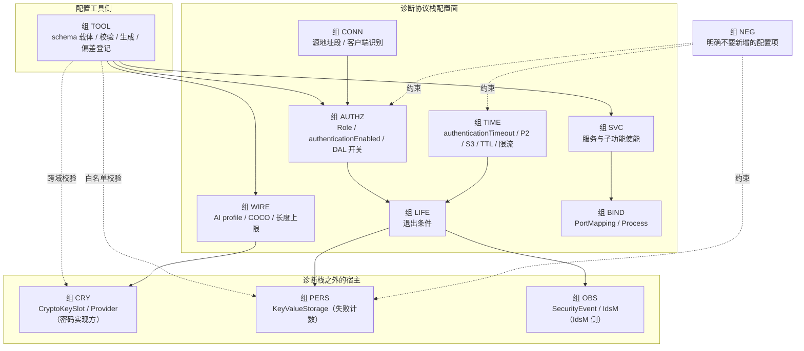

# 新增 0x29 ACR 单向认证 — 诊断协议栈与配置工具的配置项清单

> **边界声明**：本文回答一个**工程配置问题**——若要在诊断栈上新增 `0x29` 的 **ACR 单向**（`0x05 requestChallengeForAuthentication` + `0x06 verifyProofOfOwnershipUnidirectional`）能力，**诊断协议栈需要新增哪些配置项**，以及**配置工具需要新增哪些支撑能力**。
> ACR 的 wire contract 依据 **ISO 14229-1:2020**；配置元类与约束依据 **AUTOSAR R25-11**（AP SWS Diagnostics / CP TPS DEXT / AP TPS Manifest）。
> **AUTOSAR AP R25-11 明确不包含 ACR**（[SWS_DM_01226] 及其 Note、[TPS_DEXT_01159]），因此本文所有 `ACRCFG-*` 编号、schema 键名与私有配置项均为**项目工程构件**，不是 AUTOSAR 需求，也不是 `ara::diag` 标准配置。

| 文档属性 | 值 |
|---|---|
| 文档类型 | 配置项清单 / 配置工具需求输入 |
| 覆盖版本 | ISO 14229-1:2020；AUTOSAR AP SWS Diagnostics R25-11；CP TPS DiagnosticExtractTemplate R25-11；AP TPS ManifestSpecification R25-11 |
| 目标范围 | ACR 单向 `0x05`/`0x06`，及其必需的公共面 `0x00`/`0x08` |
| 视角 | **双视角**：每条同时给出「AP DM 标准落点」与「通用栈 + 自研配置工具的工程 schema 键」 |
| 配置项前缀 | `ACRCFG-<组>-nn`（12 组） |
| 编写日期 | 2026-08-28 |
| 前置阅读 | [ACR 增量模块分解](./UDS_0x29_ACR_Unidirectional_Incremental_Module_Breakdown.md)（模块 `Mxx` 与需求 `ACRI-*`）、[ACR 配置与 API 缺口](./AUTOSAR_AP_DM_R25_UDS_0x29_ACR_Config_API_Gap.md)（30 项 `GAP-*` 与 12 项 `PD-*`） |

---

## 目录

- [0. 执行摘要](#0-执行摘要)
- [1. 范围、证据规则与来源](#1-范围证据规则与来源)
- [2. 配置分层总览与 12 组速查](#2-配置分层总览与-12-组速查)
- [3. 组 SVC — 服务与子功能使能](#3-组-svc--服务与子功能使能)
- [4. 组 AUTHZ — 授权模型](#4-组-authz--授权模型)
- [5. 组 TIME — 时序与并发](#5-组-time--时序与并发)
- [6. 组 WIRE — 报文参数与长度上限](#6-组-wire--报文参数与长度上限)
- [7. 组 CRY — 密码与密钥](#7-组-cry--密码与密钥)
- [8. 组 PERS — 持久化](#8-组-pers--持久化)
- [9. 组 CONN — 客户端识别与连接](#9-组-conn--客户端识别与连接)
- [10. 组 LIFE — 生命周期退出](#10-组-life--生命周期退出)
- [11. 组 OBS — 安全事件与审计](#11-组-obs--安全事件与审计)
- [12. 组 BIND — 端口与部署绑定](#12-组-bind--端口与部署绑定)
- [13. 组 TOOL — 配置工具需新增的能力](#13-组-tool--配置工具需新增的能力)
- [14. 组 NEG — 明确不要新增的配置项](#14-组-neg--明确不要新增的配置项)
- [15. 最小诊断栈配置面变体](#15-最小诊断栈配置面变体)
- [16. 配置期校验规则总表](#16-配置期校验规则总表)
- [17. 与既有需求与缺口的映射](#17-与既有需求与缺口的映射)
- [18. 方法局限与交叉链接](#18-方法局限与交叉链接)

---

## 0. 执行摘要

### 0.1 结论先行

1. **配置面远大于"0x29 服务开关 + 角色 + 定时器"**。本文拆出 **12 组、95 条配置项**，其中已被普遍认知的四类（0x29 服务配置、Role 角色、`authenticationEnabled` 七层支持、0x29 定时器）对应约 15 条，**不到总量的两成**。
2. **最容易漏的四条**（详见各组"易漏"标注）：
   - `p2ServerMax` / `p2StarServerMax` 在 **`DiagnosticSession`** 而不是 `DiagnosticCommonProps`，ACR 的密码运算耗时长，不重估会直接 P2 超时（`ACRCFG-TIME-03`）。
   - `authenticationEnabled` 有**两个宿主**，第二个是 `DiagnosticMemoryDestinationUserDefined.authenticationEnabled`，不经过 `accessPermission`（`ACRCFG-AUTHZ-04`）。
   - **两套源地址段必须对齐**：`DiagnosticExternalAuthenticationIdentification` 决定认证状态粒度，`GenericTpConnection` 决定 Conversation 粒度，不一致会造成认证状态被跨客户端共享（`ACRCFG-CONN-03`）。
   - 报文长度上限：DM 侧**没有**通用 UDS 缓冲配置属性，唯一标准旋钮是 `DoIpFunctionalClusterDesign.maxRequestBytes`（`ACRCFG-WIRE-08`）。
3. **持久化面存在两条强制"不许存"的规范要求**，比"该存什么"更重要。R25 对 0x29 认证数据**没有任何持久化要求**，反而通过 [SWS_DM_01205]（启动为 `kDeAuthenticated`）与 [SWS_DM_01214]（DAL 启动为空）强制易失。而 [SWS_DM_01574]（graceful shutdown 持久化"所有相关数据"）容易被误用来一并存认证态。详见 [§8](#8-组-pers--持久化)。
4. **组 CRY 与组 OBS 可以大幅外移或裁掉，但各有不可裁项**。SWS 的 Functional Cluster 接口表对 Cryptography 用 `may be used`、对 Log and Trace 用 `shall use`，这个措辞差异就是裁剪依据。密码学外移后仍须在诊断栈侧保留三项协议契约；IdsM 上报可整块不做（登记偏差），但审计与脱敏不可裁。
5. **"外移"不等于"变简单"**。密码学配置移出诊断栈后，元类数量减少，但新增一条跨工具一致性校验（AI profile ↔ keyslot/算法）。配置工具的校验规则总数不降。
6. **形态 B（AP DM）下大部分 ACR 专属配置项没有标准落点**，必须走私有载体（`Sdg`/`adminData`/独立配置文件），标准 ARXML 工具不可校验（`GAP-TOOL-01`），因此组 TOOL 的自建 linter 不是可选项。

### 0.2 与已被普遍认知的四类的关系

| 已知类别 | 在本文的位置 | 本文补充了什么 |
|---|---|---|
| 0x29 服务配置 | 组 SVC | `0x08` 的 RV 取值规则、SPRMIB 策略、寻址策略、`DiagnosticServiceTable` 挂载 |
| Role 角色配置 | 组 AUTHZ `ACRCFG-AUTHZ-01/02` | `bitPosition` 与 OEM 位域矩阵的关系、令牌 rights/roles → 本地 Role 的映射表 |
| `authenticationEnabled` 七层支持 | 组 AUTHZ `ACRCFG-AUTHZ-03/04` | 第二宿主 `DiagnosticMemoryDestinationUserDefined`、`constr_10038` 的配置期负例 |
| 0x29 定时器配置 | 组 TIME `ACRCFG-TIME-01` | 相邻的会话 P2/P2\*、`0x78` 上限、S3、challenge TTL、限流窗口、并发上限 |

其余 8 组（WIRE / CRY / PERS / CONN / LIFE / OBS / BIND / TOOL）与负面清单（NEG）是本文的主要增量。

### 0.3 配置项分布

| 组 | 名称 | 条数 | 其中 `AUTOSAR-NORM` | 其中 `GAP` | 其中 `PROJECT-DECISION` |
|---|---|:--:|:--:|:--:|:--:|
| SVC | 服务与子功能使能 | 8 | 4 | 2 | 2 |
| AUTHZ | 授权模型 | 9 | 6 | 1 | 2 |
| TIME | 时序与并发 | 9 | 5 | 0 | 4 |
| WIRE | 报文参数与长度上限 | 9 | 1 | 4 | 4 |
| CRY | 密码与密钥 | 8 | 4 | 0 | 4 |
| PERS | 持久化（A 禁止 5 + B 应存 6） | 11 | 7 | 0 | 4 |
| CONN | 客户端识别与连接 | 6 | 5 | 0 | 1 |
| LIFE | 生命周期退出 | 6 | 2 | 1 | 3 |
| OBS | 安全事件与审计 | 8 | 4 | 2 | 2 |
| BIND | 端口与部署绑定 | 6 | 4 | 2 | 0 |
| TOOL | 配置工具能力 | 9 | 0 | 3 | 6 |
| NEG | 明确不要新增 | 6 | 6 | 0 | 0 |
| | **合计** | **95** | **48** | **15** | **32** |

**读法**：48 条有 AUTOSAR 标准落点（但其中不少是"标准规定恰好把 ACR 挡在门外"的构成约束，例如 `constr_10091` 与 `constr_10038`）；15 条标准无落点、必须私有承载；32 条是标准留白、必须项目冻结才能填值。

---

## 1. 范围、证据规则与来源

### 1.1 在范围内

- ACR 单向所需的、**落在配置面**的一切：DEXT / AP Manifest 元类与属性、私有 schema 键、配置期校验规则。
- 配置项的**宿主归属**（诊断栈 / 密码实现方 / IdsM 侧 / 项目私有）与**可裁剪性**。
- **配置工具**需要新增的编辑、校验、生成与偏差登记能力。

### 1.2 不在范围内

- ACR 的行为需求与验收测试（见 [ACR 单向实现 Spec](./AUTOSAR_AP_DM_R25_UDS_0x29_ACR_Unidirectional_Spec.md) 的 `ACR29-*` Catalog 与 50 项测试）。
- 模块划分与实现需求（见 [增量模块分解](./UDS_0x29_ACR_Unidirectional_Incremental_Module_Breakdown.md) 的 16 模块 / 99 条 `ACRI-*`）。
- ACR 为何在 AUTOSAR 无落点的证据链（见 [配置与 API 缺口](./AUTOSAR_AP_DM_R25_UDS_0x29_ACR_Config_API_Gap.md) §2 与 §5）。
- APCE 六子功能的配置清单（见 [0x29 DEXT 与 Manifest 配置项清单](./AUTOSAR_AP_DM_R25_0x29_DEXT_Manifest_Config.md)）。
- 认证状态管理机制与 `ara::diag` C++ 约束（见 [认证状态管理与 API 约束参考](./AUTOSAR_AP_DM_R25_Authentication_State_and_API_Reference.md)）。
- ACR 双向 `0x07`；密码算法选型；PKI / 密钥管理系统设计。

### 1.3 状态标签与列结构

每条配置项统一使用下列列：

| 列 | 含义 |
|---|---|
| ID | `ACRCFG-<组>-nn` |
| 配置项 | 要配什么 |
| 值域 / 类型 | 取值范围或数据类型 |
| AP DM 标准落点 | 元类·属性 + `[SWS_DM_*]` / `[TPS_*]` / `[constr_*]`；无落点写"无" |
| 通用栈 schema 键 | 形态 A 下自研配置工具的建议键名（**项目工程构件**） |
| 状态 | 见下表 |
| 关联 | 模块 `Mxx` / 需求 `ACRI-*` / 缺口 `GAP-*` / 决策 `PD-*` |

| 状态标签 | 含义 |
|---|---|
| `AUTOSAR-NORM` | AUTOSAR R25-11 有标准元类/属性可直接配置（含"标准有规定但恰好排除 ACR"的构成约束） |
| `GAP` | ISO 或工程需要该配置，AUTOSAR R25-11 无标准落点，必须私有承载 |
| `PROJECT-DECISION` | 标准留白，值必须由项目冻结后才能填 |

### 1.4 证据规则

1. 结论以官方 PDF 为权威；Markdown 仅作检索与摘录载体。
2. 元类名、属性名、约束 ID 均定位到**属性表或 ⌈⌋ 约束体**，不接受只在变更历史表命中。
3. 否定性结论（"无此配置项"）必须有**正向排除**（规范明文）或**结构性排除**（枚举穷尽 / 属性表穷尽 / 三份文档零命中）支撑。
4. 不因 MinerU 表格噪声断言"属性不存在"（噪声登记见 [§18.1](#181-方法局限)）。

### 1.5 源文件

| 角色 | 权威 PDF | 检索用 Markdown |
|---|---|---|
| AP DM 规范 | [`autosar/dm/autosar/AUTOSAR_AP_SWS_Diagnostics_R25-11.pdf`](../../autosar/AUTOSAR_AP_SWS_Diagnostics_R25-11.pdf) | `autosar/dm/markdown/AUTOSAR_AP_SWS_Diagnostics_R25-11/` |
| DEXT 元模型 | [`autosar/dm/autosar/AUTOSAR_CP_TPS_DiagnosticExtractTemplate_R25-11.pdf`](../../autosar/AUTOSAR_CP_TPS_DiagnosticExtractTemplate_R25-11.pdf) | `autosar/dm/markdown/AUTOSAR_CP_TPS_DiagnosticExtractTemplate_R25-11/` |
| AP Manifest | [`autosar/dm/autosar/AUTOSAR_AP_TPS_ManifestSpecification_R25-11.pdf`](../../autosar/AUTOSAR_AP_TPS_ManifestSpecification_R25-11.pdf) | `autosar/dm/markdown/AUTOSAR_AP_TPS_ManifestSpecification_R25-11/` |
| UDS 原文 | [`autosar/dm/iso/ISO 14229-1-2020.pdf`](../../iso/ISO%2014229-1-2020.pdf) | [ISO 0x29 全量中文译本](./ISO_14229-1_2020_UDS_0x29_Translation_Full_Spec.md) |

---

## 2. 配置分层总览与 12 组速查

### 2.1 分层视图

### 2.2 12 组速查

| 组 | 关注点 | 主要宿主 | 可裁剪性 |
|---|---|---|---|
| **SVC** | 支持哪些子功能、怎么被路由到 | 诊断栈 | 不可裁 |
| **AUTHZ** | 谁能访问什么资源 | 诊断栈（DEXT） | 不可裁（细粒度令牌映射条件可裁） |
| **TIME** | 各类超时与限流 | 诊断栈 | 不可裁 |
| **WIRE** | 报文参数取值域与上限 | 诊断栈（多为私有） | 不可裁 |
| **CRY** | 密钥与算法 | **密码实现方进程 / HSM** | 元类可整块外移，保留三项契约 |
| **PERS** | 什么必须存、什么禁止存 | 诊断栈 + 密码侧 + IdsM 侧 | A 表不可裁；B 表部分条件可裁 |
| **CONN** | 客户端标识与隔离粒度 | 诊断栈 + 网络配置 | 不可裁 |
| **LIFE** | 认证态怎么退出 | 诊断栈 | 里程退出可裁 |
| **OBS** | 安全事件与审计 | **IdsM 侧 + 诊断栈** | IdsM 上报可整块裁；审计不可裁 |
| **BIND** | 端口与进程绑定 | 诊断栈（AP Manifest） | 不可裁 |
| **TOOL** | 工具自身能力 | 配置工具 | 不可裁 |
| **NEG** | 防止误增配置项 | — | — |

---

## 3. 组 SVC — 服务与子功能使能

**关注点**：让 `0x29` 及其 ACR 子功能被诊断栈识别、路由、并在未启用时安全拒绝。

| ID | 配置项 | 值域 / 类型 | AP DM 标准落点 | 通用栈 schema 键 | 状态 | 关联 |
|---|---|---|---|---|---|---|
| **ACRCFG-SVC-01** | 支持的 ACR 子功能集合 | `{0x05, 0x06}`（单向）；可选 `0x07` | **无落点**：`DiagnosticAuthentication` 六子类穷尽且均为 APCE（[TPS_DEXT_01158]、[TPS_DEXT_01159]） | `acr.subfunction.enabled[]` | `GAP` | M01、`GAP-DEXT-01/02`、`PD-01` |
| **ACRCFG-SVC-02** | `0x29` 服务实例挂载到服务表 | 引用 | `DiagnosticServiceTable.diagnosticServiceInstance` → `DiagnosticAuthentication` 子类实例；`DiagnosticServiceInstance.accessPermission`（[TPS_DEXT_01006]） | `uds.serviceTable[0x29]` | `AUTOSAR-NORM` | M01、`ACRI-M01-01` |
| **ACRCFG-SVC-03** | 占位 APCE 子功能组合 | DeAuth + PoO + AuthConfig + (VCU\|VCB) | `[constr_10091]`（Imposition time 含 **AP: IT_DiagDes**）+ [SWS_DM_01227]/[SWS_DM_01228] | `apce.placeholder.profile` | `AUTOSAR-NORM`（构成约束） | `GAP-DEXT-03`、`GAP-DM-04`、`PD-07` |
| **ACRCFG-SVC-04** | `0x08 authenticationConfiguration` 的应答 RV | `0x02` APCE / `0x03` ACR 非对称 / `0x04` ACR 对称（ISO Annex B.5） | **冲突**：[SWS_DM_01246] 把 RV **硬编码为 `0x02`**，无配置项 | `acr.authConfig.returnValue` | `GAP` | M01/M13、`GAP-DEXT-08`、`GAP-DM-02`、`PD-08` |
| **ACRCFG-SVC-05** | SPRMIB 策略（`0x29` 是否允许抑制肯定响应） | `allow` / `deny` per SF | 无专用属性；行为由 ISO 通用矩阵决定 | `acr.suppressPosRsp.policy` | `PROJECT-DECISION` | `ACRI-M01-03` |
| **ACRCFG-SVC-06** | 寻址策略与诊断地址 | 物理 / 功能；逻辑地址值 | `SoftwareClusterUdsDiagnosticAddress.diagnosticAddress` + `addressSemantics`（[TPS_MANI_01434]、[TPS_MANI_01405]、`[constr_10487]` 每个 `DiagnosticCommonProps` 最多一个 physical）；`DoIpFunctionalClusterDesign.requestConfigurationDesign` | `uds.addressing.acr` | `AUTOSAR-NORM`（元类） 策略取值为 `PROJECT-DECISION` | `ACRI-M01-05`、`PD-A10` |
| **ACRCFG-SVC-07** | 基线否定行为（ACR 未启用时 `29 05` → `7F 29 12`） | 布尔（回归护栏） | [SWS_DM_00100] 子功能级检查 → NRC `0x12`（**规范要求的默认行为**） | `acr.baseline.rejectUnknownSf` | `AUTOSAR-NORM` | `ACRI-M01-06`、`ACRI-M16-01`、`GAP-DM-01` |
| **ACRCFG-SVC-08** | ACR 特性总开关与运行时禁用路径 | `enabled` / `disabled` | 无（供应商 DM 扩展点） | `acr.feature.enabled` | `PROJECT-DECISION` | M01、`GAP-DM-01`、`PD-A12` |

**易漏**：`ACRCFG-SVC-03` 不是"可选的额外配置"。`constr_10091` 的 imposition time 显式包含 AP，只要启用 `0x29` 就必须配一整套 APCE，因此**不存在"只配 ACR"的合法 DEXT**。占位 APCE 的运行时可达性必须冻结，否则 `29 01`/`29 02`/`29 03` 会成为绕过 ACR 的认证后门。

---

## 4. 组 AUTHZ — 授权模型

**关注点**：认证成功之后"谁能访问什么"。这一组是 ACR 可复用 AUTOSAR 标准配置最充分的一组（缺口文档 §4.1/§4.2 的 `C14` 判为 `AUTOSAR-NORM` ✅）。

| ID | 配置项 | 值域 / 类型 | AP DM 标准落点 | 通用栈 schema 键 | 状态 | 关联 |
|---|---|---|---|---|---|---|
| **ACRCFG-AUTHZ-01** | Role 目录 | `shortName` 集合 | `DiagnosticAuthRole`（[TPS_DEXT_01154]）；`shortName` 即应用 `ClientAuthentication::Authenticate()` 传入的 Role 字符串 | `authz.roles[]` | `AUTOSAR-NORM` | M09、`ACRI-M09-01` |
| **ACRCFG-AUTHZ-02** | 默认角色与位域位置 | `isDefault: Boolean`；`bitPosition: Integer` | `DiagnosticAuthRole.isDefault`（[SWS_DM_01204]：`kDeAuthenticated` 时的默认 Role）；`bitPosition`（贡献于 OEM roles-and-rights 位域矩阵，非 AP API 强制字段） | `authz.roles[].isDefault` / `.bitPosition` | `AUTOSAR-NORM` | `ACRI-M09-02`、[SWS_DM_01205] |
| **ACRCFG-AUTHZ-03** | `authenticationEnabled` 七层挂载 | 每资源 0..1 Proxy | `DiagnosticAccessPermission.authenticationEnabled` → `DiagnosticAuthRoleProxy.authenticationRole`；三态语义 [TPS_DEXT_01188]–[TPS_DEXT_01191]；判定粒度七层清单 [SWS_DM_01223]，未配则跳过 [SWS_DM_01739] | `authz.gate[<resource>].requireAuth` | `AUTOSAR-NORM` | `ACRI-M09-03`、[认证状态参考 §4.4](./AUTOSAR_AP_DM_R25_Authentication_State_and_API_Reference.md) |
| **ACRCFG-AUTHZ-04** | **第二宿主**：用户自定义故障内存的认证门 | 0..1 Proxy | `DiagnosticMemoryDestinationUserDefined.authenticationEnabled`（**不经过** `accessPermission`）；`DiagnosticAuthRoleProxy` 的 Aggregated-by 仅此两处 | `authz.gate.memoryDestination[<id>]` | `AUTOSAR-NORM` | M09；**易漏项** |
| **ACRCFG-AUTHZ-05** | DAL 检查启用（Proxy 存在但不指定 Role） | 布尔（由 Proxy 形态隐式表达） | [TPS_DEXT_01190]：`authenticationEnabled` 存在但无 `authenticationRole` → 对照**当前动态访问列表**检查；[SWS_DM_01224] 字节前缀匹配 | `authz.gate[<resource>].useDynamicList` | `AUTOSAR-NORM` | `ACRI-M09-04/05` |
| **ACRCFG-AUTHZ-06** | 正交门（与认证门并存） | 会话集合 / 安全等级集合 / 环境条件 / SOVD 锁 | `DiagnosticAccessPermission` 的 `diagnosticSession`（[SWS_DM_00101]）、`securityLevel`（[SWS_DM_00103]）、`environmentalCondition`（`DiagnosticEnvironmentalCondition` + `DiagnosticEnvModeElement`，[SWS_DM_00289]）、`sovdLock`（**仅 AP**） | `authz.gate[<resource>].session/securityLevel/envCondition` | `AUTOSAR-NORM` | `ACRI-M09-06`；NRC 顺序见 Breakdown §5.3 |
| **ACRCFG-AUTHZ-07** | 令牌 rights/roles → 本地 Role 的映射表 | 映射表（默认拒绝） | **无落点**：ISO §10.6.3 步骤 (5) 的令牌内容格式不由 AUTOSAR 建模 | `acr.token.roleMapping[]` | `GAP` | M06/M09、`ACRI-M09-07`、`PD-A04` |
| **ACRCFG-AUTHZ-08** | `OverrideDefaultRoles` 的默认 timeout 来源 | `TimeValue` | 无配置属性；值由应用在 [SWS_DM_01209] 调用时传入，[SWS_DM_01217] `Refresh` 刷新，[SWS_DM_01570] 重新 `Authenticate()` 即复位 | `authz.overrideDefaultRoles.timeout` | `PROJECT-DECISION` | M09/M10 |
| **ACRCFG-AUTHZ-09** | 空角色集 / 未知角色的判定策略 | `deny`（推荐）/ `allow` | 规范未明示"Proxy 存在但 Role 引用为空"的 allow/deny | `authz.unknownRole.policy` | `PROJECT-DECISION` | `ACRI-M09-07`、APCE Spec `PD29-14` |

**易漏**：`ACRCFG-AUTHZ-04` 是最常被漏掉的一条。工具若只在 `DiagnosticAccessPermission` 上提供 `authenticationEnabled` 编辑入口，用户自定义故障内存的认证门就永远配不上。

**与 DAL 的边界**：本组只能配"是否启用 DAL 检查"，**不能配 DAL 内容**——原因见 [组 NEG](#14-组-neg--明确不要新增的配置项) 与 [认证状态参考 §5.3](./AUTOSAR_AP_DM_R25_Authentication_State_and_API_Reference.md)。

---

## 5. 组 TIME — 时序与并发

**关注点**：ACR 的密码运算与两步握手把时序压力显著推高，这一组的多数项是**既有配置需要重估**，而不是新增属性。

| ID | 配置项 | 值域 / 类型 | AP DM 标准落点 | 通用栈 schema 键 | 状态 | 关联 |
|---|---|---|---|---|---|---|
| **ACRCFG-TIME-01** | 认证态 inactivity 超时 | `TimeValue`（秒） | `DiagnosticCommonProps.authenticationTimeout`；**强制存在**：DEXT `[constr_10665]`（⌈If the `DiagnosticContributionSet` that aggregates a `DiagnosticCommonProps` also references a `DiagnosticAuthentication` in the role element, then attribute `DiagnosticCommonProps.authenticationTimeout` shall exist.⌋，CP+AP IT_DiagDes）/ Manifest `[constr_10663]`（有 Auth 或 ExtAuth PortMapping 即强制）；行为 [SWS_DM_01210] | `acr.timeout.authentication` | `AUTOSAR-NORM` | M10、`ACRI-M10-02/05` |
| **ACRCFG-TIME-02** | S3 超时及其与去认证的联动 | `TimeValue`，`[constr_10440]` 规定 **≥ 5.0 s** | `DiagnosticSessionControlClass.s3ServerTimeout`；未配置时默认 5000 ms（[SWS_DM_01747]、[SWS_DM_00380]）；S3 超时 → `kDeAuthenticated`（[SWS_DM_01211]） | `uds.timer.s3Server` | `AUTOSAR-NORM` | `ACRI-M10-05` |
| **ACRCFG-TIME-03** | **会话级 P2 / P2\*** | `TimeValue`（秒），按会话 | `DiagnosticSession.p2ServerMax` / `p2StarServerMax`（**不在** `DiagnosticCommonProps`）；会话切换后按目标会话切定时器（[SWS_DM_00228]）；超时发 NRC `0x78`（[SWS_DM_00368]） | `uds.timer.p2[<session>]` / `.p2Star[<session>]` | `AUTOSAR-NORM` | M12、`ACRI-M12-01`；**易漏项** |
| **ACRCFG-TIME-04** | `0x78` 挂起次数上限 | `PositiveInteger` | `DiagnosticCommonProps.maxNumberOfRequestCorrectlyReceivedResponsePending`（[SWS_DM_00369]）；达上限后发 final `0x10` | `uds.responsePending.maxCount` | `AUTOSAR-NORM` | `ACRI-M12-02` |
| **ACRCFG-TIME-05** | 第二次被拒请求的响应策略 | `Boolean` | `DiagnosticCommonProps.responseOnSecondDeclinedRequest`（[SWS_DM_00049]、[SWS_DM_00385]、[SWS_DM_00386]） | `uds.responseOnSecondDeclined` | `AUTOSAR-NORM` | M12 |
| **ACRCFG-TIME-06** | challenge TTL | `TimeValue`（单调时钟） | **无落点** | `acr.challenge.ttl` | `PROJECT-DECISION` | M04/M05、`ACRI-M04-03`、`PD-A03` |
| **ACRCFG-TIME-07** | `0x05` 限流窗口与阈值 | 窗口时长 + 允许次数 | **无落点** | `acr.rateLimit.challengeRequest` | `PROJECT-DECISION` | M11、`ACRI-M11-03` |
| **ACRCFG-TIME-08** | 失败阈值、退避曲线、锁定时长 | 阈值 + 曲线表 + 时长 | 无 ACR 落点；**不得**挪用 `DiagnosticSecurityLevel.securityDelayTime` / `securityDelayTimeOnBoot`（0x27 专用，见组 NEG） | `acr.lockout.threshold` / `.backoff[]` / `.duration` | `PROJECT-DECISION` | M11、`ACRI-M11-02`、`PD-A08` |
| **ACRCFG-TIME-09** | 并发上限 | 全局事务数 / 每客户端事务数 / 缓冲总量 | **无落点** | `acr.concurrency.maxTransactions` / `.perClient` | `PROJECT-DECISION` | M11/M12、`ACRI-M11-05`、`ACRI-M12-05` |

**易漏**：`ACRCFG-TIME-03` 是最典型的"配置在别处"陷阱。DM 侧**不存在** per-service 的 P2/P2\* 覆盖（`DiagnosticServiceInstance` 只有 `accessPermission` 与 `serviceClass`），所以 ACR 的长耗时只能靠"调整目标会话的 P2\* + 用足 `0x78` 挂起次数"来吸收。若把 ACR 放在默认会话执行，就是在用默认会话的 P2 预算做非对称验签。

**跨项耦合**：`ACRCFG-TIME-06`（challenge TTL）必须大于 `P2* × maxNumberOfRequestCorrectlyReceivedResponsePending`，否则挑战会在合法的挂起等待中过期。这条已列入 [§16 校验规则总表](#16-配置期校验规则总表)。

---

## 6. 组 WIRE — 报文参数与长度上限

**关注点**：ACR 报文携带 16 字节 `algorithmIndicator`、三处 2 字节长度前缀与变长字段，这些取值域在 AUTOSAR 侧几乎全无建模位。

| ID | 配置项 | 值域 / 类型 | AP DM 标准落点 | 通用栈 schema 键 | 状态 | 关联 |
|---|---|---|---|---|---|---|
| **ACRCFG-WIRE-01** | 允许的 `algorithmIndicator` OID 清单 | 16 字节 BER-OID 左对齐、右填 `0x00` | **无落点**（`GAP-DEXT-04`） | `acr.algorithm.allowedOid[]` | `GAP` | M03、`ACRI-M03-01/03`、`PD-A01`、`PD-03` |
| **ACRCFG-WIRE-02** | 每 OID 的算法 profile | 密码体制 / 算法参数 / 允许 keyId 集合 / 最小安全强度 / challenge 长度 / POWN 长度约束 | **无落点** | `acr.algorithm.profile[<oid>]` | `GAP` | M03/M06、`ACRI-M03-03` |
| **ACRCFG-WIRE-03** | challenge 长度 | 字节数 `> 0`，由 profile 冻结 | 无 | `acr.challenge.length` | `PROJECT-DECISION` | M05、`ACRI-M05-02` |
| **ACRCFG-WIRE-04** | `communicationConfiguration`（COCO）值域与语义 | 位定义表 + 每取值对应的 SKI 存在性 | **无 ACR 侧建模**（`GAP-DEXT-05`）；APCE 路径的 COCO 入参绑定 `0x01`/`0x02` 语义 | `acr.coco.bitmap[]` | `GAP` | M02/M08、`ACRI-M08-01`、`PD-04` |
| **ACRCFG-WIRE-05** | 是否使用 `additionalParameter` 及格式 | `unused`（则 `LONAP`/`LOAP` 恒 `0x0000`）/ 格式定义 | **无建模**（`GAP-DEXT-06`） | `acr.additionalParameter.mode` | `GAP` | M02/M04、`ACRI-M02-05`、`PD-05`、`PD-A06` |
| **ACRCFG-WIRE-06** | POWNCL / CHCL / AP 的长度上限 | 每字段字节上限 | 无（DM 无通用 UDS 缓冲属性） | `acr.limit.pownMaxBytes` / `.challengeClientMaxBytes` / `.additionalParamMaxBytes` | `PROJECT-DECISION` | M02、`ACRI-M02-06` |
| **ACRCFG-WIRE-07** | `sessionKeyInfo`（SKI）格式与长度 | 格式定义 + 上限 | 无 ACR 侧建模；APCE 侧 SKI 由 [SWS_DM_01243] 从 `VerifyOwnership` 返回值派生 | `acr.sessionKey.info.format` | `PROJECT-DECISION` | M08、`GAP-API-05`、`PD-04` |
| **ACRCFG-WIRE-08** | 请求字节上限（唯一标准长度旋钮） | `PositiveInteger`，`[constr_3497]` 值域 `[0..4294967295]` | `DoIpFunctionalClusterDesign.maxRequestBytes`（不含 DoIP header）；`[constr_10189]` **必须存在**；`entityStatusMaxByteFieldUse == TRUE` 时填入 entity status 的 Max data size（[SWS_DM_02002]） | `transport.doip.maxRequestBytes` | `AUTOSAR-NORM` | M02；**易漏项** |
| **ACRCFG-WIRE-09** | 未知 / 非法 AI 的拒绝 NRC | `0x31` 或 `0x22`（二选一并全局一致） | 无 | `acr.algorithm.rejectNrc` | `PROJECT-DECISION` | M03/M13、`ACRI-M03-04`、`PD-A07` |

**易漏**：`ACRCFG-WIRE-08` 常被当成"网络配置、与诊断无关"。但 ACR 的 `0x06` 请求总长为 **24 + m + n + o** 字节（POWNCL + CHCL + AP 三段变长，ISO Table 71），非对称令牌可能达数百字节到数 KB；`maxRequestBytes` 配小了会在 DoIP 层就被截断，症状看起来像"密码验证失败"，排查成本很高。这条与 `ACRCFG-WIRE-06` 的一致性校验已列入 §16。

**RV 是新概念**：`ACRCFG-SVC-04` 之外，`0x05` 正响应的 RV 为 `0x00`、`0x06` 完成为 `0x12`、`0x00` 去认证成功为 `0x10`（ISO Annex B.5）。这些是**协议常量而非配置项**，但既有栈的"正响应 = 回显 SF + 数据"组装模型需要一个 RV 槽位扩展点（`ACRI-M02-07`）。

---

## 7. 组 CRY — 密码与密钥

**关注点**：ACR 的 POWN 验证需要密钥与算法能力。这一组的元类**全部在 AP Manifest**，DEXT 侧没有对应配置章。

| ID | 配置项 | 值域 / 类型 | AP DM 标准落点 | 通用栈 schema 键 | 状态 | 关联 |
|---|---|---|---|---|---|---|
| **ACRCFG-CRY-01** | 密码栈实例与 Provider | 引用链 | `CryptoModuleInstantiation`（[TPS_MANI_03260]，属性 `cryptoCertificate` / `cryptoCertificateGroup` / `cryptoProvider`）→ `CryptoProvider`（[TPS_MANI_03261]，聚合 `keySlot`） | `crypto.provider[]` | `AUTOSAR-NORM` | M07 |
| **ACRCFG-CRY-02** | 密钥槽定义 | 槽容量、算法 ID | `CryptoKeySlot`（[TPS_MANI_03263]，Machine Manifest）：`cryptoAlgId`、`slotCapacity`；另有较新的 `CryptoAlgorithmDescription.cryptoAlgorithmId`（`[constr_10690]`） | `crypto.keySlot[<id>]` | `AUTOSAR-NORM` | M07、`ACRI-M07-01` |
| **ACRCFG-CRY-03** | 槽的允许用途与可修改性 | 用途枚举 + 更新次数限制 | `CryptoKeySlotContentAllowedUsage.allowedKeyslotUsage`（`[constr_5239]`，预定义值含 `ALLOW-SIGNATURE-VERIFICATION`、`ALLOW-DATA-ENCRYPTION`、`ALLOW-KEY-AGREEMENT` 等）；`keySlotAllowedModification` → `CryptoKeySlotAllowedModification`（`maxNumberOfAllowedUpdates`、`restrictUpdate`，`[constr_5238]`） | `crypto.keySlot[<id>].allowedUsage` / `.modification` | `AUTOSAR-NORM` | `ACRI-M07-03` |
| **ACRCFG-CRY-04** | 密钥槽与 Provider 的端口映射 | iref | `CryptoKeySlotToPortPrototypeMapping`（[TPS_MANI_03264]、`[constr_5241]`，基类 `AbstractCryptoKeySlotToPortPrototypeMapping`）；`CryptoProviderToPortPrototypeMapping`（[TPS_MANI_03262]、`[constr_10207]`/`[constr_10208]`/`[constr_5240]`，只能映射到 `CryptoProviderInterface` 类型的 RPort）；接口类型 `CryptoKeySlotInterface` | `crypto.binding[]` | `AUTOSAR-NORM` | M07 |
| **ACRCFG-CRY-05** | 开发期密钥与量产禁用 | 开发期密钥值 + 构建期检查 | `CryptoServiceKey`（`algorithmFamily`、`developmentValue`、`keyGeneration`、`keyStorageType`、`length`）+ `ComKeyToCryptoKeySlotMapping` | `crypto.devKey[]`（量产构建必须为空） | `PROJECT-DECISION` | `ACRI-M07-05` |
| **ACRCFG-CRY-06** | keyId → 密钥槽的解析规则 | 映射表 | 无（是诊断栈与密码侧的接口契约，不是 Crypto 元类属性） | `acr.key.resolution[]` | `PROJECT-DECISION` | M03/M07、`ACRI-M07-01`、`PD-A01` |
| **ACRCFG-CRY-07** | POWN 输入的字节级 canonicalization | 拼接顺序 / 编码 / 分隔 / 长度前缀 + golden vector | 无 | `acr.pown.canonicalization` | `PROJECT-DECISION` | M06、`ACRI-M06-03`、`PD-A02` |
| **ACRCFG-CRY-08** | 密钥注入、轮换、吊销流程 | 流程定义 + 失效后的诊断行为 | 无（涉及产线与售后） | `acr.key.lifecycle` | `PROJECT-DECISION` | `ACRI-M07-03/04`、`PD-A11`、`GAP-CRY-02` |

### 7.1 裁剪说明：密码学不在诊断栈实现时

SWS 的 Functional Cluster 接口表对 Cryptography 的措辞是：

> Cryptography / CryptoStack / `This interface **may** be used e.g., to access keys for secure diagnostics.`

**`may`，不是 `shall`**——DM 对密码栈的依赖本身就是可选的。APCE 的架构决策同样是"报文与状态在 DM，密码学在应用/HSM，DM 不解析证书内容"（[SWS_DM_01230]/[SWS_DM_01240] 的回调模型，见 Breakdown §2.2 第 1 条）。因此"密码学不在诊断栈实现"是**推荐做法**，不是妥协。

配置项据此分三类：

| 类别 | 项 | 处理 |
|---|---|---|
| **可整块移出诊断栈配置面** | `ACRCFG-CRY-01` ～ `CRY-05` | 归属**实际持有密钥的那个进程**的 Machine / Executable Manifest（应用进程或 HSM 代理进程）。若项目使用厂商 HSM SDK 的私有配置，AP Crypto 这套元类可以完全不用 |
| **必须留在诊断栈侧**（协议契约，不是密码实现细节） | `ACRCFG-WIRE-02` 的"允许 keyId 集合"、`ACRCFG-CRY-06`、`ACRCFG-CRY-07`、`ACRCFG-SVC-04` | ① 诊断栈要在**调用密码层之前**据 profile 拒绝非法 OID/keyId 组合（`ACRI-M03-03`）；② canonicalization 决定诊断栈把哪些字段按什么顺序与长度前缀交给密码层，密码学在别处实现时**更**需要字节级冻结；③ `0x08` 的 RV 是诊断栈的报文输出，取值必须等于密码侧真实能力 |
| **新增的负担** | 跨工具一致性校验 | AI profile 在诊断工具里配、keyslot 与算法在 Crypto 工具里配，两套配置需要一个跨域校验点（见 §16 规则 `V-X01`） |

> **反直觉结论**：外移减少的是**元类数量**，不减少**校验规则数量**，反而多出一条跨工具校验。把密码学外移当成"配置工作量减半"是错误预期。

---

## 8. 组 PERS — 持久化

**核心事实**：AUTOSAR R25-11 对 `0x29` 认证数据**没有任何持久化要求**，反而有两条要求强制其易失。对比参照：`0x2C` 的 DDDID 有显式持久化开关 `DiagnosticDynamicallyDefineDataIdentifierClass.configurationHandling = nonVolatile`（[SWS_DM_01071] / [SWS_DM_01072]），`0x27` 有明文持久化需求（[SWS_DM_00478]）——**0x29 侧完全没有对等属性，属于有意留白，不是遗漏。**

### 8.1 PERS-A — 禁止持久化清单

| ID | 数据 | 依据 | 状态 | 关联 |
|---|---|---|---|---|
| **ACRCFG-PERS-A01** | 认证状态（`kAuthenticated` / `kDeAuthenticated`） | [SWS_DM_01205]：⌈On startup, the default Authentication state for a client shall be 'kDeAuthenticated'.⌋ | `AUTOSAR-NORM` | M09、`ACRI-M09-01` |
| **ACRCFG-PERS-A02** | DynamicAccessList 条目 | [SWS_DM_01214] Default DynamicAccessList：启动时所有客户端的 DAL 为空 | `AUTOSAR-NORM` | `ACRI-M09-04` |
| **ACRCFG-PERS-A03** | 认证角色（Authentication Role） | [SWS_DM_01212]：状态转为 `kDeAuthenticated` 时角色置为 [SWS_DM_01204] 定义的默认角色并清空 DAL。角色的持久载体是 **DEXT 配置**，不是运行时存储 | `AUTOSAR-NORM` | `ACRI-M10-06` |
| **ACRCFG-PERS-A04** | `OverrideDefaultRoles` 的覆盖值 | [SWS_DM_01570]：重新 `Authenticate()` 进入 `kAuthenticated` 时，覆盖的默认角色复位为 `DiagnosticAuthRole.isDefault` | `AUTOSAR-NORM` | `ACRCFG-AUTHZ-08` |
| **ACRCFG-PERS-A05** | challenge / 在途事务上下文 / 会话密钥与 SKI | 规范无明文（ACR 属项目自定义），但一次性与 TTL 语义要求易失；持久化等于给重放攻击留窗口。**须在项目配置基线中显式写明禁止** | `PROJECT-DECISION` | M04/M08、`ACRI-M04-03`、`ACRI-M08-04` |

> **实现陷阱**：[SWS_DM_01574]（⌈During graceful shutdown, the Diagnostic Server instance shall persist all relevant data to be maintained over power down cycles.⌋）与 [SWS_DM_01571]（启动恢复，允许 lazy loading）容易被误读为"认证态也属于 relevant data"。[SWS_DM_01205] 优先，**必须在实现与配置两侧显式排除**。对应的可自动化校验见 §16 规则 `V-P01`。

### 8.2 PERS-B — 应持久化清单

| ID | 数据 | 值域 / 类型 | AP DM 标准落点 | 通用栈 schema 键 | 状态 | 关联 |
|---|---|---|---|---|---|---|
| **ACRCFG-PERS-B01** | 每客户端 / 通道的认证失败计数 | 计数器（按隔离键分别存） | 无 ACR 落点；**0x27 先例**：[SWS_DM_00478] ⌈shall store the number of failed attempts persistently for every security access type separately⌋，SWS 限制章节补充"After each increment of the attempt counter, it shall be persisted to survive accidental or intended resets. Selecting the persistent storage is mandatory in Adaptive Autosar." | `acr.persist.failureCounter` | `PROJECT-DECISION`（0x27 侧为 `AUTOSAR-NORM`） | M11、`ACRI-M11-01/02` |
| **ACRCFG-PERS-B02** | 锁定状态的上电处理策略 | `counterOnly + bootDelay`（**推荐**）/ `lockUntilTimestamp` | 无 ACR 落点；**0x27 先例**：[SWS_DM_00479]（恢复的计数器 ≥ `numFailedSecurityAccess` → 用 `securityDelayTimeOnBoot` 与 `securityDelayTime` 的较大值重启延时）、[SWS_DM_01758]（未越阈值 → 用 `securityDelayTimeOnBoot`）、[SWS_DM_00480]（`sharedTimer`） | `acr.persist.lockout.bootPolicy` | `PROJECT-DECISION` | M11、`ACRI-M11-02`、`PD-A08` |
| **ACRCFG-PERS-B03** | 持久化承载与掉电健壮性 | 存储类型 + 更新策略 + 冗余 + 容量 | `PersistencyKeyValueStorage`（[TPS_MANI_01079]）+ `PersistencyDeployment`（[TPS_MANI_01380]：`deploymentUri`、`maximumAllowedSize`、`minimumSustainedSize`、`redundancyHandling`、`updateStrategy`、`version`）；`updateStrategy` 取 `keepExisting` 以在软件更新后保留计数器（[TPS_MANI_01139]/[TPS_MANI_01140]/[TPS_MANI_01147]/[TPS_MANI_01155]）；`redundancyHandling` 子类 `PersistencyRedundancyChecksum` / `Crc` / `Hash` / `MOutOfN`（[TPS_MANI_01319]/[TPS_MANI_01320]） | `acr.persist.storage` | `AUTOSAR-NORM` | M11 |
| **ACRCFG-PERS-B04** | 密钥与凭据的持久化 | 密钥槽 + 撤销信息 + 密钥版本 | **不走 Persistency**：`CryptoKeySlot` / HSM；连接点是 `PersistencyDeploymentToCryptoKeySlotMapping` | `crypto.keySlot[*]`（见组 CRY） | `AUTOSAR-NORM` | `ACRI-M07-02`；写入 KVS 属设计错误 |
| **ACRCFG-PERS-B05** | 防回滚单调计数器 / nonce 高水位 | 单调计数器或已用 nonce 水位 | 无 | `acr.persist.antiRollbackCounter` | `PROJECT-DECISION`（**条件性**：仅当令牌格式带序号或时间戳） | M06、`ACRI-M06-04`、`PD-A02`、`PD-A09` |
| **ACRCFG-PERS-B06** | 安全事件的持久化 | `Boolean` per 事件 | `SecurityEventContextProps.persistentStorage`（DEXT）：⌈controls whether **qualified reportings** of the referenced security event shall be stored persistently by the mapped `IdsmInstance`⌋——**执行方是 IdsM，不是 DM** | `obs.securityEvent[<id>].persist` | `AUTOSAR-NORM` | 组 OBS、`ACRI-M14-01` |

**读法**：PERS-B 中只有 B03/B04/B06 有标准落点，且 B04 的宿主是密码侧、B06 的宿主是 IdsM 侧。**诊断栈自己真正要新增的持久化配置只有 B01/B02（失败计数与上电策略）**，外加条件性的 B05。

### 8.3 锁定上电处理：推荐方案

AUTOSAR 在 0x27 侧做过一次明确的裁剪，SWS 限制章节写明：

> The behavior of the Delay_Timer, as described in ISO 14229-1:2020 chapter 10.4.1 and table I.1, that, after a power-up, a single false SecurityAccess attempt in the previous powercycle already starts the Delay_Timer, **is not supported by the DM**. Instead, [SWS_DM_00479] is followed.

**推荐 ACR 采用同一模式**（对应 `ACRCFG-PERS-B02` 取值 `counterOnly + bootDelay`）：

| 方案 | 持久化什么 | 前提 | 评价 |
|---|---|---|---|
| **A. 只存计数器 + 上电 boot delay**（推荐） | 失败计数 | 无 | 与 [SWS_DM_00478]/[SWS_DM_00479] 同构；**不需要可信时钟**；可复用 0x27 的延时定时器实现 |
| B. 存 lock-until 绝对时间戳 | 计数器 + 绝对时刻 | **需要可信时钟**（否则可通过改时间绕过锁定） | 语义更精确，但引入时间源信任问题与时钟回拨攻击面 |

方案 A 的代价是"锁定时长在上电后重新开始计时"而非"续算剩余时间"，这与 0x27 的既有行为一致，测试设备与 OEM 规范通常已接受该语义。

---

## 9. 组 CONN — 客户端识别与连接

**关注点**：ACR 的认证状态必须按客户端隔离，而"客户端"在 AP 上由**两套地址段配置**共同决定，两者不一致会造成隔离失效。

| ID | 配置项 | 值域 / 类型 | AP DM 标准落点 | 通用栈 schema 键 | 状态 | 关联 |
|---|---|---|---|---|---|---|
| **ACRCFG-CONN-01** | 认证状态的客户端地址段 | 源地址单值或连续区间 | `DiagnosticCommonProps.externalAuthentication` → `DiagnosticExternalAuthenticationIdentification.sourceAddressRangeStart` / `sourceAddressRangeEnd`（[TPS_MANI_01435]）；**元素个数决定 `ara::diag::ClientAuthentication` 实例数**（SWS §7.3.2.3.1） | `acr.client.authIdentification[]` | `AUTOSAR-NORM` | M04/M09、`ACRI-M04-01` |
| **ACRCFG-CONN-02** | 传输层连接的地址段与优先级 | 源地址区间 + 优先级 | `GenericTpConnection.sourceAddressRangeStart` / `sourceAddressRangeEnd` / `priority`（`[constr_9334]`/`[constr_9335]`/`[constr_9338]`；行为 [SWS_DM_02108]/[SWS_DM_02109]）；由 `DoIpNetworkConfigurationDesign.tpConnection` 聚合（[TPS_MANI_03333]） | `transport.doip.tpConnection[]` | `AUTOSAR-NORM` | M04 |
| **ACRCFG-CONN-03** | **两套地址段的对齐** | 一致性要求 | 无单一约束覆盖两侧；`CONN-01` 决定认证状态粒度、`CONN-02` 决定 Conversation 粒度 | `acr.client.granularityCheck` | `AUTOSAR-NORM`（构成约束） | 见 [认证状态参考 §3.3](./AUTOSAR_AP_DM_R25_Authentication_State_and_API_Reference.md)；**易漏项** |
| **ACRCFG-CONN-04** | 客户端标识二元组（**不可配**） | `(sourceAddr, globalChannelId)` | [SWS_DM_00421]：标识元组来自 `UdsTransportProtocolMgr::IndicateMessage`（另见 [SWS_DM_00347]）；**AP 上 Client–Server 连接不静态配置**，`DiagnosticConversation` 运行时分配 | — | `AUTOSAR-NORM`（只读事实） | `ACRI-M04-01` |
| **ACRCFG-CONN-05** | DoIP 实体与网络配置 | 逻辑地址等 | `DoIpInstantiation.logicalAddress`（[TPS_MANI_03164]，用于 Vehicle Announcement 与 **Routing Activation responses**）；`DoIpNetworkConfiguration`（[TPS_MANI_03165]） | `transport.doip.entity` | `AUTOSAR-NORM` | — |
| **ACRCFG-CONN-06** | ACR 事务隔离键的构成 | 至少含服务器实例 + 协议/通道 + 源地址 | 无（实现内部键，不是元类属性） | `acr.transaction.isolationKey` | `PROJECT-DECISION` | M04、`ACRI-M04-01` |

**易漏**：`ACRCFG-CONN-03` 是一个**跨文档、无单一约束覆盖**的一致性要求，因此标准工具不会报错。若 `DiagnosticExternalAuthenticationIdentification` 配了一个宽地址段（例如 `0x0E00`–`0x0EFF`）而 `GenericTpConnection` 按更细粒度切分，则多个不同 Conversation 会共享同一个 `ClientAuthentication` 实例——**A 客户端认证成功，B 客户端直接获得权限**。这正是 ACR 必须显式拒绝"A 取挑战、B 应答"（`ACRI-M04-01`、`ACRI-M16-05`）的配置侧根因。校验规则见 §16 `V-C01`。

---

## 10. 组 LIFE — 生命周期退出

**关注点**：ISO §10.6.4 要求显式退出为强制、隐式退出至少实现一种。本组多数项是"既有栈的会话/安全状态清理逻辑必须被修改以免误清认证态"。

| ID | 配置项 | 值域 / 类型 | AP DM 标准落点 | 通用栈 schema 键 | 状态 | 关联 |
|---|---|---|---|---|---|---|
| **ACRCFG-LIFE-01** | 显式去认证 `0x29 00` | 使能 | `DiagnosticDeAuthentication` 子类实例（[SWS_DM_01228] 强制配置）；处理 [SWS_DM_01244]/[SWS_DM_01245]（RV `0x10`）→ 执行 [SWS_DM_01212] | `acr.deauthenticate.enabled` | `AUTOSAR-NORM` | M10、`ACRI-M10-01` |
| **ACRCFG-LIFE-02** | 隐式退出方式选择 | `inactivityTimeout` / `mileage` / 两者 | inactivity 侧有 `authenticationTimeout`（见 `ACRCFG-TIME-01`）；里程侧无落点 | `acr.exit.implicitMode` | `PROJECT-DECISION` | `ACRI-M10-02`、`PD-A09` |
| **ACRCFG-LIFE-03** | 里程退出参数 | 里程源 / 阈值 / 可信度要求 / 源失效 fail-safe | **无落点** | `acr.exit.mileage.source` / `.threshold` / `.failSafe` | `GAP` | `ACRI-M10-07`、`PD-A09` |
| **ACRCFG-LIFE-04** | 认证态**不随**会话切换或 `0x27` 状态变化清除 | 配置期须确认项 | ISO §10.6.4；AUTOSAR 侧仅规定 S3 超时（[SWS_DM_01211]）与 `authenticationTimeout`（[SWS_DM_01210]）两条清除路径 | `acr.exit.notOnSessionChange`（断言型开关） | `AUTOSAR-NORM` | `ACRI-M10-04`；**既有栈改造点** |
| **ACRCFG-LIFE-05** | 通道拆除 / 连接关闭的清理策略 | 立即清理 / 宽限期 | 无 | `acr.exit.onChannelTeardown` | `PROJECT-DECISION` | M04/M10、`ACRI-M12-04` |
| **ACRCFG-LIFE-06** | 退出汇聚点与原因码 | 原因码枚举 | 无 | `acr.exit.reasonCode[]` | `PROJECT-DECISION` | M10/M14、Breakdown §5.4、`ACRI-M14-02` |

**易漏**：`ACRCFG-LIFE-04` 不是一个"要填值的配置项"，而是一个**必须在配置基线中显式断言、并有回归测试兜底的行为约定**。很多既有栈把"会话回落默认 → 清除所有安全状态"写死在会话管理里，接入 ACR 后会违反 ISO §10.6.4（Breakdown §2.1 第 6 行的负向影响项）。

---

## 11. 组 OBS — 安全事件与审计

**关注点**：本组内部是两件事——IdsM 上报与本地审计——**可裁剪度相反**。

| ID | 配置项 | 值域 / 类型 | AP DM 标准落点 | 通用栈 schema 键 | 状态 | 关联 |
|---|---|---|---|---|---|---|
| **ACRCFG-OBS-01** | 安全事件定义 | 数值 ID + 符号名 + context data 定义 | `SecurityEventDefinition`：`id`（**属性名是 `id`，不是 `securityEventId`**；须在 IDS 范围内唯一）、`eventSymbolName`、`securityEventContextDataDefinition`（Manifest 与 DEXT 各有类表；`atp.Status=candidate`） | `obs.securityEvent[]` | `AUTOSAR-NORM` | M14 |
| **ACRCFG-OBS-02** | 上报端口 | 每事件一个 RPort | `SecurityEventReportInterface`（[TPS_MANI_01340]：⌈Each RPortPrototype typed by a `SecurityEventReportInterface` is able to report **exactly one** security event.⌋，DM 侧用 **RPort**） | `obs.reportPort[]` | `AUTOSAR-NORM` | `ACRI-M14-04` |
| **ACRCFG-OBS-03** | 端口到事件定义的映射 | ref | `SecurityEventReportToSecurityEventDefinitionMapping`（[TPS_MANI_01338]/[TPS_MANI_01339]，属性 `securityEventDefinition` + `reportedSecurityEvent`，均 `0..1`） | `obs.reportPortMapping[]` | `AUTOSAR-NORM` | — |
| **ACRCFG-OBS-04** | IdsM 实例与可上报事件集 | 每 Machine 一个 | `IdsmModuleInstantiation`（`[constr_10021]` 每 Machine 仅一个）`.reportableSecurityEvent` → `SecurityEventMapping`（[TPS_MANI_01341]/[TPS_MANI_01342]，`[constr_10022]` 约束 `SecurityEventMapping.process.securityEvent.id`） | `obs.idsm.instance` | `AUTOSAR-NORM` | — |
| **ACRCFG-OBS-05** | ACR 细粒度事件 | 事件清单 + 触发点 | **无标准事件**：ID 101 `SEV_UDS_AUTHENTICATION_NEEDED`（NRC `0x34`，[SWS_DM_02017]/[SWS_DM_02018]）可复用；ID 104 成功事件绑定 `0x03 proofOfOwnership`（[SWS_DM_02023]/[SWS_DM_02024]），ID 105 为 0x29 负响应通用事件（[SWS_DM_02025]/[SWS_DM_02026]）——**均不覆盖 ACR 专属原因** | `obs.acrEvent[]` | `GAP` | `GAP-SEC-01/02`、`PD-12` |
| **ACRCFG-OBS-06** | 自定义 SEV ID 区间预留 | ID 区间 | 无；须避开 AUTOSAR 已占用的 **100–133** 区间 | `obs.acrEvent.idRange` | `PROJECT-DECISION` | `PD-12`、[IdsM 调研报告](../AUTOSAR_AP_IdsM_Technical_Research.md) |
| **ACRCFG-OBS-07** | 审计记录字段集与关联 ID | 字段清单 | **无落点**（项目自定义可观测性） | `acr.audit.fields[]` | `GAP` | M14、`ACRI-M14-01/02` |
| **ACRCFG-OBS-08** | 日志脱敏级别与敏感字段清单 | 级别 + 禁止字段清单 | 无；SWS Functional Cluster 表：Log and Trace / Logger / `Diagnostic Management **shall** use this interface to log standardized messages.` | `acr.audit.redaction` | `PROJECT-DECISION` | `ACRI-M14-03` |

### 11.1 裁剪说明：IdsM 不实现或未就绪时

**上半段（`ACRCFG-OBS-01` ～ `OBS-04`、`ACRCFG-PERS-B06`）可整块不要。** 依据 [IdsM 技术调研报告](../AUTOSAR_AP_IdsM_Technical_Research.md) §4 的结论：上报是**结果已确定之后的伴随动作**（需求措辞结构为 "...which results in a negative response with NRC 0x34, the DM shall report..."），NRC 判定、放行/拒绝、响应组装全部在上报之前完成，**没有任何需求把上报结果作为服务处理的输入**；因此暂不实现不影响 DM 任何基础诊断功能。该报告还指出，若上报实现成同步阻塞，反而会占用 P2 时间预算。

两条附带条件：

1. **报告义务本身无 DRAFT 标记、正式有效**（仅事件总表 [SWS_DM_02014] 与 context data 定义为 `Status: DRAFT`）。不实现属**须登记的规范偏差**，偏差范围是"27 对 SecurityEvent 需求未满足"。
2. **法规维度可能强制**：UN R155（CSMS）与 ISO/SAE 21434 对攻击监测与响应有要求，许多 OEM 的 IDS 需求来自法规而非 AUTOSAR 规范。AUTOSAR 侧登记偏差不等于项目可免（该结论在调研报告中标为 `二手·调研`，须与 OEM 需求文档核对）。

建议保留的唯一低成本前瞻是 `ACRCFG-OBS-06`（**预留 SEV ID 区间**），避免将来接入 IdsM 时返工需求追溯。另可按调研报告的渐进策略，把"事件检测 + context data 组装"实现出来、输出后端做成可替换适配层——此时"事件定义"仍需一份配置，只是载体从 ARXML 变成项目私有。

**下半段（`ACRCFG-OBS-07`/`OBS-08`，对应 `ACRI-M14-01/02/03`）不可裁剪，且与 IdsM 无关。** 三个理由：

- ACR 成功与细粒度失败**没有标准 SEV 覆盖**（`GAP-SEC-01`/`GAP-SEC-02`），审计是唯一取证手段；
- 脱敏是防止泄露 challenge / POWN / 预共享密钥 / 会话密钥的硬要求；
- SWS 对 Log and Trace 的措辞是 **`shall use`**，与 Cryptography 的 `may be used` 形成明确对比。

---

## 12. 组 BIND — 端口与部署绑定

**关注点**：把 DM 与应用侧处理器连起来。APCE 侧机制完备，但**引用端对 ACR 为空**（`GAP-MANI-01`）。

| ID | 配置项 | 值域 / 类型 | AP DM 标准落点 | 通用栈 schema 键 | 状态 | 关联 |
|---|---|---|---|---|---|---|
| **ACRCFG-BIND-01** | 认证处理端口映射 | 三元引用 | `DiagnosticAuthenticationPortMapping`（[TPS_MANI_01361]）：`diagnosticAuthentication` + `pPortPrototypeInExecutable` + `process`；`[constr_10092]` PPort 须由 `DiagnosticAuthenticationInterface` 类型化；`[constr_10093]` 每个 `DiagnosticAuthentication` **恰一个** Mapping；`[constr_10526]` TransmitCertificate 端口与 `DiagnosticAuthTransmitCertificate` 对应 | `bind.authHandler[]` | `AUTOSAR-NORM` | `GAP-MANI-03` |
| **ACRCFG-BIND-02** | 外部认证（结果注入）端口映射 | 二元引用 | `DiagnosticExternalAuthenticationPortMapping`（[TPS_MANI_01362]：⌈external authentication is **not bound to the existence of UDS service 0x29**⌋）：`rPortPrototypeInExecutable` + `process`；`[constr_10094]` RPort 须由 `DiagnosticExternalAuthenticationInterface` 类型化 | `bind.resultInjection` | `AUTOSAR-NORM` | **ACR 唯一完全落在标准内的着力点**；M09 |
| **ACRCFG-BIND-03** | 三类 PortInterface 定义 | 类型声明 | `DiagnosticAuthenticationInterface`（[TPS_MANI_01359]，应用 PPort）、`DiagnosticExternalAuthenticationInterface`（[TPS_MANI_01353]，应用 RPort）、`DiagnosticTransmitCertificateInterface`（[TPS_MANI_01452]，应用 PPort）；三者均为 `DiagnosticPortInterface` 子类、**仅 AP** | `bind.portInterface[]` | `AUTOSAR-NORM` | [TPS_MANI_01360] |
| **ACRCFG-BIND-04** | Process 区分与部署 | `ProcessDesign` 引用 | 两类 PortMapping 的 `process` 属性；[TPS_MANI_01360]：认证需要两类 PortMapping 同时存在 | `bind.process[]` | `AUTOSAR-NORM` | `ACRCFG-TIME-01` 的 `[constr_10663]` 触发链 |
| **ACRCFG-BIND-05** | ACR handler 的绑定与 `InstanceSpecifier` 获取路径 | 私有绑定方式 | **无落点**：`DiagnosticAuthenticationPortMapping.diagnosticAuthentication` 的类型是 `DiagnosticAuthentication`，其六个具体子类均为 APCE | `acr.handler.binding` | `GAP` | `GAP-MANI-01`、`PD-11`、`PD-A12` |
| **ACRCFG-BIND-06** | 是否新增私有 PortInterface | `yes` / `no` + 类型定义 | **不可用标准类型**：`[constr_10092]` 把 PPort 类型锁定为 `DiagnosticAuthenticationInterface` | `acr.handler.portInterface` | `GAP` | `GAP-MANI-02` |

**关键区分**：`ACRCFG-BIND-02` 与 `ACRCFG-BIND-05` 的性质完全不同。前者是**标准通路**——`[TPS_MANI_01362]` 明示 ExternalAuthentication 与 `0x29` 解耦，只引用 `ProcessDesign` 与 `RPortPrototype`，不引用任何 `DiagnosticAuthentication` 子类，因此 ACR 的"认证结果注入 DM"这一段**完全可以建立在标准之上**。后者是缺口——ACR 的**报文处理器**无法通过标准 Manifest 路径获得 `InstanceSpecifier`。

---

## 13. 组 TOOL — 配置工具需新增的能力

**关注点**：ACR 配置项中有相当比例没有标准落点，标准 ARXML 工具既看不见也不校验（`GAP-TOOL-01`），因此自建校验不是可选项。

| ID | 能力 | 内容 | AP DM 标准落点 | 通用栈实现建议 | 状态 | 关联 |
|---|---|---|---|---|---|---|
| **ACRCFG-TOOL-01** | 私有配置载体形态选定 | `Sdg` / `adminData` / 独立配置文件 | `[TPS_DEXT_01147]` 指出 custom 语义只能借 `adminData` 下的 `Sdg`，且"There is no obligation for a given tool to be able to properly process the definition of the custom service instance" | 优先独立配置文件 + 自有 schema（可版本化、可 diff） | `PROJECT-DECISION` | `ACRI-M15-03`、`PD-06`、`PD-A12` |
| **ACRCFG-TOOL-02** | ACR 配置 schema 定义 | 覆盖组 SVC/WIRE/TIME/CRY/PERS/LIFE/OBS 的私有项 | 无 | JSON Schema 或等价物，随代码库版本管理 | `GAP` | `ACRI-M15-01` |
| **ACRCFG-TOOL-03** | 静态配置校验器 | 执行 §16 全部规则 | 标准 `constr_*` 由 ARXML 工具执行；**跨域与私有规则须自建** | 独立 linter，接入 CI 流水线 | `GAP` | `ACRI-M15-02`、`GAP-TOOL-01` |
| **ACRCFG-TOOL-04** | 七层 `authenticationEnabled` 编辑能力 | 按 [SWS_DM_01223] 的七层粒度编辑，**并覆盖第二宿主** | `DiagnosticAccessPermission.authenticationEnabled` + `DiagnosticMemoryDestinationUserDefined.authenticationEnabled` | 两个入口都要有；缺一即配不上用户自定义故障内存的门 | `PROJECT-DECISION` | `ACRCFG-AUTHZ-03/04` |
| **ACRCFG-TOOL-05** | Role 位域编辑与冲突检查 | `bitPosition` 唯一性、`isDefault` 集合可视化 | `DiagnosticAuthRole.bitPosition` / `isDefault` | 位域视图 + 冲突高亮 | `PROJECT-DECISION` | `ACRCFG-AUTHZ-01/02` |
| **ACRCFG-TOOL-06** | 地址段与跨域一致性检查 | 段内无重叠 + 两套地址段对齐 + AI profile ↔ keyslot 匹配 | 无单一约束覆盖 | 跨文件校验器；密码侧配置以只读方式导入比对 | `PROJECT-DECISION` | `ACRCFG-CONN-03`、§7.1 |
| **ACRCFG-TOOL-07** | 生成物 | DM/栈配置、AI profile 注册表、rights→Role 映射表、golden vector 骨架 | 无 | 由单一配置源生成，禁止多处硬编码 | `PROJECT-DECISION` | `ACRI-M13-05`、`ACRI-M16-02` |
| **ACRCFG-TOOL-08** | 偏差清单登记与报告 | 偏差项 + 影响范围 + 责任人 | 无 | 工具输出偏差报告，作为评审输入 | `PROJECT-DECISION` | `ACRI-M15-04`、`GAP-DEXT-02` |
| **ACRCFG-TOOL-09** | 版本迁移与可见性告知 | 迁移脚本 + 显式告知"标准工具看不见私有扩展" | 无 | 每次 AUTOSAR 版本升级复核 §18.2 的有效期条件 | `GAP` | `GAP-TOOL-02` |

**读法**：`ACRCFG-TOOL-03` 与 `TOOL-06` 是本组的核心。前者决定"错误配置能否被检出"，后者决定"配置分散在多个工具后还能否保持一致"。若两者缺失，ACR 的配置错误会一路带到台架，症状表现为"密码验证失败"或"认证成功但无权限"，定位成本极高。

---

## 14. 组 NEG — 明确不要新增的配置项

**用途**：防错。以下六条都是"看起来应该有、实际上不该有"的配置项，每条都有正向或结构性排除依据。

| ID | 不要新增的配置项 | 排除依据 | 状态 | 关联 |
|---|---|---|---|---|
| **ACRCFG-NEG-01** | DynamicAccessList 的**条目内容** | 三重结构性排除：① DEXT / Manifest 对 `DynamicAccessList` / `DiagnosticServiceDynamicAccessList` 零命中；② [SWS_DM_01214] 启动为空；③ [SWS_DM_01212] 去认证清空。SWS 明确 DAL 是"在 Diagnostic Extract 配置之外"提供额外访问。可配的只有"是否启用 DAL 检查"（`ACRCFG-AUTHZ-05`） | `AUTOSAR-NORM` | [认证状态参考 §5.3](./AUTOSAR_AP_DM_R25_Authentication_State_and_API_Reference.md) |
| **ACRCFG-NEG-02** | per-service 的 P2 / P2\* / S3 覆盖 | `DiagnosticServiceInstance` 属性表穷尽为 `accessPermission` + `serviceClass`，无时序属性；P2 在 `DiagnosticSession`、S3 在 `DiagnosticSessionControlClass`，均为**会话级** | `AUTOSAR-NORM` | `ACRCFG-TIME-03` |
| **ACRCFG-NEG-03** | 挪用 `0x27` 的延时属性表达 ACR 锁定 | `DiagnosticSecurityLevel.securityDelayTime` 与 `securityDelayTimeOnBoot`（`[constr_10045]`）绑定 SecurityAccess 语义；`0x29` 的 NRC 清单（ISO §10.6.7 与 Annex A）**不含** `0x36`/`0x37`。ACR 须自建配置项（`ACRCFG-TIME-08`） | `AUTOSAR-NORM` | `ACRI-M11-04` |
| **ACRCFG-NEG-04** | 给 `0x29` 自身配 `authenticationEnabled` | `[constr_10038]`（Imposition time **CP: IT_DiagDes, AP: IT_DiagDes**）明文禁止 `DiagnosticAccessPermission` 被 **`sub-classes of DiagnosticAuthentication`** 引用时存在 `authenticationEnabled`——元模型层面消除了"未认证就无法认证"的死锁。注意约束范围仅限该聚合：用会话门或 `0x27` 门保护 `0x29` 仍是合法配置 | `AUTOSAR-NORM` | `ACRI-M01-07`、`ACRI-M16-09` |
| **ACRCFG-NEG-05** | 假设存在的 IdsM / DoIP 配置项 | 三份 R25-11 Markdown 中**明确未找到**：`IdsmProperties`、SecurityEvent 过滤链（仅有 `AbstractSecurityEventFilter` 出现在 Identifiable 子类清单）、rate / traffic limitation、aggregation / threshold、`blockState`、`securityEventId`（数值 ID 是 `SecurityEventDefinition.id`）、`DoIpTesterRoutingActivation`、`DoIpRoutingActivationAuthenticationConfiguration`。过滤与限流更可能定义在 **TPS Security Extract**（Manifest 正文已指向该文档） | `AUTOSAR-NORM`（结构性否定） | §18.1 |
| **ACRCFG-NEG-06** | 认证状态 / 角色 / DAL / 会话密钥的持久化开关 | 见 [§8.1 PERS-A](#81-pers-a--禁止持久化清单)：[SWS_DM_01205]、[SWS_DM_01214]、[SWS_DM_01212]、[SWS_DM_01570] | `AUTOSAR-NORM` | §16 规则 `V-P01` |

---

## 15. 最小诊断栈配置面变体

**前提假定**（典型项目的常见组合）：

1. 密码学在应用 / HSM 侧实现（组 CRY 元类外移）；
2. 暂无 IdsM（组 OBS 上半段裁掉）；
3. 采用 Breakdown §6.1 的 MVP 裁剪：仅对称 ACR、不建立会话密钥、单一算法 OID、不使用 `additionalParameter`、退出条件仅显式 `0x00` + inactivity 超时。

本节列出**该场景下诊断栈及其配置工具实际要配的项**，可直接当开工清单。

### 15.1 保留项

| 组 | 保留 | 说明 |
|---|---|---|
| SVC | `SVC-01` ～ `SVC-08` 全部 | 含占位 APCE（`constr_10091` 无法规避）与基线否定护栏 |
| AUTHZ | `AUTHZ-01` ～ `AUTHZ-06`、`AUTHZ-08`、`AUTHZ-09` | `AUTHZ-07`（令牌 rights/roles 细粒度映射）在 MVP 下退化为固定单一角色集 |
| TIME | `TIME-01` ～ `TIME-09` 全部 | 对称 MAC 比非对称快，但两步握手 + 挂起机制仍须完整配置 |
| WIRE | `WIRE-01` ～ `WIRE-03`、`WIRE-06`、`WIRE-08`、`WIRE-09` | `WIRE-04`（COCO）固定为"不建密钥"、`WIRE-05`（AP）固定 `unused`、`WIRE-07`（SKI）随会话密钥一并延后 |
| CRY | **仅** `WIRE-02` 的允许 keyId 集合、`CRY-06`、`CRY-07`、`SVC-04` | `CRY-01` ～ `CRY-05`、`CRY-08` 归密码实现方 |
| PERS | `PERS-A01` ～ `A05` 全部（禁止清单不可裁）；`PERS-B01`、`B02`、`B03` | `B04` 归密码侧；`B05` 条件性（对称 MAC + 无令牌序号时不需要）；`B06` 随 IdsM 一并裁掉 |
| CONN | `CONN-01` ～ `CONN-06` 全部 | `CONN-03` 的对齐校验尤其不可省 |
| LIFE | `LIFE-01`、`LIFE-02`、`LIFE-04`、`LIFE-05`、`LIFE-06` | `LIFE-03`（里程退出）延后 |
| OBS | **仅** `OBS-06`、`OBS-07`、`OBS-08` | 预留 SEV ID 区间 + 审计字段集 + 脱敏 |
| BIND | `BIND-02`、`BIND-03`、`BIND-04`、`BIND-05`、`BIND-06` | `BIND-01` 仅为占位 APCE 服务 |
| TOOL | `TOOL-01` ～ `TOOL-09` 全部 | 校验规则集按裁剪缩减，但**必须新增** AI profile ↔ 密码侧 keyslot 的跨工具校验（`V-X01`） |
| NEG | 全部 | 负面清单不随裁剪缩减 |

粗略计数：**95 条中约 68 条落在诊断栈及其配置工具**，其余归密码实现方（7 条）、IdsM 侧（5 条）或延后（约 15 条，部分交叉）。

### 15.2 裁掉项的偏差登记

| 裁掉范围 | 需登记的偏差 | 依据 |
|---|---|---|
| IdsM 上报（`OBS-01` ～ `OBS-04`、`PERS-B06`） | DM 的 27 对 SecurityEvent 需求未满足；报告义务本身**无 DRAFT 标记** | [IdsM 调研报告](../AUTOSAR_AP_IdsM_Technical_Research.md) §4；另须核对 UN R155 / ISO 21434 驱动的 OEM 要求 |
| 会话密钥（`WIRE-04` 部分、`WIRE-07`、M08 整块） | ISO §10.6.3 步骤 (10)(12) 的 SKI 能力不提供；`0x06` 正响应 `LOSKI` 恒 `0x0000` | ISO Table 82；`ACRI-M08-03` |
| 里程退出（`LIFE-03`） | ISO §10.6.4 的两种隐式退出只实现 inactivity 一种（**满足"至少一种"的强制要求**，非偏差，但须书面确认） | ISO §10.6.4；`ACRI-M10-02` |
| 非对称路径（`CRY` 非对称分支、`AUTHZ-07`） | `0x08` 的 RV 只能宣告 `0x04`（ACR 对称）；令牌驱动的细粒度权限不可用 | ISO Annex B.5；`ACRI-M06-02` |
| ACR 整体（形态 B） | SWS §7.3.2.8.11 的 `may only implement the specifications of this chapter`——启用 ACR 后 DM 的 `0x29` 行为不再是标准合规行为 | 缺口文档 §8.2 |

---

## 16. 配置期校验规则总表

规则分三类：**S** = 标准 `constr_*`（由 ARXML 工具执行）；**V** = 项目自定义规则（须自建 linter）；**V-X** = 跨工具 / 跨域规则（本文重点，标准工具与单一工具均无法覆盖）。

### 16.1 标准约束（S 类）

| 规则 | 约束 | 校验内容 | 覆盖的配置项 |
|---|---|---|---|
| **S-01** | `[constr_10091]` | 启用 `0x29` ⇒ 必须配 DeAuth + PoO + AuthConfig + (VCU\|VCB)（AP: IT_DiagDes） | `ACRCFG-SVC-03` |
| **S-02** | `[constr_10038]` | `DiagnosticAuthentication` 子类引用的 `DiagnosticAccessPermission` **不得**存在 `authenticationEnabled` | `ACRCFG-NEG-04` |
| **S-03** | `[constr_10665]`（DEXT） | `DiagnosticContributionSet` 引用 `DiagnosticAuthentication` ⇒ `authenticationTimeout` 必须存在 | `ACRCFG-TIME-01` |
| **S-04** | `[constr_10663]`（Manifest） | 存在 Auth 或 ExtAuth PortMapping ⇒ `authenticationTimeout` 必须存在 | `ACRCFG-TIME-01`、`ACRCFG-BIND-04` |
| **S-05** | `[constr_10092]` / `[constr_10093]` / `[constr_10526]` | Auth PortMapping 的 PPort 类型正确；每个 `DiagnosticAuthentication` 恰一个 Mapping；TxCert 端口与元类对应 | `ACRCFG-BIND-01` |
| **S-06** | `[constr_10094]` | ExtAuth PortMapping 的 RPort 由 `DiagnosticExternalAuthenticationInterface` 类型化 | `ACRCFG-BIND-02` |
| **S-07** | `[constr_10440]` | `s3ServerTimeout` ≥ 5.0 s | `ACRCFG-TIME-02` |
| **S-08** | `[constr_10189]` / `[constr_3497]` | `maxRequestBytes` 必须存在；值域 `[0..4294967295]` | `ACRCFG-WIRE-08` |
| **S-09** | `[constr_5238]` / `[constr_5239]` / `[constr_5240]` / `[constr_5241]` | 密钥槽的可修改性、允许用途、Provider 与槽的端口映射合法性 | `ACRCFG-CRY-03/04` |
| **S-10** | `[constr_10021]` / `[constr_10022]` | 每 Machine 仅一个 `IdsmModuleInstantiation`；`SecurityEventMapping.process.securityEvent.id` 约束 | `ACRCFG-OBS-04` |
| **S-11** | `[constr_10487]` | 每个 `DiagnosticCommonProps` 最多一个 physical `diagnosticAddress` | `ACRCFG-SVC-06` |
| **S-12** | `[constr_9334]` / `[constr_9335]` / `[constr_9338]` | `GenericTpConnection` 地址段与优先级合法性 | `ACRCFG-CONN-02` |
| **S-13** | `[constr_10045]` | `securityDelayTimeOnBoot` 的 `0x27` 归属（用于阻止 ACR 挪用） | `ACRCFG-NEG-03` |

### 16.2 项目自定义规则（V 类）

| 规则 | 校验内容 | 失败后果 | 覆盖的配置项 | 可自动化 |
|---|---|---|---|:--:|
| **V-01** | AI OID 唯一性；16 字节 BER 编码合法；padding 全零 | 非法 AI 被接受或合法 AI 被拒 | `ACRCFG-WIRE-01` | 是 |
| **V-02** | 每个 OID 的 profile 完整（体制 / 参数 / keyId 集合 / challenge 长度 / POWN 上限齐备） | 运行时选路失败 | `ACRCFG-WIRE-02` | 是 |
| **V-03** | Role 引用完整性；`bitPosition` 唯一；`isDefault` 集合非空性符合项目约定 | 授权判定不可预期 | `ACRCFG-AUTHZ-01/02` | 是 |
| **V-04** | 令牌 rights/roles 映射表的目标 Role 全部存在于 Role 目录；默认拒绝 | 未知角色获得权限 | `ACRCFG-AUTHZ-07` | 是 |
| **V-05** | `challenge TTL > p2StarServerMax × maxNumberOfRequestCorrectlyReceivedResponsePending` | 挑战在合法挂起等待中过期 | `ACRCFG-TIME-06`、`TIME-03`、`TIME-04` | 是 |
| **V-06** | `POWNCL + CHCL + AP` 的配置上限之和 + 24 ≤ `maxRequestBytes` | DoIP 层截断，症状伪装成密码失败 | `ACRCFG-WIRE-06`、`WIRE-08` | 是 |
| **V-07** | challenge 长度 > 0 且不低于 profile 的最小强度 | 挑战可预测 | `ACRCFG-WIRE-03` | 是 |
| **V-08** | 失败阈值 / 退避曲线 / 锁定时长三者自洽（曲线覆盖阈值以上全部区间） | 锁定行为不确定 | `ACRCFG-TIME-08` | 是 |
| **V-09** | 自定义 SEV ID 不落在 AUTOSAR **100–133** 区间 | 事件 ID 冲突 | `ACRCFG-OBS-06` | 是 |
| **V-10** | 审计字段清单与脱敏禁止字段清单**无交集** | 日志泄密 | `ACRCFG-OBS-07/08` | 是 |
| **V-11** | 量产构建的 `crypto.devKey[]` 为空；无弱算法、无调试后门 | 测试密钥进入量产 | `ACRCFG-CRY-05` | 是 |
| **V-12** | `0x08` 的 RV 取值与实际启用的认证族一致（APCE+ACR 共存时按冻结规则） | 测试设备误判服务端能力 | `ACRCFG-SVC-04` | 是 |
| **V-13** | 隐式退出至少配置一种（inactivity 或里程） | 违反 ISO §10.6.4 | `ACRCFG-LIFE-02` | 是 |
| **V-14** | `0x29` 子功能的 `accessPermission` 未使用 `authenticationEnabled`（配置期负例，与 S-02 互为冗余） | 死锁配置 | `ACRCFG-NEG-04`、`ACRI-M16-09` | 是 |

### 16.3 跨工具 / 跨域规则（V-X 类）

这三条是本文最需要工具方关注的部分——**标准 ARXML 工具与任一单一工具都无法覆盖**。

| 规则 | 校验内容 | 为什么标准工具查不出 | 覆盖的配置项 |
|---|---|---|---|
| **V-X01** | AI profile 声明的算法与允许 keyId 集合，必须与密码侧 `CryptoKeySlot.cryptoAlgId` / `allowedKeyslotUsage` 实际提供的能力一致 | AI profile 在诊断工具的私有配置里，keyslot 在密码实现方的 Machine Manifest 里，两侧无 ARXML 引用关系 | `ACRCFG-WIRE-02`、`ACRCFG-CRY-02/03/06` |
| **V-X02** | `DiagnosticExternalAuthenticationIdentification` 的地址段与 `GenericTpConnection` 的地址段必须对齐，且各自段内无重叠 | 两者分属 DEXT/Manifest 的不同章节，无跨引用约束 | `ACRCFG-CONN-01/02/03` |
| **V-P01** | **持久化键空间白名单**：配置中出现认证状态、认证角色、DAL 条目、challenge、会话密钥的持久化键即报错 | 持久化配置在 Persistency 侧，认证语义在 DM 侧；没有任何标准约束禁止"把认证态存进 KVS" | `ACRCFG-PERS-A01` ～ `A05`、`ACRCFG-NEG-06` |

> `V-P01` 是 [§8.1](#81-pers-a--禁止持久化清单) 的工具侧落地。它可以做得很简单——对键名做正则黑名单（如 `.*auth.*state.*`、`.*dynamicAccessList.*`、`.*sessionKey.*`、`.*challenge.*`）并要求例外必须显式白名单声明——但如果不做，[SWS_DM_01574] 的"persist all relevant data"就会在某次迭代中被实现者顺手扩展到认证态上，而这是一个**没有任何报错、只在渗透测试时暴露**的安全缺陷。

---

## 17. 与既有需求与缺口的映射

### 17.1 组 → 模块 / 需求 / 缺口

| 组 | 模块（Breakdown） | 主要 `ACRI-*` | 主要 `GAP-*` | 主要 `PD-*` |
|---|---|---|---|---|
| SVC | M01、M13 | `M01-01` ～ `M01-07` | `GAP-DEXT-01/02/03/08`、`GAP-DM-01/02/04` | `PD-01`、`PD-07`、`PD-08`、`PD-A10` |
| AUTHZ | M09 | `M09-01` ～ `M09-07` | — | `PD-A04` |
| TIME | M10、M11、M12 | `M10-02/05`、`M11-02/03/05`、`M12-01/02/05` | `GAP-MANI-05` | `PD-A03`、`PD-A08` |
| WIRE | M02、M03、M08 | `M02-01` ～ `M02-07`、`M03-01` ～ `M03-05` | `GAP-DEXT-04/05/06`、`GAP-API-03/04/05` | `PD-03`、`PD-04`、`PD-05`、`PD-A01`、`PD-A06`、`PD-A07` |
| CRY | M06、M07 | `M06-01` ～ `M06-06`、`M07-01` ～ `M07-05` | `GAP-CRY-01/02` | `PD-02`、`PD-A01`、`PD-A02`、`PD-A11` |
| PERS | M11、M07、M14 | `M11-01/02`、`M07-02`、`M09-01`、`M10-06` | — | `PD-A08`、`PD-A09` |
| CONN | M04、M09 | `M04-01`、`M16-05` | — | — |
| LIFE | M10 | `M10-01` ～ `M10-07` | — | `PD-A09` |
| OBS | M14 | `M14-01` ～ `M14-04` | `GAP-SEC-01/02` | `PD-12` |
| BIND | M15 | `M15-03` | `GAP-MANI-01/02/03/04` | `PD-11`、`PD-A12` |
| TOOL | M15、M16 | `M15-01` ～ `M15-04`、`M16-02/09` | `GAP-TOOL-01/02` | `PD-06`、`PD-A12` |
| NEG | M01、M09、M11 | `M01-07`、`M11-04`、`M16-09` | — | — |

### 17.2 反向：缺口文档 12 项冻结项在本文的落点

| 冻结项 | 内容 | 对应配置项 |
|---|---|---|
| `PD-01` | ACR 变体范围 | `ACRCFG-SVC-01` |
| `PD-02` | 密码体制 | `ACRCFG-WIRE-02`、`ACRCFG-CRY-06` |
| `PD-03` | AI 的 16 字节 OID 取值表 | `ACRCFG-WIRE-01` |
| `PD-04` | COCO 语义与会话密钥判定 | `ACRCFG-WIRE-04`、`ACRCFG-WIRE-07` |
| `PD-05` | 是否使用 `additionalParameter` | `ACRCFG-WIRE-05` |
| `PD-06` | ACR 配置载体 | `ACRCFG-TOOL-01`、`ACRCFG-TOOL-02` |
| `PD-07` | APCE 共存策略 | `ACRCFG-SVC-03`、`ACRCFG-SVC-08` |
| `PD-08` | `0x08` 应答 RV | `ACRCFG-SVC-04` |
| `PD-09` | challenge 生命周期 | `ACRCFG-TIME-06`、`ACRCFG-PERS-A05` |
| `PD-10` | 认证失败策略 | `ACRCFG-TIME-08`、`ACRCFG-PERS-B01/B02` |
| `PD-11` | ACR handler 部署绑定 | `ACRCFG-BIND-05`、`ACRCFG-BIND-06` |
| `PD-12` | 厂商 SEV 与 ID 区间 | `ACRCFG-OBS-05`、`ACRCFG-OBS-06` |

**门禁提示**：缺口文档的门禁是"`PD-01` 至 `PD-11` 全部关闭前不应进入编码阶段"。对应到本文，即 `ACRCFG-WIRE-01/02/04/05`、`ACRCFG-CRY-06/07`、`ACRCFG-TIME-06/08`、`ACRCFG-SVC-01/03/04`、`ACRCFG-BIND-05` 这 13 条在冻结前**不得填入量产定值**。

---

## 18. 方法局限与交叉链接

### 18.1 方法局限

1. **权威来源**：§1.5 的四份 PDF。检索载体为 MinerU（`parse_method=txt`）转换的 Markdown；本文所有元类名、属性名与约束 ID 均定位到属性表或 ⌈⌋ 约束体，未仅凭变更历史表断言。
2. **已登记的 MinerU 噪声**（影响检索、不影响结论）：

| 噪声 | 表现 | 应对 |
|---|---|---|
| `l` / `I` 粘连 | `CryptoModulelnstantiation`、`cryptoAlgld`、`DolpInstantiation`、`Positivelnteger`、`IdsmModulelnstantiation` | 检索时同时用两种拼写 |
| 多重性符号 | `0..*` 渲染为 `★` | 以 PDF 为准 |
| 属性表被掏空 | `DiagnosticSecurityAccessClass`（DEXT Table 4.50）属性行不可读 | 该表内容本文只用于 `ACRCFG-NEG-03` 的排除论证，已交叉 `[constr_10045]` 与 SWS 正文 |
| 类名改名残留 | `PersistencyFileProxyInterface` 索引项仍存在，正文类名已是 `PersistencyFileStorageInterface`（[TPS_MANI_01067] 标题未同步） | 本文按正文类名书写 |
| 约束体与索引分离 | `[constr_10665]` 在变更历史表中标题被截断 | 已定位到 DEXT §4.3.1 正文 ⌈⌋ 条款体 |

3. **否定性结论的强度**：`ACRCFG-NEG-05` 的"未找到"覆盖范围**仅限** AP SWS Diagnostics / CP TPS DEXT / AP TPS Manifest 三份 R25-11 文档。SecurityEvent 的过滤链、限流、聚合与签名支持很可能定义在 **TPS Security Extract**（Manifest 正文已指向该文档），本仓库暂无该 PDF。因此 `NEG-05` 的正确读法是"**不要假设这些在 DEXT/Manifest 里可配**"，而不是"AUTOSAR 没有这些能力"。
4. **配置项条数不是工作量**。`ACRCFG-WIRE-02`（算法 profile）一条的冻结成本可能超过整个组 CONN；`ACRCFG-CRY-08`（密钥注入流程）的**流程协调成本**远大于配置本身。规模判断见 Breakdown §6.3。
5. **`ACRCFG-*` 编号、schema 键名与"通用栈 schema 键"列全部是项目工程构件**，不是 AUTOSAR 需求、不是 `ara::diag` 配置、也不构成任何标准命名建议。只有明确给出 `[SWS_DM_*]` / `[TPS_*]` / `[constr_*]` 的条目对应标准规范原文。
6. **本文不覆盖**：ACR 双向 `0x07`（M02/M04/M06 需增加服务器侧 POWN 生成路径，M08 的密钥协商也会变化）、SOVD 侧认证配置、OBD 法规服务的认证约束细节。
7. **有效期绑定 R25-11**。若后续版本引入 ACR 元类（体现为 DEXT 新增 `DiagnosticAuthentication` 子类、[TPS_DEXT_01159] 措辞变更、[SWS_DM_01226] 白名单扩展、SWS Note 中 "currently out of scope" 被移除），则组 SVC/WIRE/BIND 的 `GAP` 判定需整体重核。组 OBS 的 DRAFT 项（事件 ID、context data 字段）亦须随版本复核。

### 18.2 交叉链接

- [ACR 单向增量模块分解](./UDS_0x29_ACR_Unidirectional_Incremental_Module_Breakdown.md) — **本文的实现侧对位**：16 模块 / 99 条 `ACRI-*`；`ACRI-M15-01` 的完整展开即本文
- [ACR 单向认证功能 Spec](./AUTOSAR_AP_DM_R25_UDS_0x29_ACR_Unidirectional_Spec.md) — 行为级需求 `ACR29-*` 与 50 项验收测试；本文的配置项校验规则可作为 `ACR29-TC-*` 的配置期前置
- [ACR 配置与 API 缺口分析](./AUTOSAR_AP_DM_R25_UDS_0x29_ACR_Config_API_Gap.md) — 30 项 `GAP-*` 与 12 项 `PD-*` 的证据链；本文 §17.2 与其 §7 双向映射
- [0x29 DEXT 与 AP Manifest 配置项清单](./AUTOSAR_AP_DM_R25_0x29_DEXT_Manifest_Config.md) — **APCE 侧**配置元类清单；本文组 SVC/AUTHZ/BIND 的标准落点以其为基础，并在此之上标注 ACR 增量与缺口
- [认证状态管理与 API 约束参考](./AUTOSAR_AP_DM_R25_Authentication_State_and_API_Reference.md) — 组 AUTHZ 的七层判定（§4.4）、`constr_10038`（§4.5）、DAL 无配置落点（§5.3）、客户端粒度两个缺口（§3.3）的完整论证
- [AUTOSAR AP DM R25 UDS 0x29 APCE Spec](./AUTOSAR_AP_DM_R25_UDS_0x29_APCE_Spec.md) — APCE 子集完整分析，含 NRC 顺序与 `PD29-*`
- [AUTOSAR IdsM 技术调研报告](../AUTOSAR_AP_IdsM_Technical_Research.md) — 组 OBS 裁剪结论的依据：27 对 SecurityEvent 需求、DRAFT 分层、"暂不实现上报可行但须登记偏差"
- [ISO 14229-1:2020 UDS 0x29 全量中文译本](./ISO_14229-1_2020_UDS_0x29_Translation_Full_Spec.md) — §10.6.3/§10.6.4 与 Table 70/71/81/82、Annex B.5 的来源
- [AUTOSAR AP DM R25 vs R19 五大技术方向](../AUTOSAR_AP_DM_R25_vs_R19_Five_Directions.md) — 本文属**方向 3「安全与访问控制」**的配置面细化
- [AUTOSAR AP DM 演进报告 R19–R25](../AUTOSAR_AP_DM_Evolution_Report_R19-R25.md) — `0x29` 自 R21-11 引入且五个版本内 ACR 支持范围无变化

---

*文档结束。本文所有 `ACRCFG-*` 编号与 schema 键名均为项目工程构件。行为需求见 ACR 单向 Spec，模块划分见增量模块分解，规范缺口证据见配置与 API 缺口分析。*
