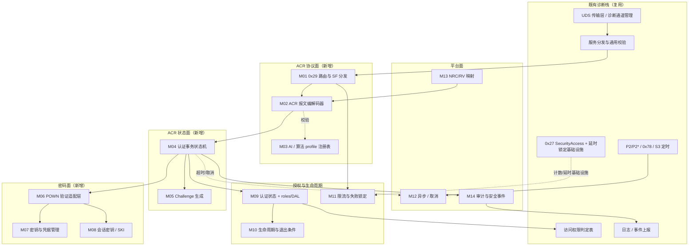
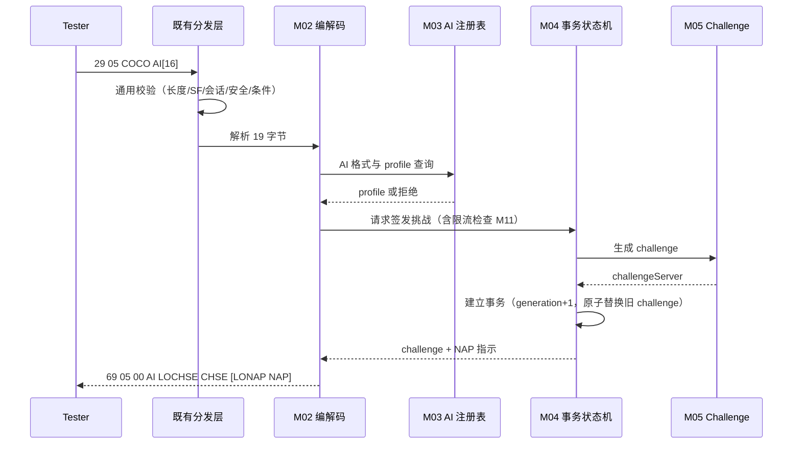
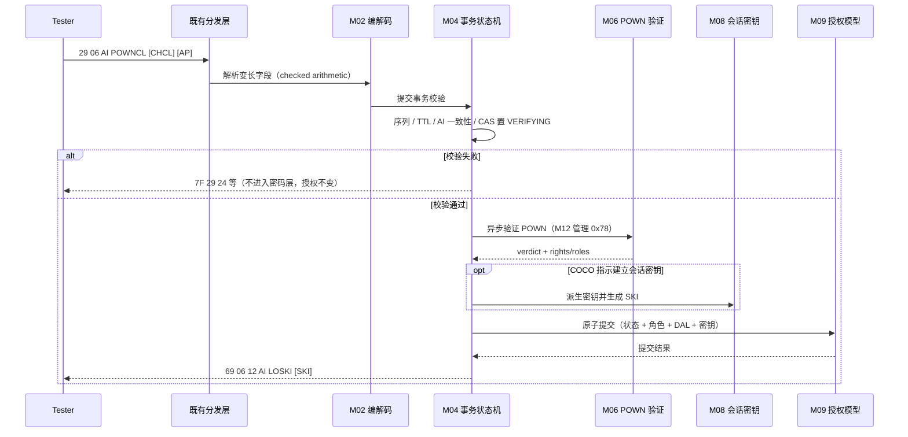
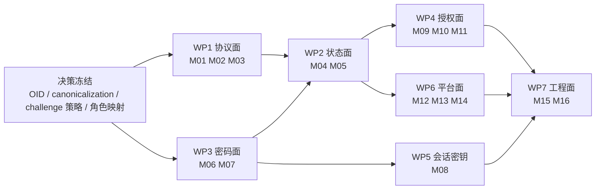

# 在既有 UDS 诊断栈上增量实现 0x29 ACR 单向认证 — 模块分解与功能需求拆分

> **边界声明**：本文回答的是**工程增量问题**——已有一套实现了 ISO 14229-1 大部分服务（含 `0x27 SecurityAccess`）的诊断协议栈，现要新增 `0x29` 的 **ACR 单向**（`0x05 requestChallengeForAuthentication` + `0x06 verifyProofOfOwnershipUnidirectional`）能力，需要新建/改造哪些软件模块与处理逻辑。
> ACR 的 wire contract 依据 **ISO 14229-1:2020**；架构与实现约束**参考** AUTOSAR AP DM R25-11 的 APCE 子集设计经验。**AUTOSAR AP R25-11 明确不包含 ACR**（[SWS_DM_01226] 及其 Note），故本文所有模块名、接口名、需求 ID 均为**项目工程构件**，不是 `ara::diag` 标准 API，也不是 AUTOSAR 需求。

| 文档属性 | 值 |
|---|---|
| 文档类型 | 增量实现拆分 / 模块级需求分析 |
| 覆盖版本 | ISO 14229-1:2020；AUTOSAR AP SWS Diagnostics R25-11（仅作参考约束与可复用机制来源） |
| 目标范围 | ACR 单向 `0x05`/`0x06`，及其必需的公共面 `0x00`/`0x08` |
| 自定义需求前缀 | `ACRI-Mxx-nn`（Incremental）；与既有 `ACR29-*` Catalog 的映射见 §8 |
| 编写日期 | 2026-08-25 |
| 前置阅读 | [ACR 单向实现 Spec](./AUTOSAR_AP_DM_R25_UDS_0x29_ACR_Unidirectional_Spec.md)、[ACR 配置与 API 缺口](./AUTOSAR_AP_DM_R25_UDS_0x29_ACR_Config_API_Gap.md) |

---

## 目录

- [0. 执行摘要](#0-执行摘要)
- [1. 前提、范围与证据规则](#1-前提范围与证据规则)
- [2. 增量定位：相对既有栈到底"多"出什么](#2-增量定位相对既有栈到底多出什么)
- [3. 目标架构与模块分解总表](#3-目标架构与模块分解总表)
- [4. 逐模块功能需求拆分](#4-逐模块功能需求拆分)
- [5. 关键处理逻辑时序](#5-关键处理逻辑时序)
- [6. 实施路线与工作包依赖](#6-实施路线与工作包依赖)
- [7. 若目标栈是 AUTOSAR AP DM 的附加约束](#7-若目标栈是-autosar-ap-dm-的附加约束)
- [8. 与既有需求 Catalog 的映射](#8-与既有需求-catalog-的映射)
- [9. 项目决策门禁与风险](#9-项目决策门禁与风险)
- [10. 方法局限与交叉链接](#10-方法局限与交叉链接)

---

## 0. 执行摘要

### 0.1 结论先行

1. **不要把 ACR 当成"0x27 的加强版"来做**。两者虽同为"两步挑战-应答"，但在**状态载体、授权模型、报文编码、并发模型**四个维度是结构性不同的：`0x27` 是"服务器全局单标量 securityLevel + 定长报文 + 随会话复位"，ACR 是"每诊断客户端/通道的认证状态 + roles 位集合 + 动态访问列表 + 变长长度前缀报文 + 与会话解耦"。**沿用 0x27 的状态容器是本项目最容易发生的架构性错误。**（详见 §2.1）
2. **增量工作量集中在三段：报文层（L1）、协议状态机（L2）、密码学（L3）**。认证**成功之后**的授权、隔离、超时、审计（L4–L6）在成熟栈中大多已有等价物或可小改复用。这一分层结论与既有缺口分析 §8.1 一致。
3. **共 16 个模块**：**9 个纯新建**（NEW）、**4 个纯改造**（MOD）、**3 个"新建 + 改造既有逻辑"**（NEW + MOD）。合计拆出 **99 条功能需求**。
4. **可从既有栈直接复用的最大三块**：① `0x27` 的**失败计数 + 延时锁定 + 掉电保持**基础设施（作用域需从 securityLevel 改为 client/channel）；② 现有**异步服务处理与 `0x78`/P2\* 机制**（若栈为同步处理，则这是一个高风险改造项）；③ 现有**访问权限判定表**（需从三维 `service × session × securityLevel` 增维到四维，加入 role/DAL）。
5. **最小可用集（MVP）= 对称 ACR + 不建立会话密钥 + 单一算法 OID**。这可以砍掉 M08（会话密钥）整块与 M06 的非对称/令牌解析分支，把首个可联调版本的模块数从 16 降到 13。（详见 §6.1）
6. **最先要冻结、否则无法开工的三项**：算法 OID 与 POWN 输入的**字节级 canonicalization**、challenge 的**生命周期规则**、rights/roles 到本地权限的**映射表**。这三项决定了 M02/M04/M06/M09 的接口形状。

### 0.2 模块分解一览

| 分组 | 模块 | 性质 | 需求数 |
|---|---|---|:--:|
| 协议面 | M01 `0x29` 服务路由与子功能分发 | MOD | 7 |
| | M02 ACR 报文编解码器 | NEW | 8 |
| | M03 algorithmIndicator 与算法 profile 注册表 | NEW | 5 |
| 状态面 | M04 ACR 认证事务状态机 | NEW | 8 |
| | M05 Challenge 生成与熵源服务 | NEW | 5 |
| 密码面 | M06 POWN 验证与密码适配层 | NEW | 7 |
| | M07 密钥与凭据管理接入 | NEW | 5 |
| | M08 会话密钥建立与 SKI 处理 | NEW（条件） | 6 |
| 授权面 | M09 认证状态与 roles/DAL 授权模型 | NEW + MOD | 8 |
| | M10 认证生命周期与退出条件 | NEW + MOD | 7 |
| | M11 防滥用、限流与失败锁定 | MOD | 5 |
| 平台面 | M12 异步处理、P2\*/`0x78` 与取消 | MOD | 5 |
| | M13 NRC / RV 统一映射与错误分层 | MOD | 6 |
| | M14 安全日志、审计与安全事件 | NEW + MOD | 4 |
| 工程面 | M15 配置项、校验与部署 | NEW | 4 |
| | M16 测试与验证资产 | NEW | 9 |
| | **合计（16 个模块）** | 9 NEW / 4 MOD / 3 NEW+MOD | **99** |

---

## 1. 前提、范围与证据规则

### 1.1 假定的既有基线

本文假定现有栈**已具备**下列能力（这是拆分"增量"的基准线；若某项实际不具备，对应模块的性质从 MOD 升级为 NEW）：

| 既有能力 | 本文假定 | 若缺失的影响 |
|---|---|---|
| UDS 传输层（CAN-TP / DoIP）与请求收发 | 具备 | — |
| 服务分发表、SID/SF 支持性检查、`0x11`/`0x12` 生成 | 具备 | M01 升级为 NEW |
| 请求长度/格式校验与 `0x13` | 具备（针对定长服务） | M02 需自带完整长度校验 |
| `0x10` 会话管理与 S3 定时器 | 具备 | M10 的 inactivity 计时需自建 |
| `0x27 SecurityAccess`：seed/key、失败计数、延时锁定、`0x33`/`0x35`/`0x36`/`0x37` | 具备 | M11 升级为 NEW |
| 访问权限判定（service × session × securityLevel） | 具备 | M09 工作量翻倍 |
| 响应挂起 `0x78` 与 P2/P2\* 定时 | 具备 | M12 为高风险改造 |
| 诊断连接/通道管理（DoIP 多连接） | 具备 | M04 的隔离键无处可取 |
| 日志/DTC/事件上报基础设施 | 具备 | M14 升级为 NEW |
| **`0x29` 任一子功能** | **不具备** | 本文全部增量成立 |
| **密码库 / HSM / 安全存储接入** | **不确定** | M06/M07 为关键路径 |

### 1.2 两种落地形态

同一份模块分解，在两类目标栈上的**合规性含义**不同，须先明确项目属于哪一类：

| 形态 | 描述 | 差异 |
|---|---|---|
| **形态 A：自研 / 供应商私有 UDS 栈** | 栈的服务分发与状态模型由项目掌控 | M01 是常规扩展；无 DEXT/Manifest 元模型约束；ISO 合规性是唯一外部标尺 |
| **形态 B：AUTOSAR AP DM 之上扩展** | 需要在 `ara::diag` 生态内落地 | `0x05`/`0x06` 无 DEXT 元类、无 PortMapping 落点、会被 [SWS_DM_00100] 判为 `0x12`；必须使用供应商扩展点，且需登记规范偏差。**附加约束见 §7** |

无论哪种形态，**ACR 的 wire 层都可以做到 ISO 14229-1:2020 合规**——这是 ACR 相对"自定义私有 SID"方案的核心价值，也是本项目值得做的理由。

### 1.3 证据等级

| 标签 | 含义 |
|---|---|
| `ISO-NORM` | ISO 14229-1:2020 规范性要求，可写"必须" |
| `AUTOSAR-REF` | AUTOSAR AP R25-11 已标准化的机制，作为**设计参考或可复用先例**，不代表 ACR 被标准化 |
| `DERIVED` | 为满足规范、安全或可测试性推导的工程约束 |
| `PROJECT-DECISION` | 标准留白，必须由项目冻结；未冻结前相关需求不可验收 |

### 1.4 来源

| 主题 | 权威源 | 检索载体 |
|---|---|---|
| ACR 流程、字段、NRC | `autosar/dm/iso/ISO 14229-1-2020.pdf` §10.6.3–10.6.8、Annex A/B | [ISO 0x29 全量中文译本](./ISO_14229-1_2020_UDS_0x29_Translation_Full_Spec.md) |
| `0x27` 失败计数与延时 | 同上 §10.4；NRC `0x35` IK / `0x36` ENOA / `0x37` RTDNE | `autosar/dm/markdown/ISO_14229-1-2020/` |
| **NRC 校验顺序** | 同上 §8.7.2 **Figure 5**（SID 级）、§8.7.3.1 **Figure 6**（子功能级） | 同上；图片见 `markdown/ISO_14229-1-2020/images/` |
| Role/DAL 配置与约束 | `autosar/dm/autosar/AUTOSAR_CP_TPS_DiagnosticExtractTemplate_R25-11.pdf` §4.3.3、§4.3.6；`constr_10038` | `autosar/dm/markdown/AUTOSAR_CP_TPS_DiagnosticExtractTemplate_R25-11/` |
| APCE 实现约束与可复用机制 | `autosar/dm/autosar/AUTOSAR_AP_SWS_Diagnostics_R25-11.pdf` §7.3.2.3–7.3.2.5、§7.3.2.8.11 | [APCE Spec](./AUTOSAR_AP_DM_R25_UDS_0x29_APCE_Spec.md) |
| ACR 在 AUTOSAR 的缺口 | 同上 + DEXT/Manifest TPS R25-11 | [ACR Config/API Gap](./AUTOSAR_AP_DM_R25_UDS_0x29_ACR_Config_API_Gap.md) |

---

## 2. 增量定位：相对既有栈到底"多"出什么

### 2.1 `0x27 SecurityAccess` 与 ACR 单向的机制对照

这是本文最重要的一张表。它回答"既有 `0x27` 实现能复用多少"，并解释为什么**复用比例远低于直觉**。

| # | 维度 | `0x27 SecurityAccess` | `0x29` ACR 单向 | 复用判定 |
|:--:|---|---|---|---|
| 1 | 交互骨架 | `requestSeed`(奇 SF) → `sendKey`(偶 SF) 两步 | `0x05` → `0x06` 两步 | **骨架可复用**：两步序列、序列错误 `0x24` 语义一致 |
| 2 | 报文编码 | 定长或 OEM 固定长度，无长度前缀 | 变长；`0x06` 请求含 **3 处** 2 字节 MSB-first 长度前缀（POWNCL / CHCL / AP） | **不可复用**：需全新的带 checked arithmetic 的解析器（M02） |
| 3 | 算法标识 | 隐含于 securityLevel 编号 | 显式 **16 字节 BER-OID** `algorithmIndicator`，且 `0x06` 必须与 `0x05` 逐字节一致 | **全新**（M03） |
| 4 | 正响应结构 | 回显 SF + seed | 回显 SF + **`returnValue` 字节** + AI + 变长字段 | **RV 是新概念**：既有栈的"正响应 = 回显 + 数据"模型需扩展（M02/M13） |
| 5 | 状态载体 | 服务器**全局**单一 securityLevel（多数实现为标量） | **每 Diagnostic Client / 通道**的认证状态 + roles + 动态访问列表 | **不可复用**：必须新建按连接隔离的状态容器（M04/M09） |
| 6 | 与会话的关系 | 会话切换通常回落 locked | 与会话、securityLevel **解耦**；仅显式去认证 / 超时 / 里程上限退出（ISO §10.6.4） | **需改造**：既有"会话切换清安全状态"逻辑必须**不得**误清认证状态（M10） |
| 7 | 授权表达 | 单一 level（标量比较） | rights/roles **位集合** + 运行时可追加的动态访问列表 | **需增维**：访问权限表由三维扩到四维（M09） |
| 8 | 未授权拒绝码 | `0x33 securityAccessDenied` | `0x34 authenticationRequired` | **新增分支**，且两个门**并存**、互不替代；ISO Figure 5/6 规定 `0x34` 校验**先于** `0x33`（M09/M13，见 §5.3） |
| 9 | 失败尝试管理 | ISO §10.4 定义 securityAccessFailed 计数 + delay timer + `0x36`/`0x37` | ISO §10.6.3 NOTE 3 明确**交给整车厂**，无标准 NRC | **基础设施可复用**（计数器、延时、掉电保持），**作用域与 NRC 必须改**（M11） |
| 10 | 密码强度要求 | 常见为私有 seed/key 算法，seed 生成常非 CSPRNG | 签名 / HMAC / CMAC / GMAC；challenge 必须不可预测 | **通常需引入密码库或 HSM**（M05/M06/M07） |
| 11 | 并发模型 | 多数实现假定单一 tester | 多客户端 / 多通道并发；challenge 必须绑定发起方 | **全新并发与隔离设计**（M04） |
| 12 | 会话密钥 | 无此概念 | 可选：`communicationConfiguration` 指示建立，返回 `sessionKeyInfo` | **全新**（M08） |
| 13 | 附加参数协商 | 无 | 服务器可在 `0x05` 响应中声明 `neededAdditionalParameter` | **全新**（M02/M04） |
| 14 | 能力宣告 | 无（能力隐含于配置） | `0x08 authenticationConfiguration` 返回 RV `0x03`（ACR 非对称）/ `0x04`（ACR 对称） | **全新**（M01/M13） |

**读法**：14 个维度中,只有 #1、#9 两项是实质性可复用，#6、#7、#12 是"既有逻辑必须被修改以免破坏 ACR"的**负向影响项**。第 6 项尤其容易被忽略——很多栈把"会话切回默认 → 清除所有安全状态"写死在会话管理里，直接接入 ACR 会导致认证态被非法清除，违反 ISO §10.6.4。

### 2.2 从 APCE 借鉴的实现约束

AUTOSAR AP DM R25-11 虽不支持 ACR，但其 APCE 子集给出了一套经过规范打磨的架构决策。以下 8 条**可以且应当迁移**到 ACR 实现：

| # | APCE 的做法 | 规范锚点 | 迁移到 ACR 的含义 |
|:--:|---|---|---|
| 1 | **报文与状态在 DM，密码学在应用/HSM**，DM 不解析证书内容 | §7.3.2.8.11 回调模型；[SWS_DM_01230]/[SWS_DM_01240] | ACR 的 POWN 验证必须放在独立的密码适配边界后，M02/M04 不得直接接触密钥（M06） |
| 2 | 应用回调返回 **Future**，DM 在完成后组装响应 | [SWS_DM_01240]、§7.3.2.5 异步处理 | ACR 验签是耗时操作，必须走异步 + `0x78`，不得阻塞诊断线程（M12） |
| 3 | 应用回调可返回 **NRC 错误码**，由 DM 统一转译 | [SWS_DM_01231]、[SWS_DM_01241] | 密码层错误不得直接上 wire，需经统一映射（M13） |
| 4 | 认证结果的**注入通路与 `0x29` 解耦** | [TPS_MANI_01362]："external authentication is not bound to the existence of UDS service 0x29" | ACR 的"提交认证结果"应设计为独立内部接口，不与 `0x05`/`0x06` 报文处理耦合（M09） |
| 5 | **序列必须有强制起点**：新认证序列须由 `0x01`/`0x02` 开启 | [SWS_DM_01243] 的序列完成语义 | ACR 的新序列必须由 `0x05` 开启；无前序 `0x05` 的 `0x06` → `0x24`（M04） |
| 6 | **显式定义跨客户端的意外请求行为** | [SWS_DM_01239]（不同客户端的意外 VCB） | ACR 必须显式拒绝"A 取挑战、B 应答"（M04） |
| 7 | **协议成功 ≠ 认证状态**：RV `0x12` 不等价于状态已置为已认证 | [SWS_DM_01243] 与 [SWS_DM_01206] 分属两条链路 | ACR 必须把"发送 RV=0x12"与"提交授权"设计为一次原子事务，且测试断言二者分离（M09） |
| 8 | 专属逻辑仅在**全部通用校验通过后**才执行 | [SWS_DM_00096]、[SWS_DM_00100] | ACR callback 不得在长度/SF/会话/条件检查失败时被调用（M01/M12） |

反过来，有 2 条 APCE 约束是**不可迁移的陷阱**：

- **`0x08` 的 RV 在 AP DM 中被硬编码为 `0x02`（APCE）**（[SWS_DM_01246]）。ACR 需要 `0x03`/`0x04`，与 APCE 共存时单字节 RV 无法同时表达两族，必须由项目冻结取值规则。
- **`DiagnosticVerifyCertificateUnidirectional`（`0x01`）不是 ACR 的落点**。它名字里的 "Unidirectional" 指证书验证方向，属 APCE 族。复用它承载 ACR 在报文格式、子功能编号、配置组合、端口绑定四层都不成立（详见缺口文档 §5.3）。

### 2.3 增量功能面清单

把 ISO §10.6.3 变体 1 的 16 个步骤映射到"已有 / 新增"：

| ISO 步骤 | 能力 | 既有栈 | 增量 |
|---|---|---|---|
| (1) 接收 `0x29 05` | 服务路由与 SF 分发 | 部分（框架有，`0x29` 无） | M01 |
| (1) 解析 COCO + AI | 定长 19 字节解析 + AI 校验 | 无 | M02、M03 |
| (2) 创建 challenge server | 高质量随机数 | 部分（`0x27` seed 生成器，强度存疑） | M05 |
| (3) 发送 challenge + NAP 指示 | 变长响应编码 | 无 | M02、M04 |
| (4)(5)(6) 客户端侧计算 | — | 不适用（服务器侧无需实现） | — |
| (7) 接收 `0x29 06` | 三段变长解析 | 无 | M02 |
| (8) 验证 client POWN | 签名/MAC 验证 | 无 | M06、M07 |
| — | 序列/时效/一致性校验 | 部分（`0x27` 有序列检查） | M04 |
| (10) 建立会话密钥、生成 SKI | KDF + 密钥激活 | 无 | M08 |
| (11) 按 rights/roles 授权 | 访问权限判定 | 部分（按 securityLevel） | M09 |
| (12) 发送成功响应 | RV + AI + SKI 编码 | 无 | M02 |
| §10.6.4 显式去认证 | `0x00` 处理 | 无 | M01、M10 |
| §10.6.4 超时/里程退出 | 定时器 / 里程监控 | 部分（S3 定时器） | M10 |
| §10.6.3 NOTE 3 失败管理 | 计数 + 延时 + 锁定 | 有（`0x27` 侧） | M11 |
| §10.6.7 NRC | NRC 生成 | 部分 | M13 |
| 全程 | 审计与安全事件 | 部分 | M14 |

---

## 3. 目标架构与模块分解总表

### 3.1 分层视图



### 3.2 模块清单总表

| 模块 | 名称 | 性质 | 核心职责 | 上游依赖 | 关键风险 |
|---|---|:--:|---|---|---|
| **M01** | `0x29` 服务路由与子功能分发 | MOD | 注册 SID `0x29`、SF `0x00/0x05/0x06/0x08`；SPRMIB；寻址策略 | 既有分发表 | 与已有 `0x12` 基线行为冲突 |
| **M02** | ACR 报文编解码器 | NEW | `0x05/0x06/0x00/0x08` 请求解析与响应编码；长度前缀与溢出防护 | M01、M03、M13 | 偏移错误导致互操作失败 |
| **M03** | AI 与算法 profile 注册表 | NEW | 16 字节 BER-OID 校验、OID→算法能力映射、允许清单 | 配置 M15 | OID 编码/填充判定错误 |
| **M04** | ACR 认证事务状态机 | NEW | 每 client/channel 事务、challenge 生命周期、序列与防重放 | M01、M05、M12 | 并发竞态、跨客户端串扰 |
| **M05** | Challenge 生成与熵源服务 | NEW | CSPRNG 挑战生成、长度/唯一性保证 | 平台熵源 | 复用弱 seed 生成器 |
| **M06** | POWN 验证与密码适配层 | NEW | 对称 MAC / 非对称签名验证、令牌解析、恒定时间比较 | M03、M07 | canonicalization 歧义 |
| **M07** | 密钥与凭据管理接入 | NEW | keyId 解析、公钥/预共享密钥存取、轮换与吊销 | HSM / 安全存储 | 产线注入流程未定义 |
| **M08** | 会话密钥建立与 SKI 处理 | NEW（条件） | KDF、SKI 编码、密钥激活点与销毁 | M06、M07、传输层 | 密钥寿命与认证态不同步 |
| **M09** | 认证状态与 roles/DAL 授权模型 | NEW + MOD | 每客户端认证状态、roles 映射、动态访问列表、`0x34` | 既有权限表 | 与 `0x27` 门混淆；提交非原子 |
| **M10** | 认证生命周期与退出条件 | NEW + MOD | 显式去认证、inactivity 超时、里程退出、通道拆除 | 既有 S3 / 会话管理 | 会话切换误清认证态 |
| **M11** | 防滥用、限流与失败锁定 | MOD | 失败计数、退避锁定、`0x05` 洪泛限流 | `0x27` 延时基础设施 | 全局锁定误伤其他客户端 |
| **M12** | 异步处理、P2\*/`0x78` 与取消 | MOD | 密码运算异步化、挂起响应、取消与晚到结果隔离 | 既有定时器 | 同步栈改造成本高 |
| **M13** | NRC / RV 统一映射与错误分层 | MOD | 新增 `0x22/0x24/0x34/0x50–0x5D`；RV 概念；单一映射源 | — | NRC 与 RV 双轨不一致 |
| **M14** | 安全日志、审计与安全事件 | NEW + MOD | 关联审计、脱敏、事件上报 | 既有日志 | 日志泄密 |
| **M15** | 配置项、校验与部署 | NEW | 配置 schema、静态校验器、部署绑定 | — | 无标准工具可校验 |
| **M16** | 测试与验证资产 | NEW | golden vector、负例、并发/重放、互操作 | 全部 | 决策未冻结导致测试阻塞 |

---

## 4. 逐模块功能需求拆分

> 表格列：需求 ID / 需求描述 / 等级 / 验证方法（`T` 测试、`A` 分析、`I` 检查、`R` 评审）。

### M01 `0x29` 服务路由与子功能分发（MOD，7 条）

**职责**：把 `0x29` 接入既有服务分发表，并在 SF 级把 `0x00/0x05/0x06/0x08` 路由到 ACR 处理链；不承担任何 ACR 语义。

**与既有栈的接触点**：服务表注册、SID/SF 支持性检查、SPRMIB 解析、寻址方式判定。这些逻辑既有栈已有，M01 是**配置与分支扩展**，不是重写。

| ID | 需求 | 等级 | 验证 |
|---|---|---|---|
| ACRI-M01-01 | 在服务分发表注册 SID `0x29`；正响应 SID `0x69`，负响应 `7F 29 NRC` | `ISO-NORM` | T |
| ACRI-M01-02 | 在 SF 级注册 `0x00`、`0x05`、`0x06`、`0x08`；未注册的 SF（含 `0x07`）返回 `0x12` | `ISO-NORM` | T |
| ACRI-M01-03 | SF 字节 bit7 作为 SPRMIB 解析，任务码取 `byte & 0x7F`；SPRMIB 仅抑制肯定响应，否定响应照常发送 | `ISO-NORM` | T |
| ACRI-M01-04 | ACR 专属处理仅在既有通用校验（长度、SF 支持性、会话、安全级、环境条件）全部通过后调用 | `AUTOSAR-REF` [SWS_DM_00096] | T |
| ACRI-M01-05 | 冻结并实施寻址策略：推荐仅允许物理寻址执行有状态的 `0x05`/`0x06`；功能寻址下的响应/抑制遵循 ISO 通用矩阵 | `PROJECT-DECISION` | T/R |
| ACRI-M01-06 | 保留基线否定行为：ACR 特性未启用的配置下，`29 05`/`29 06` 必须返回 `7F 29 12` | `DERIVED` | T |
| ACRI-M01-07 | `0x29`（含 ACR `0x05`/`0x06`）自身**不得**被认证门保护：不得为其配置 `authenticationEnabled`；`0x29` 的前置保护只允许使用会话门、`0x27` SecurityLevel 门与环境条件 | `AUTOSAR-REF` `constr_10038` | I/T |

> **ACRI-M01-06 的意义**：这是防止"无意中打开认证旁路"的回归护栏，在形态 B（AP DM）下更是规范要求的默认行为。
>
> **ACRI-M01-07 的依据**：DEXT `constr_10038`（imposition time **CP: IT_DiagDes, AP: IT_DiagDes**）明文规定，若 `DiagnosticAccessPermission` 被 **`sub-classes of DiagnosticAuthentication`**（以及八项 OBD 法规服务）引用，则 `authenticationEnabled` **不得存在**。这从元模型层面消除了"未认证就无法认证"的死锁，属规范硬约束而非项目决策。注意约束范围仅限 `authenticationEnabled` 这一个聚合——`DiagnosticAuthentication` 作为 `DiagnosticServiceInstance` 子类仍继承 `accessPermission`，因此用会话门或 `0x27` 门保护 `0x29` 是合法配置。

### M02 ACR 报文编解码器（NEW，8 条）

**职责**：ACR 四个子功能的 A_Data 级解析与编码。这是**纯新建**模块，既有栈的定长服务解析器无法复用。

**接口形状**：`decode(sf, buffer) -> AcrRequest | ParseError`、`encode(AcrResult) -> buffer`。解析器**不访问**状态与密钥。

| ID | 需求 | 等级 | 验证 |
|---|---|---|---|
| ACRI-M02-01 | `0x05` 请求固定 **19 字节**（SID + SF + COCO + AI[16]）；长度不符返回 `0x13` | `ISO-NORM` Table 70 | T |
| ACRI-M02-02 | `0x05` 正响应按 `69 05 RV AI[16] LOCHSE CHSE [LONAP NAP]` 编码，总长 **23 + m + n** | `ISO-NORM` Table 81 | T |
| ACRI-M02-03 | `0x06` 请求按 `AI[16] + LPOWNCL/POWNCL + LOCHCL/CHCL + LOAP/AP` 解析，总长 **24 + m + n + o**，无尾随字节 | `ISO-NORM` Table 71 | T |
| ACRI-M02-04 | `0x06` 正响应按 `69 06 12 AI[16] LOSKI [SKI]` 编码，总长 **21 + m** | `ISO-NORM` Table 82 | T |
| ACRI-M02-05 | 所有 `lengthOf...` 字段为 2 字节 unsigned MSB-first；长度值仅覆盖紧随其后的 payload；长度为 `0000` 时对应字段不出现 | `ISO-NORM` | T |
| ACRI-M02-06 | 所有长度求和使用 checked arithmetic，并先校验项目上限再分配缓冲；溢出、截断、越界一律安全拒绝为 `0x13`，不得崩溃或大额分配 | `DERIVED` | T/A |
| ACRI-M02-07 | 正响应携带 `returnValue` 字节：`0x05` 接受为 `0x00`，`0x06` 完成为 `0x12`，`0x00` 去认证成功为 `0x10`，`0x08` 按支持的认证族返回 | `ISO-NORM` Annex B.5 | T |
| ACRI-M02-08 | 编解码器为无状态纯函数，不持有 challenge、密钥或客户端上下文 | `DERIVED` | I/R |

> **对既有栈的影响**：ACRI-M02-07 引入的 `returnValue` 概念，要求既有"正响应 = 回显 SF + 数据"的响应组装模型增加一个 RV 槽位。若既有响应组装是模板化的，这里需要一个扩展点。

### M03 algorithmIndicator 与算法 profile 注册表（NEW，5 条）

**职责**：把 16 字节 AI 解释为项目可执行的算法能力，并作为 M06 的选路依据。独立成模块的原因是它同时被 M02（格式校验）、M04（一致性校验）、M06（选路）、M15（配置）使用。

| ID | 需求 | 等级 | 验证 |
|---|---|---|---|
| ACRI-M03-01 | AI 恰为 16 字节：BER 编码 OID 左对齐，剩余字节右填 `0x00` | `ISO-NORM` | T |
| ACRI-M03-02 | 拒绝 BER 非法、OID 超出 16 字节、padding 含非零垃圾字节的 AI | `DERIVED` | T |
| ACRI-M03-03 | 维护允许的 OID 清单，每项绑定：密码体制（对称/非对称）、算法参数、允许 keyId 集合、最小安全强度、challenge 长度、POWN 长度约束 | `PROJECT-DECISION` | I/T |
| ACRI-M03-04 | 未在清单中的 OID 按冻结的 NRC 拒绝（`0x31` 或 `0x22`，二选一并全局一致） | `PROJECT-DECISION` | T |
| ACRI-M03-05 | 提供 profile 查询接口供 M06 选路；注册表在运行时只读 | `DERIVED` | I |

### M04 ACR 认证事务状态机（NEW，8 条）

**职责**：ACR 的**核心新增模块**。管理每个诊断客户端/通道的认证事务：challenge 的签发、时效、一次性、替换、消费，以及序列合法性。

**状态**：`IDLE → CHALLENGE_ISSUED → VERIFYING → (IDLE | 已认证)`；已认证客户端再次发起时进入 `REAUTH_IN_PROGRESS`，旧授权保持到新认证成功提交。

| ID | 需求 | 等级 | 验证 |
|---|---|---|---|
| ACRI-M04-01 | 事务隔离键至少含：诊断服务器实例 + 协议/通道标识 + 客户端源地址；禁止仅以源地址做全局索引 | `DERIVED` | T/A |
| ACRI-M04-02 | 事务上下文保存：generation、AI、COCO、challenge、neededAdditionalParameter、签发/过期单调时间、尝试计数、算法 profile、取消令牌、旧认证快照引用 | `DERIVED` | I/T |
| ACRI-M04-03 | challenge 单次使用：final 成功、final 失败、取消、超时、通道断开后立即失效并擦除 | `DERIVED` | T |
| ACRI-M04-04 | 同一客户端新的 `0x05` 原子替换旧 challenge（generation +1）；针对旧 challenge 的 `0x06` 必须失败 | `DERIVED` | T |
| ACRI-M04-05 | 无有效前序 `0x05` 的 `0x06` 返回 `0x24`；过期、已消费、已替换事务按冻结的序列策略拒绝 | `ISO-NORM` §10.6.7 | T |
| ACRI-M04-06 | `0x06` 进入密码验证前，以 CAS/锁把事务从 issued 原子置为 verifying，阻止并发双提交 | `DERIVED` | T |
| ACRI-M04-07 | `0x06` 的 AI 必须与前序 `0x05` 逐字节相等，在调用密码层**之前**校验 | `ISO-NORM` Table 71 | T |
| ACRI-M04-08 | 已认证客户端重认证：失败时保持旧认证与旧授权；成功时以新认证信息整体替换 | `ISO-NORM` §10.6.4 | T |

> **ACRI-M04-08 是 ISO 明文要求**，也是最容易实现错的一条：不能在收到新的 `0x05` 时就清除已有认证状态。

### M05 Challenge 生成与熵源服务（NEW，5 条）

**职责**：产生密码学质量的 challengeServer。独立成模块便于安全评审与替换实现。

**与 `0x27` 的关系**：既有 `0x27` 的 seed 生成器**通常不满足要求**（长度短、可能基于计数器或弱 PRNG）。必须评估后决定复用还是新建；默认假设为新建。

| ID | 需求 | 等级 | 验证 |
|---|---|---|---|
| ACRI-M05-01 | challenge 来自经批准的 CSPRNG，禁止使用可预测计数器、时间戳或固定种子 | `DERIVED` | A/T |
| ACRI-M05-02 | challenge 长度由算法 profile 冻结且 `> 0`；熵不低于冻结的最小强度 | `PROJECT-DECISION` | I/T |
| ACRI-M05-03 | 生成失败（熵源不可用）时按冻结 NRC 拒绝（建议 `0x59 challenge calculation failed` 或通用 `0x10`），不得返回低质量兜底值 | `DERIVED` | T |
| ACRI-M05-04 | 提供 challenge 唯一性统计自检（研发/测试构建可启用），量产构建可关闭 | `DERIVED` | T |
| ACRI-M05-05 | 明确记录是否复用 `0x27` seed 生成器的评估结论；若复用，须提供熵评估证据 | `PROJECT-DECISION` | R |

### M06 POWN 验证与密码适配层（NEW，7 条）

**职责**：在受控边界内完成 POWN 验证。对上暴露"验证是否通过 + 解析出的 rights/roles"，对下调用密码库/HSM。

**接口形状**（逻辑，非 ABI）：
```text
VerifyPown(profile, challengeServer, challengeClient, additionalParameter,
           proofOfOwnershipClient, clientContext, cancelToken)
  -> { verdict, rightsRoles, keyHandle, failureReason }
```

| ID | 需求 | 等级 | 验证 |
|---|---|---|---|
| ACRI-M06-01 | 支持对称路径：以预共享密钥对冻结的输入序列计算 MAC/签名（HMAC/CMAC/GMAC 之一）并比较 | `ISO-NORM` §10.6.3 | T |
| ACRI-M06-02 | 支持非对称路径：以客户端公钥验证认证令牌签名，并解析令牌内容 | `ISO-NORM` §10.6.3 | T |
| ACRI-M06-03 | POWN 输入的 canonicalization（拼接顺序、编码、分隔、长度前缀）字节级冻结，并有 golden vector | `PROJECT-DECISION` | R/T |
| ACRI-M06-04 | 非对称令牌至少绑定 challengeServer；应绑定客户端身份、服务器身份/通道、AI、COCO、rights/roles 与协议用途标签 | `ISO-NORM` + `PROJECT-DECISION` | R/T |
| ACRI-M06-05 | MAC/签名比较使用恒定时间实现；密钥运算在 HSM 或受控密码边界内完成 | `DERIVED` | A/I |
| ACRI-M06-06 | 密码层错误码与 UDS NRC 分层：不得把库内部错误、异常信息或密钥状态直接暴露到 wire 或日志 | `AUTOSAR-REF` [SWS_DM_01241] 的转译模型 | T/I |
| ACRI-M06-07 | 验证操作支持取消；取消后不得写入任何授权状态 | `DERIVED` | T |

### M07 密钥与凭据管理接入（NEW，5 条）

**职责**：把 ACR 所需的密钥材料纳入既有安全存储 / HSM 生命周期。这是**最容易被低估工作量**的模块，通常牵涉产线与售后流程。

| ID | 需求 | 等级 | 验证 |
|---|---|---|---|
| ACRI-M07-01 | 定义 keyId 到密钥槽的解析规则，并与 AI profile 的允许 keyId 集合交叉校验 | `PROJECT-DECISION` | I/T |
| ACRI-M07-02 | 私钥/预共享密钥不得经 UDS wire 传输，不得出现在日志、DTC 快照或诊断读取数据中 | `DERIVED` | I/T |
| ACRI-M07-03 | 定义密钥注入（产线）、轮换、吊销与失效后的诊断行为 | `PROJECT-DECISION` | R/T |
| ACRI-M07-04 | 密钥不可用或损坏时的降级策略明确且可审计（拒绝认证而非放行） | `DERIVED` | T |
| ACRI-M07-05 | 量产构建禁止内置测试密钥、弱算法与调试后门；构建期有自动检查 | `DERIVED` | I/T |

### M08 会话密钥建立与 SKI 处理（NEW，条件性，6 条）

**触发条件**：仅当项目冻结"COCO 可指示建立会话密钥"时需要。若 MVP 选择不建立会话密钥，本模块整块可延后。

| ID | 需求 | 等级 | 验证 |
|---|---|---|---|
| ACRI-M08-01 | 冻结 COCO 值域与语义，明确每个取值对应的 SKI 存在性与内容 | `PROJECT-DECISION` | R/T |
| ACRI-M08-02 | 按冻结的 KDF（含 label/context）派生会话密钥，并生成 `sessionKeyInfo` | `ISO-NORM` §10.6.3 步骤 (10) | T |
| ACRI-M08-03 | COCO 指示不建立密钥时，`0x06` 正响应 `LOSKI = 0x0000` 且不携带 SKI | `ISO-NORM` Table 82 | T |
| ACRI-M08-04 | 会话密钥有效期不超过该已认证会话；认证结束、去认证、超时、通道销毁时必须销毁密钥 | `ISO-NORM` §10.6.3 结尾 | T |
| ACRI-M08-05 | 密钥创建/派生失败时按冻结 NRC（建议 `0x5B`）拒绝，且认证状态、角色、密钥全部回滚 | `DERIVED` | T |
| ACRI-M08-06 | 明确 SKI 的用途边界：是否真正用于保护后续诊断通信、激活点在哪一层、与传输层安全（如 DoIP/TLS）如何共存 | `PROJECT-DECISION` | R/T |

### M09 认证状态与 roles/DAL 授权模型（NEW + MOD，8 条）

**职责**：本模块是**既有栈改动面最大**的地方。既有访问控制通常是 `service × session × securityLevel`，需要增加"认证状态 + roles + 动态访问列表"这一独立授权轴。

| ID | 需求 | 等级 | 验证 |
|---|---|---|---|
| ACRI-M09-01 | 为每个诊断客户端/通道维护独立的认证状态（未认证/已认证）与角色集合；启动默认为未认证 | `ISO-NORM` §10.6.4；`AUTOSAR-REF` [SWS_DM_01205] | T |
| ACRI-M09-02 | 支持默认角色概念：未认证客户端拥有配置的默认权限集 | `AUTOSAR-REF` [SWS_DM_01204] | T |
| ACRI-M09-03 | 访问权限判定表增维：在既有 session/securityLevel 条件之外增加"是否需要认证 + 允许的角色集合"条件 | `DERIVED` | T |
| ACRI-M09-04 | 支持动态访问列表：认证成功后可按令牌内容在静态配置之外追加/替换该客户端的资源访问权 | `AUTOSAR-REF` [SWS_DM_01213]/[SWS_DM_01215] | T |
| ACRI-M09-05 | 角色检查失败后再检查动态访问列表；两者均不允许时返回 NRC `0x34` 并终止服务处理 | `AUTOSAR-REF` [SWS_DM_01223]–[SWS_DM_01225] | T |
| ACRI-M09-06 | `0x29` 认证门与 `0x27` 安全门相互独立：认证成功不得绕过 `0x27` 检查（仍返回 `0x33`），反之亦然；两门校验顺序为认证门先行（见 §5.3） | `ISO-NORM` §10.6.4、§8.7.2 | T |
| ACRI-M09-07 | rights/roles 到本地权限的映射表默认拒绝；未知角色、空角色集不得自动获得任何访问权 | `DERIVED` | T |
| ACRI-M09-08 | 认证状态、角色、动态访问列表、会话密钥的提交是**单一原子事务**；任一环节失败整体回滚，且提交与发送 `RV=0x12` 的先后顺序须冻结 | `DERIVED`；`AUTOSAR-REF` RV 与状态解耦 | T/A |

> **ACRI-M09-06 的工程含义**：验收时应构造完整四象限，其中"已认证但未通过 `0x27`"断言 `0x33`，"已通过 `0x27` 但未认证"断言 `0x34`，**两者都未通过时按 ISO Figure 5/6 断言 `0x34`**（认证门先行）。

### M10 认证生命周期与退出条件（NEW + MOD，7 条）

**职责**：实现 ISO §10.6.4 的退出语义，并**修正既有栈中会误清认证态的逻辑**。

| ID | 需求 | 等级 | 验证 |
|---|---|---|---|
| ACRI-M10-01 | 实现显式退出：`0x29 00 deAuthenticate`，成功返回 RV `0x10`，清除认证状态、角色、动态访问列表、在途事务与会话密钥 | `ISO-NORM` §10.6.4（显式退出为强制） | T |
| ACRI-M10-02 | 至少实现一种隐式退出：inactivity 超时或里程偏移上限 | `ISO-NORM` §10.6.4（至少一种为强制） | T |
| ACRI-M10-03 | 同一诊断协议上收到的每条请求均保持认证态活跃并复位超时计时 | `ISO-NORM` §10.6.4 | T |
| ACRI-M10-04 | 认证态**不随诊断会话切换或 `0x27` 状态变化而清除**；须审查并修改既有"会话回落即清安全状态"的实现 | `ISO-NORM` §10.6.4 | T/R |
| ACRI-M10-05 | 若采用 S3 超时联动去认证，须显式定义其与独立 authentication timeout 的关系 | `AUTOSAR-REF` [SWS_DM_01210]/[SWS_DM_01211] | R/T |
| ACRI-M10-06 | 去认证后恢复默认角色并清空动态访问列表 | `AUTOSAR-REF` [SWS_DM_01212] | T |
| ACRI-M10-07 | 若采用里程退出：冻结里程源、可信度要求、阈值与里程源失效时的 fail-safe 行为；退出原因可审计 | `PROJECT-DECISION` | R/T |

> **ACRI-M10-04 是本模块的关键改造点**，也是 §2.1 第 6 行所指的负向影响项。

### M11 防滥用、限流与失败锁定（MOD，5 条）

**职责**：复用 `0x27` 已有的失败计数/延时/掉电保持基础设施，但**改变作用域与响应码**。ISO 对 ACR 的失败管理只在 §10.6.3 NOTE 3 说明"由整车厂决定"，无标准 NRC。

| ID | 需求 | 等级 | 验证 |
|---|---|---|---|
| ACRI-M11-01 | 维护每客户端/通道的认证失败计数与锁定状态；锁定不得跨客户端误伤 | `DERIVED` | T |
| ACRI-M11-02 | 冻结失败阈值、退避曲线、锁定时长与上电/掉电后的保持策略；可复用 `0x27` 的延时定时器实现 | `PROJECT-DECISION` | I/T |
| ACRI-M11-03 | 对 `0x05` 的请求频率限流，防止 challenge 洪泛消耗熵源与内存 | `DERIVED` | T |
| ACRI-M11-04 | 冻结限流/锁定期间的响应策略（建议 `0x21 busyRepeatRequest` 或 `0x22`）；不得复用 `0x27` 专用的 `0x36`/`0x37` | `PROJECT-DECISION` | R/T |
| ACRI-M11-05 | 全局资源上限：并发事务总数、单客户端事务数、缓冲区总量有上限且超限时安全拒绝 | `DERIVED` | T/A |

> **ACRI-M11-04 的理由**：`0x36 exceededNumberOfAttempts` 与 `0x37 requiredTimeDelayNotExpired` 在 ISO §10.4 中绑定 SecurityAccess 语义，`0x29` 的 NRC 清单（§10.6.7 与 Annex A）不含这两项，不应挪用。

### M12 异步处理、P2\*/`0x78` 与取消（MOD，5 条）

**职责**：让耗时的密码运算不阻塞诊断处理线程。**若既有栈的服务处理是同步的，这是整个项目风险最高的改造项**，需要在方案阶段单独评估。

| ID | 需求 | 等级 | 验证 |
|---|---|---|---|
| ACRI-M12-01 | 密码验证以异步任务执行；未在 P2 内完成时发送 `0x78` 并进入 P2\* | `ISO-NORM`；`AUTOSAR-REF` [SWS_DM_00368] | T |
| ACRI-M12-02 | `0x78` 是中间响应，不消费 challenge；达到配置的挂起上限后发送 final `0x10` | `AUTOSAR-REF` [SWS_DM_00369] | T |
| ACRI-M12-03 | 一个物理请求至多产生一个 final response | `ISO-NORM` | T |
| ACRI-M12-04 | 请求取消、连接关闭或超时后必须取消/隔离密码任务；晚到结果不得发送第二个响应，不得提交任何授权或密钥 | `DERIVED` | T/A |
| ACRI-M12-05 | 同一客户端最多一个在途 ACR 事务；不同客户端可并发，且调度不得造成跨客户端阻塞 | `DERIVED` | T |

### M13 NRC / RV 统一映射与错误分层（MOD，6 条）

**职责**：扩展既有 NRC 生成逻辑，并引入 `0x29` 特有的 RV 概念。核心要求是**单一映射源**。

| ID | 需求 | 等级 | 验证 |
|---|---|---|---|
| ACRI-M13-01 | 新增/接入 ACR 相关 NRC：`0x12`、`0x13`、`0x22`、`0x24`、`0x34`，以及 `0x50–0x5D` 认证专用族 | `ISO-NORM` §10.6.7 / Annex A | T |
| ACRI-M13-02 | `0x50–0x5D` 的精确定义、mnemonic 与适用分支须在实现冻结前逐项回查授权 PDF Annex A | `PROJECT-DECISION` | R |
| ACRI-M13-03 | 冻结错误粒度策略：使用细分 `0x50–0x5D` 还是统一 `0x10`；同一失败不得同时产生正响应 RV 与负响应 NRC | `PROJECT-DECISION` | R/T |
| ACRI-M13-04 | 通用校验顺序遵循 ISO §8.7.2 Figure 5 与 §8.7.3.1 Figure 6：SID 级为 `0x11` → **`0x34`** → `0x7F` → `0x33` → `0x38`/`0x39`；子功能级为 `0x13` → `0x12` → **`0x34`** → `0x7E` → `0x33` → `0x24`。认证门与安全等级门同时失败时唯一 NRC 为 `0x34` | `ISO-NORM`；`AUTOSAR-REF` [SWS_DM_00096] | T/A |
| ACRI-M13-05 | NRC、RV 与密码层错误码三层映射来自单一配置源，禁止分散硬编码 | `DERIVED` | I/R |
| ACRI-M13-06 | ACR 专属失败（密码、challenge、rights、会话密钥）发生在 ISO 图的 "Specific SID checks" 之后；同一 final 结果的唯一 NRC 不得由线程完成先后决定 | `DERIVED` | T/A |

### M14 安全日志、审计与安全事件（NEW + MOD，4 条）

| ID | 需求 | 等级 | 验证 |
|---|---|---|---|
| ACRI-M14-01 | 认证成功、失败、去认证、退出、受保护服务被拒均产生带关联 ID 的审计记录 | `DERIVED` | T |
| ACRI-M14-02 | 审计字段至少含：单调时间戳、客户端/通道假名 ID、SF、AI profile ID、generation、结果分类与 NRC/RV、耗时、重试次数、角色集摘要、密钥句柄 ID、退出原因 | `DERIVED` | I/T |
| ACRI-M14-03 | 日志不得包含私钥、预共享密钥、原始 POWN、完整 challenge、会话密钥或 SKI 敏感内容；有自动敏感字段扫描 | `DERIVED` | I/T |
| ACRI-M14-04 | 若接入安全事件上报（IdsM 或等价物）：`0x34` 拒绝事件可直接复用既有定义；ACR 成功与细粒度失败事件属项目扩展，不得声称由 AUTOSAR 标准事件覆盖 | `AUTOSAR-REF` [SWS_DM_02017]/[SWS_DM_02025] | R/I |

### M15 配置项、校验与部署（NEW，4 条）

| ID | 需求 | 等级 | 验证 |
|---|---|---|---|
| ACRI-M15-01 | 定义 ACR 配置 schema，覆盖：SF 使能、寻址、会话/安全前置条件、定时；算法 OID 与 profile；challenge 长度/TTL；POWN/AP/SKI 上限；rights→角色/DAL 映射；超时/里程；NRC/RV 策略；限流；日志级别 | `PROJECT-DECISION` | I |
| ACRI-M15-02 | 提供静态配置校验器（引用完整性、上限一致性、算法与 keyId 匹配、角色引用存在性） | `DERIVED` | T |
| ACRI-M15-03 | 冻结配置载体形态（形态 B 下：私有扩展、`Sdg`/`adminData` 或独立配置文件），并记录标准工具链不可校验的事实 | `PROJECT-DECISION` | R |
| ACRI-M15-04 | 在项目偏差清单中登记 ACR 相对目标平台规范的偏离范围与影响 | `DERIVED` | R |

### M16 测试与验证资产（NEW，9 条）

| ID | 需求 | 等级 | 验证 |
|---|---|---|---|
| ACRI-M16-01 | 基线否定测试：ACR 未启用时 `29 05`/`29 06` 返回 `7F 29 12` | `DERIVED` | T |
| ACRI-M16-02 | Wire 级 golden vector 测试：`0x05`/`0x06` 请求与响应逐字节对照授权 ISO PDF 与 OEM profile；禁止把转换 Markdown 中的十六进制串当作测试真值 | `PROJECT-DECISION` | R/T |
| ACRI-M16-03 | 长度与格式负例：缺字节、多字节、长度前缀大于/小于实际、加法溢出、非法 BER OID、非零 padding | `ISO-NORM` | T |
| ACRI-M16-04 | 序列与重放：无前序 `0x05` 的 `0x06`、过期 challenge、重复 `0x06`、被新 `0x05` 替换后的旧 `0x06` | `DERIVED` | T |
| ACRI-M16-05 | 跨客户端串扰：A 取挑战 B 应答必须拒绝；多客户端并发认证互不影响 challenge、角色与密钥 | `DERIVED` | T |
| ACRI-M16-06 | 并发与取消：同一 `0x06` 并发双提交仅一次提交；验证中取消后无 final 正响应、无授权变更、无晚到第二响应 | `DERIVED` | T |
| ACRI-M16-07 | 生命周期：显式去认证、inactivity 超时、里程退出、通道断开重连后旧事务不可用、会话切换不清认证态 | `ISO-NORM` | T |
| ACRI-M16-08 | 授权四象限：{认证通过/未通过} × {`0x27` 通过/未通过} 对受保护服务分别断言放行 / `0x33` / `0x34`；**双失败象限必须断言 `0x34`**（ISO Figure 5/6 顺序） | `ISO-NORM` | T |
| ACRI-M16-09 | 配置期负例：为 `0x29` 子功能配置 `authenticationEnabled` 的 ARXML 必须被校验器拒绝（`constr_10038`） | `AUTOSAR-REF` | T |

---

## 5. 关键处理逻辑时序

### 5.1 `0x05` 处理链



**易错点**：签发挑战**不改变**当前认证状态。已认证客户端发起新 `0x05` 时，旧授权继续有效（ACRI-M04-08）。

### 5.2 `0x06` 处理链



**易错点**：授权提交与响应发送必须是同一事务的两个阶段。若提交失败而响应已发出，客户端会认为自己有权限而服务器侧没有（ACRI-M09-08）。

### 5.3 与 `0x27` 双门共存的判定顺序

受保护服务的执行判定需要穿过两个独立的门，**且顺序由 ISO 规范确定，不是项目决策**。

[SWS_DM_00096] 把校验顺序与 NRC 判定完全交给 ISO 14229-1，并明示依据是 ISO §8.7.2 **Figure 5 — General server response behaviour**；带子功能的服务另见 §8.7.3.1 **Figure 6**。两图给出的强制顺序为：

| 层级 | ISO Figure 5（SID 级） | ISO Figure 6（子功能级） |
|:--:|---|---|
| 1 | Server busy?（Optional）→ `0x21` | Minimum length check → `0x13` |
| 2 | manufacturer specific failure（M/S）→ `XX` | SubFunction supported ever for the SID? → `0x12` |
| 3 | SID supported? → `0x11` | **Authentication check OK? → `0x34`** |
| 4 | **Authentication check OK? → `0x34`** | SubFunction supported in active session? → `0x7E` |
| 5 | SID supported in active session? → `0x7F` | SubFunction security check OK?（Optional）→ `0x33` |
| 6 | **SID security check OK?（Optional）→ `0x33`** | request sequence respected?（Optional）→ `0x24` |
| 7 | Secure data transmission?（Optional）→ `0x38` / `0x39` | manufacturer/supplier check（M/S）→ `XX` |
| 8 | supplier-specific failure（M/S）→ `XX` | Specific SID checks |

三条由此确立的约束：

1. **`0x34` 优先于 `0x33`**。认证门在两张图中都排在安全等级门**之前**，两门同时失败时唯一 NRC 是 `0x34`。`ISO-NORM`
2. **认证检查是 Mandatory，安全等级检查是 Optional**。ISO 把 `Authentication check` 放在 Mandatory 列，`security check` 放在 Optional 列（后者取决于是否实现 `0x27`）。这进一步说明认证门不可跳过。`ISO-NORM`
3. 任一门都不能被另一门"代偿"通过；`0x29` 认证成功不豁免 `0x27` 检查，反之亦然。`ISO-NORM` ISO §10.6.4

ISO §8.7.2 有一条限定 NOTE："Depending on the choices implemented in all figures specifying NRC handling, a specific NRC is not guaranteed for all possible test pattern sequences." 由于 Optional 检查可以不实现，特定 NRC 不被普遍保证；但 **Mandatory 列的相对顺序是确定的**，本节三条结论不受该 NOTE 削弱。

AUTOSAR 侧，ISO 的 `Authentication check OK?` 这一个判定框展开为三条需求构成的链：[SWS_DM_01223] 的 Role 分层检查 → 失败后 [SWS_DM_01224] 的 DAL 前缀匹配 → 两者均失败时 [SWS_DM_01225] 发送 `0x34` 并终止服务处理。

### 5.4 退出条件汇聚

所有退出路径（显式 `0x00`、inactivity 超时、里程上限、通道拆除、会话层断链）必须汇聚到**同一个退出处理器**，统一完成：取消在途事务 → 擦除 challenge → 销毁会话密钥 → 恢复默认角色 → 清空动态访问列表 → 写审计记录。分散实现会导致某条路径漏销毁密钥。

---

## 6. 实施路线与工作包依赖

### 6.1 MVP 定义与裁剪

| 选项 | MVP | 完整版 |
|---|---|---|
| 密码体制 | 仅对称（HMAC/CMAC 之一） | 对称 + 非对称令牌 |
| 会话密钥 | 不建立（COCO 固定为"不建立"） | 支持建立 + SKI + 激活 |
| 算法 OID | 单一 OID | OID 清单 + 协商 |
| 附加参数 | 不使用（`LONAP`/`LOAP` 恒为 `0x0000`） | 支持 |
| 退出条件 | 显式 `0x00` + inactivity 超时 | 增加里程退出 |
| 角色模型 | 固定单一角色集 | 令牌驱动的细粒度角色 + 动态访问列表 |
| 涉及模块 | M01–M07、M09–M13、M16（13 个；M08 整块延后，M14/M15 仅需最小形态） | 全部 16 个 |

MVP 可以先打通完整的 wire 与状态语义，把 M08（会话密钥）、M06 非对称分支、M14/M15 的完整形态放到第二阶段。**但 M04（状态机）与 M09（授权模型）不可裁剪**——它们的接口形状决定了后续能否平滑扩展。

### 6.2 工作包依赖



**关键路径**：决策冻结 → WP3（密码面，通常受 HSM 与产线密钥流程制约）→ WP2 → WP4 → WP7。经验上 WP3 的**外部依赖**（密钥注入流程、HSM 接口排期）而非编码量，是最常见的进度瓶颈。

**可并行**：WP1 与 WP3 在决策冻结后可完全并行；WP6 的 M13（NRC 映射表）应当**最早启动**，因为其他模块都要引用它。

### 6.3 各模块相对规模提示

| 规模 | 模块 | 说明 |
|---|---|---|
| 大 | M04、M09、M06 | 状态机与授权模型是设计密集型；密码层受算法与 HSM 影响 |
| 中 | M02、M08、M10、M12、M16 | M12 在同步栈上可能升级为"大" |
| 小 | M01、M03、M05、M07、M11、M13、M14、M15 | 多为扩展点与配置，但 M07 的**流程协调成本**远大于编码量 |

---

## 7. 若目标栈是 AUTOSAR AP DM 的附加约束

形态 B 下，除上述 16 个模块外，还需处理以下**规范层面**的额外事项（详细论证见 [ACR Config/API Gap](./AUTOSAR_AP_DM_R25_UDS_0x29_ACR_Config_API_Gap.md)）：

| 事项 | 约束 | 处理方向 |
|---|---|---|
| `0x05`/`0x06` 无 DEXT 元类 | `DiagnosticAuthentication` 六子类穷尽，均为 APCE | 只能用私有配置载体；标准 ARXML 工具无法校验（M15） |
| 无 Manifest PortMapping 落点 | `DiagnosticAuthenticationPortMapping` 的引用端无 ACR 目标 | ACR handler 需通过供应商扩展点绑定（M15） |
| DM 默认对 `29 05` 返回 `0x12` | [SWS_DM_00100] 的规范要求 | 需供应商 DM 提供合法的前置拦截或扩展点（M01） |
| 强制 APCE 配置组合 | `[constr_10091]`、[SWS_DM_01227]、[SWS_DM_01228] | 只要启用 `0x29` 就必须配一套 APCE；须确认占位 APCE 不成为认证后门 |
| `0x08` RV 硬编码 `0x02` | [SWS_DM_01246] | 与 ACR 需要的 `0x03`/`0x04` 冲突，共存规则须冻结 |
| 认证结果注入 | `ExternalAuthentication` 与 `0x29` 解耦（[TPS_MANI_01362]） | **这是唯一完全落在标准内的着力点**：M09 的结果注入可合法复用 `ClientAuthentication::Authenticate(roles)` |
| 合规声明 | §7.3.2.8.11 "may only implement the specifications of this chapter" | 启用 ACR 后 DM 的 `0x29` 行为不再是标准合规行为，须登记偏差 |
| 不可用旁路 | CustomService（`[constr_1330]`）、Generic Mapping（`[TPS_MANI_01453]`）、复用 APCE 端口 | 三条捷径均已被规范排除，不要在方案阶段浪费时间 |

---

## 8. 与既有需求 Catalog 的映射

本文的 `ACRI-Mxx-nn` 是**按模块组织的实现需求**；既有 ACR 单向 Spec 的 `ACR29-*` 是**按主题组织的行为需求**。两者是同一事实的两种切分，应保持双向可追溯。

| 本文模块 | 对应 `ACR29-*` 分类 | 说明 |
|---|---|---|
| M01 | ACR29-GEN-001…006、ACR29-CFG-007 | 公共处理、`constr_10038` 配置禁止项 |
| M02、M03 | ACR29-WIRE-001…012 | Wire contract |
| M04、M05 | ACR29-STATE-001…005、ACR29-SEC-001 | 状态与挑战 |
| M06、M07 | ACR29-SEC-002…006 | 密码与密钥 |
| M08 | ACR29-SEC-007、ACR29-WIRE-010 | 会话密钥 |
| M09 | ACR29-API-002…005、ACR29-GEN-010 | 授权 |
| M10 | ACR29-STATE-006…010 | 生命周期 |
| M11 | ACR29-SEC-008 | 限流 |
| M12 | ACR29-GEN-007…009 | 异步与取消 |
| M13 | ACR29-API-007、ACR29-CFG-006 | 错误映射 |
| M14 | ACR29-OBS-001…005 | 可观测性 |
| M15 | ACR29-CFG-001…006 | 配置 |
| M16 | ACR29-TC-001…050 | 测试矩阵 |

既有 Spec 的 50 项验收测试可直接作为 M16 的测试基线，本文 ACRI-M16-\* 是其模块视角的归类，不重复定义用例。其中 ACR29-TC-049（双门同时失败断言 `0x34`）对应 ACRI-M16-08，ACR29-TC-050（`constr_10038` 配置期负例）对应 ACRI-M16-09。

---

## 9. 项目决策门禁与风险

### 9.1 开工前必须冻结（在既有 12 项 `ACR29-PD-*` 基础上，按模块重排）

| ID | 冻结项 | 阻塞模块 | 优先级 |
|---|---|---|:--:|
| PD-A01 | 密码体制（对称/非对称/双支持）与算法 OID 清单 | M03、M06、M07 | 最高 |
| PD-A02 | POWN 输入的字节级 canonicalization 与 golden vector | M06、M16 | 最高 |
| PD-A03 | challenge 长度、TTL、替换规则、重放缓存窗口 | M04、M05 | 最高 |
| PD-A04 | rights/roles 表示法与到本地权限的映射表 | M06、M09 | 最高 |
| PD-A05 | COCO 值域、是否建立会话密钥、KDF 与 SKI 格式 | M08 | 高（MVP 可延后） |
| PD-A06 | 是否使用 additionalParameter 及其格式 | M02、M04 | 高 |
| PD-A07 | ACR 专属 NRC 与 RV 的映射策略：细分 `0x50–0x5D` 还是统一 `0x10`、是否使用 OEM 专用 RV、失败时 RV 与 NRC 二选一规则 | M13 | 高 |
| PD-A08 | 失败阈值、退避曲线、锁定与掉电保持策略 | M11 | 高 |
| PD-A09 | 隐式退出方式（超时/里程）、阈值与里程源可信度 | M10 | 高 |
| PD-A10 | 功能寻址是否允许执行有状态 `0x05`/`0x06` | M01 | 中 |
| PD-A11 | 密钥注入、轮换、吊销的产线与售后流程 | M07 | 中（外部依赖长） |
| PD-A12 | 配置载体与部署绑定方式（形态 B 尤其关键） | M15 | 中 |

**门禁建议**：PD-A01 至 PD-A04 未全部关闭前不应进入编码阶段；这四项相互耦合，建议同批次评审。

**已由规范裁决、无需项目冻结的两项**（本文早期版本曾错误列为项目决策）：

| 曾列为决策的问题 | 规范裁决 |
|---|---|
| `0x27` 与 `0x29` 双门同时失败时的 NRC 优先级 | ISO §8.7.2 Figure 5 / §8.7.3.1 Figure 6：`0x34` 排在 `0x33` 之前，唯一 NRC 为 `0x34`（见 §5.3） |
| 是否需要、以及如何用认证门保护 `0x29` 自身及其引导恢复路径 | DEXT `constr_10038` 明文禁止对 `DiagnosticAuthentication` 子类配置 `authenticationEnabled`，死锁在元模型层面已被排除（见 ACRI-M01-07） |

### 9.2 风险登记

| 风险 | 后果 | 控制措施 |
|---|---|---|
| 沿用 `0x27` 的全局标量状态容器 | 多客户端串扰、认证态被误清 | 架构评审时强制检查隔离键设计（ACRI-M04-01） |
| 既有"会话切换清安全状态"逻辑未修改 | 违反 ISO §10.6.4，认证态非法丢失 | ACRI-M10-04 专项走查 + 回归测试 |
| 既有栈服务处理为同步 | 密码运算阻塞诊断线程，P2 超时 | 方案阶段先做 M12 可行性验证，必要时升级为独立工作包 |
| POWN canonicalization 未字节冻结 | 与客户端/测试设备不互通，或产生签名绕过 | PD-A02 + golden vector 门禁（ACRI-M16-02） |
| 复用弱 seed 生成器作为 challenge | 挑战可预测，认证被绕过 | ACRI-M05-01/05 强制熵评估证据 |
| 授权提交与响应发送非原子 | 权限短暂放大或客户端与服务器状态不一致 | ACRI-M09-08 + 故障注入测试 |
| 挪用 `0x36`/`0x37` 表达 ACR 锁定 | 违反 ISO NRC 语义，测试设备误判 | ACRI-M11-04 |
| 把项目扩展当作标准 API 对外宣称 | 合规与可移植性问题 | 命名空间隔离；需求追溯标注 `PROJECT` |
| 用转换 Markdown 的十六进制串做测试真值 | 偏移或字节错误 | ACRI-M16-02 强制回查授权 PDF |

---

## 10. 方法局限与交叉链接

### 10.1 方法局限

1. 本文的"既有栈能力"是**假定基线**（§1.1）。落地前须逐项核对目标栈实际情况；任一假定不成立都会改变对应模块的性质与规模。
2. ACR 字段偏移与长度沿用仓库中已按 PDF 校正的 ISO 译本；**量产联调仍须用授权 PDF 的 golden vector 逐字节复核**，本文未复制长十六进制向量。
3. `0x50–0x5D` 的精确定义与适用分支未在本文展开，须按 ACRI-M13-02 回查 ISO Annex A。
4. 引用的 `[SWS_DM_*]`、`[TPS_*]`、`[constr_*]` 仅用于说明**可借鉴的机制或构成约束的规范条款**，不表示 ACR 被 AUTOSAR 标准化。R25-11 的立场是 ACR "currently out of scope"（[SWS_DM_01226] Note）。
5. 模块规模提示（§6.3）是相对量级判断，不是工时估算，未考虑具体团队与代码基线。
6. 本文未覆盖 ACR 双向（`0x07`）。若项目后续扩展双向，M02、M04、M06 需增加服务器侧 POWN 生成路径，M08 的密钥协商也会变化。
7. **2026-08-27 修订**：§5.3 原把判定顺序写为"`0x27` SecurityLevel 门先于 `0x29` 认证门"，并声称双门同时失败的 NRC 优先级需项目冻结（原 PD-A07）。这与 ISO §8.7.2 Figure 5 / §8.7.3.1 Figure 6 相反——认证检查排在安全等级检查之前，双失败唯一 NRC 为 `0x34`。本版已更正顺序、把 ACRI-M13-04 升为 `ISO-NORM`、收窄 PD-A07 范围，并新增 ACRI-M01-07 / ACRI-M13-06 / ACRI-M16-09（依据 DEXT `constr_10038`），需求总数由 96 增至 99。

### 10.2 交叉链接

- [ACR 单向认证功能 Spec](./AUTOSAR_AP_DM_R25_UDS_0x29_ACR_Unidirectional_Spec.md) — 行为级需求与 50 项验收测试；本文 §8 与之双向映射
- [认证状态管理与 API 约束参考](./AUTOSAR_AP_DM_R25_Authentication_State_and_API_Reference.md) — **M04 / M09 / M13 的规范依据**：客户端标识二元组 [SWS_DM_00421]、Conversation 与 ClientAuthentication 的粒度差异、Role 七层判定与 `0x38` mode 反例、DAL Builder 完整接口、`ara::diag` 认证类的 C++ 实现约束
- [ACR 配置与 API 缺口分析](./AUTOSAR_AP_DM_R25_UDS_0x29_ACR_Config_API_Gap.md) — 形态 B 下的规范排除证据链与 30 项 Gap；本文 §7 的依据
- [AUTOSAR AP DM R25 UDS 0x29 APCE Spec](./AUTOSAR_AP_DM_R25_UDS_0x29_APCE_Spec.md) — APCE 子集完整分析；本文 §2.2 的借鉴来源
- [0x29 DEXT 与 AP Manifest 配置项清单](./AUTOSAR_AP_DM_R25_0x29_DEXT_Manifest_Config.md) — 配置元类清单
- [ISO 14229-1:2020 UDS 0x29 全量中文译本](./ISO_14229-1_2020_UDS_0x29_Translation_Full_Spec.md) — §10.6.3/10.6.4 与字段表来源
- [AUTOSAR AP DM R25 vs R19 五大技术方向](../AUTOSAR_AP_DM_R25_vs_R19_Five_Directions.md) — 方向 3「安全与访问控制」
- [AUTOSAR AP DM 演进报告 R19–R25](../AUTOSAR_AP_DM_Evolution_Report_R19-R25.md) — `0x29` 自 R21-11 引入且五个版本内 ACR 支持范围无变化

---

*本文所有 `ACRI-*` 需求、模块编号 `Mxx` 与逻辑接口均为项目工程构件。只有明确标注 `ISO-NORM` 并给出 ISO 章节/表号的条目，以及标注 `AUTOSAR-REF` 并给出五位需求 ID 的条目，才对应标准规范原文。*
