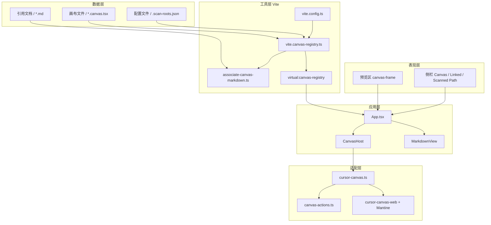

# canvas-preview

cursor-canvas 本地预览器，用 Vite + React 预览 `*.canvas.tsx` 及其源码里引用的 Markdown。本目录是独立的 Node / pnpm 工程。

## 技术栈

| 层 | 选用 |
|----|------|
| 构建 | Vite 8 + `@vitejs/plugin-react` + TypeScript |
| UI | React 19、`@mantine/core` / `@mantine/charts`、Recharts 2 |
| Canvas shim | `@thisismydesign/cursor-canvas-web`（经 `src/cursor-canvas.ts` 再导出） |
| Markdown | `react-markdown` + `remark-gfm`（表格等 GFM） |

## 实现架构

分层：浏览器只跑 React 壳；Vite 在开发/构建期扫盘、做 alias、生成虚拟模块。



- **侧栏区**：Canvas Files 列出扫描到的 `*.canvas.tsx`；Linked Files 只显示**当前 canvas** 源码里解析成功的 `.md`（没有也保留分组）。两组之间可拖高度（展开 Linked Files 时；双击复位）。Scanned Path 可增删改单条路径；点对勾或刷新后才写入 gitignore 的 `.scan-roots.json` 并重扫（`POST /__canvas-preview/scan`，**仅 `pnpm dev`**）。
- **预览区**：居中 / 全宽由宿主 `.canvas-frame` 统一留白；浅色/深色与布局写入 `localStorage`；当前文件用 URL hash。Canvas 的 `openFile`、正文里的 `.md` 路径、Markdown 内链可跳到已收录的 md；路径无效则提示「未收录该文件」。
- **扫描**：Vite 插件 `vite.canvas-registry.ts` 递归收集 `*.canvas.tsx`（跳过 `node_modules` / `.git` / `dist` 等），生成虚拟模块 `virtual:canvas-registry`（`id` / `kind` / `relatedIds` / `load()`）。同名且内容 SHA-256 相同只留一份（优先仓库 `analysis/`，其次 `drop-in/`，再次仓库外目录）。
- **关联**：`associate-canvas-markdown.ts` 被插件调用（不是独立扫描器）。从 canvas 文本抽 `.md` 路径，按绝对路径、仓库根、canvas 目录、上一级目录及上一级下的文件名做存在性检查，**不遍历 Markdown 目录**。命令行打印用 `pnpm associate`。
- **适配**：`vite.config.ts` 把 `cursor/canvas` alias 到 `src/cursor-canvas.ts`（再导出 `cursor-canvas-web`，并覆盖 `useCanvasAction`）。`server.fs.allow` 含仓库与 `~/.cursor`。

> 无 `.scan-roots.json` 时的默认根路径：`autosar/dm/analysis/`、`canvas-preview/drop-in/`、以及本机所有 `~/.cursor/projects/*/canvases/`（存在才加入）。可用 `$env:CANVAS_EXTRA_DIRS`（分号分隔）。若已有 `.scan-roots.json`，**整表覆盖**默认根，不与默认合并。Scanned Path 里也支持 `*` 通配符（例如 `~/.cursor/projects/*/canvases/`），刷新时展开为实际目录。

## 启动

仓库根目录、Windows PowerShell。先装依赖：

```powershell
cd canvas-preview
pnpm install
```

| 命令 | 作用 |
|------|------|
| `pnpm dev` | 开发服务器（默认 `http://localhost:5173`），热更新、可改扫描路径并刷新 |
| `pnpm build` | `tsc --noEmit` 后产出 `dist/` |
| `pnpm preview` | 本地预览已构建的 `dist/`（无扫描 API、无按源码热重载、前须先 `pnpm build`） |
| `pnpm associate` | 打印各 canvas 解析到的 `.md`（不扫全量 Markdown） |

## 限制

- Canvas 必须 `import` 自 `cursor/canvas`，且 **default export** 一个 React 组件。
- 开发模式下新增扫描目录要点刷新；Vite 仍受 `server.fs.allow` 约束。
- 源码里写了 `.md` 但磁盘上不存在时，预览区提示「未收录该文件」，不会去全库猜文件名。
